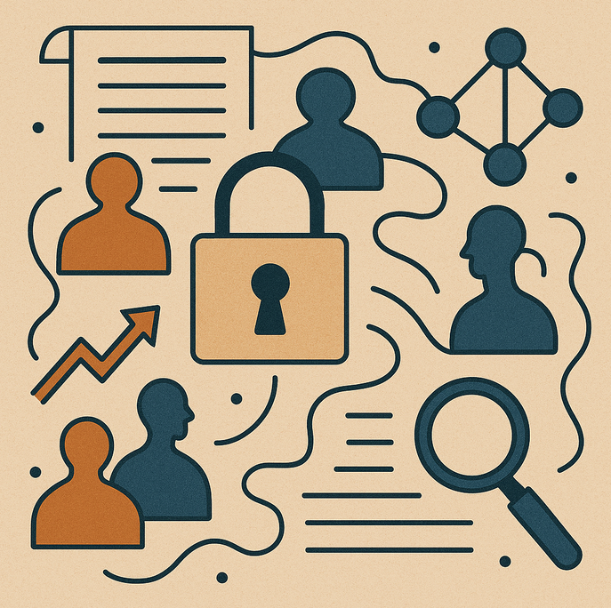
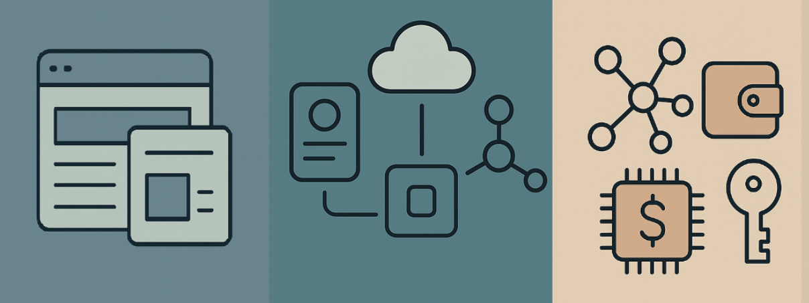
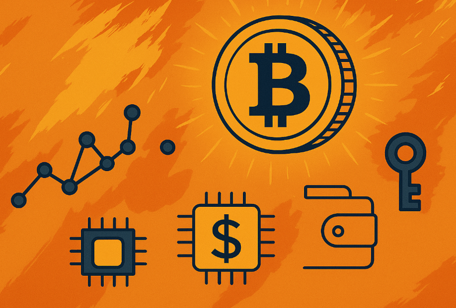
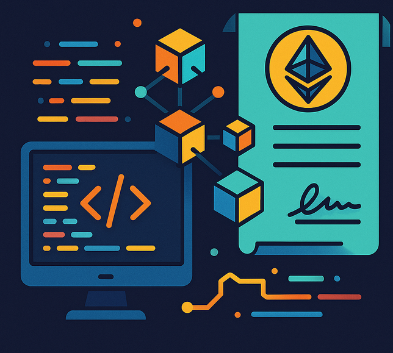
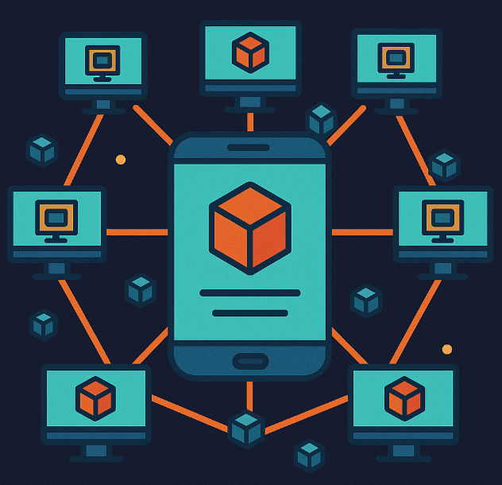
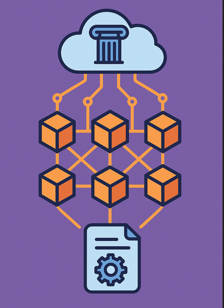
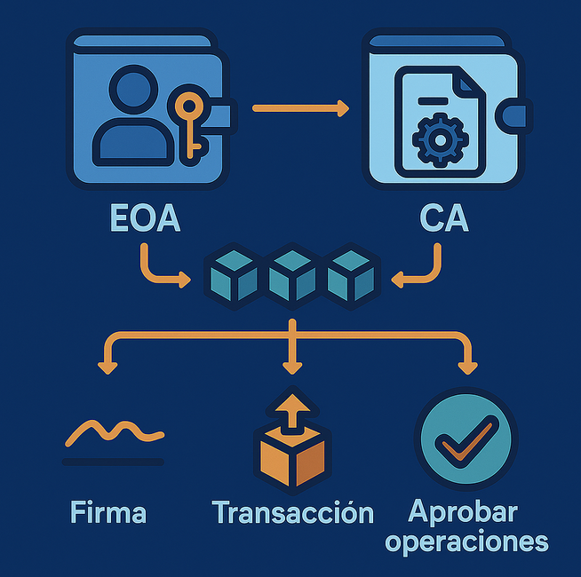
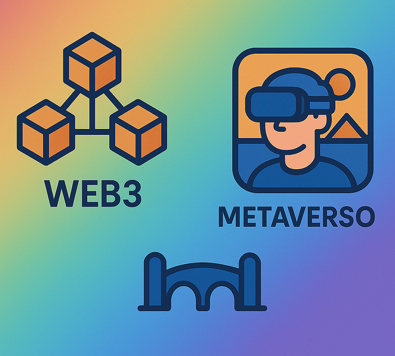
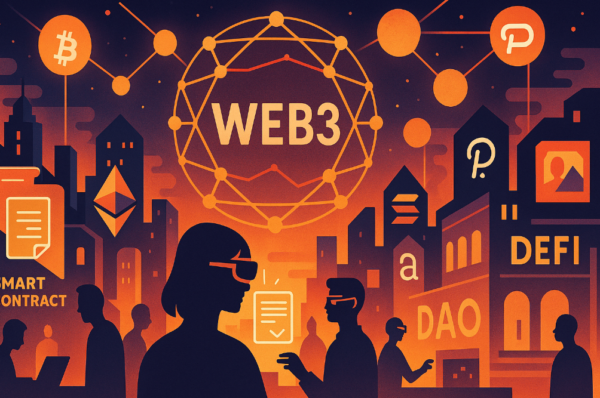
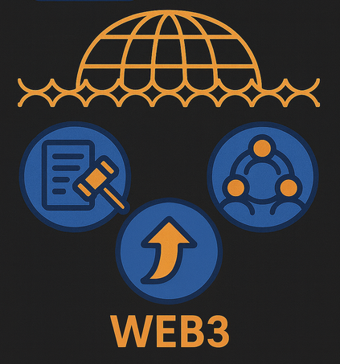

# La descentralización de la Web: la Web3

Te recomiendo aprender sobre web3 en esta increíble formación de metamask.io: <ttps://learn.metamask.io/es-ES/overview>.

## La apuesta por el valor

La Web3 es la propuesta evolutiva de Internet hacia la descentralización y empoderamiento de la comunidad.

Esto implica dejar de depender únicamente de entidades centrales, como gobiernos, grandes empresas o proveedores de servicios, reduciendo su papel dominante y abriéndoles la posibilidad de participar en igualdad de condiciones con el resto de actores.

Se devuelve el control y propiedad a usuarios y proveedores, evitando que los datos, identidades y activos digitales estén bajo el control de una sola organización. Esto se consigue mediante nuevos modelos económicos que incentivan la participación.

  > Es decir, ahora sí: no solo los activos digitales tienen valor, también tus datos (Data Ownership) y tu identidad son elementos valiosos que debes atesorar. Son aspectos que influyen directamente en el mundo real y, precisamente por su importancia, no deberían quedar en manos de una élite.

Este nuevo modelo económico es posibles gracias a avances tecnológicos basados en la criptografía, como blockchain, las redes entre pares, contratos inteligentes autónomos, la propiedad verificable y la gobernanza descentralizada. Todo esto permite crear una [escasez digital](https://academy.bit2me.com/que-es-escasez-digital) verificable y programable, un elemento clave que otorga valor y seguridad tanto a los activos digitales como a la infraestructura que los sostiene. Al incentivar la participación y dar valor a la propiedad a la Web3 también se la conoce como el **Internet del valor**.

Podemos ver ejemplos de esta nueva economía en el [play-to-earn](https://en.wikipedia.org/wiki/Blockchain_game), los coleccionables digitales en el arte (NFT), en la música, en marcas como Nike..., en el staking, la gobernanza mediante tokens y la [tokenización de activos](https://www.ibm.com/mx-es/think/topics/tokenization) reales (RWA), etcétera.

Este modelo incentiva la participación al recompensar a los usuarios no solo como consumidores, sino también como creadores, o como creadores que a la vez consumen, es decir, [prosumidores](https://es.wikipedia.org/wiki/Prosumidor). De este modo, se fomenta un papel activo y colaborativo en la toma de decisiones y se pondera el valor entre los participantes, en lugar de concentrarlo en unas pocas entidades centrales. Esto permite un ecosistema digital sostenible que evoluciona según los intereses de la comunidad.

## El consenso social de Web3

El consenso social de Web3 surge como una respuesta a la desconfianza en los sistemas tradicionales. Cuando la confianza se rompe, la comunidad crea un nuevo tablero de juego cuyas reglas están escritas en código y no pueden alterarse.

Este nuevo orden, basado en la inmutabilidad y la transparencia, ofrece seguridad y equidad al no permitir reescribir la historia, pero también genera incomodidad al no asegurar la confidencialidad permitiendo exponer cada acción al público.

En cierta forma incomoda a todas las partes y quizás por eso es perfecto.

Es, en esencia, una norma compartida por quienes prefieren un sistema donde la confianza se sustituye por verificación y donde la estabilidad nace del consenso, no de la autoridad y para ello es necesario aceptar la inmutabilidad y compartir la información, aunque sea confidencial, de lo contrario sería complicado llegar a un consenso en un un sistema descentralizado, si no existe la posibilidad de conocer la información a validar.

Es cierto que el [seudoanimmato](https://es.beincrypto.com/aprende/seudonimato-anonimato-diferencias/) puede dar cierta ventaja, pero es una barrera limitada, ya que la trazabilidad y la transparencia inherentes a la blockchain permiten analizar y vincular actividades, reduciendo significativamente el anonimato real, sobre todo cuando se interactúa con un mundo real donde sí hay [KYC](https://es.wikipedia.org/wiki/Conozca_a_su_cliente).

> Es muy posible que tú puedas llegar a ser anónimo, pero es poco probable que Paco el pescadero si entra en Web3 sea capaz de serlo.

Es posible que el ecosistema evolucione a soluciones donde podamos elegir qué es publico y privado, pero el propio ecosistema nos obliga a entender que la confianza y la verificación no se consigue sin exponernos.

Es un dilema a explorar en web3 que debemos conocer.

## La evolución de Internet

La Web ha evolucionado a lo largo del tiempo, y para entenderlo mejor, solemos referirnos a ella como Web1, Web2 y Web3. Si te interesa profundizar en esta evolución, puedes consultar artículos como: <https://blog.bit2me.com/es/de-la-web1-a-la-web3-la-re-evolucion-de-la-web/>.

Web3 se inspira en la idea original de Internet como un espacio abierto, añadiendo la capa económica y de propiedad que faltaba para completarla. Esta evolución permite que los usuarios no solo accedan y compartan información, sino que también sean propietarios de sus datos, identidades y activos digitales, participando activamente en la economía digital.

> Suele confundirse Web3.0 y Web3, ya que originalmente el término Web3.0 se utilizaba para referirse a la web semántica, enfocada en la estructuración y recopilación de datos para la inteligencia artificial. Sin embargo, este concepto ha quedado obsoleto y, en la actualidad, cuando hablamos de Web3 nos referimos principalmente a la descentralización, la economía digital y la propiedad de los datos y activos por parte de los usuarios.

Sobre todo, la Web3 introduce nuevos paradigmas:

* Reemplaza la confianza en intermediarios por confianza en el código, la criptografía y el consenso colectivo de la red.

  > Ya no basta con parecer confiable; ahora debes demostrarlo mediante pruebas verificables. Actuar correctamente es recompensado, mientras que las acciones fraudulentas o maliciosas son penalizadas. Este principio se aplica de forma fractal: cuando un sistema necesita interactuar con otro externo, ese nuevo sistema también se organiza como una red independiente de nodos, alcanza consensos y aplica el mismo esquema de incentivos y penalizaciones, convirtiéndose en una **solución modular** que sigue las reglas de la descentralización en una red descentralizada trustless.

* Se sigue la premisa de definir previamente la necesidad del proyecto, el modelo económico y la estructura de la comunidad; es la propuesta de valor la que sirve para atraer a los usuarios. En contraste con el modelo Web2, donde las empresas primero captaban una gran base de usuarios para, posteriormente, monetizarla y definir su modelo de negocio.

* Web3 permite un **internet con estado confiable** gracias a blockchain, donde Web2 solo lo consigue parcialmente y para sus clientes.

En una fase inicial, la descentralización se impulsa gracias a tecnologías como blockchain, contratos inteligentes, aplicaciones descentralizadas (DApps), la autocustodia de la identidad mediante wallets y, en general, mediante protocolos abiertos. Estos elementos distribuyen el control, eliminan puntos únicos de fallo y favorecen la transparencia, la resiliencia y la resistencia a la censura.

  > En 2025 seguimos en esa fase inicial, con avances técnicos importantes pero aún con fuerte dependencia de infraestructuras centralizadas.

## Bitcoin y Blockchain: un cambio de paradigma

El cambio de paradigma y la introducción de blockchain se lo debemos a Bitcoin. Es la génesis que impulsa la descentralización y la escasez digital. Esta transformación influye en big tech, empresas, organizaciones, colectivas e incluso desafía a los gobiernos, que deben adaptarse a una realidad incómoda para ellos.

Blockchain es un registro, principalmente usado como registro contable, y funcionalmente no es mucho más que eso. Lo extraordinario es que opera en una red descentralizada de nodos, generalmente trustless (no se requiere confianza entre las partes) y sin necesidad de terceros de confianza.

Si quieres conocer más sobre Blockchain, ya existen numerosos recursos en línea que lo abordan en detalle, como:

* Nate gentile: <https://www.youtube.com/watch?v=YBNr69vrscw>.
* Dot CSV: <https://www.youtube.com/watch?v=V9Kr2SujqHw>
* Bit2me Academy: <https://bit2me.com/learn/cursos/blockchain/>.

Es fundamental entender que Blockchain es una estructura de datos diseñada para operar en una red P2P de nodos descentralizados que deben llegar a un estado único de la red mediante decisiones por consenso.

  > La relación entre blockchain, los nodos y el consenso es clave para comprender su diseño y funcionamiento.

Si analizamos las decisiones de diseño de esta estructura de datos, podemos concluir que:

* Debe ser un registro inmutable; de lo contrario, cualquier alteración comprometería la integridad del historial, haciendo imposible verificar si ha sido manipulado.

  > La inmutabilidad es un pilar clave de la resistencia a la censura: impide que otros actores borren o modifiquen información registrada, garantizando transparencia y permanencia.

* La información de las transacciones debe ser, al menos, pública en forma seudónima para que los nodos puedan validar operaciones: prevenir el doble gasto, verificar la pertenencia de fondos y reproducir el estado compartido. Sin ese nivel de visibilidad la red no podría alcanzar un consenso fiable ni validar la integridad del historial.

  > Aunque existen opciones para mejorar la privacidad, como las pruebas de conocimiento cero (ZK proofs), que permiten a los nodos validar transacciones sin revelar información sensible, su implementación sigue siendo compleja y representa un desafío técnico importante en la actualidad.

* Como existe un coste para llegar al consenso, las transacciones se agrupan en bloques. Imagina lo inviable que sería que cientos o miles de nodos tengan que llegar a un acuerdo por cada transacción individual que reciben.
* Agrupar las transacciones en bloques y, además, incluir el hash del bloque anterior —que resume y valida todas las transacciones previas— facilita la validación de nuevos bloques por parte de los nodos. Sin este mecanismo, los nodos tendrían que validar millones de transacciones previas, lo que sería inviable.
* Como normalmente los nodos operan en una red trustless (sin confianza previa entre participantes), estos necesitan generar evidencias criptográficas. Ejemplos de esto son los árboles de Merkle, que permiten validar grandes volúmenes de datos de forma eficiente, y los zero-knowledge proofs (pruebas de conocimiento cero) que se utilizan en redes más recientes, mejorando privacidad y escalabilidad.

En las redes blockchain, las decisiones por consenso suelen seguir tres enfoques principales que equilibran de forma progresiva la seguridad, la descentralización y la escalabilidad. Dependiendo del contexto, puede ser necesario realizar un trabajo (Proof of Work), demostrar la participación (Proof of Stake) o, si el participante se identifica correctamente y tiene suficiente autoridad en un ámbito concreto, basta con considerar su participación como confiable (Proof of Authority).

Es decir, se generan evidencias (proof, en inglés) que demuestran el trabajo realizado ([PoW, Proof of Work](https://academy.bit2me.com/que-es-proof-of-work-pow/)), o la participación ([PoS, Proof of Stake](https://academy.bit2me.com/que-es-proof-of-stake-pos/)) o la autoridad ([PoA, Proof of Authority](https://academy.bit2me.com/que-es-proof-of-authority-poa/)).

Cada enfoque es relevante para cada necesidad, bitcoin como sistema resiliente necesita PoW, el trabajo realizado es lo que realmente asegura la red, pero otras redes con mucha participación, PoS es suficiente como demuestra Ethereum, pero incluso hay redes, muchas veces privadas, donde demostrar la pertenencia a la red con PoA es suficiente, porque ni siquiera se tiene que tener en cuenta las [fallas bizantinas](https://academy.bit2me.com/que-es-falla-bizantina/), es decir, una NFB (No Fault Byzantine).

> En mí opinión, existe cierto fundamentalismo sobre si se debe usar siempre PoW y realmente el debate es innecesario, cada red tiene contextos y necesidades diferentes, es como pensar que necesites siempre un vehículo blindado para ir a hacer la compra, es simplemente absurdo.

## Programabilidad on-chain

Bitcoin introdujo la solución pionera de blockchain enfocada en la simplicidad, seguridad e inmutabilidad, con una capacidad de programación limitada mediante Bitcoin Script. Aunque esta funcionalidad se ha ampliado con propuestas como [Taproot](https://academy.bit2me.com/que-es-taproot/) y otros [BIP](https://academy.bit2me.com/que-es-bip-bitcoin/), su diseño deliberadamente restrictivo prioriza la seguridad y la resistencia a la censura sobre la flexibilidad. Esta limitación no es un defecto, sino una elección de diseño. Por eso, para casos que requieren lógica de ejecución compleja, surgieron los contratos inteligentes en la red Ethereum y posteriormente en otras redes de propósito similar, con una máquina virtual [Turing-completa](https://academy.bit2me.com/que-es-turing-completo/) (pero limitada por el coste o gas en Ethereum) orientada a la programabilidad general, denominada, por lo menos en el ecosistema Ethereum, [EVM](https://academy.bit2me.com/que-es-ethereum-virtual-machine-evm/) (Ethereum Virtual Machine), existiendo variantes equivalentes como la [WASM](https://ewasm.readthedocs.io/en/mkdocs/) en redes más recientes.

El término “contrato inteligente” puede parecer una etiqueta comercial, pero en realidad describe un programa informático que define reglas de negocio y se ejecuta al recibir una transacción o consulta. Cada nodo reproduce la ejecución y, mediante el consenso, la red acuerda el bloque válido, quedando su resultado registrado de forma inmutable en la blockchain.

Para quienes vienen del mundo de bases de datos relacionales, la analogía más cercana sería un [procedimiento almacenado](https://es.wikipedia.org/wiki/Procedimiento_almacenado) con interfaz similar a una API RPC, es decir procedural.

  > Ambos residen en un entorno persistente (blockchain o base de datos), gestionan su propio estado y exponen funciones. Sin embargo, a diferencia de los procedimientos tradicionales, los contratos inteligentes operan de forma descentralizada siguiendo las reglas de inmutabilidad y consenso de la red.

Como mencionamos, una de las características fundamentales de los contratos inteligentes es la inmutabilidad, una vez desplegados en la blockchain, su código y lógica no pueden modificarse. Esta propiedad garantiza transparencia y confianza, ya que todos los participantes pueden verificar que las reglas no cambiarán arbitrariamente. Sin embargo, la inmutabilidad también implica un riesgo importante: si el contrato contiene errores o vulnerabilidades, corregirlos resulta extremadamente difícil, ya que no es posible actualizar el código directamente.

Para mitigar este riesgo, se han desarrollado patrones y soluciones como los contratos proxy, que permiten separar la lógica del contrato de los datos y delegar las llamadas a una implementación que puede ser actualizada. Así, el contrato principal permanece inmutable, pero la lógica puede evolucionar mediante la actualización del contrato delegado. Otra estrategia es el uso de bloqueadores de contratos (circuit breakers), que permiten pausar la ejecución del contrato en caso de detectar un problema grave, evitando daños mayores mientras se implementa una solución alternativa.

Además, existen mecanismos adicionales como los timelocks, que permiten programar un retraso antes de aplicar cambios importantes, dando tiempo a la comunidad para revisar, auditar y actuar en consecuencia. Por otro lado, la gobernanza descentralizada otorga a los usuarios la capacidad de votar sobre propuestas de actualización o migración de contratos, es decir, aunque el contrato sea inmutable se puede crear otro que corrija el problema, siempre y cuando la comunidad esté de acuerdo. Estos mecanismos ayudan a equilibrar la flexibilidad para corregir errores con la necesidad de mantener la confianza y la transparencia.

//todo recalccar que las transacciones permite tener un historico del estado de internet, maquina de estados?

// todo recalcar ehte introduce gas como comision o coste computacional. evita el DoS

//todo un smart contrat no se autoejecuta, lo inicia otra transaccion o oraculo o servicio off-chain

## Aplicaciones descentralizadas (DApps)

Una vez que disponemos de un backend on-chain que gestiona las validaciones, la lógica de negocio y el estado, el siguiente paso natural es construir aplicaciones frontend que también sean descentralizadas. Así surgen las DApps: aplicaciones descentralizadas que combinan contratos inteligentes en la blockchain con interfaces accesibles para los usuarios.

Esta definición es algo simplista; el ecosistema es muy amplio y modular, es como un juego de lego, por eso otra utilidad clara de las DApps es la composabilidad, es decir, la capacidad de interactuar con el resto de protocolos y servicios del ecosistema Web3, facilitando la experiencia al usuario.

La composabilidad real ocurre casi al 100% on-chain, porque:

  Los smart contracts son públicos y sin permisos → cualquiera puede llamarlos.

  La lógica de “lego financiero/social” se da al encadenar contratos (Uniswap → Aave → Yearn, etc.).

  El usuario solo interviene para aprobar movimientos de tokens desde su wallet. 

El objetivo es crear aplicaciones, idealmente inmutables, que no dependan de un servidor central. Esto es técnicamente posible utilizando soluciones como IPFS o distribuyendo las aplicaciones en los dispositivos de los usuarios finales.

En la práctica, sin embargo, se suele considerar DApp a cualquier aplicación web que interactúa con contratos inteligentes y está diseñada como una SPA (Single Page Application); es decir, se ejecuta en el navegador de cada usuario, de forma distribuida, sin depender de un backend centralizado, realizando únicamente llamadas RPC al contrato inteligente o las interacciones necesarias al resto de módulos del ecosistema.

  > Este diseño como SPA, sin depender de un backend centralizado, es el requisito mínimo para considerar una aplicación como DApp. Sin embargo, suelen hacerse concesiones según necesidades técnicas o de experiencia de usuario.

## Oráculos y acceso al mundo exterior

Las blockchains y los contratos inteligentes operan en un entorno cerrado, donde solo pueden acceder a los datos que existen dentro de la propia red. Sin embargo, muchas aplicaciones requieren consultar o enviar información del mundo exterior. Para resolver esta limitación, se utilizan oráculos, que son servicios encargados de conectar estos datos externos de forma segura y verificable.

El principal reto de los oráculos es garantizar la fiabilidad y resistencia a la manipulación de los datos suministrados. Si un oráculo centralizado es comprometido, todo el sistema puede verse afectado. Por eso, la solución más robusta es emplear oráculos descentralizados, que funcionan como una red de nodos independientes. Cada nodo recopila datos de fuentes externas y, mediante mecanismos de consenso, determinan el valor final que se introduce en la blockchain. Este proceso reduce el riesgo de manipulación y aumenta la transparencia. Además, los oráculos descentralizados suelen incorporar sistemas de incentivos que recompensan a los nodos por suministrar datos correctos y penalizan a quienes proporcionan información fraudulenta o errónea, reforzando así la integridad y seguridad del sistema.

Un ejemplo destacado de oráculo descentralizado es **Chainlink**, que se ha convertido en el estándar de facto para conectar contratos inteligentes con datos del mundo real, el cual además sigue este paradigma de descentralización, consenso, incentivos económicos y penalización.

Gracias a los oráculos descentralizados como Chainlink, las aplicaciones Web3 pueden habilitar casos de uso avanzados, como finanzas descentralizadas (DeFi), seguros automáticos, mercados de predicción, integración con sensores IoT y mucho más. Los oráculos son, por tanto, un componente esencial para la expansión y utilidad de la Web3; además, tienden puentes de forma segura con el exterior.

## Cuentas y control de acceso

//TODO los contratos tienen ownner y se puede quitar para que sea mas descentralizado

//gassless otra mejora usabilidad

// todo UTXO vs ABM.

Al interactuar con una DApp y su contrato inteligente, surge la necesidad de identificar y autenticar a ambas partes. Por ello, los usuarios disponen de cuentas de su propiedad llamadas EOA (Externally Owned Accounts), mientras que los contratos inteligentes cuentan con CA (Contract Accounts). Ambas cuentas son identificadores únicos, representados por una serie de caracteres alfanuméricos de longitud fija. En el caso de las EOA, pueden asociarse a servicios de nombres de dominio descentralizados, como [ENS](https://ens.domains/), lo que permite mostrar un nombre o marca personal en lugar de un identificador difícil de memorizar. Además, una cuenta puede asociarse a un [DID (Decentralized Identifier)](https://www.w3.org/TR/did-1.0/), facilitando su vinculación con una identidad descentralizada interoperable.

   > Dependiendo del tipo de DID —por ejemplo, en Ethereum— es posible asociar una o varias cuentas, incluso procedentes de entornos Web2 compatibles, a una única identidad, lo que incrementa la interoperabilidad.

Las cuentas de propiedad externa (EOA) existen gracias a las wallets propiedad de los usuarios, que son contenedores de cuentas generadas a partir de un par de claves criptográficas (una privada y otra pública) mediante criptografía asimétrica.

  > Si tienes curiosidad, de forma simplificada y sin entrar en detalles técnicos, la dirección pública de una cuenta se genera aplicando funciones hash a la clave pública, la cual se deriva matemáticamente de la clave privada que solo conoce el usuario. Este proceso garantiza que solamente quien posee la clave privada puede controlar la cuenta, mientras que la dirección pública puede compartirse libremente a modo de seudónimo para recibir fondos o interactuar con contratos inteligentes.

Otra función esencial de una wallet, gracias a la gestión de la clave privada, es la firma de transacciones y mensajes para demostrar la propiedad de una EOA (Externally Owned Account) y autorizar operaciones en contratos inteligentes, como transferencias de fondos o interacciones con DApps. Para que un contrato inteligente pueda operar en nombre del usuario, incluso posterior a la transacción, es imprescindible que la cuenta EOA firme la autorización correspondiente. El contrato verifica estas firmas en cada operación o, si se ha realizado una aprobación previa, mantiene un registro de permisos concedidos. Esta gestión puede resultar compleja para el usuario y es fundamental revisar cuidadosamente cada autorización antes de firmar.

  > Muchas estafas se han producido por firmar autorizaciones sin comprender su implicación, por lo que es fundamental tener cuidado con lo que se firma y, sobre todo, guardar un historial de las operaciones realizadas.

Alternativamente existen servicios de custodia que almacenan las claves de usuario, facilitando el acceso y recuperación, pero sacrificando seguridad, control y autonomía, ya que el tercero puede imponer restricciones o ser vulnerable a riesgos externos y ataques.

  > Además de ser un punto único de fallo, los servicios de custodia representan el eslabón más débil frente a ataques, robos y pueden generar problemas fiscales si las claves se almacenan en servidores extranjeros. Aunque estas wallets suelen ser fáciles de usar y atractivas, están totalmente desaconsejadas, ya que quedan fuera del paradigma descentralizado y modular de la Web3. Esto es especialmente relevante ahora que existen alternativas como la abstracción de cuentas, que permiten mejorar la experiencia de usuario sin sacrificar la autonomía y seguridad.

Como mencionamos anteriormente, una alternativa que mejora la seguridad y la experiencia del usuario sin sacrificar la descentralización es la abstracción de cuentas. Este enfoque actúa como un punto intermedio entre la autocustodia de claves y el uso de servicios de terceros. La abstracción de cuentas permite delegar funciones como la recuperación de acceso, la gestión de comisiones (gas) o la aprobación de operaciones a servicios externos, que, aunque pueden ser centralizados, lo ideal es que sean descentralizados; es decir, operan en la blockchain mediante contratos inteligentes, donde una red de participantes, mediante consenso y validación, colabora en la gestión y recuperación de cuentas sin depender de una autoridad central, manteniendo así la autonomía y seguridad del usuario.

Como mencionamos, una alternativa que mejora la seguridad y la experiencia del usuario sin sacrificar la descentralización es la abstracción de cuentas. Este enfoque actúa como un punto intermedio entre la autocustodia y el uso de servicios de terceros. Permite delegar funciones como la recuperación de acceso, la gestión de comisiones (gas) y la aprobación de operaciones a servicios externos. Aunque estos servicios pueden ser centralizados (lo que requiere precaución), también existen opciones descentralizadas que operan mediante contratos inteligentes en la blockchain. Así, una red de participantes colabora en la gestión y recuperación de cuentas mediante consenso, eliminando la necesidad de una autoridad central y manteniendo la autonomía y seguridad del usuario.

  > En Web3, cualquier concesión en la descentralización no implica recurrir a un servicio centralizado, sino a otra red autónoma y descentralizada que alcanza consenso. Entender esta filosofía modular en capas es fundamental, especialmente al analizar el trilema de la blockchain: seguridad, descentralización y escalabilidad, donde cada concesión no necesariamente implica perder la capacidad de ser modular y descentralizado.

A pesar de su nombre, una wallet es principalmente un contenedor de cuentas que permite firmar transacciones, operaciones y autorizaciones, y además tiene la capacidad de comunicarse con la blockchain. Una wallet realmente **no es un monedero** en el sentido tradicional, ya que no almacena los activos (tokens, NFTs, etc.); estos siempre permanecen en la blockchain. Adicionalmente, la wallet permite consultar el saldo de las cuentas en las distintas redes, gestionar redes disponibles, configurar límites de comisiones (gas en Ethereum) y acceder directamente a las DApps necesarias, entre otras funcionalidades que son de utilidad al usuario final.

  > En Web3, hablar de wallets es referirse a soluciones como MetaMask, actualmente el estándar de facto para interactuar con aplicaciones descentralizadas. Sin embargo, el ecosistema está evolucionando hacia opciones más simples y seguras, como la abstracción de cuentas, que facilitan la experiencia del usuario y mejoran la seguridad. Estas alternativas se explorarán mas adelante en este repositorio.

Vemos como en la Web3 existe un cambio de paradigma muy importante respecto a la Web2: el usuario no “inicia sesión” con usuario y contraseña, sino que su identidad está vinculada a una clave privada bajo su propia custodia, lo que garantiza la propiedad y el control. Esto redefine la noción tradicional de identidad y delega la responsabilidad directamente en el usuario. Este es uno de los principales desafíos para la adopción de la Web3; por ello, la recuperación de cuentas mediante una frase semilla o la abstracción de cuentas son aspectos fundamentales.

Aunque la autocustodia puede parecer "incómoda", es crucial entender su importancia frente a la vulneración y el robo de identidades en la Web. La adopción de la autocustodia, apoyada por técnicas de la Web3 como la abstracción de cuentas para mejorar la experiencia de usuario y las [pruebas de conocimiento cero](https://academy.bit2me.com/zkp-zero-knowledge-protocol/), como [ZK ID](https://pse.dev/projects/zk-id), para proteger la privacidad, ofrece una seguridad fundamental donde los mecanismos de autorización centralizados de la Web2 a menudo fallan.

//todo las EOA y CA pueden ejecutar transacciones del contrato, cuando son CA, como oraculos, tiene un calculo mas complejo

## La seguridad criptoeconómica

La seguridad criptoeconómica es uno de los pilares fundamentales de la Web3 y del Internet del valor. En este nuevo paradigma, cada infraestructura, red o aplicación está respaldada por su comunidad y por mecanismos económicos que incentivan la participación y el comportamiento correcto y penalizan las acciones maliciosas.

El objetivo es crear sistemas sostenibles, resilientes y alineados con los intereses de sus participantes.

El token es la herramienta principal para articular estos incentivos. Representa el valor actual y futuro de la red, y cumple varias funciones clave para la participación y gobernanza, aporta  seguridad de la red, en redes como Ethereum, los tokens se utilizan para el staking, un proceso en el que los participantes bloquean sus tokens como garantía para validar transacciones y asegurar la red. Si actúan de forma deshonesta, pueden perder parte o la totalidad de sus tokens, lo que incentiva el comportamiento honesto. Además, soluciones como EigenLayer permiten reutilizar el staking para asegurar aplicaciones adicionales, aumentando la seguridad y la eficiencia del ecosistema.

- **Liquidez y utilidad:** Los tokens también facilitan la creación de pools de liquidez, donde los usuarios aportan pares de tokens (por ejemplo, un token nativo y una stablecoin) para habilitar el intercambio y la operatividad de aplicaciones DeFi. Estos pools permiten a las comunidades crear mercados, incentivar la participación y ofrecer recompensas a quienes contribuyen con liquidez.

- **Modelos económicos diversos:** Existen diferentes tipos de tokens según su función: tokens de utilidad, tokens de gobernanza, tokens de seguridad (security tokens), stablecoins, entre otros. Cada uno responde a necesidades específicas y puede habilitar modelos económicos innovadores, como el acceso a servicios, la representación de activos reales (tokenización), la distribución de beneficios o la financiación de proyectos.

La seguridad criptoeconómica se basa en el diseño de incentivos y penalizaciones que alinean los intereses de los participantes con la salud y sostenibilidad de la red. Los mecanismos de staking, slashing (penalización), gobernanza y liquidez permiten crear sistemas robustos, resistentes a ataques y manipulaciones, y capaces de evolucionar según las necesidades de la comunidad.

incluso aportar seguridad sobre el precio que se mantenga sosteible, motivo que aparecen mecanisos como vote escrow.

hacer stack no solo aporta seguridad a un protocolo, lo aporta a un token.

La seguridad no es solo ataques a una red p2p, lo peude ser al protocolo y al precio del token.

efecto red? se puede capturar valor token futuro, por eso el stake se premia

Si tu proyecto está muy anclado a la infraestructura/red (ej. ENS en Ethereum, o un L2 como Optimism) → tiene sentido usar el token nativo de esa red (ETH) como referencia. Es como una forma de pertenencia, de identidad comunitaria.

Si tu proyecto busca usuarios más generales o externos (juegos, pagos, remesas) → lo natural es usar estables, porque el usuario piensa en dólares/euros y quiere estabilidad.

//todo hablar del token y nft

//todo hablar de como afecta al quemado burn en la seguridad del precio

## Casos de uso que habilita Web3

//revisar

Gracias a la escasez digital y al hecho de que la web ahora cuenta con estado en una red neutra y segura, se habilitan nuevos casos de uso en Web3 que antes habrían sido difíciles o imposibles de implementar. Esta combinación permite crear activos digitales únicos, gestionar identidades y reputaciones verificables, automatizar procesos mediante contratos inteligentes y conectar aplicaciones con datos del mundo real de forma transparente y confiable. Así, Web3 abre la puerta a modelos económicos innovadores, mercados globales sin intermediarios y una colaboración más eficiente entre usuarios, empresas y comunidades.

- **Tokenización de activos:** Web3 permite representar activos físicos y digitales como tokens en la blockchain, desde bienes raíces, obras de arte y vehículos, hasta acciones, derechos de autor y materias primas. Esta tokenización facilita la compraventa, el fraccionamiento y la transferencia de propiedad de forma global y sin intermediarios, habilitando mercados más líquidos y accesibles.

- **RWA (Real World Assets):** La integración de activos del mundo real en la blockchain, como inmuebles, bonos, facturas o commodities, permite crear productos financieros innovadores y democratizar el acceso a inversiones que antes estaban reservadas a grandes instituciones.

- **Liquidez de activos digitales:** Protocolos DeFi y pools de liquidez permiten que cualquier usuario aporte activos y reciba recompensas, facilitando el intercambio instantáneo y la creación de mercados globales sin necesidad de bancos o brokers. Esto habilita modelos como el market making automatizado y la provisión de liquidez entre pares.

- **Finanzas descentralizadas (DeFi):** Web3 ha revolucionado el sector financiero con préstamos, créditos, seguros, derivados y stablecoins gestionados por contratos inteligentes. Los usuarios pueden interactuar directamente con estos servicios, sin intermediarios, con total transparencia y control sobre sus fondos.

- **NFTs y propiedad digital:** Los tokens no fungibles (NFTs) permiten certificar la propiedad y autenticidad de activos digitales únicos, como arte, música, coleccionables, entradas a eventos o identidades digitales. Esto habilita nuevos modelos de negocio para creadores y comunidades, y facilita la interoperabilidad entre plataformas. La programabildiad permite cosas como permitir al NFT que cierto porcentajde posteriores ventas, sean recompensadas al creador inicial

- **Gobernanza descentralizada (DAO):** Las organizaciones autónomas descentralizadas permiten que comunidades gestionen proyectos, fondos y decisiones colectivas mediante votaciones transparentes y reglas programadas en contratos inteligentes, eliminando jerarquías tradicionales y fomentando la participación activa.

- **Economía colaborativa y play-to-earn:** Web3 habilita modelos donde los usuarios pueden ganar recompensas por participar en juegos, redes sociales, plataformas educativas o proyectos colaborativos, convirtiéndose en prosumidores y generando valor para el ecosistema.

- **Identidad y reputación digital:** La gestión de identidades descentralizadas (DID) y sistemas de reputación permiten a los usuarios controlar sus datos, demostrar credenciales y construir una reputación verificable en múltiples plataformas, sin depender de proveedores centralizados.

- **Integración IoT y automatización:** Gracias a los oráculos y contratos inteligentes, Web3 permite conectar dispositivos físicos y sensores al mundo digital, automatizando pagos, seguros, logística y procesos industriales de forma segura y transparente.

- Cadena de suministro

Estos casos de uso demuestran cómo Web3 supera las limitaciones de la Web2, habilitando una economía digital más abierta, eficiente y colaborativa, donde la escasez digital y la propiedad verificable son el motor de innovación y nuevas oportunidades.

## Web3 y el metaverso

La Web3 redefine la propiedad de activos digitales, lo que está directamente relacionado con el concepto de metaverso. Los metaversos descentralizados se construyen sobre tecnologías Web3, permitiendo que los usuarios sean verdaderos propietarios de sus avatares, objetos y terrenos virtuales mediante NFTs y contratos inteligentes. Esta infraestructura elimina intermediarios y otorga soberanía sobre los activos digitales, facilitando la interoperabilidad entre distintos mundos virtuales y aplicaciones.

Así, la Web3 no solo impulsa la descentralización de la web tradicional, sino que también habilita la creación de lo que muchos denominan el nuevo frontend: el metaverso. En este contexto, la blockchain y su ecosistema actúan como el backend, proporcionando la infraestructura para la propiedad digital, la interoperabilidad y la gobernanza descentralizada.

En definitiva, la Web3 y el metaverso convergen para ofrecer una experiencia digital completa, siendo inmersiva, masiva, en tiempo real y segura, donde la propiedad, la identidad y la colaboración se gestionan de forma descentralizada.

## Ecosistema Web3

El ecosistema Web3 es un entorno dinámico y modular, compuesto por redes blockchain, protocolos, infraestructuras, organizaciones y aplicaciones que interactúan de forma descentralizada. Esta diversidad puede resultar abrumadora, pero es clave para entender las oportunidades y desafíos que ofrece Web3.

Las blockchains constituyen la base del ecosistema. Bitcoin y Ethereum son referentes, cada una con enfoques distintos: Bitcoin red de primera generación, como reserva de valor y Ethereum, de segunda generación, como plataforma programable. A su alrededor han surgido más redes de segunda y tercera generación, que buscan mejorar la escalabilidad, interoperabilidad, sostenibilidad y abordar casos de uso más cercanos a las comunidades.

Ethereum destaca por su modelo abierto y comunitario, y por la evolución constante, pero segura, de su infraestructura, incorporando soluciones de segunda capa (Layer 2) como Optimism, Arbitrum y Polygon, que permiten procesar transacciones de forma más eficiente y económica. Estas capas adicionales facilitan la especialización y la interoperabilidad dentro del ecosistema EVM.

La infraestructura Web3 abarca desde redes de almacenamiento distribuido como IPFS y Filecoin, hasta oráculos como Chainlink y soluciones de seguridad compartida como EigenLayer. También incluye arquitecturas modulares como OP Stack, protocolos de interoperabilidad de capa 0 como Cosmos o Polkadot, y redes monolíticas de alta escalabilidad como Solana y propuestas experimentales como MegaETH.

  > El objetivo es claro: dotar a la web de la capacidad necesaria, con un tiempo de respuesta objetivo inferior a 10 ms y más de 100.000 transacciones por segundo (TPS).

Los protocolos son el tejido que conecta aplicaciones, usuarios y servicios. Existen protocolos técnicos, de gobernanza, DeFi, identidad, experiencia de usuario, lanzamiento de proyectos y marketing, que definen estándares y reglas para la interacción y el desarrollo en Web3.

Las organizaciones en Web3 adoptan múltiples formas: DAOs, fundaciones, empresas, comunidades y agencias. Todas buscan reducir la dependencia de intermediarios, fomentar la transparencia y alinear incentivos, aunque cada una tiene su propio grado de descentralización y propósito.

Existe un ecosistema muy diverso de aplicaciones descentralizadas (DApps), cada una enfocada en resolver un caso de uso específico. Podemos encontrar distintas categorías como DeFi (finanzas descentralizadas), GameFi (juegos con economía integrada), SocialFi (redes sociales descentralizadas), marketplaces de NFTs, infraestructura de datos, identidad y gobernanza, utilidades y bienes públicos, entre otras. Cada categoría aporta soluciones innovadoras y amplía las posibilidades dentro del entorno Web3.

También existen infraestructuras Web3 como servicio que facilitan la integración entre Web2 y Web3, permitiendo experimentar y desarrollar DApps de forma ágil mediante soluciones especializadas como Blockchain-as-a-Service, Storage-as-a-Service y otros modelos similares. Aunque estas soluciones son un buen punto de partida, la Web3 se basa principalmente en la participación activa. Por ello, es recomendable operar tu propio nodo dentro del ecosistema, lo que refuerza la autonomía y la descentralización. Además, es posible dar un paso más y participar en la descentralización física con DPIN (Decentralized Physical Infrastructure Network), aunque aún en fase inicial, abre la posibilidad de reducir la dependencia de servicios centralizados en la nube y contribuir directamente a la infraestructura física de servicios que además son descentralizados.

## Potencial y desafíos

Una de las primeras lecciones que debemos considerar es que no todo necesita ser descentralizado. La descentralización debe aplicarse allí donde aporte beneficios claros y medibles, como mayor seguridad, transparencia, resistencia a la censura o autonomía para los usuarios. Si los objetivos y ventajas de descentralizar no son evidentes, puede resultar contraproducente y añadir complejidad es innecesario. Por ello, es fundamental analizar cada caso y decidir de forma pragmática cuándo y cómo implementar la descentralización, priorizando siempre el valor real que aporta a los participantes.

Existen tanto defensores como detractores de la descentralización, pero aún falta un análisis social más profundo sobre su verdadero coste y los contextos en los que realmente aporta valor. No siempre somos plenamente conscientes del pacto social que implica: al priorizar la transparencia y la inmutabilidad, se pone en riesgo la confidencialidad, ya que el seudoanonimato en blockchain es fácilmente trazable. Además, la inmutabilidad, aunque aporta seguridad y resistencia a la censura, introduce una complejidad significativa en la gestión de errores y en la protección de la privacidad. Por ello, es fundamental reflexionar sobre cuándo y cómo aplicar la descentralización, evaluando cuidadosamente sus implicaciones sociales y técnicas.

Vemos que en Web3, los roles suelen estar claramente definidos, lo que ayuda a minimizar los conflictos de interés y refuerza la resistencia a la censura. Aunque pueden existir intentos de censura, la arquitectura descentralizada lo dificulta. Por ejemplo, en redes como Ethereum, los validadores tienen como principal función asegurar la red y reciben incentivos económicos por ello, sin motivaciones directas para censurar transacciones. Si bien factores externos, como presiones regulatorias, pueden influir, el propio diseño de la red hace que la censura sea compleja y poco efectiva.

La tecnología blockchain, basada en tecnologías abiertas y estándares, se destaca como el modelo de interoperabilidad por excelencia. Permite que diferentes participantes —ya sean particulares, organizaciones, empresas o gobiernos— puedan comunicarse bajo un lenguaje común, además operando en una de las redes más seguras posibles.

En Web3, los usuarios pueden ser proveedores, consumidores o ambos, participando en comunidades, colaborando en proyectos o creando sus propias aplicaciones descentralizadas, lo que permite que sea un entorno realmente neutro y colaborativo.

//todo mierda todo. es el ecosistema la clave para la composabildiad
Web3, al estar basada en estándares y protocolos abiertos, fomenta la adopción de mejores prácticas y habilita la composabilidad en las aplicaciones. Esto permite que diferentes componentes, servicios y contratos inteligentes se integren y reutilicen fácilmente, acelerando la innovación y el desarrollo de nuevos productos. Este enfoque modular y abierto representa una evolución respecto a la Web2, donde las soluciones suelen ser cerradas y menos interoperables. No obstante, plantea el desafío de mantener un ecosistema cohesionado y eficiente, además de una curva de aprendizaje inicial más alta, lo que dificulta su adopción masiva.

Este modelo cambia las reglas del juego: deja de tratar a los usuarios como productos y redefine modelos de negocio. La participación se vuelve más directa, en la práctica, puedes pagar solo por lo que necesitas y contribuir a definir servicios y productos de manera más precisa.

  > Esta característica también impulsa la evolución hacia una economía más eficiente y responsable, alineada con los principios de la industria 4.0. Por ejemplo, permite combatir la obsolescencia programada y evitar la generación de residuos que contaminan nuestro planeta de forma innecesaria.

Web3 redefine los términos de licencia abusivos, como el DRM (Digital Rights Management – Gestión de Derechos Digitales), que tradicionalmente han permitido a las empresas productoras imponer restricciones y prácticas invasivas sobre los usuarios, como el monitoreo y control del uso de contenidos. En contraste, Web3 promueve modelos abiertos y personalizados.

A la Web3 y a las criptomonedas a menudo se les asocia con estafas debido a noticias negativas. Sin embargo, es precisamente su transparencia lo que permite que estas situaciones salgan a la luz; esto constituye una fortaleza, no una debilidad, en comparación con la ocultación que ocurre frecuentemente en el sistema financiero tradicional o en la Web2. Además, el hecho de que puedas conocer estas malas prácticas es, en sí mismo, una oportunidad para corregirlas, algo que no pueden decir otros ecosistemas. Por estas razones, la Web3 representa el avance evolutivo de la web, aunque la resistencia al cambio es innata al ser humano y es natural que veamos un progreso paulatino ante un cambio de paradigma tan profundo.

A pesar de su potencial, la adopción masiva de Web3 enfrenta importantes barreras, muchas de ellas de carácter cultural más que técnico. Para la mayoría de las personas, Web3 aún no es una realidad cotidiana, principalmente por la experiencia de usuario, dificultad para entender conceptos técnicos, familiaridad como la autocustodia de activos digitales, la inmutabilidad de transacciones o entender el cambio de paradigma económico. Además, organizaciones y gobiernos suelen mostrar resistencia, ya que la descentralización reduce su cuota de control y poder. La ausencia de una legislación clara y específica genera incertidumbre, dificultando la integración de soluciones Web3 en el marco regulatorio actual. También existe cierta desconfianza hacia la comunidad crypto, alimentada por la mala prensa y estereotipos como el "cryptobro".

Sin embargo, debemos entender que el ecosistema sigue en construcción y que cualquier sistema complejo es difícil de desarrollar; las bases técnicas son muy consistentes y las bases sociales aprenden de las lecciones previas.

La regulación avanza para adaptarse a esta nueva realidad porque Web3 es un ecosistema muy real para una comunidad amplia que utiliza DApps, participa en gobernanza como DAO, juega y gana en juegos, o compra arte digital.

Ante la complejidad del ecosistema para el usuario final, están surgiendo soluciones intermedias que facilitan la adopción de Web3. Estas aplicaciones, aunque no son completamente descentralizadas, ofrecen una experiencia similar a la Web2 tradicional, pero integran mecanismos de autocustodia y redes blockchain para descentralizar procesos clave siempre que sea posible. Este enfoque híbrido permite a los usuarios beneficiarse de la seguridad y autonomía de la Web3 sin sacrificar la usabilidad, sirviendo como puente entre ambos paradigmas y acelerando la transición hacia modelos más abiertos y colaborativos.

Así como la Web2 no reemplazó a la Web1, sino que la complementó y enriqueció, la Web3 busca aportar soluciones donde la Web2 presenta limitaciones o desafíos. Su objetivo es sumar valor y facilitar la transición hacia un ecosistema más abierto, colaborativo y sostenible. Por lo tanto, Web3 no debe verse como un adversario, sino como una evolución natural de la web.

Aunque a primera vista Web3 puede parecer un ecosistema caótico, con infinidad de soluciones y tecnologías en constante evolución, lo que finalmente se consolida resulta funcional y resiliente, ya que ha sido puesto a prueba y atacado de formas inimaginables. Sin embargo, es cierto que aún existe mucha dispersión tecnológica, muchas decisiones por concretar, que no ayuda a que el ecosistema pueda escalar en adopción.

Pero no debemos olvidar que en Web3, como sistema resiliente, muchos de los desafíos fueron resueltos, como el cambio a Proof of Stake en Ethereum, que redujo el coste energético, pero incluso vemos como la critica al respecto a Bitcoin es ilegitima, ha encontrado una solución que beneficia a la propia estabilidad de la red eléctrica, con estudios sobre cómo absorber excedentes energéticos de las renovables, contribuyendo a su gestión eficiente y evitando inestabilidad en la red. Además, y esto es una reflexión, ¿tiene sentido criticar a Bitcoin por su gasto energético sin compararlo con otros sistemas? La crítica es incompleta si se compara Bitcoin con un “coste cero” implícito de otros sistemas, ignorando el gasto energético y de infraestructura de la banca, pagos electrónicos o minería de metales para dinero físico. Si se pondera todo, el argumento de que Bitcoin “desperdicia” energía pierde fuerza y pasa a ser una cuestión de eficiencia relativa y utilidad social, no de gasto absoluto.

Sin embargo, persisten desafíos que van más allá de lo técnico o de la experiencia de usuario. En muchos aspectos, la comunidad Web3 experimenta conflictos internos y cierta falta de cohesión con el entorno exterior. Aunque existe un esfuerzo conjunto por acercar la Web3 a la sociedad, aún se observa una tendencia a "reinventar la rueda", como reinventar los protocolos DeFi cuando aun no se ha conseguido una adopción masiva en el mundo real. Aunque puede parecer una opinión, esta crítica es legítima: la comunidad puede ser demasiado cerrada y enfocada en sus propios intereses. Por ello, el verdadero avance evolutivo será principalmente social y vendrá desde dentro de la comunidad, más que de nuevas soluciones tecnológicas, que inevitablemente se adaptarán a las necesidades sociales.

Cabe añadir y destacar que, si la comunidad no logra resolver sus conflictos internos, será el mundo de las startups y empresas quien adopte la tecnología Web3 y la modele según sus propios intereses y necesidades. Esto podría llevar a una evolución de la Web3 más orientada al mercado y menos alineada con los principios originales de descentralización y autonomía, poniendo en riesgo la visión colaborativa y abierta que la comunidad promueve.

## Conclusión

La Web3 es la evolución natural de Internet, orientada a la descentralización y la autonomía de los usuarios. Gracias a tecnologías como blockchain, contratos inteligentes, wallets de autocustodia y oráculos descentralizados, se redefine la propiedad digital, la identidad y los modelos económicos, devolviendo el control a la comunidad y eliminando intermediarios. Este nuevo paradigma fomenta la transparencia, la resistencia a la censura y la colaboración, permitiendo que los usuarios participen activamente como prosumidores y creadores de valor.

La capacidad de interactuar de forma segura con datos del mundo real mediante oráculos, amplía los casos de uso y la utilidad de las aplicaciones Web3, consolidando un ecosistema modular y abierto. Sin embargo, la adopción masiva enfrenta desafíos técnicos, culturales y sociales, así como la necesidad de resolver conflictos internos y mejorar la experiencia de usuario. La transparencia y robustez de Web3 frente a ataques y críticas constituyen una fortaleza, pero su consolidación será gradual y dependerá de la adaptación de la comunidad y de la evolución tecnológica.

En definitiva, Web3 busca aportar soluciones allí donde la Web actual presenta limitaciones, impulsando una economía digital más eficiente, colaborativa y sostenible. El principal reto será lograr una transición inclusiva, en la que tecnología y sociedad evolucionen juntas hacia un ecosistema más abierto y resiliente.

---
