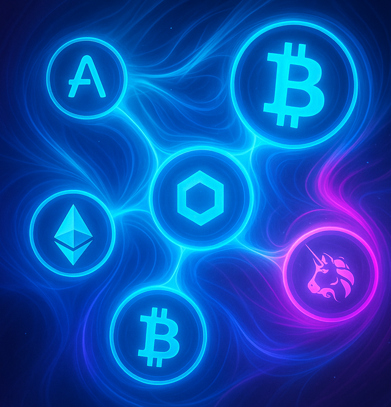
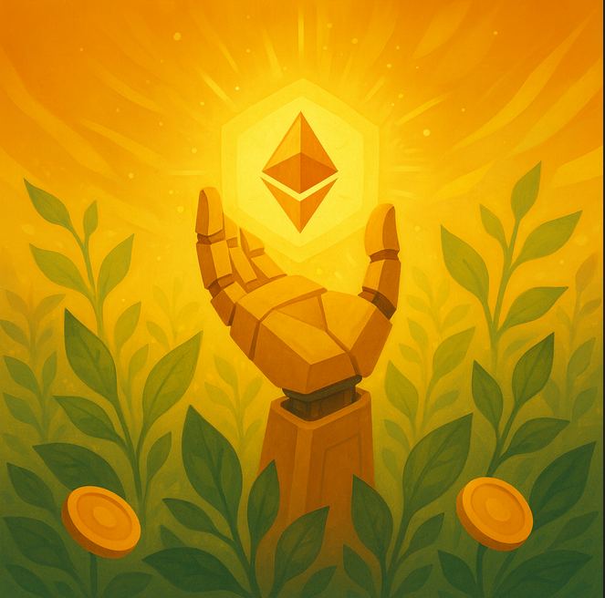

# El ecosistema de aplicaciones para las finanzas: DeFi

## La economía: un entramado complejo y difícil de digerir

La economía, en sí, ya es compleja; pero con los conceptos DeFi lo es aún más.

La [composabilidad](https://www.ledger.com/academy/glossary/composability), ese juego de legos característico de Web3 donde todo encaja, está muy presente en DeFi. Esto la hace extremadamente versátil y con gran capacidad de escalar, pero también la vuelve compleja de entender al principio.

Se intentará simplificar, resumir y enfocar en los conceptos económicos que cualquier emprendedor que inicia un proyecto debería comprender.

Debemos tener claro que se trata de un ecosistema financiero tan sofisticado como las finanzas tradicionales, pero construido sobre tecnología descentralizada.

Como explicamos, en este ecosistema existe una evolución natural: desde los servicios básicos de intercambio de tokens, préstamos, provisión de liquidez y generación de rendimiento en la etapa 1.0, hasta su automatización en la 2.0, la mejora de rentabilidad e interoperabilidad en la 3.0, y finalmente su escalado al mundo real en la 4.0. Todo esto resume, en esencia, la visión general de DeFi.

Por supuesto, cada DApp o protocolo DeFi puede combinar distintas capas o enfoques. Por ejemplo, [PancakeSwap](https://pancakeswap.finance/swap) integra elementos de DeFi 1.0 y 2.0 para ofrecer servicios financieros descentralizados —como intercambio, provisión de liquidez y generación de rendimiento— a cambio de comisiones. En la práctica, cada protocolo evoluciona según sus propios objetivos: unos buscan reducir costes o mejorar la rentabilidad, otros aumentar la liquidez o atraer nuevos usuarios. La idea general es sencilla: ofrecer servicios financieros dentro del ecosistema cripto sin intermediarios, de forma automatizada y abierta, a cambio de una ganancia en comisiones que sostiene su propio modelo económico.

Y en la práctica, muchas DApps y protocolos ya comprenden el ecosistema Web3 y son capaces de integrar conceptos DeFi complejos de forma más simplificada y accesible, permitiendo que los proyectos Web3 se creen, crezcan y se mantengan. Aun así, no todo es perfecto: DeFi sigue en crecimiento, la mala experiencia de usuario (UX) continúa siendo un reto, muchos protocolos siguen siendo experimentales, los ataques, tanto a la lógica económica que los hace rentables como a su seguridad básica (por ejemplo, el robo de tokens), siguen siendo una realidad. Pero incluso un token mal gestionado o con poco capital puede ser manipulado ([pump /dump](https://academy.bit2me.com/que-es-pump-and-dump/)) a voluntad con fines especulativos, por actores ajenos al proyecto.

**Riesgos inherentes al ecosistema DeFi**:

Más allá de las ventajas transformadoras, DeFi arrastra riesgos significativos que cualquier participante debe comprender antes de comprometer capital. Los fallos de seguridad en smart contracts representan el riesgo técnico más crítico: un error de programación puede permitir la explotación del protocolo y la pérdida total de fondos depositados. El caso histórico de The DAO en 2016 marcó un punto de inflexión cuando una vulnerabilidad de reentrancia permitió drenar más de 3.6 millones de ETH, provocando el controversial hard fork de Ethereum. El ataque a Parity en 2017 explotó la función DELEGATECALL, congelando permanentemente más de 500.000 ETH. El protocolo dForce sufrió pérdidas millonarias por copiar código de Compound v1 sin comprender las vulnerabilidades heredadas. Protocolos como Synthetix, bZx, Balancer, Bancor y Uniswap han experimentado exploits de distinta gravedad, demostrando que incluso proyectos consolidados pueden verse comprometidos.

La volatilidad extrema del mercado cripto amplifica los riesgos económicos: los protocolos DeFi no siempre pueden garantizar estabilidad ante movimientos bruscos de precio, y están expuestos a ataques económicos diseñados específicamente para desestabilizar el sistema mediante pump and dump coordinados, arbitrajes agresivos o manipulaciones de oráculos. La curva de aprendizaje pronunciada y la falta de información accesible agravan el problema: muchas interfaces de protocolos presuponen conocimientos financieros avanzados sin proporcionar explicaciones didácticas. Conceptos técnicos aparecen sin contexto adecuado, y la proliferación de proyectos clonados sin valor diferencial genera confusión. En algunos casos, las comunidades priorizan el marketing especulativo sobre la educación real de usuarios.

El problema de la descentralización incompleta afecta a numerosos proyectos que se presentan como totalmente descentralizados pero mantienen controles centralizados ocultos. MakerDAO implementa un "Emergency Shutdown" que permite cerrar completamente el funcionamiento del protocolo en situaciones críticas, cediendo control a un grupo reducido de guardianes. Aunque este mecanismo puede ser necesario para proteger el sistema, contradice la narrativa de descentralización absoluta. Muchos protocolos mantienen funciones administrativas privilegiadas, capacidad de pausar contratos o modificar parámetros críticos sin consenso comunitario real. La confiabilidad del proyecto depende fundamentalmente de la honestidad del equipo: aunque el código sea abierto, pueden existir backdoors o funciones de extracción de valor que solo se activen en circunstancias específicas. Si un protocolo colapsa o el equipo desaparece, no existen salvaguardas equivalentes a los seguros de depósito tradicionales ni mecanismos de compensación institucional.

Finalmente, las estafas disfrazadas de proyectos DeFi legítimos representan un riesgo constante: protocolos que copian código sin auditorías profesionales, equipos anónimos sin reputación verificable, tokenomics diseñadas para enriquecer exclusivamente a los fundadores mediante exit scams planificados. La ausencia de regulación efectiva y la dificultad de emprender acciones legales contra entidades descentralizadas hacen que la diligencia debida y la verificación de auditorías sean absolutamente críticas antes de depositar fondos en cualquier protocolo, por prometedor que parezca.

Estas DApps son conocidas como DEX (Decentralized Exchanges), en contraposición a las CEX (Centralized Exchanges). En la práctica como hemos visto, no se limitan al intercambio de tokens unicamente. La mayoría integran los servicios DeFi que mencionamos como préstamos, provisión de liquidez o yield farming. Por tanto, el término “DEX” es más bien una categoría formal o histórica dentro de DeFi, ya que muchas de estas plataformas funcionan hoy como ecosistemas financieros completos.

### La economía del token

Ya entendimos lo importante que el token el [criptoeconomía](5-1-crypto%20economy.md), ahora veremos cómo para DeFi es fundamental.

En el ciclo de vida de un token, durante su fase inicial o startup, [el mercado primario](https://www.gate.com/es/learn/articles/understanding-the-primary-crypto-market-opportunities-and-risks/8122) es donde se decide cómo y a quién se distribuye la emisión inicial. En este punto, DeFi no siempre está plenamente presente: lo habitual es que los fundadores haga una venta directa mediante una oferta inicial (ICO, Initial Coin Offering), estructurada en distintas fases —privada, anticipada o pública— que funcionan como rondas de financiación temprana.

Estas ofertas suelen basarse en un [preminado](https://www.binance.com/es/academy/glossary/premining), es decir, una creación previa de tokens asignados antes de su lanzamiento público. Parte de ese preminado se vende en preventas y se gestiona mediante [whitelists](https://www.coinbase.com/es-es/learn/tips-and-tutorials/what-is-a-crypto-whitelist), listas de direcciones autorizadas a participar en cada fase, limitando el acceso o aplicando requisitos específicos (comunidad, KYC, aportación previa, etc.). Todo esto ocurre dentro del mercado primario, antes de que el token entre en circulación libre en [DEX o CEX](https://academy.bit2me.com/que-es-exchange-criptomonedas/).

Con el tiempo, y ante los desafíos regulatorios —dado que las ICO podían clasificarse como valores ([securities](https://www.investopedia.com/terms/s/security.asp))—, el modelo fue evolucionando. Durante años coexistieron varias variantes: las [IEO](https://academy.bit2me.com/que-es-una-ieo/) (Initial Exchange Offering), donde la venta inicial ocurre en un exchange centralizado; las [IDO](https://academy.bit2me.com/como-participar-en-una-ido/) (Initial DEX Offering), donde la distribución se ejecuta mediante contratos inteligentes en un DEX; las [ILO](https://www.cls.global/glossary/initial-liquidity-offering) (Initial Liquidity Offering), donde el equipo no vende el token directamente sino que lo deposita junto a otro activo en una pool de liquidez, de modo que la propia pool actúa como mecanismo de distribución y de formación del precio desde el primer momento; y los [Liquidity Bootstrapping Pools](https://docs.fjord.network/app/lbps/what-is-an-lbp) o LBP, subastas en las que el precio del token empieza alto y va bajando progresivamente según la demanda, permitiendo una distribución más orgánica sin que un solo comprador acapare la oferta. [Fjord Foundry](https://fjord.network/) es hoy la plataforma de referencia para este último modelo.

Sin embargo, el patrón dominante desde 2022 ya no es ninguno de los anteriores. El modelo que se ha impuesto se llama [programa de puntos con airdrop](https://defiprime.com/points-based-token-distribution-programs-web3) y funciona de manera muy diferente: el equipo lanza el protocolo sin emitir ningún token todavía. Los usuarios que lo usan durante semanas o meses van acumulando puntos, que no tienen precio ni se pueden vender. Cuando el equipo decide que es el momento de lanzar el token, esos puntos se convierten en una asignación. Lo que era uso gratuito retroactivo se convierte de golpe en un reparto de tokens. [Blur](https://blur.io/) fue el protocolo que popularizó esta mecánica en 2022, y desde entonces casi todos los proyectos relevantes la han replicado.

En el extremo opuesto está el [fair launch](https://www.coingecko.com/learn/what-is-a-fair-launch-in-crypto): un lanzamiento sin preminado, sin fases privadas y sin asignaciones previas, donde todo el mundo parte del mismo punto desde el primer bloque.

El papel clave de DeFi llega cuando el token entra en el mercado secundario, en el que el token obtiene liquidez real a través de los denominados [liquidity pools](https://finematics.com/liquidity-pools-explained/) o piscinas de liquidez. En ellos entran en juego los *Automated Market Makers* ([AMM](https://academy.bit2me.com/que-es-automated-market-maker-amm/)), mecanismos algorítmicos que fijan los precios de intercambio utilizando los fondos aportados por los usuarios. Gracias a este modelo, los tokens pueden negociarse de forma completamente descentralizada y sin intermediarios.

Dentro de la economía del token, también existen mecanismos de ajuste y distribución del valor, como las recompras de tokens ([buybacks](https://cointelegraph.com/explained/buyback-and-burn-what-does-it-mean-in-crypto)) para sostener el precio, las quemas (burn) para controlar la inflación, los [airdrops](https://academy.bit2me.com/que-es-un-airdrop-criptomonedas/), que funcionan como campañas de marketing de distribución gratuita de tokens para atraer nuevos usuarios, premiar a quienes ya usaban el protocolo y repartir la propiedad entre más participantes para hacer el proyecto más descentralizado y las reservas de incentivos, que sirven para premiar a los holders o mantenedores del token a bloquear y asegurar el precio (por eso se habla tanto del [TVL](https://coinmarketcap.com/academy/es/glossary/total-value-locked-tvl) o Total Valor Bloqueado como una métrica fundamental). Todo esto se gestiona en las DAO mediante mecanismos como las [tesorerías](https://www.ledger.com/academy/glossary/bitcoin-treasury), que son contratos inteligentes que acumulan tokens propios o ajenos; o las [bóvedas](https://cointelegraph.com/explained/what-is-a-crypto-vault-and-how-does-it-work), que actúan como bots automatizados que ejecutan operaciones concretas definidas para alcanzar ciertos objetivos de rentabilidad.

Con el tiempo, si el proyecto crece, el token puede evolucionar hacia nuevos usos: gobernanza, staking o incluso integración con productos financieros más amplios dentro del ecosistema DeFi.

Como vemos, la envergadura y complejidad de todo esto es enorme. Pero no es necesario aplicarlo todo de golpe. A medida que el proyecto crezca, podremos contar con especialistas en el ecosistema DeFi o como decíamos, también contamos con la ayuda de launchpads o lanzadores de proyectos, porque DeFi es una herramienta, el token es solo el mecanismo de captura de valor, el verdadero valor proviene del modelo de negocio y la comunidad.

### El mercado en web3

El mercado es el espacio donde se realiza la actividad económica, principalmente el intercambio. En él se cruzan la oferta y la demanda de activos digitales, se forman los precios y se genera la liquidez que sostiene el ecosistema. La diferencia fundamental frente al mercado tradicional o centralizados, es que en Web3, en mercados descentralizados, las reglas no las dicta una institución central, sino que están en el propio código desplegado en contratos inteligentes, lo que le permite estar abierto en cualquier momento, incluido fines de semana, todos los días de año; es accesible en cualquier lugar y para cualquiera, y el único requisito de tener una conexión a internet y una wallet.

Podemos hablar en primer lugar de los mercados [entre pares (P2P)](https://es.cointelegraph.com/news/p2p-vs-exchanges-what-is-the-best-option-for-cryptocurrency-trading), donde los usuarios intercambian directamente activos sin intermediarios. Son la forma más simple de comercio descentralizado y se basan en la confianza o en sistemas de reputación, aunque también se usan servicios de garantía como el [servicio escrow](https://academy.bit2me.com/que-es-un-servicio-de-escrow/), donde un contrato inteligente retiene temporalmente los fondos hasta que ambas partes cumplen las condiciones del intercambio.

El mercado evolución a un modelo user-to-contract (U2C), en el que el usuario ya no negocia con otra persona, sino con un contrato inteligente que actúa como contraparte automatizada. Este modelo es el estándar en DeFi: el código define las reglas del intercambio, elimina el riesgo de contraparte y permite la ejecución automática de órdenes. Se puede entender un mercado P2P con un servicio de garantía (escrow) como un modelo U2C; sin embargo, el matiz fundamental del modelo User-to-Contract es que no existe en ningún momento interacción ni conocimiento directo entre las partes, a diferencia de lo que ocurre en una transacción P2P, donde sí hay relación o contraparte identificable.

En Web3 también distinguimos el [mercado primario y el mercado secundario](https://www.gate.com/es/learn/articles/understanding-the-primary-crypto-market-opportunities-and-risks/8122). El primario es donde los proyectos emiten y distribuyen sus tokens iniciales, normalmente mediante preventas, whitelists, IDO o airdrops. Aquí es donde entra el capital que financia al protocolo. El mercado secundario, en cambio, es donde esos tokens ya emitidos se compran y venden entre usuarios, generando liquidez, ajustando el valor de los activos y permitiendo el descubrimiento de precios, es decir, el proceso mediante el cual la interacción entre oferta y demanda determina de forma transparente y dinámica el valor real de un token en el mercado.

Los mercados pueden clasificarse según su mecanismo de funcionamiento. El mercado de [libro de órdenes](https://academy.bit2me.com/que-es-un-libro-de-ordenes-order-book/) (order book) organiza las órdenes de compra y venta para determinar el precio mediante el matching de ofertas. Este modelo es típico de los exchanges centralizados (CEX) como Binance o Coinbase, donde la plataforma custodia los fondos y gestiona el matching off-chain. Recientemente, algunos DEXs híbridos como dYdX V4 y Vertex Protocol han logrado implementar order books on-chain o mediante L2s dedicadas, permitiendo órdenes límite (limit orders) con autocustodia, aunque requieren mayor infraestructura y liquidez profesional para funcionar eficientemente.

El [mercado OTC](https://academy.bit2me.com/que-son-operaciones-otc/) (Over The Counter) permite acuerdos directos entre partes, ideal para grandes operaciones fuera del mercado público.

Finalmente, el modelo más característico de DeFi es el AMM (Automated Market Maker), donde los intercambios se realizan contra pools de liquidez gestionados por algoritmos. Los AMM eliminan la necesidad de matching directo entre compradores y vendedores: en su lugar, los usuarios intercambian contra un pool de fondos depositados por proveedores de liquidez. Existen diferentes variantes según el tipo de activo: el patrón Constant Product (x × y = k) de [Uniswap](https://uniswap.org/) V2, SushiSwap y PancakeSwap distribuye liquidez uniformemente en todo el rango de precios; el patrón StableSwap de [Curve](https://curve.fi/) optimiza intercambios entre activos de igual precio (stablecoins, LSDs) minimizando slippage; y la liquidez concentrada de Uniswap V3 permite a los LPs elegir rangos de precio específicos, multiplicando la eficiencia del capital pero incrementando el riesgo. [Balancer](https://balancer.fi/) lleva esto más allá permitiendo pools multi-token con ponderaciones personalizadas. Todos estos AMM operan sin intermediarios, de forma continua y abierta, repartiendo comisiones entre los proveedores de liquidez.

Además, en Web3 surgen nuevos tipos de mercado especializados. Los mercados de préstamos operan mediante diferentes arquitecturas según el modelo de riesgo: el Pooled Lending (Pool-to-Peer) de protocolos como Aave y Compound permite depositar activos en un pool común donde otros piden prestado, con tasas de interés algorítmicas según la utilización, aunque introduce riesgo sistémico compartido; el Peer-to-Peer Lending busca matching directo entre prestamista y prestatario, como Morpho optimizando sobre Aave/Compound, o PWN y MetaStreet permitiendo NFTs como colateral; los Isolated Markets de Euler Finance y Silo Finance crean pools separados para cada activo evitando contagio, permitiendo listar long-tail assets; y el Undercollateralized Lending de Maple Finance, TrueFi y Goldfinch ofrece préstamos sin colateral on-chain mediante KYC y reputación, introduciendo exposición a activos del mundo real (RWA) pero alejándose del ideal descentralizado.

Los mercados de derivados permiten exposición apalancada y cobertura de riesgo: los Perpetual Futures (perps) como GMX con Virtual AMM o Gains Network con oráculos ofrecen contratos sin expiración con funding rates; las opciones on-chain de Opyn, Lyra, Aevo y Hegic implementan modelos de pricing complejos; y los activos sintéticos de Synthetix permiten trackear precios externos sin poseer el activo subyacente.

Finalmente, los mercados de activos tokenizados conectan finanzas tradicionales mediante la representación on-chain de acciones, bonos, materias primas o bienes raíces, expandiendo DeFi más allá del ecosistema puramente cripto.

En conjunto, el mercado en Web3 es un entorno dinámico, sin fronteras y sin permiso, donde los contratos inteligentes sustituyen a los intermediarios y la confianza se distribuye entre los participantes. Es la base de toda la economía descentralizada, y entender su estructura es esencial para comprender cómo fluye el valor en DeFi.

### Infraestructura de protocolos DeFi

La infraestructura DeFi se organiza en categorías funcionales que reflejan distintos modelos de negocio y arquitecturas técnicas. Cada categoría responde a necesidades específicas del ecosistema: intercambio, préstamos, derivados y optimización de rendimientos. Comprender esta clasificación ayuda a identificar qué protocolo utilizar según el objetivo del proyecto, sin necesidad de reinventar soluciones ya consolidadas.

**DEXs: la evolución del intercambio descentralizado**:

Los exchanges descentralizados son la columna vertebral del intercambio de activos en DeFi. Su evolución refleja la búsqueda constante de eficiencia, mejor experiencia de usuario y protección contra manipulación.

Los AMM tradicionales como Uniswap V2, SushiSwap o PancakeSwap operan bajo el patrón Constant Product (x × y = k), donde la liquidez se distribuye uniformemente en todo el rango de precios. Este modelo es robusto y simple, pero ineficiente en términos de capital: gran parte de la liquidez permanece inactiva fuera del rango donde realmente se comercia.

La liquidez concentrada, introducida por Uniswap V3 y adoptada posteriormente por Trader Joe V2 y PancakeSwap V3, permite a los proveedores de liquidez (LPs) elegir rangos de precio específicos donde su capital estará activo. Esto multiplica la eficiencia del capital, pero incrementa el riesgo de salirse del rango y quedarse expuesto a un solo token.

Para activos de igual precio, como stablecoins o liquid staking derivatives, Curve optimizó el patrón StableSwap, que minimiza el deslizamiento (slippage) y maximiza la eficiencia en intercambios entre activos altamente correlacionados. Este modelo es clave para mantener la liquidez entre DAI/USDC o stETH/ETH sin pérdidas significativas.

Más recientemente, los Order Book DEXs como dYdX V4 y Vertex Protocol recuperan el modelo tradicional de libro de órdenes pero en cadena, permitiendo órdenes límite (limit orders) que ofrecen mayor control de precios. El trade-off es que requieren liquidez profesional y mayor infraestructura, por lo que no todos los proyectos pueden sostener este modelo.

Los DEX Aggregators como 1inch, Matcha (0x) y ParaSwap dividen las órdenes entre múltiples DEXs para obtener el mejor precio mediante routing óptimo. Representan la capa de abstracción de DeFi 3.0, donde el usuario final no necesita saber qué protocolo está usando.

Los Intent-Based DEXs representan la siguiente evolución en intercambio descentralizado, donde el usuario simplemente expresa qué quiere lograr y una red competitiva de solvers determina la mejor forma de ejecutarlo. Este paradigma invierte el modelo tradicional donde el usuario debe especificar exactamente cómo ejecutar un trade. Protocolos como CoWSwap, UniswapX y 1inch Fusion lideran esta arquitectura.

En CoWSwap, los usuarios firman órdenes que expresan sus intenciones de intercambio sin pagar gas inmediatamente. Estas órdenes se agrupan en batches durante ventanas de tiempo específicas. Los solvers compiten por resolver estos batches, encontrando matches directos entre traders cuando es posible mediante CoWs (Coincidence of Wants), eliminando la necesidad de usar pools AMM y ahorrando slippage. Para órdenes que no pueden matchearse directamente, los solvers las ejecutan en DEXs externos, optimizando rutas. Los solvers pagan el gas, y los usuarios solo pagan si su orden se ejecuta dentro de sus parámetros. El modelo de batch auctions inherentemente protege contra MEV porque no hay transacciones públicas en mempool que los bots puedan frontrunner.

UniswapX lleva este concepto más allá permitiendo órdenes cross-chain y utilizando fillers (equivalente a solvers en CoWSwap) que compiten por proporcionar la mejor ejecución. Los usuarios firman órdenes off-chain especificando tokens de entrada/salida, cantidades límite y deadline. Los fillers pueden satisfacer estas órdenes desde cualquier fuente de liquidez: su propio inventario, pools Uniswap, otros DEXs, o incluso CEXs. La competencia entre fillers garantiza que los usuarios reciban precios cercanos a los óptimos del mercado. El protocolo cobra una pequeña comisión, pero elimina la necesidad de múltiples transacciones on-chain para routing complejo.

1inch Fusion implementa un modelo similar donde los resolvers profesionales ejecutan órdenes agregando liquidez de múltiples fuentes. La arquitectura permite especificar condiciones complejas como ejecución parcial, órdenes límite con expiración, y protección contra slippage extremo. El mecanismo de [Dutch Auction](https://chain.link/education-hub/what-is-a-dutch-auction) integrado ajusta dinámicamente el precio ofrecido hasta que un resolver la acepta, equilibrando velocidad de ejecución con precio óptimo.

El impacto real de los Intent-Based DEXs se mide en protección MEV y savings para usuarios. Estudios muestran que CoWSwap ahorra a usuarios promedios de 0.3-0.5% por trade comparado con ejecución directa en Uniswap, principalmente eliminando sandwich attacks. Para traders de volumen alto o tokens con baja liquidez, estos ahorros pueden ser sustancialmente mayores. La arquitectura también beneficia al ecosistema reduciendo congestión en mempool: múltiples intenciones se resuelven en una sola transacción batch.

**Lending: préstamos descentralizados sin intermediarios**:

Los protocolos de préstamos eliminan la necesidad de bancos o intermediarios financieros, permitiendo que cualquiera pueda prestar o pedir prestado usando criptoactivos como colateral.

El modelo Pooled Lending (Pool-to-Peer), usado por Aave y Compound, permite depositar activos en un pool común donde otros pueden pedir prestado. La tasa de interés se ajusta algorítmicamente según la utilización del pool: cuanto más capital prestado, mayor el interés. Este modelo es eficiente, pero introduce riesgo sistémico: todo el pool comparte el riesgo de liquidación o exploit.

El Peer-to-Peer Lending busca matching directo entre prestamista y prestatario, eliminando el riesgo compartido. Morpho optimiza este modelo creando una capa de matching P2P sobre Aave y Compound, ofreciendo mejores tasas sin sacrificar liquidez. PWN y MetaStreet amplían este concepto permitiendo usar NFTs como colateral.

Los Isolated Markets, implementados por Euler Finance y Silo Finance, crean pools separados para cada activo, evitando contagio entre mercados. Esto permite listar activos de long-tail sin comprometer la seguridad de todo el protocolo.

Finalmente, los Undercollateralized Lending como Maple Finance, TrueFi y Goldfinch intentan ofrecer préstamos sin colateral on-chain, pero requieren KYC y mecanismos de reputación. Esto introduce default risk y exposición a activos del mundo real (RWA), alejándose del ideal descentralizado pero abriendo DeFi a casos de uso institucionales.

**Derivatives: réplica de mercados tradicionales en cadena**:

Los derivados permiten exposición apalancada, cobertura de riesgo y trading sofisticado sin custodia centralizada.

Los Perpetual Futures (perps) son contratos sin fecha de expiración donde un funding rate periódico ajusta el precio del contrato al del activo subyacente. GMX utiliza un Virtual AMM donde el pool GLP actúa como contraparte de todos los traders. Gains Network y Kwenta (sobre Synthetix) usan oráculos para determinar precios, eliminando la necesidad de pools de liquidez profundas. La ventaja principal sobre CEXs es la autocustodia: el usuario controla sus fondos en todo momento.

Las Options (opciones) otorgan el derecho, pero no la obligación, de comprar o vender un activo a un precio determinado. Protocolos como Opyn (Squeeth), Lyra, Aevo y Hegic implementan diferentes modelos de pricing y gestión de riesgo. La complejidad de las opciones on-chain radica en la liquidez fragmentada y la dificultad de replicar los modelos de pricing tradicionales como Black-Scholes en un entorno de gas limitado.

Los Synthetic Assets, liderados por Synthetix, permiten trackear el precio de activos externos (acciones, commodities, forex) sin poseerlos directamente. Utilizan un debt pool compartido donde todos los holders de synths comparten el riesgo. Mirror Protocol intentó replicar este modelo en Terra, pero colapsó junto con el ecosistema. Los sintéticos expanden DeFi más allá de las criptomonedas, pero introducen dependencia de oráculos y riesgo de desacople.

**Yield Optimization: automatización del rendimiento**:

La optimización de rendimientos automatiza estrategias complejas que manualmente serían costosas o ineficientes.

Los Yield Aggregators como [Yearn Finance](https://yearn.fi/vaults) y [Beefy Finance](https://beefy.finance/) auto-componen las recompensas y cambian automáticamente entre estrategias según los rendimientos. Esto ahorra gas, permite estrategias profesionales y democratiza el acceso a farming avanzado. El usuario deposita capital y recibe un token representativo cuyo valor aumenta con el tiempo.

El mecanismo central de estos agregadores es la bóveda o vault. Para el inversor minorista, la experiencia es comparable a depositar dinero en un fondo de inversión: vas a [yearn.fi/vaults](https://yearn.fi/vaults), eliges una bóveda —por ejemplo, la bóveda de USDC— y depositas tus tokens. A cambio recibes un token representativo de tu participación, llamado yToken (por ejemplo, yUSDC). A partir de ese momento, el vault trabaja de forma autónoma: un conjunto de contratos inteligentes llamados estrategias busca continuamente los mejores rendimientos disponibles en el ecosistema DeFi, mueve el capital entre protocolos, reinvierte las recompensas automáticamente y cobra comisiones por la gestión. Cuando decides retirar, devuelves tus yTokens y récuperan la cantidad depositada más los rendimientos acumulados.

La diferencia respecto a una pool de liquidez es importante. En una pool de liquidez aportas un par de tokens para que otros hagan swaps, y tus ganancias provienen de las comisiones de esas operaciones, pero te expones a pérdida impermanente. En una vault depositas un único activo, no hay liquidez para terceros que intercambiar, y los rendimientos provienen de estrategias activas de yield: staking, préstamos en Aave o Compound, farming de tokens de recompensa, etc. La complejidad estratégica está oculta tras una interfaz simple de depositar y retirar.

Este modelo fue posible en parte gracias al estándar [ERC-4626](https://eips.ethereum.org/EIPS/eip-4626), que unifica la interfaz de los vaults tokenizados. Antes de su adopción, cada protocolo implementaba su propia lógica incompatible; con ERC-4626, cualquier protocolo DeFi puede integrarse con vaults de forma estandarizada, facilitando la composabilidad entre capas. Yearn adoptó ERC-4626 en sus vaults v3, al igual que otros protocolos como Morpho o Spark.

El principal riesgo de los vaults no es la pérdida impermanente, sino el riesgo de smart contract y el riesgo de estrategia. Si una de las estrategias interactúa con un protocolo que es hackeado, el capital depositado puede perderse parcialmente. Yearn mitiga esto mediante auditorías de cada estrategia y límites de exposición: ninguna estrategia puede concentrar todo el capital del vault. Beefy opera de forma similar en múltiples cadenas. Para el inversor minorista, esto implica que cuanto más sofisticada es la estrategia y más protocolos intermedios involucra, mayor es la superficie de ataque acumulada.

Los Liquid Staking Derivatives (LSD) como Lido (stETH), Rocket Pool (rETH) y Frax (frxETH) permiten stakear ETH sin perder liquidez: el token recibido es tradeable y puede usarse en otros protocolos DeFi. Esto combina staking rewards con composabilidad DeFi, multiplicando la utilidad del capital.

**Riesgos de centralización en LSD:** El dominio de Lido con >30% del ETH staked total genera preocupaciones sistémicas. Si un single protocol controla >33% de validadores, puede unilateralmente atacar finalidad de Ethereum; si supera 50%, puede censurar transacciones o reorganizar bloques. Además, concentración en pocos node operators (Lido usa ~30 operadores para millones de ETH) crea single points of failure. Rocket Pool mitiga esto con staking permissionless donde cualquiera puede correr minipools con solo 8 ETH, distribuyendo validadores entre miles de operadores independientes.

**LSD-Fi ecosistema:** Los LSDs se han convertido en primitivo DeFi que genera ecosistema secundario. Pendle tokeniza yield futuro de stETH permitiendo especular sobre rates sin exposición a principal. Index Coop y otros crean productos estructurados (ej. dsETH que diversifica entre múltiples LSDs). Protocolos de restaking como EigenLayer permiten restakear stETH para segurizar AVS, multiplicando utility. Curva de riesgo: ETH staking base (~4%) + LSD premium (0.5-1%) + DeFi strategies (variable) - slashing risk - smart contract risk compuesto por múltiples capas.

El Leveraged Yield Farming, implementado por Alpaca Finance y Gearbox Protocol, permite pedir prestado contra colateral para aumentar la exposición a una estrategia de farming. Esto amplifica tanto ganancias como pérdidas, introduciendo riesgo de liquidación si el valor del colateral cae.

Finalmente, la Vote Incentivization (Bribes) surgió de las Curve Wars: proyectos pagan por votos en gauge weights para dirigir emisiones de tokens hacia sus pools. Votium, Hidden Hand y Paladin facilitan este mercado de incentivos. Convex actúa como agregador de veCRV, permitiendo a usuarios pequeños participar en la gobernanza de Curve sin bloquear capital directamente. Redacted Cartel coordina estrategias de acumulación de poder de voto entre múltiples protocolos.

Esta infraestructura de protocolos DeFi es modular y composable: cada capa puede construirse sobre otra, creando productos financieros cada vez más sofisticados. Como emprendedor, no necesitas implementar todo desde cero: puedes integrar estos protocolos según las necesidades de tu proyecto, enfocándote en la propuesta de valor única que aportas al ecosistema.

**Formación de precios y arbitraje entre mercados DeFi y CEX**:

La formación de precios en Web3 depende de la interacción constante entre los mercados centralizados (CEX) y los descentralizados (DEX). Ambos operan con los mismos activos, pero bajo reglas distintas: los CEX usan libros de órdenes tradicionales, mientras que los DEX y AMM ajustan sus precios de forma algorítmica mediante la liquidez aportada por los usuarios.

El precio de un token nunca es completamente fijo, sino el resultado del equilibrio dinámico entre oferta y demanda en cada tipo de mercado. En los CEX, los precios reflejan la suma de todas las órdenes activas de compra y venta; en los AMM, el precio se determina automáticamente según la proporción entre los tokens en el pool (x·y = k). Cuando un activo se compra masivamente en un AMM, su precio sube dentro del pool, y si se vende, baja.

Este desajuste temporal entre el precio en los CEX y el precio en los DEX crea oportunidades de [arbitraje](https://www.coinbase.com/es-es/learn/advanced-trading/what-is-crypto-arbitrage-trading). Los arbitrajistas son agentes que detectan diferencias de valor entre mercados y realizan operaciones simultáneas para obtener beneficio y equilibrar los precios. Por ejemplo, si un token vale 1,02 USD en un DEX y 1,00 USD en un CEX, los arbitrajistas comprarán en el CEX y venderán en el DEX hasta que los precios se igualen.

El arbitraje no solo genera beneficio individual, sino que cumple una función económica esencial: mantiene la coherencia de precios entre los distintos mercados, evita distorsiones y mejora la eficiencia del sistema. En DeFi, muchas de estas operaciones se ejecutan de forma automática mediante bots on-chain, que monitorizan los precios y actúan en cuestión de segundos, aprovechando la transparencia total de los datos en la blockchain.

En periodos de alta volatilidad o congestión de red, pueden producirse desacoples temporales entre CEX y DEX, ya que las comisiones o la lentitud de las transacciones dificultan el arbitraje. Estas diferencias pueden ser amplificadas si los pools de liquidez tienen poco volumen o si los oráculos tardan en actualizar precios.

En definitiva, la formación de precios en Web3 es un proceso continuo, descentralizado y autorregulado, donde el arbitraje actúa como fuerza de equilibrio entre los mercados. La interacción entre CEX y DeFi es, en última instancia, lo que garantiza que los precios reflejen el valor real de los activos y que la economía digital mantenga coherencia y liquidez global.

**TWAP Oracles: resistencia a manipulación mediante promedios temporales:**

Los Time-Weighted Average Price (TWAP) oracles calculan el precio promedio de un activo durante un período temporal, en lugar de usar el precio spot instantáneo. Esto previene manipulación mediante flash loans o trades grandes momentáneos que pueden distorsionar precios en AMMs de baja liquidez.

**Funcionamiento:** Uniswap V2 implementó TWAP nativamente acumulando precio en cada bloque. Contrato almacena suma acumulativa de precio: `priceAccumulator += price * timeElapsed`. Para obtener TWAP entre dos puntos temporales: `TWAP = (priceAccumulatorEnd - priceAccumulatorStart) / timeElapsed`. Un período de 30 minutos significa que atacante necesitaría manipular precio consistentemente durante 30 minutos, no solo un bloque, incrementando costo de ataque exponencialmente.

**Trade-offs críticos:** TWAP introduce latency - precio refleja condiciones pasadas, no actuales. Durante alta volatilidad, TWAP puede estar significativamente desactualizado respecto a precio real, permitiendo arbitraje contra protocolos que lo usan. Protocolos de lending (Compound, Maker) históricamente usaron TWAP para prevenir manipulación de colateral, pero bajo volatilidad extrema (crash March 2020) la latency causó liquidaciones subóptimas. Uniswap V3 mantiene TWAP pero con mejoras en precisión mediante tick accumulation.

**Alternativas modernas:** Chainlink combina múltiples fuentes off-chain agregadas, resistiendo manipulación sin latency de TWAP. Pyth Network usa publishers de alta frecuencia para precios real-time. Sin embargo, TWAP on-chain permanece como oracle más simple y manipulation-resistant puramente on-chain, útil para protocolos que priorizan descentralización sobre latency.

**Los oráculos de precios**:

Los [oráculos](https://www.coinbase.com/es-es/learn/crypto-glossary/what-is-a-blockchain-oracle-in-crypto) son sistemas que conectan la blockchain con información del mundo exterior. En el contexto DeFi, su función principal es proveer precios fiables y actualizados de los activos negociados, permitiendo que los contratos inteligentes tomen decisiones correctas en función del valor real del mercado.

Como la blockchain no puede acceder por sí misma a datos externos, los oráculos actúan como fuente de verdad para operaciones críticas: liquidaciones, préstamos, emisión de stablecoins o cálculo de recompensas.

Los oráculos pueden ser manipulados, sufrir retrasos o depender de fuentes únicas, lo que genera riesgos como precios falsos, liquidaciones indebidas y pérdidas por ataques (flash loans, front-running, sandwich). La diversificación y actualización rápida son clave para mitigar estos problemas.

**DEX Aggregators**:

Los [DEX aggregators](https://www.coinbase.com/es-es/learn/crypto-glossary/what-is-a-dex-aggregator) son plataformas que permiten a los usuarios encontrar el mejor precio y la mayor eficiencia al intercambiar tokens en DeFi. Plataformas como [1inch](https://1inch.io/) lideran este espacio, optimizando rutas de intercambio distribuyendo órdenes entre múltiples fuentes de liquidez. Estos agregadores representan una evolución hacia DeFi 3.0, ya que conectan múltiples exchanges descentralizados y rutas de liquidez, analizando en tiempo real dónde se puede ejecutar una operación con el menor coste y el menor deslizamiento posible, incluso entre distintas blockchains. El usuario solo interactúa con el agregador, que se encarga de dividir la orden entre diferentes pools o protocolos si es necesario, optimizando el resultado final.

### Pools de liquidez

Las [piscinas de liquidez](https://academy.bit2me.com/que-es-una-liquidity-pool-y-como-crear-una/) o liquidity pools son la base de la economía DeFi. Su función es permitir que exista liquidez constante en el mercado: que cualquier usuario pueda comprar o vender un activo en cualquier momento, sin necesitar una contraparte directa. Este mecanismo automatizado es lo que da origen al modelo AMM (Automated Market Maker).

Se les llama “piscinas” porque funcionan de forma análoga a un depósito común. Los usuarios aportan pares de tokens que quedan bloqueados en un contrato inteligente, formando una reserva sobre la que otros pueden operar. Generalmente, una pool se compone de dos tokens: uno base y otro cotizado. Este par es el binomio mínimo necesario para el intercambio.

En muchos casos, el token cotizado suele ser una stablecoin, que actúa como nexo común de valor (por ejemplo, DAI, USDC o USDT). En otros, el token cotizado es ETH u otro activo del protocolo con el que se relaciona el token base. Lo importante es que entre ambos tokens exista afinidad de mercado, es decir, que haya una relación económica real o una demanda sostenida. Si un par carece de interés o uso, simplemente no genera volumen ni liquidez.

El precio dentro de una pool se mantiene mediante una fórmula matemática de equilibrio, normalmente x·y = k, donde x y y representan las cantidades de cada token y k es una constante. Si un activo se compra mucho, su cantidad en la pool disminuye y su precio sube automáticamente; si se vende, ocurre lo contrario. Este mecanismo reemplaza el libro de órdenes tradicional, garantizando que siempre haya ambos token disponibles.

Sin embargo, las pools no son sistemas perfectos. En teoría son cerradas y autorreguladas, pero en la práctica dependen del comportamiento externo del mercado. Si el token base puede emitirse libremente fuera de la pool, su exceso de oferta diluye el valor del otro token, generando un efecto similar a la inflación: los proveedores de liquidez pierden poder adquisitivo dentro del pool.

Existen también riesgos de manipulación del precio, como los ataques [pump and dump](https://academy.bit2me.com/que-es-pump-and-dump/), en los que grandes operadores mueven bruscamente los precios para obtener beneficios especulativos.

Finalmente, uno de los fenómenos más característicos de este modelo es la [pérdida impermanente](https://www.coinbase.com/es-es/learn/crypto-glossary/what-is-impermanent-loss), que ocurre cuando el precio relativo de los tokens del pool cambia respecto al mercado externo.

Se llama "impermanente" porque la pérdida solo se materializa (se hace permanente) si retiras tus activos del pool mientras la diferencia de precios persiste, si luego se ajusta al precio de la pool, ya no hay perdida.

**Ejemplo simple**:

Supongamos una pool con 1 ETH y 3500 DAI (precio inicial 1 ETH = 3500 DAI):

- **Inicio:**  
  - 1 ETH + 3500 DAI → valor total = **7000 DAI**

- **Si el precio sube** a 4000 DAI:  
  - El pool vende parte de tu ETH → terminas con ~0.935 ETH + 3740 DAI  
  - Valor total ≈ **7470 DAI**  
  - Si hubieras holdeado (1 ETH + 3500 DAI), tendrías **7500 DAI**  
  - → **Pérdida impermanente ≈ 30 DAI**

- **Si el precio baja** a 2500 DAI:  
  - El pool compra ETH → terminas con ~1.183 ETH + 2958 DAI  
  - Valor total ≈ **5933 DAI**  
  - Si hubieras holdeado, tendrías **6000 DAI**  
  - → **Pérdida impermanente ≈ 67 DAI**

En ambos casos, **pierdes respecto a haber [holdeado](https://academy.bit2me.com/que-es-holdear/)**, porque el mecanismo del pool te mantiene equilibrado entre ambos activos.  
La pérdida solo se compensa si las comisiones o incentivos superan esa diferencia.

#### Evolución de las fórmulas de los pools de liquidez

El funcionamiento de los AMM se basa en una función matemática constante que mantiene el equilibrio entre los tokens del pool. A lo largo del tiempo, estos modelos han evolucionado para mejorar la eficiencia del capital y adaptarse a distintos tipos de activos.

**Modelo clásico — x·y = k**:

El modelo original de Uniswap v2 y muchos AMM iniciales.
La fórmula establece que el producto de las cantidades de los dos tokens debe mantenerse constante. Si un usuario compra un token, su cantidad en el pool baja y la del otro sube, ajustando automáticamente el precio.
Este modelo es robusto y simple, pero reparte la liquidez de forma uniforme en todo el rango de precios posibles (de 0 a ∞), lo que significa que gran parte del capital permanece inactivo fuera del rango donde realmente se comercia.

Ejemplo simple:

Supongamos un pool con 10 ETH y 35 000 DAI (precio inicial: 1 ETH = 3.500 DAI).  

El valor total del pool es 70.000 DAI.  

Si un usuario compra 1 ETH, el pool debe mantener constante el producto x·y=k.  

Para ello, la cantidad de ETH baja a 9 y el DAI sube, por ejemplo, a 38.888.  

El nuevo precio resultante será 38 888 / 9 ≈ 4320 DAI por ETH.  

Así, el precio aumenta automáticamente conforme se reduce la cantidad de ETH disponible.

**Liquidez concentrada — Uniswap v3**:

Para mejorar la eficiencia, Uniswap v3 introdujo el concepto de [liquidez concentrada](https://tangem.com/es/glossary/concentrated-liquidity/), donde los proveedores eligen un rango de precios específico en el que su capital estará activo.

Cada posición se comporta como un pequeño x·y=k dentro de su rango.

Esto permite usar el capital de forma mucho más eficiente y aumentar los rendimientos por comisión, pero también incrementa [el riesgo](https://www.binance.com/es/square/post/28884083167057) ante ataques de bots y snipers: si el precio sale del rango elegido, la posición se “desactiva” y el proveedor queda expuesto solo a uno de los tokens.

> Debes evaluar cuidadosamente el equilibrio entre riesgo y beneficio. Crear una pool de liquidez con poco capital es posible, pero implica una mayor exposición a riesgos de inestabilidad y ataques, precisamente debido al bajo volumen y la menor protección frente a movimientos bruscos o manipulaciones.

Ejemplo:

Si un proveedor coloca liquidez en el rango 3.000–4.000 DAI por ETH y el precio del ETH sube a 4.100 DAI, toda su liquidez se convierte en DAI, quedando fuera de actividad.

En ese momento ya no genera comisiones ni mantiene equilibrio entre ambos tokens: solo conserva DAI.

De forma inversa, si el precio cae por debajo de 3000, el proveedor mantiene únicamente ETH.

Este comportamiento introduce un riesgo crítico: el proveedor puede quedar atrapado con solo uno de los tokens, perdiendo completamente la exposición al otro.  
Cuando el precio sale del rango, el contrato habrá intercambiado casi todo un activo por el otro, de modo que el saldo de uno de ellos se reduce prácticamente a cero.  
Si el precio no regresa al rango, la posición permanece inactiva y el LP mantiene indefinidamente solo el token restante, sin generar comisiones.  
Por eso, en rangos estrechos, aunque la rentabilidad potencial sea alta, el riesgo de quedar totalmente fuera del mercado o de sufrir pérdidas permanentes aumenta de forma considerable.

**Modelos dinámicos y estrategias adaptativas**:

Actualmente surgen enfoques donde la liquidez se reajusta de forma automática según la volatilidad o el comportamiento del mercado.
Algunos protocolos experimentales aplican estrategias dinámicas que modifican el rango de precios o redistribuyen liquidez sin intervención manual.
Estas técnicas buscan mantener la eficiencia de la liquidez concentrada sin exigir al usuario reposicionar constantemente sus fondos, reduciendo costes y riesgo de pérdida impermanente.

En conjunto, la evolución de las fórmulas en los AMM refleja la transición desde un modelo simple y universal a sistemas más inteligentes, adaptativos y orientados a la eficiencia del capital, que ajustan la curva de precios al comportamiento real del mercado.

**vAMMs y Dynamic AMMs: más allá de la liquidez física**:

Los Virtual Automated Market Makers (vAMMs) representan un salto conceptual donde el pricing ocurre mediante fórmulas matemáticas sin requerir liquidez física bloqueada en pools. Perpetual Protocol fue pionero en este modelo para trading de perpetual futures. En lugar de mantener activos reales en un pool, el vAMM utiliza una fórmula x·y=k virtual que solo determina el precio de entrada y salida de posiciones apalancadas. La liquidez real proviene de un vault separado donde los LPs depositan colateral que respalda las posiciones de todos los traders. Esto permite profundidad de liquidez sintética sin fragmentación capital: el mismo vault puede respaldar múltiples mercados de perpetuals simultáneamente.

La ventaja principal de vAMMs es capital efficiency extremo. Un vault con $10M puede soportar cientos de millones en volumen de trading nocional porque los traders no retiran liquidez física del pool, solo abren posiciones que se resuelven mediante funding rates periódicos que ajustan el precio del perpetual al spot. El trade-off es dependencia crítica de oráculos externos para prevenir manipulación: si el precio on-chain diverge significativamente del spot real, arbitrajistas pueden drenar el vault.

Los Dynamic AMMs, implementados más notablemente por Balancer v2, permiten pools multi-token con pesos variables ajustables. A diferencia de Uniswap que requiere ratios 50/50, Balancer permite pools con proporciones arbitrarias como 80/20 o incluso 40/30/20/10 con cuatro tokens. Los LPs que creen en apreciación long-term de un token pueden mantener mayor exposición a él mientras aún generan fees de trading. La fórmula generalizada de Balancer mantiene el valor constante ponderado: (x₁^w₁)(x₂^w₂)...(xₙ^wₙ) = k, donde w son los pesos.

Balancer v2 introdujo dos innovaciones arquitecturales fundamentales. Primero, el Protocol Vault centraliza toda la liquidez de todos los pools en un solo contrato, permitiendo que trades multi-hop (A→B→C) ocurran en una sola transacción on-chain sin mover tokens entre pools, ahorrando gas significativo. Segundo, los custom pool types permiten lógica de pricing completamente personalizada: creadores pueden definir curvas específicas para sus casos de uso sin forkear todo el protocolo.

Casos de uso reales incluyen pools de índices descentralizados donde un pool 40/30/20/10 de ETH/WBTC/LINK/UNI actúa como fondo indexado tradeable, pools de treasury management donde DAOs mantienen diversificación mientras ganan fees, y pools de Liquidity Bootstrapping Pools (LBPs) donde pesos se ajustan gradualmente de 95/5 a 50/50 durante el lanzamiento de un token, presionando el precio hacia abajo y desincentivando especulación inmediata.

La complejidad de estos sistemas requiere expertise técnico sustancial. Los LPs deben entender impermanent loss asimétrico, rebalanceo dinámico, y riesgos de oracle en vAMMs. Para proyectos considerando implementar liquidez propia, evaluar si la eficiencia de capital justifica la complejidad operacional y de auditoría adicional es crítico.

> En esta introducción tampoco se quiere profundizar más, además tampoco es objeto de este sitio de documentación describir estos mecanismos.

#### Estrategias de provisión de liquidez

La provisión de liquidez en DeFi no es estática: cada proveedor elige cómo y dónde aportar capital según su tolerancia al riesgo, horizonte temporal y conocimientos técnicos. Con la evolución de los AMM, han surgido tres enfoques principales: estrategias pasivas, activas y automatizadas.

**Estrategias pasivas**:

Son las más simples y tradicionales. El proveedor deposita sus tokens en una pool y mantiene su posición sin realizar ajustes, confiando en las comisiones generadas por las operaciones del mercado.  
Este método funciona bien en modelos clásicos como Uniswap v2 o Balancer, pero resulta menos eficiente en entornos de liquidez concentrada, donde el rango de precios puede quedar rápidamente fuera de actividad.  
El riesgo principal es la pérdida impermanente, que puede superar los beneficios si el mercado se mueve bruscamente. Por ello, se recomienda usar pares de tokens estables o pools especializadas (por ejemplo, Curve para stablecoins), ya que minimizan la divergencia de precios.  
En el caso de proyectos que controlan la emisión o disponen de una tesorería, esta puede emplearse para mantener la liquidez o estabilizar el precio del token, pero no elimina la pérdida impermanente, solo ayuda a reducir la volatilidad y mitigar los efectos de movimientos especulativos en el mercado.

**Estrategias activas**:

El proveedor gestiona su posición de forma dinámica, reajustando los rangos de precio o migrando la liquidez según las condiciones del mercado.
En AMM modernos como Uniswap v3, esta estrategia permite mantener el capital en los tramos donde hay mayor volumen de operaciones, maximizando el rendimiento.
Sin embargo, requiere seguimiento constante, experiencia en análisis de precios y un equilibrio entre comisiones obtenidas y costes de reposicionamiento. En la práctica, solo usuarios avanzados o entidades profesionales logran hacerlo de manera rentable.

**Estrategias automatizadas o gestionadas**:

Para simplificar la gestión, han surgido protocolos que automatizan las decisiones de provisión de liquidez. Plataformas como [Arrakis](https://arrakis.finance), [Gamma](https://docs.gamma.xyz/gamma), [Charm](https://learn.charm.fi/charm/) o [Automata](https://www.ata.network/) redistribuyen los fondos dentro de los AMM en función de algoritmos de optimización o modelos de volatilidad.
Estas estrategias convierten la liquidez concentrada en una experiencia más pasiva, similar a un [fondo indexado](https://es.wikipedia.org/wiki/Fondo_%C3%ADndice), donde el usuario delega la gestión a un contrato inteligente.
Aun así, implican confiar en el algoritmo y en la seguridad del protocolo gestor, lo que añade una capa de riesgo técnico.

En resumen, la provisión de liquidez ha evolucionado desde una actividad puramente pasiva a una disciplina estratégica que combina análisis, gestión de riesgo y automatización. El objetivo final es el mismo: maximizar el rendimiento sin comprometer el capital, manteniendo la eficiencia del mercado y la estabilidad del sistema DeFi.

#### Riesgo de pérdida impermanente ([Impermanent Loss](https://www.coinbase.com/es-es/learn/crypto-glossary/what-is-impermanent-loss))

La pérdida impermanente es uno de los fenómenos más característicos y malinterpretados de DeFi. Ocurre cuando el precio relativo de los tokens en una pool de liquidez cambia respecto al momento en que depositaste los fondos.

Se llama "impermanente" porque la pérdida solo se materializa si retiras tus activos mientras la diferencia de precios persiste. Si los precios regresan a su proporción original, la pérdida desaparece. Sin embargo, en mercados volátiles, esta reversión es poco frecuente, por lo que la mayoría de las veces la pérdida acaba siendo permanente.

**¿Por qué ocurre?**

Los AMM mantienen un equilibrio matemático entre los dos tokens del pool mediante la fórmula x·y = k. Cuando el precio de mercado de uno de los tokens cambia, los arbitrajistas compran o venden en el pool hasta ajustar el precio interno al del mercado externo. Este reequilibrio automático implica que tu participación en el pool se redistribuye: vendes el token que sube y compras el que baja, quedándote con una combinación menos rentable que si hubieras mantenido los activos originales en tu wallet.

**Ejemplo numérico concreto:**

Supongamos que depositas 1 ETH + 3500 DAI en una pool 50/50 (precio inicial: 1 ETH = 3500 DAI).

- **Valor inicial total:** 7000 DAI (1 ETH × 3500 + 3500 DAI)

Escenario 1: El precio de ETH sube a 4000 DAI.

- El pool se reequilibra automáticamente vendiendo parte de tu ETH.
- Terminas con aproximadamente 0.935 ETH + 3740 DAI.
- Valor total en el pool ≈ 7470 DAI.
- Si hubieras holdeado (mantenido sin tocar): 1 ETH × 4000 + 3500 DAI = 7500 DAI.
- **Pérdida impermanente: ~30 DAI (~0.4%)**

Escenario 2: El precio de ETH baja a 2500 DAI.

- El pool compra ETH automáticamente con tus DAI.
- Terminas con aproximadamente 1.183 ETH + 2958 DAI.
- Valor total en el pool ≈ 5933 DAI.
- Si hubieras holdeado: 1 ETH × 2500 + 3500 DAI = 6000 DAI.
- **Pérdida impermanente: ~67 DAI (~1.1%)**

En ambos casos, **pierdes respecto a simplemente holdear**, porque el mecanismo del AMM te fuerza a vender el activo ganador y comprar el perdedor, manteniendo siempre un equilibrio entre ambos.

**¿Cuándo se compensa?**

La pérdida impermanente solo se justifica si las comisiones generadas por el trading en el pool, más los posibles incentivos de liquidity mining, superan esa pérdida. En pools de alto volumen o con incentivos generosos, la compensación puede ser suficiente. En pools de bajo volumen o alta volatilidad, raramente vale la pena.

**Estrategias para minimizar el riesgo:**

- **Proveer liquidez en pares correlacionados:** stablecoins (USDC/DAI), ETH/stETH o tokens que se mueven juntos reducen la divergencia de precios.
- **Usar pools especializadas:** protocolos como Curve optimizan AMMs para activos de bajo deslizamiento (stablecoins, liquid staking derivatives).
- **Liquidez concentrada con gestión activa:** en Uniswap v3, elegir rangos estrechos aumenta comisiones pero requiere monitoreo constante para evitar salirse del rango.
- **Evaluar el ratio comisiones/volatilidad:** antes de entrar en una pool, analiza el volumen diario, las comisiones generadas y la volatilidad histórica del par.

**Conclusión:**

La pérdida impermanente no es un bug, es una característica inherente al diseño de los AMM. Entenderla es fundamental antes de convertirse en proveedor de liquidez. No todos los pools son rentables: muchos inversores pierden dinero porque subestiman este riesgo o solo se fijan en los APR atractivos sin considerar el impacto de la volatilidad.

Como emprendedor, si lanzas tu propio token y creas un pool, debes comunicar claramente este riesgo a tu comunidad y diseñar incentivos suficientes para que proveer liquidez sea rentable incluso considerando la pérdida impermanente. De lo contrario, tu pool se quedará sin liquidez en cuanto los incentivos bajen o el mercado se vuelva volátil.

### Haz que el dinero trabaje para ti 💪: yield farming

La [agricultura de rendimiento](https://academy.bit2me.com/que-es-el-yield-farming/) tiene esa idea, a veces de marketing, de cultivar el dinero y hacer que trabaje para ti. En el ecosistema DeFi consiste en bloquear activos durante un tiempo para proporcionar un servicio y recibir recompensas en forma de comisiones o nuevos tokens. Aunque puede aplicarse a préstamos (lending pools) o seguridad del protocolo (staking), el yield farming se asocia principalmente con las pools de liquidez en AMM, donde encontramos diferentes modalidades estratégicas.

La [liquidity mining](https://academy.bit2me.com/que-es-liquidity-mining/) es la modalidad básica: proveer liquidez a una pool y recibir incentivos en tokens del protocolo. DeFi adopta el término "minería" del proof of work (PoW) como estrategia de marketing, cuando en realidad se trata de premiar la provisión de liquidez para asegurar que los protocolos tengan fondos disponibles. El objetivo es simple: incentivar a que mantengas tu posición y no abandones la pool de liquidez.

Más allá de la liquidity mining básica, existen estrategias avanzadas. Las [Vault Strategies](https://www.thestandard.io/blog/smart-vault-strategies-a-comprehensive-guide-to-thestandard-protocol) automatizan el farming mediante bóvedas (vaults) que ejecutan estrategias complejas: auto-compounding de recompensas, rotación automática entre pools según APR, diversificación multi-protocolo y rebalanceo dinámico. Protocolos como Yearn Finance, Beefy Finance y Harvest Finance perfeccionaron este modelo, democratizando el acceso a estrategias profesionales que manualmente serían costosas o ineficientes.

El Leveraged Yield Farming, implementado por Alpaca Finance y Gearbox Protocol, permite pedir prestado contra colateral para multiplicar la exposición a una estrategia de farming. Esto amplifica tanto ganancias como pérdidas, introduciendo riesgo de liquidación si el valor del colateral cae.

Finalmente, la Vote Incentivization o "bribes" surgió de las Curve Wars: proyectos pagan por votos en gauge weights para dirigir emisiones de tokens hacia sus pools. Votium, Hidden Hand y Paladin facilitan este mercado de incentivos. Convex actúa como agregador de veCRV, permitiendo a usuarios pequeños participar en la gobernanza de Curve sin bloquear capital directamente. Redacted Cartel coordina estrategias de acumulación de poder de voto entre múltiples protocolos, convirtiendo la gobernanza en un juego económico estratégico.

En economía, tanto en [TradFi](https://launchpad.ripio.com/blog/defi-cefi-o-tradfi) como en DeFi, la seguridad del protocolo, la estabilidad de precios y la disponibilidad de liquidez son lo fundamental. La confianza en que los proveedores de liquidez permanezcan es esencial. Todo esto va, en el fondo, de asegurar que mantengas tu posición durante un tiempo y que no abandones la pool de liquidez. El “juego” consiste en eso: en incentivarte para que no retires tus fondos.

Los incentivos provienen tanto del propio emisor del token, que puede reservar parte de su tesorería para repartir recompensas a los holders, como de la plataforma DeFi, que actúa como intermediaria y busca fortalecer su posición de mercado siendo percibida como la más segura o la de mayor liquidez. Ahí entra en juego la métrica [TVL](https://coinmarketcap.com/academy/es/glossary/total-value-locked-tvl?amp%3Bamp%3Bamp%3Bapp=android&amp%3Bamp%3Btheme=day) (Total Value Locked), usada como indicador de confianza y como herramienta de marketing imprescindible. Pero no pensemos siempre en las plataformas como ángeles de la guarda: tienen sus propios intereses y moverán la liquidez allí donde obtengan más rendimiento. DeFi puede llegar a ser un juego peligroso.

En la mecánica de incentivos —y es eso, mecánica— existen diferentes variantes. Cada protocolo ofrece sus soluciones, pero lo común, dentro de la composabilidad de Web3, es cuando participas en una pool recibes y recibes un token fungible denominado [LP](https://academy.bit2me.com/que-es-un-lp-token/) (liquidity provider). Ese token representa tu participación y puedes usarlo para retirar los activos, como colateral en préstamos, venderlo como token fungible o, sobre todo, bloquearlo durante un tiempo para asegurar que la liquidez permanezca estable a medio o largo plazo.

Es un bucle de incentivos: bloqueas capital para obtener un token que puedes volver a bloquear para seguir participando en la rueda, por eso, a cambio de ese LP token, la plataforma DeFi puede darte otro token [VE](https://www.coingecko.com/learn/vetokens-and-vetokenomics) (vote-escrowed), es decir, un token bloqueado que otorga poder de voto en la gobernanza del protocolo. Pero no pienses que esa gobernanza significa decidir sobre el futuro del proyecto: eso es una fantasía. En la práctica, ese “voto” se usa para participar en un metajuego interno, donde se decide qué pools recibirán más incentivos.

> En lo personal, este modelo ve(3,3) que veremos en otro apartado, opino que suele aportar menos de lo que promete. Aunque en teoría busca incentivar la permanencia y participación, muchas implementaciones acaban siendo una **coreografía de incentivos** más que un sistema real de gobernanza, donde los usuarios **solo mueven la zanahoria de un sitio a otro** sin poder verdadero sobre el protocolo.

Con DeFi 2.0 y la automatización mediante bóvedas y DAO, la dinámica se acelera. Las bóvedas buscan rentabilidad sin lealtad, los algoritmos mueven liquidez entre protocolos según el rendimiento del momento y los DAO votan estrategias que priorizan el beneficio colectivo sobre la estabilidad individual del token. Los stablecoins facilitan este juego: son el lubricante perfecto para entrar y salir sin fricción. Muchas pools usan como base el token del emisor y una stablecoin, lo que facilita el acceso, pero también la fuga. En cambio, pares como TOKEN-ETH amarran más al ecosistema y reducen el riesgo de una salida masiva… aunque nadie se queda mucho tiempo cuando el [APR](https://academy.bit2me.com/que-es-apy-y-apr-en-criptomonedas/) cae.

Este “juego” constante afecta a la economía interna de las pools y del propio token, que termina siendo tratado más como un activo especulativo que como un servicio o utilidad. En ese mercado secundario, el valor ya no proviene de la función del token, sino del intento de inflar o derrumbar su precio (el clásico pump and dump). Por eso, bloquear el token y asegurar su precio mediante mecanismos de [vesting](https://academy.bit2me.com/que-es-el-vesting/) o vote-escrow se vuelve esencial para mantener la estabilidad del ecosistema.

### Curva matemática que relaciona precio y emisión

Como alternativa a pools de liquidez, existen mecanismos en los que la compraventa de tokens no depende de la interacción entre usuarios ni de la provisión de liquidez por terceros.

Una [bonding curve](https://coinmarketcap.com/academy/glossary/bonding-curve) (curva de vinculación, en este contexto de emisión) es una función matemática que define cómo varía el precio de un token según su cantidad emitida o en circulación.

El contrato inteligente actúa como un mercado automatizado que vende y recompra el token directamente, sin necesidad de un order book ni de proveedores de liquidez.

El precio se calcula mediante una fórmula predefinida, de modo que cada compra o venta ajusta automáticamente el valor del token en función de la oferta.

**Tipos de bonding curves**:

- **Lineal:** el precio aumenta de forma proporcional al suministro.

  Ejemplo: `p(x) = a·x + b`  
  Adecuada para ventas o emisiones progresivas con crecimiento estable del precio.

- **Exponencial o cuadrática:** el precio crece más rápido a medida que aumenta el suministro.

  Ejemplo: `p(x) = a·x² + b`  
  Útil para limitar la entrada temprana y reforzar el valor de los primeros participantes.

- **Sigmoidal:** combina una fase inicial plana, una parte media empinada y una meseta final.

  Ejemplo: `p(x) = 1 / (1 + e^(-k(x - x₀)))`  
  Se usa para limitar el precio máximo y crear una distribución equilibrada.

- **Inversa:** el precio disminuye con el suministro o con el tiempo.

  Aplicada en modelos deflacionarios, recompensas o subsidios decrecientes.

**Ejemplos de uso en Web3**:

- **Financiación continua de DAOs:** los miembros compran y venden participaciones directamente en la curva, que mantiene liquidez constante.  

  Ejemplo: *Commons Stack*, *Giveth*.  

- **Mercados de NFT dinámicos:** el precio de cada NFT aumenta con cada compra y baja con cada reventa.

  Ejemplo: *Zora Protocol*, *Sound.xyz*.  

- **Tokens sociales o de acceso:** el precio sube a medida que crece la comunidad o el número de holders, reflejando la demanda real.

  Ejemplo: *Rally*, *Friend.tech*.  

- **Emisión o quema programada de tokens:** contratos que usan curvas para ajustar el precio de mint o burn de activos sintéticos o stablecoins.  

**Ventajas frente a una pool de liquidez**:

- Sin pérdida impermanente: solo interviene un activo colateral y un token emitido, por lo que no existen reequilibrios entre dos precios variables.  
- Liquidez garantizada: el contrato siempre compra y vende según la fórmula, sin depender de proveedores de liquidez ni de volumen en el mercado.  
- Gestión pasiva total: no requiere ajustar rangos, mover posiciones ni usar tesorerías para mantener estabilidad.  
- Precio determinista: el valor depende exclusivamente de la curva definida, eliminando arbitraje y manipulaciones externas.  
- Previsibilidad económica: se puede calcular de antemano el impacto exacto de cada compra o venta sobre el precio.  

**Inconvenientes frente a una pool de liquidez**:

- Liquidez limitada al colateral disponible: si el contrato se queda sin reserva, no puede recomprar tokens ni sostener el precio.  
- Ausencia de mercado libre: el precio no se ajusta por oferta y demanda entre usuarios, sino solo por la fórmula.  
- Riesgo de diseño: una curva mal parametrizada puede generar inflación excesiva o precios inalcanzables para nuevos participantes.  
- Sin arbitraje externo: no hay integración automática con otros AMM, por lo que el precio puede desviarse del mercado secundario.  
- Dependencia total del contrato: cualquier fallo o error matemático afecta directamente al mecanismo de compraventa.

## La financiación ICO en DEX

Hemos visto cómo el token es esencial para la captura de valor y cómo DeFi se ha convertido en el mecanismo fundamental para ello. Tradicionalmente, los launchpads han sido la alternativa común para lanzar nuevos tokens, ofreciendo una estructura más centralizada y controlada. Sin embargo, DeFi aporta una alternativa mucho más descentralizada y, si se diseña correctamente, más justa, ya que permite delegar la gestión del lanzamiento de forma transparente, asumiendo riesgos y posibles fallos, pero con mayor equidad para todos los participantes. Esto es especialmente relevante cuando el fundador busca realizar un lanzamiento lo más justo posible, evitando favoritismos y prácticas opacas.

En este contexto, surge un entramado de términos que conviene aclarar. La [IDO (Initial DEX Offering)](https://www.binance.com/es/academy/glossary/initial-dex-offering-ido) es el concepto general de lanzamiento de tokens en exchanges descentralizados mediante contratos inteligentes, eliminando intermediarios centralizados. Sin embargo, existen múltiples mecanismos específicos de IDO, cada uno con diferentes estrategias de distribución y descubrimiento de precios.

### Mecanismos de IDO

**Fixed Price Sale (Venta a Precio Fijo)**:

El mecanismo más simple y directo. El proyecto establece un precio único por token y los participantes compran hasta agotar la asignación o alcanzar el límite temporal. Similar a una venta tradicional de productos, el token tiene un valor fijo predeterminado por el equipo del proyecto, basado normalmente en su valoración interna y rondas de financiación previas.

Para mitigar el problema de concentración, la mayoría implementa límites máximos por participante (caps individuales), sistemas de whitelist donde solo direcciones pre-aprobadas pueden participar, o mecanismos de lotería donde se sortean los slots disponibles entre los interesados. Algunos proyectos utilizan sistemas de niveles (tiers) basados en la cantidad de tokens nativos de la plataforma launchpad que posee el usuario.

Ventajas: máxima simplicidad operativa para el proyecto y los participantes, claridad absoluta sobre el precio y la valoración inicial, facilidad de planificación financiera tanto para el proyecto como para los inversores, previsibilidad de los fondos recaudados.

Desventajas: extremadamente vulnerable a bots y snipers que pueden comprar masivamente en los primeros bloques mediante gas wars, no refleja la demanda real del mercado ya que el precio es arbitrario, puede generar presión de venta inmediata si el precio inicial fue muy bajo comparado con el interés real, favorece a usuarios con mejor infraestructura técnica o conexiones más rápidas.

Ejemplos destacados: La mayoría de IDOs en plataformas como [Polkastarter](https://www.polkastarter.com/), [DAO Maker](https://daomaker.com/), [TrustSwap](https://trustswap.com/) o [GameFi](https://gamefi.org/) utilizan este modelo. Por ejemplo, [Seedify](https://seedify.fund/) implementa un sistema de tiers donde los holders de su token SFUND acceden a diferentes niveles de asignación garantizada. Proyectos como [Star Atlas](https://staratlas.com/) en gaming o [Illuvium](https://www.illuvium.io/) también lanzaron mediante fixed price sales en diferentes plataformas.

**Dutch Auction (Subasta Holandesa)**:

El precio inicia alto y disminuye gradualmente según una curva temporal predefinida. Los participantes pueden comprar cuando consideren que el precio es justo. La subasta finaliza cuando se vende todo el suministro o se alcanza el precio mínimo establecido.

Este mecanismo invierte la presión especulativa: comprar temprano es más caro, por lo que los especuladores esperan a que el precio baje, permitiendo que la verdadera demanda determine el precio de equilibrio. Es especialmente efectivo para evitar guerras de gas fees y concentración en manos de bots.

Ventajas: descubrimiento de precio eficiente determinado por la demanda real, reduce incentivos para [front-running](https://coinmarketcap.com/academy/es/glossary/front-running) y [sniping](https://tangem.com/es/glossary/sniping-in-crypto/), permite participación escalonada sin necesidad de estar desde el segundo cero.

Desventajas: puede ser confuso para usuarios novatos, requiere que los participantes monitoricen activamente la subasta, el precio final puede terminar siendo muy bajo si la demanda es débil.

Proyectos como [Gnosis](https://gnosis.io/) y [Mina Protocol](https://minaprotocol.com/) utilizaron Dutch Auctions para sus lanzamientos iniciales con resultados mixtos.

**Batch Auction (Subasta por Lotes)**:

Los participantes envían órdenes de compra con el precio que están dispuestos a pagar durante un periodo de tiempo determinado. Al finalizar, se calcula un precio de equilibrio donde la oferta y la demanda se cruzan, y todos los participantes que pujaron a ese precio o superior reciben tokens al mismo precio de equilibrio.

Este modelo elimina la ventaja del primer llegado y garantiza que nadie pague más de lo necesario. Es el mecanismo más justo para distribución, ya que todos pagan el mismo precio independientemente de cuándo participaron.

Ventajas: máxima equidad en distribución y precio, elimina completamente el front-running y las guerras de gas, descubrimiento de precio basado en consenso del mercado.

Desventajas: complejidad técnica y de UX, requiere que los participantes entiendan cómo funciona una subasta por lotes, puede generar incertidumbre sobre el precio final hasta que cierra la subasta.

Plataformas como [Gnosis Auction](https://gnosis-auction.eth.limo/) especializan este modelo, utilizado por proyectos DeFi de infraestructura.

**Liquidity Bootstrapping Pools (LBPs)**:

Desarrollado por [Balancer](https://balancer.fi/), este mecanismo combina lo mejor de las subastas holandesas con la creación automática de liquidez. El proyecto configura una pool con un peso inicial extremadamente asimétrico (por ejemplo, 95% token del proyecto / 5% stablecoin) que se rebalancea gradualmente hacia una proporción equilibrada (50/50) durante 2-3 días.

Al ir cambiando los pesos, el precio del token disminuye automáticamente si no hay demanda que lo sostenga. Esto presiona a la baja el precio, desincentivando la compra especulativa temprana. Los participantes pueden comprar en cualquier momento durante el evento, y el mercado encuentra el precio de equilibrio de forma orgánica.

Ventajas: no requiere capital inicial masivo para liquidez (el proyecto solo aporta tokens), descubrimiento de precio eficiente y justo, castiga a especuladores early, crea liquidez permanente que queda disponible inmediatamente después del lanzamiento.

Desventajas: requiere monitorización activa del mercado, puede generar volatilidad de precios durante el evento, los usuarios deben entender el mecanismo para participar de forma óptima.

Proyectos como [Perpetual Protocol](https://perp.com/), [API3](https://api3.org/) y [Radicle](https://radicle.xyz/) utilizaron LBPs con éxito, logrando distribuciones justas y evitando concentraciones excesivas.

**Initial Liquidity Offering (ILO)**:

Similar a una IDO estándar, pero los participantes no solo compran tokens: aportan directamente los activos que formarán la pool de liquidez (por ejemplo, ETH o stablecoins). El proyecto aporta los tokens, y los participantes aportan el par de cotización. Al finalizar, se crea la pool y todos los contribuyentes reciben tokens LP que representan su participación proporcional.

Este modelo funciona mediante un proceso en dos fases: primero los usuarios depositan fondos (generalmente ETH, USDC o USDT) durante un periodo de tiempo definido, luego el contrato inteligente combina automáticamente esos fondos con los tokens del proyecto para crear la pool de liquidez inicial en el DEX elegido. Los participantes reciben tokens LP proporcionales a su contribución, que representan su porción de la liquidez total.

Este modelo asegura que la liquidez esté distribuida entre la comunidad desde el inicio, reduciendo dependencia de grandes proveedores y garantizando profundidad de mercado. A diferencia de las ventas tradicionales donde el proyecto controla toda la liquidez post-lanzamiento, aquí la comunidad posee directamente la liquidez desde el momento cero.

Ventajas: liquidez inmediata y distribuida sin necesidad de que el proyecto aporte capital masivo, todos los participantes se convierten en proveedores de liquidez desde el día uno y generan comisiones inmediatamente, alinea incentivos entre proyecto y comunidad al compartir el riesgo y beneficio de la liquidez, reduce presión de venta inicial ya que los tokens están en pools no en wallets individuales, mayor descentralización de la propiedad de liquidez.

Desventajas: los participantes asumen riesgo de pérdida impermanente desde el inicio si el precio del token diverge significativamente del activo par, requiere mayor compromiso de capital ya que no es solo comprar tokens sino proveer liquidez, puede ser complejo para usuarios nuevos que no entienden el concepto de LP tokens, los tokens LP pueden estar bloqueados por un periodo inicial lo que reduce liquidez individual, requiere confianza en el contrato inteligente que gestiona todo el proceso.

Ejemplos destacados: [Fjord Foundry](https://www.fjordfoundry.com/) (anteriormente Copper Launch) se especializa en ILOs mediante sus Liquidity Bootstrapping Pools, permitiendo a proyectos como [Alchemix](https://alchemix.fi/) distribuir liquidez inicial de forma justa. [MISO](https://www.sushi.com/miso) de SushiSwap ofreció esta funcionalidad para múltiples proyectos del ecosistema. [Bounce Finance](https://bounce.finance/) implementa ILOs donde los participantes pueden elegir qué porcentaje de su contribución va a liquidez vs tokens directos. Proyectos como [Hegic](https://www.hegic.co/) (protocolo de opciones on-chain) utilizaron ILOs para asegurar liquidez descentralizada desde el lanzamiento, distribuyendo ownership de los pools entre cientos de participantes en lugar de depender de market makers centralizados.

**Liquidity Generation Event (LGE)**:

Los participantes depositan activos (normalmente stablecoins o ETH) en un contrato inteligente durante un periodo determinado, típicamente 3-7 días. Al finalizar el evento, esos fondos se combinan automáticamente con los tokens del proyecto para crear la pool de liquidez inicial en el DEX. Los participantes reciben tokens LP bloqueados por un periodo predefinido (usualmente 3-12 meses), garantizando que la liquidez permanezca estable durante la fase crítica inicial del proyecto.

La mecánica típica funciona así: durante el periodo de depósito, los usuarios envían ETH o stablecoins al contrato del LGE sin saber el precio final del token. Una vez cerrado el evento, el contrato calcula la distribución proporcional basada en el total recaudado, crea la pool de liquidez automáticamente en el DEX configurado (usualmente Uniswap o SushiSwap), y distribuye los tokens LP bloqueados a los participantes. El bloqueo de LP tokens asegura que nadie pueda retirar liquidez prematuramente, evitando el colapso del precio por falta de profundidad de mercado.

Este mecanismo maximiza equidad y transparencia: todos contribuyen durante el mismo periodo sin conocer el precio exacto de antemano, nadie tiene ventaja de acceso temprano ni información privilegiada sobre el precio final, la liquidez queda asegurada por el periodo de bloqueo, y el proceso completo es verificable on-chain. Es especialmente efectivo para proyectos que priorizan comunidad y sostenibilidad sobre recaudación rápida.

Ventajas: distribución completamente justa donde el precio lo determina la participación total colectiva, liquidez garantizada y bloqueada desde el inicio eliminando riesgo de rug pull de liquidez, minimiza manipulación y sniping ya que no hay ventaja temporal, precio de lanzamiento orgánico determinado por demanda real no por decisión arbitraria del equipo, incentiva holders de largo plazo en lugar de traders especulativos, transparencia total del proceso desde depósito hasta creación de pool.

Desventajas: bloqueo de tokens LP puede desincentivar participación de inversores que buscan liquidez inmediata, requiere confianza absoluta en el contrato inteligente que gestiona todo el evento ya que controla fondos significativos, menor liquidez individual para participantes en corto plazo lo que puede frustrar a quienes necesiten salir rápido, incertidumbre sobre el precio final hasta que cierra el evento lo que puede alejar a participantes conservadores, si la participación es baja el precio inicial puede ser muy alto generando barrera de entrada posterior.

Ejemplos destacados: [Yearn Finance](https://yearn.fi/) (YFI) es quizás el LGE más famoso de la historia DeFi. En julio 2020, Andre Cronje lanzó YFI mediante un LGE de 7 días donde los participantes depositaban stablecoins en diferentes pools de Curve. El resultado fue una distribución extremadamente equitativa: 30,000 YFI se distribuyeron entre la comunidad sin preminado, sin asignación al equipo, sin VC. El precio inicial orgánico fue ~34 USD y alcanzó picos de +90,000 USD, todo sostenido por liquidez comunitaria bloqueada. [SushiSwap](https://www.sushi.com/) también utilizó un modelo similar de "vampire mining" que funcionaba como LGE inverso, incentivando a usuarios de Uniswap a migrar su liquidez. [Reflexer](https://reflexer.finance/) (RAI stablecoin) ejecutó un LGE en febrero 2021 recaudando ~15M USD en ETH, creando liquidez profunda para su stablecoin no pegged desde día uno. [Fei Protocol](https://fei.money/) intentó un LGE masivo recaudando ~1.3B USD pero enfrentó problemas de diseño económico que generaron pérdidas a participantes, demostrando que un LGE exitoso requiere más que solo mecánica justa: necesita tokenomics sólidos.

### Fair Launch: el ideal descentralizado

El concepto de **[fair launch](https://www.coingecko.com/learn/what-is-a-fair-launch-in-crypto)** (lanzamiento justo) surge como respuesta a las crecientes estafas y prácticas abusivas donde insiders o grandes inversores acaparaban tokens antes del acceso público. Representa el ideal de equidad máxima: sin preminado, sin whitelists exclusivas, sin rondas privadas de VCs. Todos los participantes acceden en igualdad de condiciones desde el primer bloque, sin ventaja temporal ni de capital.

Este modelo filosófico contrasta radicalmente con los lanzamientos tradicionales donde el 20-40% del suministro se asigna a equipo, asesores e inversores privados antes de que el público tenga acceso. En un fair launch puro, el 100% de la distribución inicial ocurre de forma abierta y transparente, generalmente mediante [liquidity mining](https://academy.bit2me.com/que-es-liquidity-mining/) donde los usuarios ganan tokens proporcionalmente a su participación activa en el protocolo.

**Ventajas**: máxima descentralización de la propiedad desde el inicio, eliminación de [dumping](https://academy.bit2me.com/que-es-pump-and-dump/) coordinado (venta masiva que colapsa el precio) por insiders cuando se desbloquean sus asignaciones, comunidad más comprometida al tener [skin in the game](https://help.mintos.com/hc/en-us/articles/5602648341265-What-is-skin-in-the-game) (capital propio en riesgo) desde día cero, narrativa poderosa que atrae idealistas cripto que valoran equidad sobre eficiencia de recaudación.

**Desafíos**: vulnerabilidad a [bots y snipers](https://tangem.com/es/glossary/sniping-in-crypto/) que pueden capturar porcentajes desproporcionados en los primeros bloques mediante [MEV](https://www.gate.com/es/learn/articles/what-is-mev/104) y [gas wars](https://coinmarketcap.com/academy/article/3-minute-tips-what-are-gas-wars), capital limitado para desarrollo pre-lanzamiento ya que no hay financiación de VCs que aporte runway, ausencia de [market makers](https://academy.bit2me.com/que-es-un-market-maker/) institucionales que estabilicen el precio en fases tempranas volátiles, mayor probabilidad de fallo si el proyecto no genera tracción inmediata sin respaldo financiero.

Muchas IDOs modernas en plataformas como [Fjord Foundry](https://www.fjordfoundry.com/), [Bounce Finance](https://bounce.finance/) o [MISO](https://www.sushi.com/miso) implementan "fair launch mejorado": combinan acceso abierto con [mecanismos anti-sniping](https://docs.kyberswap.com/reference/legacy/kyberswap-elastic/concepts/anti-sniping-mechanism) como [Dutch Auctions](https://www.investopedia.com/terms/d/dutchauction.asp) que penalizan la compra temprana, LBPs que reducen precio automáticamente si no hay demanda real, límites máximos por wallet para evitar concentración, y periodos de contribución extendidos (24-72h) que eliminan ventaja de velocidad.

Ejemplos emblemáticos: [Yearn Finance](https://yearn.fi/) (YFI) ejecutó quizás el fair launch más puro de DeFi en 2020: cero preminado, cero asignación al equipo, 30,000 tokens distribuidos íntegramente mediante farming en Curve. [Uniswap](https://uniswap.org/) lanzó sin ICO ni preventa, distribuyendo su token UNI mediante [airdrop](https://academy.bit2me.com/que-es-un-airdrop-criptomonedas/) retroactivo a usuarios históricos del protocolo. [Sushiswap](https://www.sushi.com/) utilizó vampire mining como fair launch inverso, recompensando a quienes migraran liquidez de Uniswap.

En la práctica, el enfoque más sostenible equilibra equidad con pragmatismo: acceso abierto sin preventas privadas, pero con mecanismos anti-bot robustos, periodos de contribución suficientemente largos para democratizar participación, y quizás una pequeña asignación estratégica (5-10%) para desarrollo que se [vestea](https://academy.bit2me.com/que-es-el-vesting/) transparentemente. Esto permite financiar adecuadamente el desarrollo sin comprometer la equidad fundamental del lanzamiento ni exponerse a la concentración extrema que puede colapsar el proyecto.

## El conflicto de intereses en DeFi

Los principales actores en DeFi son las DAOs, los proveedores de liquidez, los traders y los emisores de tokens. Cada uno responde a incentivos distintos: las DAOs buscan preservar y hacer crecer su tesorería, los proveedores de liquidez tratan de maximizar su rendimiento ajustado al riesgo, los traders persiguen rentabilidad inmediata y los emisores intentan equilibrar el crecimiento del protocolo con la sostenibilidad a largo plazo.

Lanzar un token al mercado equivale a salir a bolsa: el proyecto se expone a la volatilidad, la presión del precio y a una nueva relación con una comunidad que pasa a ser copropietaria. En este contexto, el diseño del token es esencial. El proyecto debe considerar en qué grado el token servirá como herramienta económica del protocolo o como instrumento financiero de inversión (mas especulativo). Cuando el token carece de utilidad real, su valor depende únicamente de la demanda especulativa, y cuando el interés se desvanece, su precio se desploma.

La liquidez también debe ser gestionada con visión de sostenibilidad. Incentivos excesivos atraen liquidez mercenaria, capital que entra solo para capturar recompensas y sale cuando los rendimientos disminuyen. Este comportamiento desestabiliza los pools y debilita la economía interna del protocolo.

Las propias DAOs pueden agravar estos conflictos. En algunos casos utilizan su tesorería o su poder de voto para sostener artificialmente el valor de su token o proteger la estabilidad interna del protocolo, incluso si ello perjudica a los holders o al mercado en general. Esto ocurre, por ejemplo, cuando una DAO destina fondos a comprar su propio token, a rescatar posiciones en riesgo o a mantener la paridad de una stablecoin emitida por el protocolo. Tales decisiones pueden ser racionales desde la perspectiva de la supervivencia del sistema, pero generan tensiones con los inversores que esperan rentabilidad y transparencia.

En definitiva, el equilibrio en DeFi depende de cómo se alinean los incentivos entre sus actores. La transparencia, la gobernanza equilibrada y un diseño económico coherente son las únicas defensas reales frente a los conflictos de interés que surgen de manera natural en sistemas abiertos y descentralizados.

## DeFi evoluciona: L2, fees, RWA, staking líquido y re-staking, cross-chain, ZK y NFT-Fi

La evolución de DeFi no se detiene en los modelos clásicos de intercambio y préstamos. Actualmente, el ecosistema está incorporando innovaciones que amplían su alcance y funcionalidad:

[L2](https://coinmarketcap.com/academy/glossary/layer-2) (Layer 2) y reducción de [fees](https://www.coinbase.com/es-es/learn/crypto-basics/what-are-gas-fees): Las soluciones de segunda capa (L2) escalan redes como Ethereum procesando transacciones fuera de la cadena principal. Esto reduce drásticamente las gas fees y acelera la confirmación, permitiendo que los pequeños inversores y las operaciones de alta frecuencia sean viables en DeFi.

[RWA](https://academy.bit2me.com/que-son-real-world-assets-rwa/) (Real World Assets): DeFi está comenzando a integrar activos del mundo real, como bienes raíces, bonos, commodities y otros instrumentos financieros tradicionales, tokenizándolos para que puedan ser gestionados y negociados en la blockchain. Esto permite que el capital fluya entre el mundo cripto y la economía tradicional, abriendo nuevas oportunidades de inversión y escalabilidad. 

La tokenización de RWA enfrenta complejos desafíos legales y regulatorios que incluyen compliance con securities laws (Regulation D, Regulation A+ en EE.UU., MiFID II en Europa), estructuras legales específicas (SPVs, Trusts), verificación de custody física, y el "oracle problem legal" de conectar estado legal con estado on-chain. Proyectos destacados incluyen **Ondo Finance** (US Treasuries tokenizados con yields ~5%), **Centrifuge** (invoice financing descentralizado), **Blackrock BUIDL** (fund institucional de $500M+ tokenizado), y **RealT** (bienes raíces fraccionados desde $50). Este sector representa uno de los puentes más prometedores entre finanzas tradicionales y DeFi, con instituciones como Blackrock, Franklin Templeton y JPMorgan entrando activamente.

Para análisis profundo de marcos legales, estructuras de compliance, y arquitectura técnica de RWA tokenization, ver [RWA: Tokenización y Marcos Legales](../deep-dive/use-cases/rwa-tokenization.md).

[Staking líquido](https://www.binance.com/es/academy/glossary/liquid-staking) y [re-staking](https://academy.bit2me.com/que-es-el-restaking/): El staking líquido permite a los usuarios bloquear sus tokens para obtener recompensas, pero sin perder la liquidez, ya que reciben tokens representativos que pueden usar en otros protocolos DeFi. El re-staking lleva este concepto más allá, permitiendo que los activos bloqueados se utilicen simultáneamente en múltiples redes o protocolos, maximizando el rendimiento y la eficiencia del capital (ver [EigenLayer](../infrastructure/ethereum/eigenlayer.md) para deep dive de restaking en Ethereum).

[Cross-chain](https://academy.bit2me.com/que-es-cross-chain-swaps/): La interoperabilidad entre diferentes blockchains es clave para el futuro de DeFi. Los protocolos cross-chain facilitan la transferencia de activos y datos entre distintas redes, eliminando las barreras de liquidez y permitiendo que los usuarios accedan a servicios DeFi en cualquier ecosistema, sin importar la blockchain de origen.

[ZK (Zero-Knowledge)](https://academy.bit2me.com/zkp-zero-knowledge-protocol/): Las tecnologías de pruebas de conocimiento cero están transformando DeFi al abordar dos retos clave: la privacidad y la escalabilidad, especialmente en el contexto de regulaciones cada vez más estrictas. Estas tecnologías permiten validar transacciones y estados sin revelar datos sensibles, lo que facilita el cumplimiento normativo al proteger la identidad y la información financiera de los usuarios.

[NFT-Fi](https://www.coinbase.com/es-es/learn/crypto-glossary/what-is-nft-finance): Las finanzas NFT representan la convergencia entre NFTs y DeFi, desbloqueando liquidez de activos únicos. Incluye préstamos con NFTs como colateral ([NFTfi](https://www.nftfi.com/), [Arcade](https://www.arcade.xyz/)), propiedad fraccionada de NFTs de alto valor mediante plataformas como Fractional.art o NFTX, y AMMs especializados para NFTs como [Sudoswap](https://sudoswap.xyz/). Los estándares experimentales [ERC-404](https://www.erc404.com/) y su evolución DN-404 introducen un enfoque híbrido donde tokens fungibles y NFTs coexisten nativamente, permitiendo liquidez simultánea en DEXs y marketplaces NFT mediante mecanismos de acuñado/quemado automático. DN-404 mejora la eficiencia original con una arquitectura de dos contratos separados que reduce costes de gas. Aunque aún incipientes, NFT-Fi permite a holders monetizar sus activos sin venderlos y a inversores acceder a mercados antes ilíquidos.

## El ecosistema DeFi: interoperabilidad y bridges

DeFi no existe en una sola blockchain. La liquidez y los usuarios están distribuidos entre Ethereum, Binance Smart Chain, Polygon, Arbitrum, Optimism, Avalanche, Solana y decenas de redes más. Esta fragmentación crea un reto: ¿cómo mover valor entre ecosistemas sin depender de exchanges centralizados?

Los [bridges](https://www.coinbase.com/es-es/blog/what-are-bridges-bridge-basics-facts-and-stats) o puentes son protocolos que permiten transferir activos entre blockchains. Funcionan bloqueando tokens en una cadena y emitiendo representaciones equivalentes en otra (wrapped tokens). Por ejemplo, [Multichain](https://multichain.org/) (antes Anyswap) o [Synapse](https://synapseprotocol.com/) facilitan este tipo de transferencias.

Sin embargo, los bridges son uno de los vectores de ataque más críticos en DeFi. Exploits en bridges como [Ronin](https://www.coindesk.com/tech/2022/03/29/axie-infinitys-ronin-network-suffers-625m-exploit/) (625M USD robados), [Poly Network](https://www.theverge.com/2021/8/23/22638087/poly-network-600-million-stolen-crypto-hack-restored) (600M USD) o [Wormhole](https://www.theblockcrypto.com/post/133932/wormhole-hack-325-million-ether) (325M USD) demuestran que son puntos únicos de fallo con custodia centralizada o vulnerabilidades en contratos.

La interoperabilidad verdadera requiere soluciones más robustas: protocolos de mensajería cross-chain como [LayerZero](https://layerzero.network/), [Axelar](https://axelar.network/) o [Chainlink CCIP](https://chain.link/cross-chain), que permiten no solo transferir valor, sino ejecutar lógica entre cadenas de forma segura y descentralizada.

Para el emprendedor, entender este ecosistema es clave: elegir la blockchain correcta, integrar bridges seguros y diseñar con interoperabilidad en mente puede determinar el éxito de un proyecto multichain.

**Sidechains: cadenas paralelas para escalabilidad**:

Las [sidechains](https://www.coinbase.com/es-es/learn/crypto-glossary/what-is-a-sidechain) o cadenas laterales son blockchains independientes conectadas a una blockchain principal (mainnet), diseñadas para mejorar prestaciones específicas como velocidad, costes o funcionalidades sin sobrecargar la cadena principal. En Ethereum, [Polygon](https://polygon.technology/) es el ejemplo más conocido, operando como sidechain EVM-compatible con su propio mecanismo de consenso y un protocolo de comunicación bidireccional con Ethereum.

En el ecosistema Bitcoin, donde la mainnet no soporta smart contracts complejos nativamente, las sidechains han sido fundamentales para expandir funcionalidad. [RGB Protocol](https://www.rgbfaq.com/what-is-rgb) implementa un sistema de contratos inteligentes y tokens diseñado específicamente para Lightning Network, usando una arquitectura off-chain donde los datos de contratos y tokens no se registran en la blockchain de Bitcoin, manteniendo máxima privacidad y escalabilidad mientras aprovecha la seguridad de Bitcoin como capa de liquidación.

[RSK](https://rootstock.io/) (Rootstock) trae funcionalidad similar a Ethereum mediante una sidechain vinculada a Bitcoin que permite ejecutar DApps y contratos inteligentes, aprovechando el hash rate de Bitcoin para seguridad. Su ecosistema [RIF OS](https://www.rifos.org/) incluye smart contracts, almacenamiento descentralizado (RIF Storage), sistema de nombres (RIF Name Service similar a ENS), pagos instantáneos, comunicaciones descentralizadas y bridges cross-chain, creando una plataforma completa para mercados descentralizados sobre la seguridad de Bitcoin.

Proyectos como [Bitcoin OS](https://www.bitcoinos.build/) y la integración con [Cardano](https://cardano.org/) exploran puentes adicionales para extender la funcionalidad de Bitcoin mediante interoperabilidad con otras redes. Las sidechains representan un enfoque de escalabilidad donde se sacrifica cierta descentralización (tienen sus propios validadores) a cambio de mejor rendimiento y nuevas capacidades, diferenciándose de las L2 que heredan directamente la seguridad de la mainnet.

## Lecciones de fracasos históricos en DeFi

La historia de DeFi está llena de experimentos fallidos que dejaron lecciones valiosas. Estos colapsos no solo afectaron a los inversores, sino que educaron al ecosistema sobre qué diseños son insostenibles:

**[The DAO (2016)](https://www.bitstamp.net/es/learn/crypto-101/ethereum-dao-hack/)**: El primer fondo de inversión descentralizado recaudó 150M USD, pero un bug de reentrancy permitió robar 60M USD. Esto llevó al controversial hard fork de Ethereum, creando Ethereum Classic. Lección: la auditoría y el diseño seguro de contratos son fundamentales.

**[Terra/Luna (2022)](https://todosonfinanzas.com/el-crash-de-terra-luna/)**: La stablecoin algorítmica UST colapsó en una espiral de muerte, vaporizando 40.000M USD. Su mecanismo de arbitraje con LUNA era insostenible ante pérdida de confianza. Lección: las stablecoins algorítmicas puras sin colateral son extremadamente frágiles.

**[Iron Finance (2021)](https://en.wikipedia.org/wiki/Iron_Finance)**: Otro colapso de stablecoin parcialmente algorítmica en Polygon. Una corrida bancaria rompió su peg y el token TITAN cayó de 60 USD a 0 en horas. Lección: los mecanismos de incentivos deben resistir escenarios de pánico extremo.

**[Celsius](https://en.wikipedia.org/wiki/Celsius_Network), [Voyager](https://en.wikipedia.org/wiki/Voyager_Digital), [BlockFi](https://en.wikipedia.org/wiki/BlockFi) (2022)**: Aunque técnicamente CeFi, estos prestamistas centralizados ofrecían yields DeFi-style pero operaban con opacidad, apalancamiento excesivo y mala gestión de riesgo. Colapsaron durante el mercado bajista. Lección: la transparencia on-chain y la descentralización real importan.

**[Mango Markets exploit (2022)](https://www.soliduslabs.com/post/mango-hack)**: Manipulación de oráculos permitió drenar 110M USD. El atacante manipuló el precio del token MNGO usando baja liquidez. Lección: los oráculos robustos y la liquidez profunda son críticos para la seguridad.

Estos fracasos subrayan que DeFi, pese a su potencial, requiere diseño económico sólido, seguridad rigurosa y transparencia absoluta para ser sostenible.

## Trading en DeFi

Derivados como los perpetual swaps y otros similares —futuros con vencimiento, opciones, activos sintéticos o swaps de rendimiento— pueden entenderse, **bajo mi punto de vista**, como el patio de recreo donde “los mayores” se encargan de conseguir cobertura de sus operaciones a costa de un retail de incautos; es decir, el abusón de siempre, robándome el bocadillo al pardillo; en lo que sería un juego de suma cero controlado. Es una especie de sandbox donde entras y te roban. Entras como retail porque te bombardean con anuncios; cambian de rostro, pero la estrategia es la misma y empezó en EE.UU hace ya unos 50 años, con el auge de los derivados financieros modernos, que marcaron el inicio del trading especulativo tal y como lo conocemos hoy. Ahora lo ves con cara de gente de 20 años, pero el guion es el mismo. Como se ve, no soy parcial…

DeFi también tiene esto. Quizás menos manipulación directa por su naturaleza descentralizada, pero sigue habiendo dinámicas parecidas: liquidez concentrada en pocos actores, bots y arbitraje constante, liquidaciones automáticas y apalancamiento que te saca del juego en segundos.

Sin embargo, también funcionan como una antesala al sentimiento de mercado, actuando como un mecanismo clave para el descubrimiento de precios. Los futuros y perpetuals reflejan expectativas colectivas, guiando el precio spot a través del arbitraje, donde los traders alinean mercados para explotar discrepancias. Este proceso, aunque imperfecto y a veces manipulado, aporta eficiencia y liquidez. Así, los derivados son tanto un campo de batalla desigual como una herramienta esencial para que el mercado "haga sentido" de sí mismo, un equilibrio que el retail debe navegar con cautela.

> Este repositorio no pretende hablar del trading de derivados, solo mencionar que existe. Además este autor es el menos indicado por conocimiento e interés, además con una opinión claramente sesgada y parcial sobre el trading retail.

## La seguridad en DeFi

Ya hemos hablado de impermanent loss en los pools de liquidez, de las manipulaciones tipo pump & dump, pero también existen [rug pulls](https://coinmarketcap.com/academy/es/glossary/rug-pull?%3Bamp%3Bref=alternativeassets.club&ck_subscriber_id=1430834118), que son estafas en las que los desarrolladores o administradores del proyecto retiran los fondos y desaparecen.

Pero no son el único riesgo, existe también el [riesgo de dilución FDV](https://crypto.com/es/university/what-is-fully-diluted-valuation-fdv-in-the-cryptocurrency-market) en las pools de liquidez, ya que muchas veces no estudiamos al detalle las condiciones de emisión (tokenomic), los calendarios de vesting o las ventas de tokens retenidos por el equipo, fundadores o primeros inversores. Esos desbloqueos o ventas, que son los compromisos del proyecto, pueden aumentar súbitamente la oferta circulante y reducir bruscamente el valor de las posiciones de los participantes minoristas, generando un efecto inflacionario. Por eso es esencial revisar el vesting schedule, las asignaciones (team, advisors, VCs, tesorería) y las políticas de desbloqueo antes de aportar liquidez.

### Ataques comunes en DeFi

DeFi, por su naturaleza abierta y programable, está expuesta a vectores de ataque específicos que no existen en las finanzas tradicionales:

**[Flash Loan Attacks](https://www.welivesecurity.com/la-es/2023/01/26/que-es-ataque-flash-loan-prestamo-rapido-plataformas-defi/)**: Préstamos instantáneos sin colateral que se ejecutan y liquidan en una sola transacción. Los atacantes los usan para manipular precios en pools de baja liquidez, explotar vulnerabilidades en oráculos o drenar fondos mediante arbitraje malicioso. El ataque a [Cream Finance](https://www.theblock.co/post/120038/cream-finance-suffers-130-million-exploit) en 2021 es un ejemplo clásico.

**[Reentrancy](https://www.alchemy.com/overviews/reentrancy-attack-solidity)**: Ocurre cuando una función puede ser llamada recursivamente antes de completar su ejecución, permitiendo retirar fondos múltiples veces. El famoso hack de [The DAO en 2016](https://www.gemini.com/es-419/cryptopedia/the-dao-hack-makerdao) que robó 60M USD utilizó este método.

**[Front-running](https://www.binance.com/es/academy/articles/what-is-front-running) y [MEV](https://coinmarketcap.com/academy/es/glossary/miner-extractable-value-mev)**: Los bots monitorean el mempool (transacciones pendientes) para adelantarse a operaciones rentables pagando más gas. Esto drena valor de los usuarios y puede generar [sandwich attacks](https://www.coinbase.com/es-es/learn/crypto-glossary/what-are-sandwich-attacks-in-crypto), donde el atacante compra antes y vende después de tu orden, capturando el deslizamiento.

**Manipulación de oráculos**: Si un protocolo depende de un oráculo centralizado o de baja calidad, los atacantes pueden manipular el precio reportado para liquidar posiciones, obtener préstamos inflados o drenar pools.

**[Honeypot Contracts](https://coinmarketcap.com/academy/es/glossary/honeypot)**: Contratos inteligentes maliciosos diseñados para parecer vulnerables o contener fondos "fáciles" de explotar, cuando en realidad están programados para atrapar a atacantes o usuarios incautos. El contrato puede permitir depositar fondos pero impedir su retiro mediante lógica oculta, funciones trampa o condiciones imposibles de cumplir. También existen honeypots en tokens donde el contrato permite comprar pero no vender, atrapando a inversores que intentan aprovechar lo que parece una oportunidad. Estos ataques explotan la codicia y la falta de auditoría previa del código del contrato.

**[Shallow Pools](https://coinmarketcap.com/academy/article/what-is-liquidity-pool) (Pools de Baja Liquidez)**: Las pools con poco TVL (Total Value Locked) y bajo volumen de trading son extremadamente vulnerables a manipulación de precios. Con relativamente poco capital, un atacante puede mover drásticamente el precio, ejecutar ataques de flash loans más baratos, o causar [slippage](https://academy.bit2me.com/que-es-slippage/) excesivo que genera pérdidas inesperadas a los usuarios.

Indicadores de pools riesgosas: TVL menor a 100K USD, volumen diario bajo comparado con la liquidez total, pocos proveedores de liquidez (concentración alta), y diferencias de precio significativas con otros exchanges. Antes de aportar liquidez o hacer trading, siempre verifica la profundidad del pool y su historial de estabilidad.

### La importancia de las auditorías

En DeFi, el código es ley, pero también es vulnerable. Las auditorías de contratos inteligentes por firmas especializadas como [Trail of Bits](https://www.trailofbits.com/), [OpenZeppelin](https://www.openzeppelin.com/security-audits), [Certora](https://www.certora.com/) o [Code4rena](https://code4rena.com/) son esenciales antes de cualquier lanzamiento.

Una auditoría no garantiza que el código sea invulnerable, pero reduce dramáticamente la superficie de ataque al identificar vulnerabilidades comunes: reentrancy, integer overflow, permisos incorrectos, lógica de negocio defectuosa o dependencias inseguras.

Los proyectos serios publican sus informes de auditoría de forma transparente y mantienen [bug bounties](https://www.immunefi.com/) activos, recompensando a investigadores de seguridad que encuentren fallos antes que los atacantes.

### Seguros DeFi

Para mitigar riesgos, han surgido protocolos de seguros descentralizados que protegen contra exploits, hacks o fallos de contratos:

**[Nexus Mutual](https://nexusmutual.io/)**: Protocolo pionero que funciona como una mutua descentralizada. Los usuarios compran cobertura contra fallos en protocolos específicos, y los stakers aportan capital asumiendo el riesgo a cambio de rendimientos.

**[InsurAce](https://www.insurace.io/)**: Ofrece seguros multi-chain con pricing dinámico basado en riesgo y análisis on-chain.

Aunque el sector de seguros DeFi aún es pequeño comparado con el TVL total, representa una capa crítica de protección para usuarios e instituciones que buscan reducir la exposición al riesgo técnico.

> Emitir un token te convierte en banco central y en gobierno, puedes hacerlo bien pero también mal.

Y, por supuesto, abundan los proyectos fraudulentos o esquemas Ponzi que prometen rendimientos imposibles sin un modelo económico sostenible. Muchos usuarios caen en ellos por la apariencia de "éxito rápido" o por recomendaciones superficiales. Por eso, contar con un seguro en proyectos serios puede ser una señal de solidez y compromiso con la protección de los usuarios.

**Principales categorías de riesgo en DeFi**:

- **Smart Contract Risk**: Bugs en contratos pueden resultar en pérdida permanente de fondos. Incluso protocolos auditados han sufrido exploits millonarios.

- **Liquidation Risk**: Posiciones con colateral insuficiente pueden ser liquidadas automáticamente durante volatilidad extrema, generando pérdidas importantes.

- **Impermanent Loss**: Proveedores de liquidez en AMMs sufren pérdida impermanente cuando el precio relativo de los activos del pool cambia significativamente.

- **Oracle Manipulation**: Ataques donde actores maliciosos manipulan feeds de precios para explotar protocolos que dependen de ellos.

- **Composability Risk**: La naturaleza interconectada de DeFi significa que un fallo en un protocolo puede propagarse a otros que dependen de él (riesgo sistémico).

- **Regulatory Uncertainty**: El estatus legal de muchos protocolos DeFi es incierto, con riesgo creciente de enforcement regulatorio.

> **Regla fundamental**: Nunca inviertas en protocolos DeFi más de lo que puedes permitirte perder completamente. Los rendimientos altos típicamente reflejan riesgos altos, no oportunidades libres. La diligencia debida (auditorías, TVL, track record, equipo) es esencial antes de depositar fondos.

Desde el punto de vista del emisor del token, el creador de la pool, también existen los llamados [ataques vampiro](https://www.coinbase.com/es-es/learn/crypto-glossary/what-are-vampire-attacks-in-crypto), en los que un nuevo protocolo ofrece incentivos agresivos para atraer la liquidez de otro proyecto rival. Es una forma de competencia desleal que puede vaciar los pools del protocolo original, reduciendo su volumen, su liquidez y su capacidad de generar comisiones. El caso más conocido fue el de SushiSwap contra Uniswap en 2020.

Por otro lado, hay que tener en cuenta los riesgos de custodia y de llaves privadas, sobre todo en proyectos híbridos o [CeFi](https://www.coinbase.com/es-es/learn/crypto-basics/what-is-cefi). Si no controlas tus claves, no controlas tus fondos (Not your keys, not your coins).

En este entorno, la seguridad no depende solo del protocolo: depende de ti. Siempre se debe insistir en el principio DYOR (Do Your Own Research), pero en DeFi es aún más relevante. Analiza el código o revisa si ha sido auditado, evalúa la [liquidez bloqueada](https://www.gate.com/es/blog/4756/What-is-locked-liquidity-in-crypto-and-how-does-it-work), la reputación del equipo, si usan patrones de smart contract [ownership renounced](https://www.binance.com/en/square/post/1106217), los canales de gobernanza y la actividad real de la comunidad.

DeFi ofrece innovación y libertad financiera, pero sin seguridad ni criterio, la descentralización no sirve de nada. La responsabilidad recae en el usuario: sé tu propio banco, pero también tu propio auditor.

## Servicios que surgen de DeFi

El ecosistema DeFi ha evolucionado mucho más allá de los simples préstamos y swaps de tokens. A partir de sus bases —liquidez, contratos inteligentes y gobernanza descentralizada— han surgido nuevos sectores y servicios complementarios que amplían sus usos reales.

[Seguros DeFi](https://opencover.com/defi-insurance/): plataformas como Nexus Mutual o InsurAce ofrecen cobertura contra fallos de contratos inteligentes, exploits o pérdida de fondos. Actúan como aseguradoras descentralizadas donde los usuarios aportan capital y reciben recompensas por cubrir riesgos.

[GameFi](https://www.coinbase.com/es-es/learn/crypto-glossary/what-is-gamefi): combina juegos en blockchain con economías descentralizadas. Los jugadores pueden ganar tokens, NFT u otros activos con valor real mediante el modelo play-to-earn. Títulos como Axie Infinity o Gods Unchained integran elementos DeFi como staking, préstamos de NFT y mercados secundarios.

[SocialFi](https://www.coinbase.com/es-es/learn/crypto-glossary/what-is-socialfi): fusiona redes sociales con incentivos DeFi. Permite monetizar la interacción, la influencia o los contenidos a través de tokens y DAOs. Ejemplos: Lens Protocol, Farcaster o Friend.tech.

DeFi + IA: proyectos emergentes usan inteligencia artificial para optimizar estrategias de yield farming, análisis de riesgo o gestión de tesorerías descentralizadas, automatizando decisiones financieras complejas.

CeDeFi (Centralized + DeFi): híbridos donde exchanges centralizados ofrecen productos DeFi (staking, préstamos, vaults) pero con una capa de custodia y soporte regulado. Binance, por ejemplo, ha impulsado varios productos de este tipo.

**Diferenciando FinTech, CeFi y DeFi**:

Para comprender DeFi es fundamental entender cómo se diferencia de sus predecesores: [FinTech](https://es.wikipedia.org/wiki/Tecnolog%C3%ADa_financiera) y [CeFi](https://www.coinbase.com/es-es/learn/crypto-basics/what-is-cefi). Aunque los tres ofrecen servicios financieros digitales, su arquitectura, control y filosofía son radicalmente diferentes.

**FinTech** representa la digitalización del sistema financiero tradicional. Neobancos como N26, Revolut o plataformas de inversión como Robinhood modernizan la interfaz y experiencia del usuario, pero mantienen la estructura centralizada subyacente: una empresa controla tu cuenta, procesa transacciones mediante infraestructura bancaria tradicional, y requiere aprobación burocrática para operaciones. Los contratos siguen siendo legales tradicionales, ejecutados por instituciones reguladas que pueden congelar tu cuenta, bloquear transferencias o negar servicios según sus políticas internas o presiones regulatorias. Tu acceso depende completamente de la aprobación y continuidad operativa de esa empresa tercera.

**CeFi** (Finanzas Centralizadas Crypto) son compañías que ofrecen productos financieros cripto —préstamos, staking, trading— pero operan con custodia centralizada de tus activos. Plataformas como Nexo, Celsius (colapsada en 2022) o exchanges centralizados como Binance o Coinbase cuando ofrecen servicios de staking o lending entran en esta categoría. Aunque usan blockchain para algunas operaciones, la lógica del negocio es código cerrado, la gobernanza está en manos de directivos corporativos, y los usuarios deben confiar en que la plataforma gestiona sus fondos correctamente. CeFi ofrece velocidad y soporte al cliente tradicional, pero replica el riesgo de contraparte: si la empresa quiebra, tiene mala gestión o es hackeada, pierdes acceso a tus fondos. Los colapsos de Celsius, Voyager y BlockFi en 2022 demostraron estos riesgos sistémicos.

**DeFi** elimina intermediarios mediante smart contracts transparentes y auditables desplegados en blockchain pública. No existe una empresa que custodie tus fondos: interactúas directamente con protocolos usando tu wallet personal (autocustodia). La lógica es código abierto que cualquiera puede verificar, auditar o incluso forkear. La gobernanza ocurre mediante DAOs donde holders de tokens de gobernanza votan propuestas, distribuyendo poder más allá de fundadores corporativos. Las operaciones son inmediatas y permissionless: no necesitas KYC, aprobación crediticia ni permisos de terceros. Si el código funciona y tienes los activos requeridos, puedes participar.

Esta diferencia no es solo técnica sino filosófica. FinTech optimiza el sistema existente haciéndolo más accesible digitalmente, pero preserva el control institucional. CeFi trae productos cripto al usuario promedio con facilidades tradicionales (soporte, recuperación de contraseña, UI familiar), sacrificando descentralización y transparencia. DeFi prioriza soberanía financiera, transparencia y resistencia a censura, aunque esto conlleva responsabilidad total: si pierdes tu seed phrase o envías fondos a la dirección equivocada, no hay soporte técnico que pueda revertirlo.

Para emprendedores Web3, la elección entre construir sobre DeFi puro, CeFi o híbridos depende de tu mercado objetivo y modelo de negocio. DeFi atrae usuarios cripto-nativos que valoran autocustodia y transparencia. CeFi captura usuarios tradicionales que priorizan conveniencia y soporte, aceptando confiar en una entidad centralizada. Los modelos híbridos (CeDeFi) intentan combinar ambos, ofreciendo opciones de custodia según preferencia del usuario.

Infraestructura de oráculos y datos: servicios como Chainlink, Pyth o Band Protocol proporcionan datos del mundo real (precios, clima, eventos) a los contratos inteligentes, esenciales para seguros, derivados y mercados predictivos.

[NFT Finance](https://www.coinbase.com/es-es/learn/crypto-glossary/what-is-nft-finance) (NFTFi): integra NFTs con DeFi. Se pueden usar como colateral para préstamos, fraccionarlos, alquilarlos o generar yield mediante su tokenización. Plataformas: Blend, NFTX, FloorDAO.

En conjunto, todos estos servicios forman la base del nuevo ecosistema Web3 financiero, donde cada capa —desde el juego hasta los seguros— se interconecta sin intermediarios tradicionales.

## El Padrino de DeFi: Andre Cronje

[Andre Cronje](https://andrecronje.medium.com/) es una figura icónica en DeFi, apodado el "Padrino de DeFi" por su impacto transformador. Su fama explotó con Yearn Finance (YFI) en 2020, un protocolo de yield aggregation que automatizaba rendimientos y lideró el "DeFi Summer", con un fair launch legendario que llevó a YFI a superar temporalmente a Bitcoin. Su estilo de "testing in production" y su rol en +20 proyectos (Hegic, Keep3r, etc.) generaron miles de millones en valor, aunque con controversias como exploits. Cronje no solo codifica; define tendencias, critica el hype y encarna el ethos crypto al priorizar comunidad sobre [VCs](https://startupeable.com/glosario/vc-venture-capital/).
Tras un retiro dramático en 2022, volvió en 2024 con Sonic Labs (evolución de Fantom) y en 2025 lanzó Flying Tulip, un presale reembolsable que recaudó $200M a $1B de valoración, con mecánicas innovadoras que protegen inversores. Su influencia persiste porque combina visión técnica con narrativa: sus fair launches, posts en X y críticas al oportunismo resuenan con devs y [degens](https://www.ledger.com/es/academy/glossary/degen). En 2025, Cronje sigue siendo el nombre que mueve mercados y comunidades, un "filósofo DeFi" cuyo próximo movimiento todos esperan.

## Sostenibilidad DeFi: Teoría de juegos

La [teoría de juegos](https://academy.bit2me.com/que-es-teoria-de-juegos/) aplicada a DeFi, estudia como los participantes —inversores, protocolos y proveedores de liquidez— se comportan entre sí para diseñar estrategias de inversión. Su objetivo es que el beneficio individual esté alineado con la salud colectiva del sistema, evitando comportamientos oportunistas que drenen liquidez o destruyan valor.

En este contexto, surgieron modelos de estrategia representados por pares inspirados en la teoría de juegos clásica.

Es una representación simbólica donde existen dos partes: tú, que tomas una decisión con una posible recompensa, y el resto de participantes, que también pueden ganar o perder según sus propias decisiones.

Para simplificar, se definen tres niveles: 1 como la menor recompensa, 2 como recompensa intermedia y 3 como la mayor recompensa posible. Es un modelo conceptual, no implica valores numéricos exactos.

Si, hipotéticamente, creas una pool de liquidez, tú puedes obtener una recompensa mientras los demás no reciben nada; por ejemplo, en un escenario competitivo, podría expresarse como (1,0): tú ganas una unidad de recompensa y el resto nada.

En este modelo, (3,3) representa el escenario de cooperación total: ambos agentes mantienen su participación, hacen staking o proveen liquidez, y todos se benefician a largo plazo. En cambio, (2,2) o (1,1) reflejan comportamientos menos deseables.

A partir de esta idea se desarrolló el concepto de [Protocol Owned Liquidity (POL)](https://docs.olympusdao.finance/main/pol/overview), que propone que el propio protocolo posea parte o toda su liquidez en lugar de depender de usuarios externos. De este modo, el protocolo no queda expuesto a retiros masivos y puede mantener una base de liquidez permanente, asegurando la continuidad del mercado sin depender de incentivos inflacionarios. Su mayor impulsor fue el proyecto [Olympus DAO](https://www.olympusdao.finance/), que aunque no logró sostenerse en el tiempo, sirvió como referencia para un nuevo enfoque sobre cómo los protocolos pueden controlar y proteger su propia liquidez.

**Bonding: el mecanismo de adquisición de POL**:

El [bonding](https://karma-finance.gitbook.io/karma-bond-documentation/overview/what-is-bonding-and-pol) es el mecanismo mediante el cual un protocolo adquiere su propia liquidez. En lugar de pagar recompensas continuas en tokens para atraer proveedores de liquidez, el protocolo ofrece un intercambio directo: el usuario vende sus LP tokens al protocolo a cambio de tokens del proyecto con descuento, distribuidos mediante vesting. Este proceso funciona de forma análoga a un bono financiero donde el usuario compromete su liquidez hoy y recibe el pago diferido en el tiempo. La diferencia fundamental es que, en lugar de pagar intereses constantes para mantener la liquidez externa, el protocolo posee permanentemente esa liquidez, convirtiéndola en un activo de tesorería. Esto elimina la dependencia de emisiones infinitas de tokens como incentivo, reduciendo la presión inflacionaria, y proporciona estabilidad de liquidez incluso durante caídas del mercado, cuando los proveedores tradicionales suelen retirar fondos.

Posteriormente, [Andre Cronje](https://andrecronje.medium.com) amplió esta lógica con el modelo [ve(3,3)](https://medium.com/@0xloot.ag/an%C3%A1lisis-completo-del-ve-3-3-parte-1-d4089f50be34), combinando la teoría de incentivos del (3,3) con el sistema veTokenomics (vote-escrowed tokens). En este esquema, los usuarios bloquean sus tokens durante un tiempo determinado y, a cambio, obtienen poder de voto y mayores recompensas. Cuanto más largo sea el bloqueo, mayor será su influencia en las decisiones del protocolo y sus beneficios, incentivando el compromiso a largo plazo.

Modelos como el de [Curve Finance](https://www.cube.exchange/es/what-is/vetokenomics) demostraron que los incentivos basados en bloqueo pueden mantener liquidez estable sin depender de emisiones constantes.

Aterrizándolo en DeFi y llevándolo a casos concretos, el significado de los pares de la teoría de juegos en el contexto de las decisiones de inversión define estos niveles predefinidos:

**Par (1,1)**:

- Ambos jugadores (A y B) deciden vender el token o retirar liquidez.  
- Actividad económica o estrategia: salida masiva o retirada de liquidez.  
- Consecuencia en el protocolo: colapso del precio, drenaje de la pool, pérdida de valor y posible fracaso del sistema.

**Par (2,2)**:

- Ambos jugadores (A y B) deciden aportar liquidez (LP).  
- Actividad económica o estrategia: provisión de liquidez no bloqueada.  
- Consecuencia en el protocolo: estabilidad básica, el protocolo funciona, pero es vulnerable a grandes inversores y a movimientos de liquidez hacia otras oportunidades.

**Par (3,3)**:

- Ambos jugadores (A y B) deciden bloquear tokens (veToken).  
- Actividad económica o estrategia: compromiso a largo plazo mediante voto-bloqueo (modelos veTokenomics).  
- Consecuencia en el protocolo: máxima estabilidad y sostenibilidad. El protocolo puede emitir menos recompensas inflacionarias y mantener incentivos alineados, generando mayor rentabilidad para los participantes comprometidos.

Esta introducción no busca convertirte en un experto en finanzas, sino ayudarte a comprender los conceptos que vas a encontrarte en plataformas y protocolos DeFi. En muchos casos, estas ideas ya están integradas en la interfaz de usuario y no será necesario evaluarlas directamente, aunque es importante entender sus fundamentos para reconocer cómo afectan a la economía de un protocolo.

## Utilidades y métricas DeFi

En el ecosistema DeFi existen múltiples herramientas que facilitan el seguimiento, análisis y gestión de protocolos, métricas y activos. Estas utilidades permiten tener una visión clara del estado del mercado y de los riesgos asociados.

### Herramientas de análisis

[DeFi Pulse](https://defipulse.com/): una de las primeras plataformas en medir el Total Value Locked (TVL) de los protocolos DeFi. Permite comparar proyectos por capital bloqueado, rentabilidad, categoría (préstamos, DEX, derivados, etc.) y evolución histórica. Fue referencia durante el auge inicial de DeFi.

[DeFiLlama](https://defillama.com/): actualmente la herramienta más completa para monitorear el ecosistema. Ofrece métricas en tiempo real de TVL, ingresos, rendimiento por cadena, airdrops, bridges, yield farms y fees. También permite analizar protocolos multichain, comparar DEX, o ver datos consolidados de L2.

[Zapper](https://zapper.xyz/) y [Zerion](https://zerion.io/): permiten conectar una wallet y gestionar portafolios DeFi desde un único panel. Muestran balances, posiciones en staking, deuda, farming y NFTs, con interfaces visuales sencillas.

[Dune Analytics](https://dune.com/): plataforma de análisis basada en consultas SQL sobre datos on-chain. Los usuarios pueden crear dashboards personalizados y compartir estadísticas públicas sobre protocolos, volumen, o actividad de usuarios.

[DefiLlama APIs](https://defillama.com/docs/api) y dashboards agregadores: se usan también a nivel técnico para integrar métricas de rendimiento, precios y TVL en proyectos o documentación.

### Métricas clave para evaluar protocolos

Más allá del TVL, existen métricas fundamentales para evaluar la salud y sostenibilidad de un protocolo DeFi:

**Volume/TVL Ratio**: Mide la eficiencia del capital bloqueado. Un ratio alto indica que el protocolo genera mucha actividad con relativamente poco capital, señal de demanda real y uso activo.

**Protocol Revenue**: Ingresos reales generados por comisiones. Distinguir entre ingresos totales y los que van a holders del token es crítico para evaluar sostenibilidad a largo plazo.

**Token Value vs Protocol Revenue**: Relación entre la capitalización del token de gobernanza y los ingresos del protocolo. Ayuda a identificar proyectos sobrevalorados o infravalorados.

**Treasury Health**: Estado de la tesorería del protocolo. ¿Tiene suficientes activos para sostener operaciones, incentivos y desarrollo? ¿Está diversificada o concentrada en su propio token?

**Real Yield**: Rendimientos generados por actividad económica real (comisiones, fees), no por inflación de tokens. Proyectos con "real yield" son más sostenibles que aquellos que solo distribuyen tokens inflacionarios.

**Active Users y Retention**: Número de usuarios únicos y su frecuencia de retorno. Muchos protocolos inflan el TVL con incentivos temporales, pero pocos retienen usuarios cuando los incentivos acaban.

## Aspectos regulatorios: el panorama global

DeFi suele resultar confuso en lo regulatorio porque se mezclan demasiadas piezas a la vez: leyes, agencias, bancos centrales, emisores de stablecoins, exchanges y protocolos. La forma más simple de leer este panorama es hacerse tres preguntas. Primero: quién escribe las reglas. Segundo: quién las hace cumplir. Tercero: a quién afectan en la práctica. Cuando lo ordenas así, el mapa deja de parecer otro idioma.

**Qué actores hay aquí**:

El legislador es quien aprueba la ley. En EE.UU. eso significa Congreso; en Europa, Parlamento y marco comunitario; en China, el Estado y el banco central tienen un papel mucho más directo. Luego están los reguladores, que interpretan y aplican esas normas. En el caso estadounidense destacan la SEC, que trata los activos que se parecen a valores financieros tradicionales, y la CFTC, que supervisa commodities y derivados. Después vienen las empresas e intermediarios: emisores de stablecoins, exchanges, brokers, custodios y plataformas con frontend. Finalmente está el usuario y también el desarrollador del protocolo, que es quien termina sufriendo o aprovechando las consecuencias reales: KYC, geobloqueos, más costes de compliance, más seguridad jurídica o, al contrario, más incertidumbre.

**Estados Unidos**:

En EE.UU. ahora mismo hay que separar claramente dos debates. El primero es el de las stablecoins. La [GENIUS Act de 2025](https://www.fundssociety.com/es/noticias/normativa/genius-act-asi-innova-ee-uu-para-innovar-en-el-ambito-de-las-stablecoins/) sirve para ordenar ese terreno: si quieres emitir una stablecoin dolarizada con legitimidad institucional, debes respaldarla 1:1 con activos muy seguros y líquidos, sobre todo Bonos del Tesoro a corto plazo. Traducido a lenguaje práctico: EE.UU. no está diciendo "no queremos stablecoins", sino casi lo contrario; está diciendo "sí queremos stablecoins, pero bajo reglas que fortalezcan la confianza, protejan al usuario y mantengan el ecosistema dentro de la órbita del dólar".

La consecuencia es importante. Para empresas como Circle o para futuros emisores regulados, el terreno es ahora mucho más claro. Para usuarios y protocolos, eso significa que las stablecoins más institucionales ganan legitimidad y probablemente más presencia en pagos, tesorerías y mercados DeFi. Pero esa ley no resuelve por sí sola qué pasa con DEXs, lending, yield farming o con la clasificación legal de muchos tokens.

Aquí conviene mencionar explícitamente a USDT, porque aunque no sea el ejemplo más cómodo desde el punto de vista regulatorio, sí es la stablecoin más usada del mercado global. Precisamente por eso importa. USDT demuestra que popularidad y encaje regulatorio no son lo mismo. Su peso en trading, liquidez y pares de mercado sigue siendo enorme, pero cuando se habla del nuevo marco estadounidense o europeo suele aparecer menos como modelo a seguir y más como referencia de la tensión entre adopción masiva, emisor offshore y exigencias crecientes de transparencia, reservas y supervisión. Dicho de forma simple: USDT sigue siendo central en el uso real del ecosistema, pero cuando los reguladores diseñan reglas, el tipo de emisor que parecen querer favorecer se parece más a una stablecoin plenamente integrada en el circuito regulado que al modelo histórico con el que creció Tether.

Ahí entra la [CLARITY Act (H.R. 3633)](https://www.congress.gov/bill/119th-congress/house-bill/3633). Su función no es ordenar las stablecoins, sino el mercado cripto en general. La pregunta que intenta responder es muy concreta: cuándo un activo digital debe tratarse más como un valor financiero supervisado por la SEC y cuándo debe tratarse más como una digital commodity bajo la CFTC. Además, intenta crear un marco para que exchanges, brokers y dealers de activos digitales sepan dónde registrarse y bajo qué reglas operar. La [síntesis oficial del Congressional Research Service](https://www.congress.gov/crs-product/IN12583) explica justo esa arquitectura institucional.

También hay un punto importante para DeFi: la CLARITY Act intenta dejar fuera de ciertas obligaciones a actividades técnicas puras, como validar transacciones o ejecutar nodos, siempre que no impliquen controlar fondos de clientes como lo hace un intermediario clásico. Eso importa porque no es lo mismo desarrollar infraestructura o publicar smart contracts que custodiar dinero ajeno y vender servicios financieros al público.

Esto conecta directamente con los DEXs y con los utility tokens. Si un DEX es solo un conjunto de contratos on-chain que los usuarios usan desde su propia wallet, sin que una empresa custodie fondos ajenos, se parece menos a un exchange tradicional. Pero si detrás hay una empresa visible, una web oficial, comisiones para el equipo, filtros de acceso, control sobre actualizaciones o capacidad de apagar partes del sistema, el regulador ya no ve solo código: ve también un negocio financiero identificable.

Con los utility tokens pasa algo parecido. Que un token sirva para pagar, votar o desbloquear funciones no basta por sí solo. Si además se vende para financiar el proyecto y el comprador lo adquiere esperando que suba de precio porque el equipo hará crecer la red, el regulador puede verlo más como un activo de inversión que como una simple herramienta de uso. En otras palabras: importa menos cómo lo llame el proyecto y más cómo funciona en la práctica. La CLARITY Act intenta aclarar mejor esa frontera, pero mientras no sea ley definitiva sigue habiendo bastante zona gris para los equipos que lanzan tokens.

La consecuencia práctica, sin embargo, es que hoy la CLARITY Act sigue siendo horizonte regulatorio, no derecho cerrado. La Cámara la aprobó, pero el Senado no ha completado el proceso, como resume este seguimiento sobre [el estado de la CLARITY Act en 2026](https://www.fintechweekly.com/news/what-is-the-clarity-act-digital-asset-market-structure-explained-2026). Por tanto, en EE.UU. el mensaje real es este: las stablecoins tienen bastante más claridad; el resto del mercado cripto y buena parte de DeFi todavía no.

**Unión Europea**:

Europa ha optado por otro estilo. Con [MiCA](https://academy.bit2me.com/cuales-son-las-stablecoins-ancladas-al-euro-y-adaptadas-a-mica/), el objetivo principal no es dejar crecer el mercado primero y ordenar después, sino definir antes quién puede emitir, ofrecer o comercializar ciertos criptoactivos dentro del Espacio Económico Europeo. Eso da más previsibilidad jurídica, pero también impone más puertas de entrada.

En la práctica, Europa favorece actores regulados, identificables y con estructura empresarial clara. Una stablecoin en euros o en dólares que quiera operar con normalidad dentro de ese marco lo tiene más fácil si nace ya con licencia, cumplimiento normativo y capacidad de reportar. Esto beneficia soluciones como [EURD](https://academy.bit2me.com/que-es-eurod/) o productos emitidos por entidades formalmente supervisadas, pero complica modelos totalmente descentralizados, anónimos o difíciles de encajar en la figura jurídica tradicional.

La consecuencia para DeFi es doble. Por un lado, hay más claridad para empresas que quieran construir algo legalmente defendible en Europa. Por otro, esa claridad suele venir acompañada de más costes, más compliance y menos espacio para experimentos radicalmente descentralizados. A eso se suma el interés europeo por las [CBDC](https://www.bde.es/wbe/es/areas-actuacion/politica-monetaria/preguntas-frecuentes/definicion-funciones-del-dinero/que-son-las-cbdc.html), que encajan mejor con una visión institucional del dinero digital.

**China**:

China representa otro enfoque todavía más claro en términos de poder: control estatal fuerte. En la China continental, el mensaje general ha sido restringir severamente el trading cripto abierto y, al mismo tiempo, impulsar el [yuan digital (e-CNY)](https://www.binance.com/es-LA/square/post/16796254015674) como infraestructura monetaria controlada por el Banco Popular. Aquí el objetivo principal no es fomentar un DeFi abierto, sino mantener control sobre pagos, trazabilidad y política monetaria.

Al mismo tiempo, Pekín ha permitido que Hong Kong funcione como laboratorio más flexible para [experimentar con stablecoins privadas](https://es.cointelegraph.com/news/first-chinese-stablecoin-debut-race-heats-up) y marcos más cercanos al mercado internacional. La consecuencia es que China no está "fuera" del tema, sino participando con una estrategia dividida: control estricto en casa y experimentación medida en una jurisdicción puente.

**Qué consecuencias tiene todo esto**:

Para un usuario normal, la consecuencia más visible es que no todos los protocolos, stablecoins o frontends estarán disponibles igual desde cualquier país. Algunos pedirán KYC, otros bloquearán regiones, y otros seguirán siendo accesibles técnicamente on-chain pero con menos soporte comercial y más riesgo legal alrededor.

Para un desarrollador o emprendedor, la consecuencia es aún más concreta: no basta con que el smart contract funcione. También importa desde dónde operas, qué activo emites, si custodias fondos, si tienes frontend público, si cobras comisiones, si prometes rendimiento y si tu token parece una herramienta de red o una inversión vendida al mercado. La misma pieza técnica puede recibir tratamientos regulatorios muy distintos según su función económica real.

Visto de manera práctica, un DEX puede seguir existiendo on-chain aunque su interfaz pública tenga que geobloquear usuarios, pedir KYC o mover parte de su actividad a entidades reguladas. Y un emisor de utility token puede descubrir que el problema no está en el nombre del token, sino en cómo lo lanzó, qué prometió y cuánto control retiene sobre el sistema. Por eso, cuando se diseña un proyecto Web3, ya no basta con preguntarse si algo es descentralizado en abstracto; hay que preguntarse también qué parte del proyecto parece infraestructura neutral y qué parte parece un negocio financiero operado por un equipo identificable.

En resumen, el panorama global no dice "DeFi será prohibido" ni "DeFi ya está plenamente aceptado". Lo que dice es algo más incómodo pero más útil: cada jurisdicción está intentando decidir qué parte de DeFi tolera, qué parte quiere domesticar y qué parte quiere empujar hacia actores regulados. Entender eso es esencial porque determina qué se puede construir, dónde se puede lanzar y qué riesgos legales asumen tanto el creador como el usuario.

## Relevancia para el emprendedor Web3

Entender los protocolos DeFi es fundamental para cualquier proyecto Web3:

- Son el lugar donde podrás lanzar tu token de la forma más justa y descentralizada posible.
- Necesitarás integrar stablecoins para pagos o liquidaciones.
- Probablemente uses DEXs para gestionar liquidez de tu token.
- Puedes necesitar lending para gestionar tesorería DAO.
- Los mecanismos de incentivos DeFi (liquidity mining, yield farming) inspiran tokenomics de proyectos no-DeFi.

Además, DeFi representa el sector con mayor valor bloqueado (TVL) y actividad on-chain en Web3, siendo el caso de uso más probado de contratos inteligentes. Comprender cómo funcionan estos protocolos te permite:

- Diseñar mejores modelos económicos para tu proyecto.
- Identificar oportunidades de integración y composabilidad.
- Evitar errores de diseño que han causado fallos millonarios en el pasado.
- Participar en el ecosistema financiero descentralizado.

  > Para profundizar en DeFi, el curso [DeFi MOOC de UC Berkeley](https://defi-learning.org/) y el libro [How to DeFi](https://landing.coingecko.com/how-to-defi/) son recursos excelentes. Practicar con cantidades pequeñas en testnets antes de usar fondos reales es altamente recomendable.

### Launchpads descentralizados

Para el emprendedor en Web3, los launchpads descentralizados son fundamentales y una mejor opción a las ICO. Han evolucionado más allá de simples plataformas de venta de tokens, incorporando mecanismos sofisticados de protección y gobernanza:

**[DAO Maker](https://daomaker.com/)**: Combina whitelisting comunitario con staking de su token nativo (DAO) para acceder a ventas. Introduce mecanismos anti-dump mediante vesting dinámico y Strong Holder Offerings (SHO), que priorizan a holders comprometidos a largo plazo.

**[Polkastarter](https://polkastarter.com/)**: Especializado en proyectos cross-chain, implementa pools con límites de participación, KYC opcional y distribución proporcional según el stake de POLS. Incluye protección contra bots mediante whitelisting y mecanismos de lottery para democratizar el acceso.

**[Copper Launch](https://copperlaunch.com/)**: Plataforma que ofrece múltiples mecanismos de lanzamiento incluyendo LBPs, Dutch auctions y batch auctions. Enfocado en price discovery justo y reducción de manipulación mediante subastas donde el precio se descubre orgánicamente según la demanda real.

Estos launchpads representan un trade-off entre acceso justo y complejidad operativa: aunque democratizan la participación y reducen riesgos de rug pulls mediante vesting y auditorías, también introducen barreras de entrada (requisitos de stake) y centralizan parcialmente el proceso de distribución.

### Programas de financiación alternativos

Más allá de la venta directa de tokens, existen mecanismos de financiación que priorizan el desarrollo sostenible y la alineación con el ecosistema:

**Grants de ecosistemas**: Financiación no-dilutiva otorgada por fundaciones y protocolos establecidos para builders que aportan valor público. Ejemplos:

- **[Ethereum Foundation Grants](https://esp.ethereum.foundation/)**: Financian investigación, herramientas de desarrollo, educación y proyectos de infraestructura crítica.
- **[Optimism RetroPGF](https://round3.optimism.io/project=)**: Retroactive Public Goods Funding que premia proyectos después de demostrar impacto real, invirtiendo el modelo tradicional.
- **[Polygon Village](https://polygon.technology/village)**: Accelerator con mentoría, grants y acceso a recursos técnicos para proyectos early-stage.
- **[Arbitrum STIP](https://www.arbitrumhub.io/incentive-programs/short-term-incentive-program/)**: Short-Term Incentive Program que distribuye tokens ARB a protocolos que impulsan actividad on-chain.

Estos programas requieren propuestas detalladas con milestones medibles, transparencia en el uso de fondos y compromiso con bienes públicos. Son ideales para proyectos con impacto social o técnico que no buscan rentabilidad inmediata.

### Venture DAOs

Como mecanismo de financiacion, son fondos de inversión descentralizados donde la comunidad participa en decisiones de inversión:

- **[Syndicate](https://syndicate.io/)**: Plataforma para crear investment DAOs con pocas barreras técnicas, permitiendo pooling de capital y decisiones colectivas.
- **[MetaCartel Ventures](https://www.metacartel.org/)**: Venture DAO enfocado en dApps consumer-facing, con proceso de due diligence comunitario.
- **[Orange DAO](https://www.orangedao.xyz/)**: Formado por alumni de Y Combinator, invierte en proyectos Web3 early-stage con mentoría activa.

Los Venture DAOs ofrecen capital más "paciente" con alineación a largo plazo, pero el proceso de decisión es más lento que VCs tradicionales y requiere mayor transparencia y engagement con la comunidad inversora.

### Casos de uso prácticos para el emprendedor Web3

Como fundador de un proyecto Web3, DeFi no es solo teoría: es infraestructura que probablemente necesitarás integrar. Aquí algunos casos concretos:

**Gestión de tesorería DAO**: Si tu proyecto recauda fondos mediante venta de tokens, necesitarás gestionar esa tesorería. Usar protocolos como [Aave](https://aave.com/) para generar yield en stablecoins, diversificar con [Curve](https://curve.fi/) o implementar estrategias automatizadas con [Yearn](https://yearn.finance/) puede sostener operaciones sin diluir el capital.

**Liquidez para tu token**: Lanzar un token sin liquidez es inútil. Necesitarás crear pools en DEXs como [Uniswap](https://uniswap.org/) o [PancakeSwap](https://pancakeswap.finance/), decidir el par (TOKEN/USDC, TOKEN/ETH), aportar liquidez inicial y diseñar incentivos (liquidity mining) para atraer LPs externos. Evalúa si usar liquidez concentrada (v3) o clásica (v2) según tu estrategia.

**Incentivos y tokenomics**: Diseñar emisiones, vesting, airdrops y mecanismos de burn/buyback requiere entender profundamente DeFi. Protocolos como [Balancer](https://balancer.fi/) permiten pools con múltiples tokens y pesos dinámicos, útiles para gestionar tesorerías o liquidez compleja.

**Pagos y settlement**: Integrar stablecoins (USDC, DAI) para pagos recurrentes, salarios DAO o liquidaciones es estándar. Servicios como [Request Network](https://request.network/) o [Sablier](https://sablier.com/) facilitan pagos programables y streaming de tokens.

**Composabilidad**: Aprovecha protocolos existentes en lugar de reinventar la rueda. ¿Necesitas préstamos? Integra Aave. ¿Oráculos de precios? Usa Chainlink. ¿Swaps? Llama a la API de Uniswap. La composabilidad reduce tiempo de desarrollo y riesgo técnico.

**Riesgos a considerar**: Cada integración DeFi añade superficie de ataque (smart contract risk), dependencias externas (oracle risk, bridge risk) y complejidad operativa. Prioriza auditorías, usa protocolos battle-tested y mantén un plan de contingencia ante exploits o depeg de stablecoins.

En resumen: DeFi es la infraestructura financiera nativa de Web3. Entenderla y usarla bien puede ser la diferencia entre un proyecto sostenible y uno que colapsa por mala gestión de capital o falta de liquidez.

## Mercados de predicción: agregación de información descentralizada

Los mercados de predicción representan una intersección fascinante entre finanzas, información y coordinación social. A diferencia de las apuestas tradicionales controladas por casas de apuestas centralizadas, los mercados de predicción descentralizados funcionan como oráculos sociales que agregan expectativas colectivas sobre eventos futuros mediante incentivos económicos.

El concepto fundamental es simple pero poderoso: permitir que usuarios compren y vendan contratos basados en el resultado de eventos reales, desde elecciones políticas hasta lanzamientos de productos, pasando por fenómenos meteorológicos o decisiones de política monetaria. El precio de mercado de estos contratos refleja la probabilidad colectiva asignada al evento. Por ejemplo, si un contrato que paga 1 USDC si cierto candidato gana una elección se negocia a 0.65 USDC, el mercado está indicando una probabilidad implícita del 65%.

**Funcionamiento técnico**:

Los mercados de predicción DeFi operan mediante contratos inteligentes que implementan varias funciones críticas:

- **Creación de mercados**: Cualquier usuario puede proponer un mercado sobre un evento futuro verificable, depositando colateral inicial para crear liquidez. El mercado define el evento, las opciones posibles (binario sí/no, o múltiples resultados), la fecha de resolución y la fuente de verdad (oráculo).

- **AMM para probabilidades**: En lugar de un libro de órdenes tradicional, muchos protocolos usan [Automated Market Makers especializados](https://docs.gnosis.io/conditionaltokens/docs/introduction3/) que ajustan dinámicamente el precio de los contratos según la oferta y demanda. La fórmula LMSR (Logarithmic Market Scoring Rule) es común, permitiendo que cada compra incremente exponencialmente el precio, reflejando la creciente certeza del mercado.

- **Resolución mediante oráculos**: El mayor desafío técnico es determinar el resultado real del evento. Protocolos como [Augur](https://augur.net/) usan un sistema de reportes descentralizados donde usuarios con tokens REP reportan el resultado, siendo recompensados por honestidad y penalizados por reportes fraudulentos. [Polymarket](https://polymarket.com/) utiliza inicialmente UMA's Optimistic Oracle, donde cualquiera puede proponer un resultado y existe un período de disputa antes de la resolución final.

- **Liquidación automática**: Una vez resuelto el evento, los contratos inteligentes distribuyen automáticamente los fondos. Los poseedores de contratos del resultado correcto reciben el pago completo (típicamente 1 USDC por contrato), mientras que los demás pierden su inversión.

**Diferencias clave con apuestas tradicionales**:

Aunque superficialmente parecen apuestas, los mercados de predicción descentralizados presentan características distintivas:

- **Sin casa de apuestas**: No existe un intermediario central que fije odds arbitrarias o capture margen. Los precios emergen orgánicamente de la oferta y demanda entre participantes.

- **Transparencia total**: Todas las transacciones, posiciones y movimientos de liquidez son públicos y auditables en blockchain. No hay manipulación oculta de odds ni restricciones arbitrarias a ganadores.

- **Composabilidad**: Los contratos de predicción son tokens estándar (típicamente ERC-1155) que pueden ser negociados, usados como colateral en otros protocolos DeFi, o incluso fraccionados.

- **Permissionless**: Cualquiera puede crear mercados sobre cualquier evento sin necesitar aprobación, licencias o cumplir requisitos regulatorios de casas de apuestas tradicionales.

**Principales protocolos**:

El ecosistema de mercados de predicción ha evolucionado significativamente:

- **[Augur](https://augur.net/)**: Pionero lanzado en 2018 sobre Ethereum. Completamente descentralizado con resolución mediante reportes comunitarios incentivados. Aunque técnicamente robusto, sufrió problemas de UX y liquidez fragmentada.

- **[Polymarket](https://polymarket.com/)**: El líder actual en volumen y adopción. Opera en Polygon para reducir gas fees, usa USDC como moneda base y resuelve eventos mediante UMA's Optimistic Oracle. Su interfaz pulida y enfoque en eventos de actualidad política y cultural han atraído volumen millonario.

- **[Gnosis](https://www.gnosis.io/)**: Además de su DEX (Cowswap), Gnosis mantiene infraestructura de mercados de predicción con [Conditional Tokens Framework](https://docs.gnosis.io/conditionaltokens/), permitiendo crear mercados complejos con múltiples resultados y condiciones anidadas.

**Aplicaciones más allá de las apuestas**:

Los mercados de predicción tienen utilidad real como herramientas de agregación de información:

- **Forecasting corporativo**: Empresas pueden crear mercados internos para predecir lanzamientos de productos, demanda o hitos técnicos, aprovechando el conocimiento distribuido de empleados.

- **Gobernanza (Futarchy)**: Como mencionamos en el documento de DAOs, algunos proyectos experimentan con usar mercados de predicción para guiar decisiones de gobernanza, votando sobre valores pero apostando sobre resultados esperados.

- **Cobertura de riesgo**: Crear mercados sobre eventos que afectan tu negocio permite hedging descentralizado. Por ejemplo, un proyecto DeFi podría crear un mercado sobre "¿Ethereum migrará a PoS antes de Q4 2022?" para cubrir riesgo técnico.

- **Research y análisis**: Los precios de mercados de predicción reflejan probabilidades agregadas más precisas que encuestas o análisis expertos individuales, útiles para planificación estratégica.

**Desafíos y riesgos**:

A pesar de su potencial, los mercados de predicción enfrentan obstáculos significativos:

- **Regulación**: En muchas jurisdicciones, especialmente EE.UU., los mercados de predicción sobre eventos políticos están prohibidos o altamente regulados, clasificándolos como gambling. La CFTC ha perseguido algunos protocolos, creando incertidumbre legal.

- **Resolución de disputas**: Determinar el resultado "verdadero" de eventos subjetivos o ambiguos es difícil. ¿Quién decide si un político "cumplió su promesa"? Los sistemas de resolución descentralizados pueden ser lentos, costosos o capturados por actores coordinados.

- **Liquidez fragmentada**: Cada mercado es único y temporal, dificultando la acumulación de liquidez profunda. Mercados sobre eventos nicho pueden tener spreads enormes, haciéndolos inviables.

- **Manipulación**: Aunque descentralizados, los mercados pequeños pueden ser manipulados por whales que mueven precios artificialmente para influir percepciones públicas (por ejemplo, hacer parecer que un candidato es más popular de lo que es).

- **Oracle risk**: La dependencia de oráculos para resolución introduce un punto de fallo crítico. Si el oráculo falla, es hackeado o reporta incorrectamente, todo el mercado colapsa.

**Innovaciones recientes**:

El sector continúa evolucionando con nuevos enfoques:

- **Mercados combinatorios**: Gnosis permite crear mercados con condiciones complejas ("A gana Y B también gana"), desbloqueando estrategias sofisticadas.

- **Resolución híbrida**: Combinar oráculos automáticos (para eventos objetivos como precios de activos) con resolución social (para eventos subjetivos), optimizando velocidad y fiabilidad.

- **Subsidios de liquidez**: Programas que incentivan a market makers con tokens de gobernanza para profundizar liquidez en mercados clave.

- **Cross-chain**: Expandir mercados a múltiples chains para capturar liquidez global y reducir fees.

**Perspectiva práctica para builders**:

Si estás construyendo en Web3 y consideras integrar mercados de predicción, evalúa cuidadosamente:

- **Caso de uso real**: ¿Realmente aporta valor predictivo o solo es gambling disfrazado? Los mejores mercados resuelven problemas de información genuinos.

- **Estrategia de resolución**: Define claramente cómo se determinará el resultado y quién tendrá autoridad. La ambigüedad mata la confianza.

- **Cumplimiento regulatorio**: Consulta con abogados especializados. Operar mercados de predicción puede exponerte a riesgo legal significativo dependiendo de tu jurisdicción y usuarios objetivo.

- **Liquidez inicial**: Sin liquidez profunda desde el lanzamiento, los mercados son inútiles. Planifica incentivos o aporta capital propio para bootstrapping.

Los mercados de predicción son una de las aplicaciones más intelectualmente interesantes de DeFi, transformando la agregación de información en un mecanismo económico transparente y permissionless. Aunque aún nicho, su potencial como herramienta de forecasting descentralizado es significativo, especialmente conforme maduren las soluciones de oráculo y el marco regulatorio se clarifique.

## DeFi para impacto social: más allá de la especulación

Aunque DeFi se asocia frecuentemente con trading especulativo y búsqueda de yields, existe un segmento emergente de protocolos que utilizan la infraestructura financiera descentralizada para propósitos de impacto social: redistribución de riqueza, acceso financiero inclusivo, y experimentación con modelos económicos alternativos.

La infraestructura DeFi habilita estos experimentos de forma única: smart contracts transparentes eliminan intermediarios que capturarían comisiones, la composabilidad permite que proyectos construyan sobre primitivas existentes (staking, lending, AMMs) sin reinventar la rueda, y la naturaleza permissionless permite que cualquier persona con wallet participe sin requisitos de KYC o ubicación geográfica.

**Renta básica universal descentralizada (UBI crypto)**

Proyectos como **[GoodDollar](https://www.gooddollar.org/)** demuestran cómo DeFi puede financiar distribuciones de ingresos básicos de forma sostenible y descentralizada:

- **Modelo de tesorería yield-bearing**: La DAO de GoodDollar mantiene una tesorería multi-millonaria en protocolos DeFi productores de yield (principalmente Aave y Compound para lending, junto con liquid staking de ETH). Los rendimientos generados (yields) se convierten automáticamente a stablecoin G$ y se distribuyen diariamente entre usuarios verificados.

- **Distribución mediante claim diario**: Usuarios reclaman su porción de UBI diaria desde la app móvil. La cantidad no es fija: depende del yield total generado por la tesorería dividido entre todos los usuarios activos. Durante bull markets con yields altos, las distribuciones aumentan; en bear markets, se reducen.

- **Verificación de identidad descentralizada**: Para evitar Sybil attacks (una persona creando múltiples cuentas), GoodDollar requiere verificación facial mediante liveness detection. No almacena imágenes completas sino hashes criptográficos de features faciales, similar al modelo de Worldcoin pero sin hardware especializado.

- **Economía circular local**: El objetivo no es solo distribuir dinero sino crear ecosistemas económicos locales donde G$ se gaste en comercios participantes, generando actividad económica real. Han establecido pilotos en comunidades de Brasil, Nigeria y Vietnam.

**Sistemas de mutual credit: Circles**

[Circles](https://circles.garden/) implementa un modelo radicalmente diferente basado en emisión personal de tokens y web of trust:

- **Token personal inflacionario**: Cada usuario genera su propio token CRC a tasa constante (~8 CRC/día), creando inflación individual predecible. No hay emisión centralizada ni premine: el sistema es inherentemente igualitario desde el día uno.

- **Red de confianza como mecanismo de valor**: El token de cada persona solo tiene valor para quienes confían en él. Si tú confías en Alice y Alice confía en Bob, puedes aceptar indirectamente los tokens de Bob mediante Alice como intermediaria. Esto crea una economía basada en relaciones sociales reales donde el valor emerge orgánicamente de la red de confianza.

- **Sin colateral externo**: A diferencia de GoodDollar que depende de tesorerías DeFi, Circles no requiere capital inicial. Es un sistema monetario completamente autónomo donde el dinero es la prueba criptográfica de pertenencia a la red de confianza.

- **Descentralización extrema**: No hay DAO central ni gobernanza token-weighted. Las reglas están codificadas en smart contracts inmutables y cada participante tiene exactamente el mismo poder de emisión monetaria.

**Desafíos sistémicos y sostenibilidad**

Estos experimentos enfrentan problemas fundamentales que limitan su escalabilidad:

- **Volatilidad de yields DeFi**: GoodDollar depende críticamente de rendimientos DeFi estables. Durante el bear market 2022-2023, los yields en Aave/Compound colapsaron a <1% APY, reduciendo distribuciones dramáticamente. La sostenibilidad long-term requiere diversificar fuentes de ingreso más allá de lending protocols.

- **Proof-of-personhood no resuelto**: La verificación de identidad única sin sacrificar privacidad sigue siendo el Santo Grial. Worldcoin propone biometría de iris pero introduce centralización de hardware y riesgos de privacidad. GoodDollar usa reconocimiento facial que puede engañarse. Circles confía en verificación social vulnerable a colusión.

- **Utilidad limitada y fragmentación**: UBI crypto solo es valioso si puedes gastarlo. La mayoría de comerciantes no aceptan G$ o CRC, forzando a usuarios a convertir a moneda fiduciaria mediante exchanges (pagando fees y enfrentando fricción). La atomización geográfica impide efectos de red: proyectos separados en Brasil, Argentina, y África no interoperan.

- **Complejidad de UX**: Explicar conceptos como "claim diario de yields de tesorería DeFi" o "tokens personales basados en web of trust" a poblaciones no-bancarizadas es extremadamente difícil. La fricción de onboarding (instalar wallet, entender seeds phrases, pagar gas fees iniciales) excluye precisamente a quienes más se beneficiarían.

- **Regulación ambigua**: ¿Son estos tokens securities? ¿Constituyen ingresos gravables? La mayoría de jurisdicciones no tienen marcos claros, exponiendo tanto a proyectos como usuarios a riesgos legales.

**Perspectiva práctica para builders**

Si estás considerando construir aplicaciones DeFi de impacto social:

- **Prioriza sostenibilidad económica sobre pureza ideológica**: Modelos que dependen exclusivamente de donaciones o yields volátiles fracasan. Explora revenue streams sostenibles como fees opcionales, servicios premium, o partnerships con instituciones.

- **Enfócate en casos de uso hiperlocales primero**: No intentes resolver UBI global. Empieza con comunidades pequeñas y geográficamente concentradas donde puedes iterar rápido y construir economías circulares reales.

- **Simplifica UX radicalmente**: Abstrae toda la complejidad crypto. Los usuarios no deberían saber qué blockchain usan ni qué son las gas fees. Account abstraction y wallets con social recovery son esenciales.

- **Proof-of-personhood es tu mayor riesgo técnico**: Sin solución robusta anti-Sybil, tu proyecto será farmeado por bots. Invierte recursos significativos en esto desde el principio.

- **Cumplimiento regulatorio proactivo**: Consulta abogados especializados temprano. Operar sistemas de distribución monetaria atrae escrutinio regulatorio intenso.

DeFi para impacto social es un campo experimental fascinante que demuestra que la infraestructura descentralizada puede servir propósitos más allá del lucro individual. Sin embargo, la brecha entre visión y ejecución práctica sigue siendo enorme, y la mayoría de estos proyectos permanecen nicho con tracción limitada. El verdadero test será si pueden escalar más allá de early adopters cripto-nativos hacia poblaciones que genuinamente necesitan alternativas al sistema financiero tradicional.

## Anti-patrones y riesgos sistémicos en DeFi

Mientras DeFi ha democratizado el acceso a servicios financieros y habilitado innovación permissionless, también ha generado modelos económicamente insostenibles que colapsan dañando a participantes tardíos. Reconocer estos anti-patrones es fundamental para builders que buscan crear protocolos sostenibles y para usuarios que evalúan dónde alocar capital.

**Ponzinomics: extracción sistemática de valor**:

El término Ponzinomics describe mecánicas tokenómicas donde early adopters extraen valor de participantes posteriores sin creación real de valor económico subyacente. A diferencia de Ponzi schemes tradicionales con operadores centralizados fraudulentos, estos protocolos codifican la extracción en smart contracts que ejecutan automáticamente. OlympusDAO popularizó el meme (3,3) sugiriendo que todos ganan si todos stakean, pero la matemática subyacente requería crecimiento exponencial perpetuo de nuevos participantes para sostener APYs de 7000%+. Cuando el crecimiento se estancó, el token OHM colapsó >95% desde máximos, destruyendo valor masivo.

La anatomía de Ponzinomics típicamente incluye emisión hiperinflacionaria de tokens (1000%+ APY nominal), dependencia de nuevos entrantes para sostener rendimientos (no generación orgánica de fees o revenue), promesas de "treasury backing" o "risk-free value" que matemáticamente no sostienen distribuciones prometidas, y colapso inevitable cuando flujo de nuevos participantes se desacelera. Protocolos como Wonderland (TIME), Klima DAO, y docenas de forks OHM siguieron este patrón, colapsando en meses.

**Rebase tokens insostenibles**:

Los rebase tokens ajustan el supply automáticamente para mantener un target price, típicamente $1. Ampleforth fue pionero en este modelo para crear un activo no-correlacionado. Sin embargo, el mecanismo de rebase introduce volatilidad extrema en balance de wallets: si el precio cae a $0.50, tu balance se rebajea a la mitad; si sube a $2, se duplica. Esto hace que rebase tokens sean inútiles como stores of value o medios de intercambio estables.

Terra/Luna llevó rebase mechanics al extremo con el algoritmo UST-LUNA. UST pretendía ser stablecoin algorítmica manteniendo $1 mediante arbitraje: si UST < $1, puedes quemar $1 de UST para acuñar $1 de LUNA; si UST > $1, quemas $1 de LUNA para acuñar $1 de UST. Este diseño colapsó catastróficamente en mayo 2022 cuando una de-peg desencadenó death spiral: pánico masivo de UST forzó acuñar trillones de LUNA inflacionando supply desde 350M a 6.5 trillones de tokens en días, destruyendo $60B de valor y contagiando todo el ecosistema DeFi.

La lección crítica: algoritmos puros sin colateral suficiente no pueden sostener pegs bajo stress extremo. Fei Protocol, Iron Finance, Neutrino USD, y otros stablecoins algorítmicos han experimentado de-pegs o colapsos similares. Modelos híbridos como Frax que combinan colateral parcial con algoritmos han demostrado mayor resiliencia pero aún enfrentan desafíos.

**Yield farming extractivo y vampire attacks**:

El yield farming sostenible genera rendimientos de fees económicamente productivos: comisiones de trading, intereses de préstamos, revenue de servicios reales. El yield farming extractivo distribuye tokens inflacionarios como incentivos sin revenue subyacente, atrayendo mercenarios que farman y dumpen tokens inmediatamente.

SushiSwap ejecutó el primer vampire attack prominente en 2020, ofreciendo SUSHI tokens a LPs de Uniswap para migrar su liquidez. Este modelo popularizó competencia por liquidez mediante bribes, pero degeneró en guerras insostenibles donde protocolos competían ofreciendo APYs cada vez más absurdos financiados por dilución de holders. Proyectos como PickleFinance, YAM Finance, y cientos de food-named forks colapsaron rápidamente después de draining inicial de liquidez.

Vampire attacks legítimos pueden tener sentido cuando el nuevo protocolo ofrece innovación técnica real o mejor alineación de incentivos, como SushiSwap distribuyendo gobernanza a la comunidad vs Uniswap siendo controlado por VCs. Sin embargo, la mayoría de copycats solo extraen liquidez temporalmente sin ofrecer valor duradero.

**Indicadores de red flags para usuarios**:

Al evaluar protocolos DeFi, desconfía de APYs órdenes de magnitud superiores a tasas de mercado base sin fuente clara de revenue, emisiones token que exceden sustancialmente fees generados, tesorerías que no pueden sostener matemáticamente las distribuciones prometidas long-term, equipos anónimos sin track record verificable, contratos no auditados o auditados por firmas desconocidas, y concentración extrema de supply en pocas wallets que pueden dumpar.

Protocolos sostenibles generan revenue real de servicios demandados, alinean incentivos entre stakeholders long-term, mantienen emisiones controladas relativas a crecimiento orgánico, operan transparentemente con auditorías de firmas reputadas, y construyen comunidades comprometidas más allá de mercenarios yield-farming.

Para builders, resistir la tentación de Ponzinomics es crítico para longevidad. Lanzamientos exitosos como Uniswap (sin token hasta demostrar product-market fit masivo), Aave (revenue-generating desde el principio), y Curve (ve-tokenomics que alinean holders con protocolo) priorizan sostenibilidad sobre hype de corto plazo. El ecosistema DeFi madura gradualmente hacia modelos más robustos, pero la responsabilidad recae en builders de diseñar tokenómicas honestas y en usuarios de aplicar escepticismo ante promesas irreales.

Cada enlace de ayuda representa un recurso adicional para profundizar en DeFi y su ecosistema. Puedes seguir descubriendo más en:

- [Introducción a DeFi (YouTube - Whiteboard Crypto, lista de reproducción)](https://www.youtube.com/watch?v=TlfOjahDGi0&list=PLaDcID4s1KronHMKojfjwiHL0DdQEPDcq&index=1)
- [Finematics (Web y recursos educativos)](https://finematics.com/)
- [Whiteboard Crypto (Canal de YouTube)](https://www.youtube.com/@WhiteboardCrypto)
- [Ethereum.org - DeFi](https://ethereum.org/es/defi/)
- [Academy Binance - Stablecoins](https://academy.binance.com/en/articles/what-is-a-stablecoin)
- [Cointelegraph - Launchpads](https://es.cointelegraph.com/news/launchpads-funding-ideas-not-products)

---

DeFi tiene una curva de entrada complicada, pero si entiendes sus pilares, motivaciones y orígenes, y haces un pequeño cambio mental, verás que detrás de explicaciones complejas o protocolos enrevesados, muchas veces hay conceptos sencillos. No intentes comprenderlo todo; la economía es compleja por naturaleza, y quizás necesites la perspectiva de alguien con formación económica. Lo importante es entender que, detrás de esas mecánicas, hay un "juego" de incentivos. Existen protocolos que nacen con la rentabilidad como fin y, sí, puede que tu instinto sea correcto: algunos no funcionan, y otros directamente son estafas. DeFi es tan complejo como la ambición humana, y a la vez, es lo que permite que el sistema siga funcionando. No lo juzgues tanto como yo; simplemente, entiéndelo.

---
