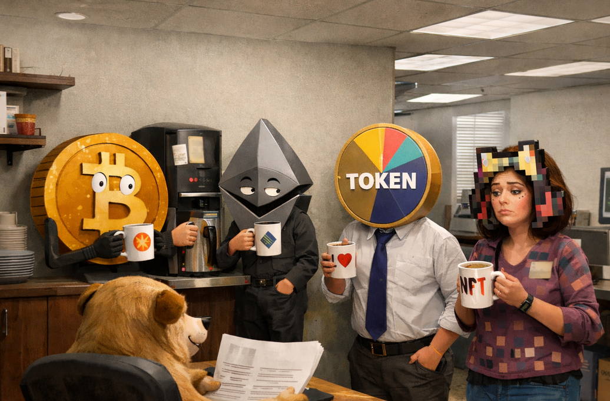
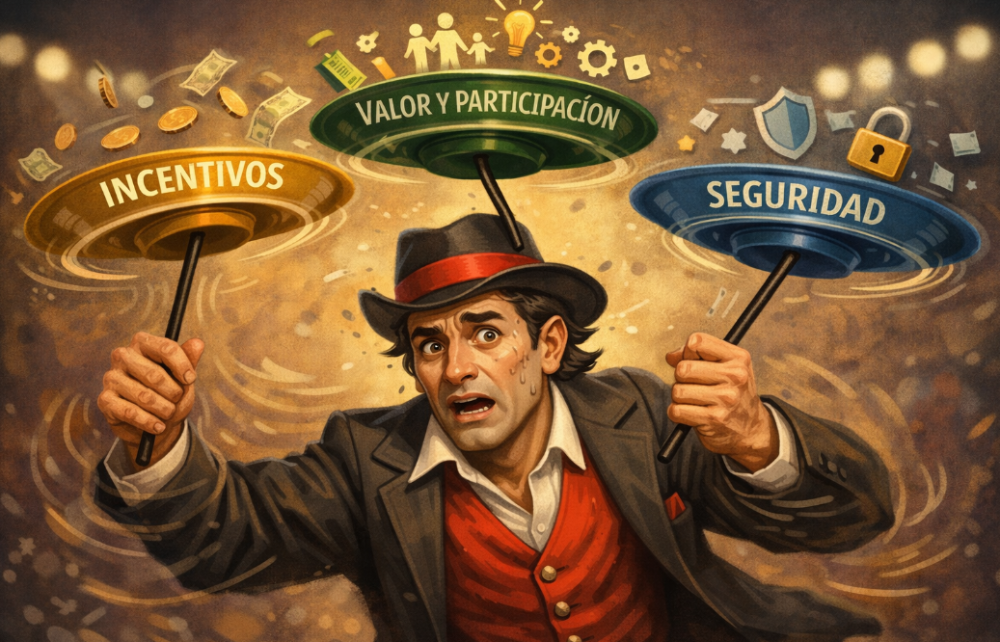

# Las organizaciones descentralizadas y autónomas: DAO

Las DAOs son las oficinas de trabajo del nuevo internet.

Se busca una organización lo más descentralizada posible para evitar abusos de poder, y lo más autónoma técnicamente para reducir la intervención humana innecesaria. Esa autonomía técnica la aportan los smart contracts: una vez aprobada una regla, el código la ejecuta sin que nadie tenga que intervenir manualmente. Pero el código no inventa propuestas ni interpreta el mundo externo. Los cambios los siguen proponiendo y decidiendo personas, igual que en cualquier otra organización. La autonomía es en la ejecución, no en la voluntad de la organización, en proponer ideas y sostener un protocolo.

Esto es una DAO: una forma de organizarse descentralizada y autónoma que favorece la transparencia y la resistencia a la censura, pero sacrifica la eficiencia...Funciona muy bien cuando el objetivo es común y la confianza escasa. Funciona fatal cuando hay que moverse rápido o cuando todos quieren opinar.

Existen otros modelos de gobernanza que van desde estructuras completamente descentralizadas hasta formas más centralizadas en organizaciones permisionadas o federadas. Estos modelos no son categorías aisladas, sino que frecuentemente convergen hacia características de DAO con matices grises y se les llama también DAO. Es común encontrar DAOs que incorporan algunas decisiones centralizadas cuando es necesario, reconociendo que la descentralización perfecta no siempre existe en la práctica.

Conviene aclarar qué no es una DAO. Un protocolo de consenso —como el mecanismo por el que los nodos de una red acuerdan el estado de la cadena— no es una DAO, aunque sea descentralizado. Un sistema autónomo que ejecuta reglas codificadas tampoco lo es, aunque nadie lo controle. Una DAO no se define por ser técnicamente autónoma ni por operar sin servidores centrales: se define porque hay personas que se organizan colectivamente para tomar decisiones sobre un propósito común. Sin esa capa humana de deliberación, propuesta y voto, hay gobernanza descentralizada, pero no hay DAO.

Para que eso funcione se necesita un mecanismo de decisión. Existen varios enfoques: mayoría simple, votación ponderada, delegación, etc... Todos resuelven lo mismo: quién puede proponer, quién puede votar, con qué peso, y qué hace vinculante una decisión. El modelo que han popularizado las DAOs lo resuelve con posesión de tokens, participación y reputación.

El token no es solo dinero: es el mecanismo que permite distribuir poder sin una autoridad central que lleve el registro. Hay además mecanismos para frenar la concentración: límites al peso del voto, quórums mínimos, y sistemas que premian la participación sostenida y la reputación, no solo el capital.

Una DAO bien diseñada debe mantener en equilibrio tres factores: el valor que aporta el protocolo y su utilidad real, los incentivos directos que motivan a los participantes a actuar, y la proyección a largo plazo que da seguridad y razón para permanecer. Ninguno de los tres puede descuidarse: si los incentivos inmediatos dominan sin contrapeso, la DAO se convierte en un juego especulativo; si solo se piensa en el largo plazo sin recompensar la participación activa, nadie actúa; y si el protocolo pierde utilidad real, los otros dos factores no sirven de nada. Comprender este equilibrio no garantiza el éxito, pero ignorarlo casi siempre anticipa el fracaso.

## ¿Por qué existe una DAO?

Las DAOs emergen del impulso humano por organizarse en comunidades para perseguir objetivos compartidos. En estos entornos, el efecto red asegura que cuanto mayor sea la participación, mayor será el valor generado. Una DAO habilita la gobernanza descentralizada de esa red: emplea tecnología blockchain y tokens de gobernanza para coordinar a los miembros de manera transparente, eficiente y sin jerarquías tradicionales.

El ecosistema debería evolucionar hacia una combinación de reputación verificada (por ejemplo, mediante Soulbound Tokens o SBTs), participación activa y pertenencia ponderada por la cantidad de tokens. Este enfoque permitiría equilibrar el poder económico con el valor de la contribución y la trayectoria dentro de la comunidad, haciendo la gobernanza más justa y representativa.

El propósito de una DAO puede ser cualquier cosa: desde gestionar una comunidad de agricultores, como administrar fondos para causas sociales o artísticas. Lo importante es que el modelo es flexible y puede adaptarse tanto a grupos espontáneos como a organizaciones formales.

En esencia, una DAO es un vehículo que transforma la energía colectiva de una comunidad en acción coordinada, usando un token con participación y reputación como herramienta para repartir poder y tomar decisiones. Es una forma moderna de organizarse, donde el código y la participación reemplazan al jefe y al papeleo.

La etiqueta “DAO” es flexible: puede ser una estructura formal con estatutos y procesos, o simplemente un grupo de Telegram donde se vota con emojis y Google Forms. Aunque formalmente un proyecto Web3 no tenga DAO, en la práctica, la mayoría terminan pareciéndose, aunque sea por accidente o por presión de los usuarios. La diferencia está en el grado de descentralización y en cuánta gente realmente participa.

**Una DAO no es una startup, es algo más**:

Aunque puede ser tentador comparar una DAO con una startup descentralizada, esta analogía es limitada y no refleja su verdadera naturaleza. Una startup tradicional se basa en la visión y control de sus fundadores, mientras que una DAO se asemeja más a una negociación colectiva en línea, donde la idea inicial puede ser moldeada, ampliada o incluso transformada por la comunidad.

Este enfoque es especialmente relevante en las etapas iniciales. En lugar de seguir un modelo jerárquico, una DAO opera como un organismo vivo: caótico, orgánico y en constante evolución. Su identidad y rumbo dependen tanto del proyecto como de las decisiones colectivas que se toman a lo largo del tiempo.

Por ello, aunque una DAO pueda compartir ciertas características con una startup, su esencia es distinta. Es un experimento de gobernanza colectiva donde el destino no está predeterminado por unos pocos, sino negociado y construido por todos los participantes.

Como comentábamos, existen varios grados de descentralización. Una startup puede crear una solución Web3 y retener el mayor poder de decisión, con ciertas concesiones que la hacen parecer una DAO, pero siendo más decorativa que funcional. Luego están las startups que se convierten en DAO, e incluso proyectos que nacen claramente con el objetivo de ser DAO desde sus inicios (aunque siempre tengan un punto de partida). El propósito y el contexto determinan qué modelo tiene sentido: no es lo mismo coordinar capital financiero que construir comunidad, gestionar infraestructura crítica o financiar bienes públicos.

### Tipos de DAOs: una taxonomía práctica

Aunque el propósito y funcionamiento varían radicalmente según lo que intentan coordinar, podemos enumerar una clasificación práctica de DAOs:

**Protocol DAOs**:

Estas DAOs gobiernan la evolución técnica y económica de protocolos descentralizados. Son las más comunes en DeFi y representan el caso de uso original: descentralizar el control de infraestructura crítica que antes estaba en manos de equipos fundadores. Los holders del token de gobernanza votan sobre cambios en parámetros del protocolo, actualizaciones de smart contracts, distribución de fees, y dirección estratégica del proyecto. Ejemplos como [Uniswap](https://uniswap.org/), [Aave](https://aave.com/), [Compound](https://compound.finance/) y [MakerDAO](https://makerdao.com/) operan con este modelo, donde las decisiones afectan directamente el comportamiento del código que mueve miles de millones de dólares. El reto principal es equilibrar la agilidad técnica necesaria para competir en mercados dinámicos con procesos de gobernanza lentos pero legítimos.

**Service DAOs**:

Funcionan como cooperativas digitales de profesionales que coordinan talento para ofrecer servicios especializados. A diferencia de las Protocol DAOs que gobiernan código, las Service DAOs coordinan trabajo humano. [RaidGuild](https://www.raidguild.org/) opera como una agencia descentralizada de desarrollo Web3 donde diseñadores, desarrolladores y estrategas se organizan en "raids" para tomar proyectos de clientes. [LexDAO](https://github.com/lexdao) agrupa abogados especializados en crypto que ofrecen servicios legales a proyectos descentralizados. [dOrg](https://www.dorg.tech/) funciona como colectivo de desarrollo full-stack. El modelo invierte la relación tradicional empleado-empresa: los trabajadores son dueños de la organización, toman decisiones sobre qué proyectos aceptar, y se distribuyen los ingresos según contribución y gobernanza comunitaria. Es el "futuro del trabajo" aplicado, eliminando intermediarios extractivos y devolviendo poder a los creadores de valor.

La reputación juega un rol crítico en Service DAOs porque la calidad del trabajo es lo que atrae clientes. Por eso muchas implementan sistemas de credenciales y seguimiento de contribuciones que pueden tokenizarse mediante Soulbound Tokens o sistemas de [POAP](https://poap.xyz/). Para entender cómo la reputación on-chain puede funcionar como capital social en estas organizaciones, revisa [7-2-web3-reputation.md](7-2-reputation.md).

**Investment DAOs**:

Son fondos de capital de riesgo colectivos donde los miembros agrupan capital para invertir en proyectos, normalmente startups Web3 o activos digitales. [The LAO](https://www.thelao.io/) fue pionera en este modelo, cumpliendo con regulaciones de valores mediante estructura legal en Wyoming mientras mantiene operación descentralizada. [MetaCartel Ventures](https://metacartel.xyz/) combina inversión con mentoría operativa, donde los miembros no solo aportan capital sino también expertise. El valor está en democratizar el acceso a inversiones que tradicionalmente estaban reservadas para fondos institucionales, permitiendo que individuos con menor capital participen en oportunidades de alto potencial mediante coordinación colectiva.

**Collector DAOs**:

Se especializan en adquirir activos de alto valor que serían inaccesibles para individuos. [PleasrDAO](https://pleasr.org/) compra NFTs culturalmente significativos y los gestiona colectivamente, desde piezas de arte digital hasta documentos históricos tokenizados. [Constitution DAO](https://www.constitutiondao.com/) intentó comprar una copia original de la Constitución de Estados Unidos mediante crowdfunding masivo, demostrando que las DAOs pueden coordinar capital para objetivos específicos incluso cuando no tienen éxito final. [FlamingoDAO](https://flamingodao.xyz/) se enfoca en arte digital y NFTs como clase de activo de inversión. Estos casos demuestran cómo la propiedad fraccional on-chain permite que comunidades posean colectivamente activos que antes solo podían comprar millonarios individuales.

**Grant DAOs**:

Se dedican a financiar bienes públicos, desarrollo de ecosistemas y proyectos que benefician a la comunidad sin expectativa directa de retorno financiero. [Gitcoin](https://gitcoin.co/) distribuye millones de dólares mediante Quadratic Funding, un mecanismo que amplifica donaciones pequeñas para priorizar proyectos con amplio apoyo comunitario. [MolochDAO](https://github.com/molochdao) financia infraestructura pública de Ethereum, desde herramientas de desarrollo hasta investigación académica. [Optimism Collective](https://optimism.io/) asigna fondos para retrocompensar bienes públicos que ya demostraron valor. El modelo resuelve el problema clásico de financiamiento de infraestructura compartida: ¿cómo pagar por cosas que benefician a todos pero que ningún actor individual puede monetizar eficientemente?

**Social DAOs**:

Son comunidades tokenizadas donde la membresía se representa mediante tokens o NFTs, y los beneficios incluyen acceso a eventos, redes profesionales, contenido exclusivo y coordinación social. [Friends With Benefits](https://fwb.help/) funciona como club social digital donde holders del token acceden a canales de Discord curados, eventos en persona, y colaboraciones creativas. [Bankless DAO](https://www.bankless.community/) coordina producción de contenido educativo y media en torno al concepto de "vivir sin bancos". A diferencia de comunidades Web2 donde la plataforma captura el valor, las Social DAOs permiten que los miembros sean copropietarios de la red social misma y participen en su dirección estratégica.

**Infrastructure DAOs**:

Estas DAOs desarrollan y mantienen las herramientas, plataformas y estándares base sobre los cuales se construyen y operan otras DAOs. En lugar de enfocarse en un producto financiero o social para el usuario final, su objetivo es crear sistemas de votación, gestores de tesorerías y frameworks de contratos inteligentes que faciliten la descentralización. Proyectos como [Aragon](https://aragon.org/) o [DAOhaus](https://daohaus.club/) operan bajo este modelo, proporcionando el equivalente a un "sistema operativo" para que nuevas organizaciones puedan lanzarse de forma rápida y segura sin tener que programar toda su arquitectura desde cero.

> Esta taxonomía no es exhaustiva ni mutuamente excluyente. Muchas DAOs combinan elementos de múltiples categorías, y constantemente emergen nuevos modelos que experimentan con diferentes estructuras de coordinación. Lo importante es entender que "DAO" es una primitiva flexible, no una plantilla rígida, y su utilidad depende completamente del problema de coordinación que intenta resolver.

### ¿Quién crea una DAO y por qué?

Nadie se ilumina en una montaña y decide crear una DAO para cambiar el mundo. Se crea porque alguien tiene un problema concreto y necesita una solución concreta.

Es esta perspectiva práctica, vamos a ver con explicaciones reales para entender porque existe una DAO.

**El fundador de una startup DeFi**:

Tiene un protocolo de préstamos. En la teoría DeFi, debería ser gobernado por la comunidad.

El problema real es que hay que tomar decisiones como: “¿Añadimos este nuevo token como colateral?” o “¿Cambiamos la tasa de interés?”. Si decide todo él solo, se convierte en una dictadura y la gente deja de confiar.

La solución es crear una DAO con un token de gobernanza. Quien tiene el token vota. Los que más arriesgan (porque tienen más tokens) tienen más poder de decisión.

El motivo real no es descentralizar por amor. Es una forma de compartir decisiones y culpas. Una DAO, en este contexto, es más un sistema de gobierno que un acto idealista.

**El protocolo que aprendió a escuchar al mercado**:

Un equipo lanza un protocolo de préstamos DeFi con un token solo de gobernanza. Crece, pero los usuarios reclaman: “¿Para qué sirve holdearlo?”.

La competencia reparte ingresos; ellos no.

La comunidad propone: usar parte de los intereses para recomprar tokens o premiar a los stakers.

Se debate, se vota, se aprueba. El protocolo evoluciona con nuevos contratos y flujo de capital.

Lección: una DAO no solo descentraliza decisiones; permite que el protocolo se adapte al mercado sin quedarse en la versión 1.0.

**El colectivo de inversión**:

Un grupo de 50 amigos de Internet quiere comprar un piso en Miami para alquilar.

El problema es práctico: ¿quién guarda el dinero?, ¿quién firma la escritura?, ¿cómo se decide si reparar el techo o cambiar la fachada?

Hacerlo con un banco y un notario es un caos para 50 personas anónimas.

Crean una DAO. Cada uno envía 1 ETH a un contrato inteligente. Ese contrato es la caja fuerte. Para gastar dinero, hace falta que el 51% vote “Sí” a una propuesta.

El motivo real: sustituir a abogados y bancos por código. Es una Sociedad Limitada digital, sin papeleo.

**El club o comunidad de NFTs**:

Una DAO nace en torno a una colección de NFTs de arte generativo. Miles de personas los compran, comparten memes, hacen eventos, colaboran en proyectos creativos.

En los primeros meses, los fondos de la DAO se usan para pagar exposiciones, becas para artistas y herramientas internas. Pero pronto surgen tensiones:
— ¿A qué tipo de artistas apoyar?
— ¿Dejamos entrar a marcas o lo mantenemos independiente?
— ¿Qué tipo de contenido refleja los valores del colectivo?

No hay una única respuesta. No se trata de mover dinero, sino de decidir quiénes somos como comunidad y qué queremos representar.

La DAO empieza a votar cosas como:
– Crear un código de conducta.
– Modificar los criterios de curaduría.
– Expulsar (o no) a miembros que rompen con la ética común.

Aquí no se cambia código. Se negocia la cultura.

Motivo real: proteger una identidad compartida y sostener una comunidad diversa sin que una sola persona tenga la última palabra.

## El inicio por los fundadores

Normalmente toda DAO comienza siendo lo contrario de lo que aspira a ser, es decir, un grupo pequeño de fundadores tomando decisiones de forma centralizada. Eso no es un defecto, es una necesidad. No existe descentralización sin un punto de partida, y ese punto lo fijan siempre personas concretas con nombres, ideas y responsabilidades.

El equipo fundador controla las piezas iniciales: el dominio o nombre del proyecto, los repositorios de código, los contratos inteligentes desplegados, los canales de comunicación, la tesorería inicial. Hay una analogía útil con el hardware y el software: las reglas formales del protocolo son, hasta cierto punto, modificables mediante votación, como el software. Pero hay capas más profundas —repositorios, servidores, contratos de gobernanza desplegados— que son mucho menos maleables, casi como el firmware de un ordenador. Cambiarlas exige confianza, consenso y, a veces, migraciones complejas.

Puedes acceder a esta [guía práctica para construir una DAO](../launch-funding-and-growth/DAO/creation-practical-guide.md) para tener unos pasos para comenzar.

El camino desde esa centralización inicial hacia una gobernanza genuinamente distribuida se llama descentralización progresiva. No ocurre de golpe: los fundadores retienen control operativo durante las primeras etapas mientras construyen el producto, la comunidad y la infraestructura técnica. A medida que el proyecto madura, ceden poder gradualmente: primero habilitando propuestas de la comunidad, luego transfiriendo la tesorería a contratos gestionados por votos y, finalmente, diluyendo su influencia en el token al incorporar a más participantes.

Este proceso tiene tensiones inevitables. La comunidad puede exigir más voz antes de que la infraestructura esté lista. Los fundadores pueden resistirse a ceder control incluso cuando deberían hacerlo. No hay un momento exacto en que una DAO "termina de descentralizarse"; es un equilibrio dinámico que se negocia continuamente. Lo importante es que el vector apunte en la dirección correcta y que la comunidad pueda verificarlo.

## Definición de la DAO

**Preámbulo y Propósito**:

Aquí se establece el por qué existe la DAO. No es un texto decorativo: define la misión, la visión y los principios fundamentales que guiarán las decisiones futuras. Cuando surgen conflictos sobre la dirección del proyecto, el preámbulo actúa como constitución interpretativa. Por ejemplo, una DAO enfocada en bienes públicos de Ethereum tendrá un preámbulo muy distinto de una DAO orientada a inversión especulativa, y eso determinará qué propuestas son legítimas y cuáles se desvían de la misión.

**Membresía y Derechos**:

Determina quién puede participar en la DAO y bajo qué condiciones se adquieren, mantienen o pierden los derechos de membresía. Aunque en las DAOs basadas en tokens la membresía suele ser automática al poseer el token, existen múltiples modelos con distintos niveles de acceso: membresía por tokens fungibles, por NFTs, sistemas basados en reputación on-chain, o combinaciones híbridas. Además, muchas DAOs establecen umbrales diferenciados para votar versus proponer, requisitos de antigüedad, mecanismos de expulsión, y derechos de salida como el ragequit que permite retirarse con fondos proporcionales. El diseño de estos mecanismos tiene consecuencias profundas sobre la distribución real de poder en el protocolo. Para un análisis detallado de los diferentes modelos de membresía, umbrales de participación, sistemas de reputación y mecanismos de entrada y salida, consulta la sección de [Membresía y Derechos en la arquitectura de gobernanza](../launch-funding-and-growth/DAO/governance-architecture.md#membresía-y-derechos-en-una-dao).

**Marco de gobernanza**:

Los estatutos deben cubrir todo el ciclo de toma de decisiones, desde cómo nace una propuesta hasta cómo se ejecuta el resultado. Esto incluye quién puede proponer (umbrales mínimos de tokens, períodos de antigüedad, requisitos de patrocinio), cómo se delibera antes de votar (foros públicos, períodos mínimos de debate, procesos de revisión), las reglas de votación (duración, quórum, umbral de aprobación, posibilidad de delegación) y los mecanismos de ejecución (timelocks, multisigs, ejecución automática on-chain).

También se debe especificar si existen categorías de decisiones con requisitos distintos: un ajuste de parámetros técnicos no puede tratarse igual que una modificación de los estatutos fundacionales. Cambiar un parámetro de riesgo puede requerir mayoría simple con quórum del 10%, mientras que modificar los estatutos podría exigir una supermayoría del 66% con un período de debate extendido. Esta diferenciación no es un detalle técnico: es la arquitectura política de la organización.

La elección del mecanismo de votación concreto —ponderado por tokens, cuadrático, conviction voting, delegación líquida— tiene consecuencias profundas sobre quién concentra poder real en el protocolo. Estos mecanismos se analizan en detalle en [governance-architecture.md](../launch-funding-and-growth/DAO/governance-architecture.md).

**Resolución de Conflictos**:

Los desacuerdos son inevitables. Los estatutos deben establecer mecanismos para resolverlos sin destruir la organización. Esto puede incluir sistemas de arbitraje on-chain como Kleros, procesos de mediación comunitaria, o incluso válvulas de escape como el ragequit que permite a minorías disidentes salir en lugar de ser forzadas a acatar decisiones con las que están fundamentalmente en desacuerdo. Para casos extremos, también se debe contemplar el proceso de fork, donde la comunidad se divide en dos DAOs separadas si el conflicto es irreconciliable. Los mecanismos de resolución de conflictos en entornos descentralizados se abordan con mayor profundidad en [7-4-conflict-resolution.md](7-4-conflict-resolution.md).

**Procedimientos de Enmienda**:

Los estatutos no son inmutables. El documento debe especificar cómo se pueden modificar las propias reglas. Generalmente, esto requiere umbrales más altos que las decisiones ordinarias (supermayorías, períodos de votación extendidos, múltiples votaciones) para evitar cambios impulsivos que alteren fundamentalmente la naturaleza de la organización. Algunas DAOs establecen aspectos inmutables que nunca pueden cambiarse, mientras que otras mantienen todo abierto a revisión democrática.

**Disolución y Distribución Final**:

Todas las organizaciones pueden terminar, y los estatutos deben contemplar cómo. Esto incluye las condiciones bajo las cuales la DAO puede ser disuelta (votación con supermayoría, falta de actividad durante cierto período, imposibilidad técnica de continuar), el proceso para hacerlo, y cómo se distribuyen los activos restantes. Algunas DAOs estipulan que los fondos se devuelven proporcionalmente a los poseedores de tokens, otras los donan a causas relacionadas con su misión, y algunas permiten que la última votación decida el destino final.

La realidad práctica es que muchas DAOs en etapa temprana operan con estatutos informales o incompletos, confiando en el consenso social y la buena fe. Esto funciona cuando la comunidad es pequeña y alineada, pero se vuelve problemático conforme crece el número de participantes y aumenta el valor en juego. La codificación gradual de reglas, pasando de normas sociales a documentación formal y finalmente a smart contracts, es el camino natural de maduración de una DAO.

## ¿Qué gestiona una DAO?

Tenemos que entender que una DAO tiene normalmente 3 niveles, una es la gobernanza donde se atienden cuestiones

## El Stack de Gobernanza de la DAO

Cuando alguien habla de "la gobernanza" de una DAO, habla en realidad de varias cosas a la vez. No hay una sola palanca que mueva todo: hay decisiones que cambian el código del protocolo, decisiones que organizan el trabajo diario, acciones que cada usuario puede tomar directamente desde la dApp, y normas que nunca se escriben en ningún contrato pero que determinan quién tiene influencia real. Cada una de estas dimensiones funciona con reglas distintas, con actores distintos y con consecuencias de distinto alcance. Confundirlas —o ignorar alguna— es uno de los errores más frecuentes al diseñar o evaluar una DAO.

**Gobernanza de protocolo**:

Controla las reglas fundamentales del sistema: cambios en smart contracts, parámetros económicos —tasas, recompensas, límites— y aspectos técnicos que definen el comportamiento del protocolo. Es la capa más crítica y normalmente la más formalizada, porque cualquier cambio puede tener consecuencias profundas e irreversibles. Requiere procesos claros, votaciones con quórum y, muchas veces, auditorías previas. La analogía política es directa: los token holders son los ciudadanos que votan leyes que modifican la constitución, es decir, el código del protocolo. Cómo se diseñan estos procesos —mecanismos de votación, modelos de delegación, infraestructura de ejecución y flujo completo de una propuesta desde el foro hasta el timelock— se desarrolla en [governance-architecture.md](../launch-funding-and-growth/DAO/governance-architecture.md).

**Gobernanza operativa**:

Se refiere a las decisiones y estructuras que permiten que el proyecto funcione día a día sin depender de votaciones formales para cada acción. Implica organizar quién hace qué y con qué recursos: los working groups y core units que ejecutan las decisiones aprobadas, los ciclos operativos (seasons, sprints) que dan ritmo al trabajo asíncrono y distribuido, los procesos de onboarding de nuevos contributors, y la gestión de todos los recursos de la organización —financieros, técnicos, humanos y de comunicación. Suele estar más centralizada que la gobernanza de protocolo, especialmente en etapas tempranas, y es donde el equipo fundador retiene más influencia práctica. La estructura de esta capa se describe en [operations-framework.md](../launch-funding-and-growth/DAO/operations-framework.md), y los recursos que gestiona en [resource-management.md](../launch-funding-and-growth/DAO/resource-management.md).

**Gobernanza de producto**:

Son las palancas que el poseedor del token puede ejercer directamente en la dApp sin necesidad de propuestas formales: votar por la pool más popular, elegir qué tokens se aceptan como colateral, seleccionar parámetros de riesgo dentro de rangos predefinidos. Estos mecanismos están integrados en la funcionalidad del producto y representan el nivel más granular de participación: no requieren quórum ni debate, solo la acción del usuario con tokens.

**Gobernanza social**:

Define las normas informales, las leyes no escritas, las expectativas compartidas y la cultura del proyecto. Abarca debates comunitarios, dinámicas de participación, reputación, legitimidad y resolución de conflictos en contextos donde no hay reglas codificadas. Es la capa menos visible y la más difícil de modificar, porque no vive en ningún contrato: vive en las personas. Determina quién tiene influencia real más allá de los tokens, cómo se interpreta la misión del proyecto y qué valores prevalecen en momentos de crisis.

Estas capas no son estancas. Una decisión de gobernanza de protocolo puede desencadenar una crisis de gobernanza social. Un conflicto cultural puede bloquear la operativa. Una DAO madura aprende a navegar entre capas, reconociendo que gobernar un protocolo no es solo ejecutar contratos, sino también coordinar personas, mantener confianza y sostener una narrativa compartida.

## El trilema en las DAO: el equilibrio en la práctica

Como el malabarista que tiene que estar continuamente girando los platos para que no se caigan, esa es la gestión de la DAO: trabajo constante para atraer capital con incentivos, proporcionar valor al protocolo y mantener la seguridad y estabilidad en el tiempo.

Los tres factores —utilidad real, incentivos y proyección— no son conceptos abstractos. Cada uno tiene mecanismos concretos que lo sostienen, y entender esa correspondencia ayuda a leer una DAO con criterio.

**La utilidad real del protocolo** se sostiene mediante la gobernanza de protocolo y la gobernanza de producto: las decisiones que modifican parámetros técnicos, añaden nuevos activos como colateral, ajustan tasas o introducen funcionalidades que los usuarios realmente usan. Una DAO que no puede actualizar su protocolo para responder al mercado pierde utilidad; una que lo actualiza sin control pierde seguridad. El ciclo de vida de una propuesta —desde el debate informal hasta el timelock— es el mecanismo institucional que permite que el protocolo evolucione sin que nadie lo capture unilateralmente.

**Los incentivos directos** se materializan en las herramientas de gestión financiera: el diseño del tokenomics desde el inicio, los programas de staking que recompensan la permanencia, el revenue sharing que convierte al holder en beneficiario directo del protocolo, y los airdrops que premian la participación temprana o activa. Sin estos mecanismos, los participantes no tienen razón para actuar hoy, y sin acción hoy, no hay protocolo mañana. El riesgo, como vimos, es que dominen sobre los demás: cuando los incentivos se convierten en el único atractivo, la DAO colapsa en un juego de suma cero donde ganadores tempranos extraen valor a costa de quienes llegan después.

**La proyección a largo plazo** depende de tres pilares que ya hemos analizado: la gobernanza operativa que mantiene el trabajo diario funcionando; la gestión de tesorería que asegura que los recursos colectivos sobrevivan a las caídas del mercado y estén disponibles cuando se necesiten; y el marco legal que, aunque incómodo, es lo que permite a una DAO interactuar con el mundo off-chain sin exponer a sus miembros a responsabilidades ilimitadas. La descentralización progresiva —ceder control gradualmente desde los fundadores hacia la comunidad— es el proceso por el que esa proyección se vuelve creíble: no como promesa, sino como trayectoria verificable on-chain.

El error frecuente es diseñar para uno solo de estos ejes. Protocolos con utilidad técnica sólida que fracasan porque no consiguen retener participantes. Proyectos con tokenomics agresivos que generan actividad inicial pero se vacían en meses. DAOs con visión de largo plazo pero sin mecanismos que recompensen la participación hoy. El equilibrio no es un estado que se alcanza; es un ajuste continuo que requiere medir, proponer y votar. Las señales de desequilibrio, el cuadro de mandos para detectarlas a tiempo y las mejores prácticas para corregirlas se desarrollan en [prácticas de salud en una DAO](../launch-funding-and-growth/DAO/dao-health-practices.md).

## Características estructurales de las DAOs

Después de entender qué es una DAO, las capas que está compuesto y la gestión que realiza, podemos entender de forma ordenada sus características estructurales. Entenderlas ayuda a distinguirlas de organizaciones tradicionales y a comprender sus ventajas y limitaciones inherentes.

**Organizaciones autónomas descentralizadas**:

Los miembros ejercen la gobernanza de forma colectiva sin liderazgo centralizado. Las decisiones se toman mediante consenso, y aunque pueden existir roles coordinadores, ningún individuo tiene poder unilateral para imponer cambios.

**Programación de reglas mediante smart contracts**:

Las reglas de funcionamiento se codifican previamente en contratos inteligentes. Esto permite que la organización opere de forma anticipada y automatizada según lógica predefinida. El código actúa como la "constitución" de la organización, ejecutándose sin necesidad de intermediarios humanos para la mayoría de operaciones rutinarias.

**Protocolo de consenso garantizado**:

Todas las decisiones importantes requieren consenso de los miembros según las reglas establecidas. Ningún factor externo puede alterar decisiones unilateralmente, y ningún miembro individual puede decidir por encima del colectivo. Esto protege tanto la descentralización como la transparencia del proceso de toma de decisiones.

**Sin jerarquía central formal**:

No existe estructura de mando tradicional tipo CEO-directores-empleados. El poder está distribuido entre los participantes según la posesión de tokens (o reputación en sistemas más avanzados). Las decisiones emergen de forma bottom-up en lugar de ser impuestas top-down. Sin embargo, en la práctica suelen surgir jerarquías informales basadas en conocimiento técnico, participación activa, o simplemente concentración de tokens.

**No vinculadas a ninguna jurisdicción específica**:

Las DAOs operan globalmente en blockchain sin necesidad de registrarse en una jurisdicción particular. Esto les otorga independencia geográfica pero también crea desafíos legales, ya que no encajan fácilmente en los marcos regulatorios tradicionales. La responsabilidad legal y la tributación son áreas grises que cada proyecto debe navegar según su contexto.

**Alta transparencia inherente**:

Todas las operaciones son visibles on-chain. Votaciones, propuestas, movimientos de fondos de la tesorería, y ejecución de decisiones son públicamente auditables. Cualquier persona puede verificar qué se decidió, quién votó, y cómo se ejecutó. Esta transparencia radical es imposible de replicar en organizaciones tradicionales, aunque también significa que información sensible (como estrategias comerciales) no puede ocultarse fácilmente.

**Ámbito global e inclusivo**:

Las DAOs son accesibles desde cualquier parte del mundo. No existen barreras de entrada geográficas o burocráticas más allá de tener los tokens requeridos y una wallet. Esto crea comunidades verdaderamente internacionales donde participantes de decenas de países colaboran sin necesidad de permisos, visados, o estructuras legales intermedias.

**Fáciles de crear técnicamente**:

Las herramientas modernas ([Aragon](https://aragon.org/), [DAOhaus](https://daohaus.club/), [Snapshot](https://snapshot.org/), [Safe](https://safe.global/)) permiten lanzar una DAO en minutos sin escribir código. La barrera técnica ha disminuido radicalmente, democratizando la capacidad de crear organizaciones descentralizadas. Sin embargo, lanzar la infraestructura es lo fácil; el verdadero desafío es diseñar la gobernanza correcta y mantener una comunidad activa.

**Complejidad en la definición inicial**:

Aunque crear la estructura técnica es fácil, definir correctamente la DAO mediante código es extremadamente complejo. Un error de programación en los smart contracts puede ser fatal porque el código es inmutable una vez desplegado. Cambiar reglas fundamentales requiere procesos de actualización complejos (upgradeable contracts, migraciones, forks) que son arriesgados. Por eso las auditorías exhaustivas por múltiples firmas especializadas son esenciales antes de lanzar.

**Balance inevitable entre descentralización e eficiencia**:

En teoría, las DAOs son completamente descentralizadas. En práctica, casi todas mantienen cierta jerarquía residual, típicamente en forma de:

- Fundadores del proyecto con mayor conocimiento histórico.
- Desarrolladores principales (core developers) que entienden el código.
- Early contributors con reputación acumulada en la comunidad.
- Multisigs de emergencia que pueden pausar contratos ante ataques.

Esta centralización práctica no es necesariamente mala. Una DAO solo se mantiene en el tiempo si equilibra descentralización ideal con eficiencia operativa real. La descentralización sostenible viene de holders activos que hacen propuestas y participan, con el core team actuando como facilitadores en lugar de autoridad central. La transición gradual del control de fundadores a comunidad es el camino típico de maduración.

Estas características definen el espacio de diseño de las DAOs. No son organizaciones perfectas ni reemplazan universalmente a estructuras tradicionales. Son herramientas específicas para contextos donde transparencia, resistencia a censura y coordinación global sin confianza centralizada son más valiosas que velocidad de ejecución y privacidad estratégica.

## Marco legal y regulatorio: el elefante en la habitación

Uno de los mayores desafíos que enfrentan las DAOs no es técnico sino legal. La mayoría de los sistemas jurídicos del mundo no reconocen las DAOs como entidades, con consecuencias prácticas inmediatas: no pueden firmar contratos formales, no pueden abrir cuentas bancarias, sus miembros pueden enfrentar responsabilidad personal ilimitada por las acciones de la organización, y no tienen personalidad jurídica para demandar ni ser demandadas. Es como si varias personas operaran un negocio sin registrarlo: técnicamente posible, legalmente arriesgado.

El precedente más relevante en el ámbito regulatorio lo fijó la [SEC](https://www.sec.gov/) en 2017, cuando determinó que los tokens de The DAO constituían valores bajo la ley federal estadounidense. Aunque no se impusieron sanciones, el mensaje fue claro: las DAOs no están exentas de regulación. Cualquier token de gobernanza que genere expectativas de beneficio derivadas del esfuerzo ajeno puede quedar bajo el ámbito del derecho de valores, con todas las obligaciones de registro y cumplimiento que eso implica, según el conocido [test de Howey](https://www.investopedia.com/terms/h/howey-test.asp).

Algunas jurisdicciones han empezado a experimentar con marcos legales específicos. Wyoming fue en 2021 el primer estado de EE.UU. en reconocer las DAOs como LLC, otorgándoles personalidad jurídica y responsabilidad limitada para sus miembros, aunque con requisitos —como designar representantes legales o mantener registros de miembros— que contradicen parcialmente su naturaleza descentralizada. Vermont, Tennessee y las Islas Marshall han seguido caminos similares. En Europa, la situación es más incierta: el Reglamento de Mercados de Criptoactivos ([MiCA](https://www.esma.europa.eu/esma-35-1842921098-238)) establece reglas para tokens y proveedores de servicios cripto, pero no aborda las DAOs como forma organizativa. España ha comenzado a regular aspectos del ecosistema mediante la Ley 11/2021, pero tampoco resuelve el estatus jurídico de las DAOs en sí.

Los desafíos prácticos se concentran en tres planos. A nivel fiscal, la pregunta de quién paga impuestos sobre los ingresos de una DAO —los miembros individualmente, la organización, en qué jurisdicción— no tiene respuesta universal. A nivel de responsabilidad, si un smart contract defectuoso pierde fondos de usuarios, queda abierto quién responde: ¿los desarrolladores?, ¿los votantes que aprobaron el contrato?, ¿todos los poseedores de tokens? A nivel contractual, la imposibilidad de contratar empleados formalmente, firmar acuerdos con proveedores o comprar activos del mundo real obliga a soluciones indirectas.

La paradoja de fondo es estructural: las DAOs aspiran a ser globales, sin permisos y resistentes a censura, mientras que los sistemas legales son jurisdiccionales, requieren identidades verificables y puntos de control centralizados. Esta tensión no tiene solución fácil con los paradigmas actuales.

En la práctica, los proyectos adoptan una de tres estrategias. La más extendida es el modelo híbrido: crear una fundación o entidad legal en una jurisdicción favorable —Suiza, Islas Caimán, Panamá— que actúa como interfaz con el mundo legal mientras la gobernanza real ocurre en la DAO. La fundación firma contratos, abre cuentas bancarias y asume responsabilidades formales; la DAO decide qué hacer. Es un compromiso, pero funciona en la práctica. Otros proyectos optan por estructuras más simples como un *wrapper* legal: una LLC que posee formalmente los activos mientras la DAO la controla mediante tokens. Por último, algunos operan puramente on-chain asumiendo que la descentralización los hace difíciles de regular, aunque renuncian a cualquier interacción con instituciones financieras reguladas o sectores con alta regulación.

La mayoría de DAOs hoy operan en esa zona gris. La tendencia regulatoria parece dirigirse hacia el reconocimiento gradual, pero con requisitos de transparencia, responsabilidad y protección al consumidor que variarán significativamente entre jurisdicciones. Conforme el ecosistema madura y gestiona más capital, la claridad legal deja de ser un detalle técnico y se convierte en un requisito para la sostenibilidad a largo plazo.

## ¿Cómo se entra en una DAO? (El proceso de inmersión)

No es como hacerse socio de un club. No hay formulario ni carnet. Es un proceso por capas que puede llevar desde unos minutos —técnicamente— hasta meses para participar con criterio real.

### Fase 1: Conseguir el token

El punto de entrada es el token de gobernanza o el NFT que da acceso a la DAO. No hay registro: simplemente compras el token en un exchange centralizado como [Coinbase](https://www.coinbase.com/) o directamente en un exchange descentralizado como [Uniswap](https://uniswap.org/), conectando tu cartera. En el caso de DAOs basadas en NFTs, como [Friends With Benefits](https://fwb.help/), el acceso exige poseer uno de los tokens de la colección, que se compran en mercados como [OpenSea](https://opensea.io/).

El token llega a tu cartera. Con [MetaMask](https://metamask.io/) o cualquier cartera compatible con EVM, ya eres técnicamente miembro. Pero ser miembro no significa saber qué está pasando.

### Fase 2: Explorar antes de actuar

Antes de votar cualquier cosa, conviene entender el estado actual de la DAO. Cada proyecto tiene al menos dos canales de acceso público: el foro de gobernanza y el servidor de Discord o Telegram.

Los foros suelen estar alojados en [Discourse](https://www.discourse.org/) —por ejemplo, [gov.uniswap.org](https://gov.uniswap.org/) o [forum.makerdao.com](https://forum.makerdao.com/)— y son el lugar donde viven las propuestas con su debate de fondo: análisis técnicos, críticas, versiones revisadas. En Discord, los canales como `#governance` o `#proposals` muestran la temperatura del debate en tiempo real, quién está activo y cuáles son las tensiones del momento.

Una semana leyendo sin intervenir enseña más que un mes votando a ciegas.

### Fase 3: Tu primera votación en Snapshot

La mayoría de DAOs realizan votaciones de temperatura en [Snapshot](https://snapshot.org/), una plataforma que agrega poder de voto sin necesidad de gastar gas. Entras con tu cartera, buscas la DAO —Uniswap, Aave, MakerDAO, Gitcoin y cientos más tienen su espacio allí—, ves las propuestas activas con su descripción, el porcentaje de votos de cada opción y qué wallets han votado. Firmas un mensaje con tu cartera y tu voto queda registrado.

El proceso completo tarda menos de dos minutos. Lo difícil no es votar; es tener suficiente contexto para votar con criterio.

### Fase 4: Delegar si no tienes tiempo

No todas las DAOs requieren que cada holder participe activamente en cada propuesta. Muchas implementan sistemas de delegación: transfirieres tu poder de voto a un delegado de confianza sin mover el token de tu cartera. En Uniswap puedes delegar directamente desde [app.uniswap.org](https://app.uniswap.org/); en MakerDAO existe un directorio de delegados en [vote.makerdao.com](https://vote.makerdao.com/) con su historial público de votaciones y sus posturas declaradas sobre los temas principales.

La delegación es el equivalente a elegir a un representante: puedes revocarla en cualquier momento sin coste significativo.

### Fase 5: De votante a contribuidor

Votar es el nivel mínimo de participación. El siguiente paso es escribir en el foro: comentar una propuesta, señalar un riesgo que otros no han considerado, sugerir una modificación. Si el argumento es sólido, personas con muchos más tokens pueden adoptarlo. La influencia real en una DAO no es proporcional solo al capital; también depende de la reputación por contribuciones anteriores.

Más adelante, quienes demuestran conocimiento sostenido son invitados a grupos de trabajo especializados —risk committees, grants committees, developer guilds— donde se preparan las propuestas antes de llegar a votación pública. Ahí es donde se toman las decisiones que realmente mueven el protocolo.

## ¿Cómo es vivir en una DAO? (El día a día)

Imagina que eres un miembro activo de MakerDAO, la DAO que gobierna el stablecoin DAI.

El lunes abres [forum.makerdao.com](https://forum.makerdao.com/) y encuentras un hilo nuevo: alguien propone añadir el token $POL como colateral aceptado en el protocolo. No es un simple sí o no. El hilo incluye un análisis de riesgo de varias páginas elaborado por el equipo de Risk Core Unit, modelos de liquidación, límites propuestos de deuda y comparativas con otros colaterales ya aceptados. Participar bien en esa discusión requiere leerlo todo.

El martes el debate migra al servidor de Discord de MakerDAO. En el canal `#governance` hay mensajes nuevos cada pocos minutos; en una llamada de voz programada en el canal `#governance-call`, varios delegados dan su opinión. Algunos tienen miles de MKR delegados por otros holders que confían en su criterio, así que su postura pesa más que la tuya. Sin embargo, un argumento técnico bien fundamentado en el foro puede cambiar su posición aunque no tengas un solo token.

El miércoles la propuesta llega a [snapshot.org](https://snapshot.org/) como temperatura de chequeo: una votación no vinculante donde conectas tu MetaMask (o cualquier cartera compatible), firmas un mensaje que no cuesta gas y registras tu voto. Puedes ver en tiempo real cuántos tokens respaldan cada opción y qué wallets han votado.

El jueves gana el sí. La propuesta pasa al proceso formal on-chain a través de [vote.makerdao.com](https://vote.makerdao.com/), el panel de gobernanza oficial del protocolo. Ahí se puede ver el estado de cada propuesta activa, el historial completo de votaciones anteriores y los delegados más activos con su historial público de votos. Esta vez sí hay coste de gas porque la ejecución modifica el smart contract del protocolo. El contrato de gobernanza tiene un timelock de 48 horas: aunque la votación ya terminó, el cambio no entra en vigor de inmediato, dando tiempo a quien quiera salir del protocolo antes de que las nuevas reglas sean efectivas.

El viernes aparece en el foro una solicitud de grant: un desarrollador pide 80.000 DAI para construir un dashboard de análisis de colaterales. Lo ha publicado siguiendo la plantilla oficial de MIP (Maker Improvement Proposal), con cronograma, entregables y presupuesto detallado. La discusión en el hilo ya tiene más de cuarenta respuestas. Alguien señala que existe una herramienta similar en [daistats.com](https://daistats.com/); el proponente responde explicando qué haría diferente. Esa conversación determinará si la propuesta tiene viabilidad antes de llegar a votación formal.

Buena parte de la actividad de una DAO es exactamente esto: leer, debatir en foros y Discord, votar en Snapshot, y revisar ejecuciones on-chain. La transparencia es total: cualquiera puede auditar el estado de la tesorería en tiempo real, revisar el historial de propuestas aprobadas o rechazadas, y ver exactamente qué wallets votaron qué.

## ¿Cómo se gestiona una DAO? (haciendo girar los platos del valor, incentivos y seguridad)

Como el malabarista que tiene que estar continuamente girando los platos para que no se caigan, esa es la gestión de la DAO: trabajo constante para atraer capital con incentivos, proporcionar valor al protocolo y proporcionar seguridad y mantenerse en el tiempo.

Imagina que eres uno de los fundadores de una DAO de tamaño medio. No una DAO gigante con mil millones bajo gestión, sino una con unas decenas de personas activas y una tesorería que te permite vivir pero que tampoco da para despilfarrar. ¿Qué haces el lunes por la mañana?

Lo primero es mirar el estado de la tesorería. Abres el dashboard —probablemente en [DefiLlama](https://defillama.com/) o en un panel de [Dune Analytics](https://dune.com/) que alguien construyó hace seis meses y que se actualiza sola— y calculas el runway: ¿cuántos meses puede sobrevivir la organización al ritmo de gasto actual? Si la respuesta es "menos de doce", hoy hay que proponer algo. Si el setenta por ciento de la tesorería está en el propio token nativo y el mercado lleva dos semanas bajando, hoy hay que proponer algo con más urgencia. La [gestión de tesorería](../launch-funding-and-growth/DAO/treasury-management.md) no es glamurosa, pero es la diferencia entre una DAO que sobrevive al invierno cripto y una que desaparece.

Después revisas los canales de operaciones. En una DAO bien organizada el trabajo se divide en grupos especializados —los llamados Working Groups, Core Units, Squads, o como le haya apetecido llamarlos al equipo fundador— que operan con presupuestos propios aprobados por gobernanza. El de desarrollo está en mitad de una "Season": un ciclo de dos o tres meses con objetivos acordados públicamente. El de comunicación acaba de publicar su retrospectiva de la Season anterior. El de riesgos lleva dos semanas deliberando sobre si añadir un nuevo tipo de colateral. Nadie te pide permiso para cada decisión pequeña, y eso es exactamente lo que buscas. Si tienes que aprobar cada tarea individualmente, has construido una empresa con más burocracia y menos sueldo. El [framework operativo](../launch-funding-and-growth/DAO/operations-framework.md) detalla cómo estructurar estos ciclos para que las cosas sucedan sin que nadie tenga que perseguir a nadie.

El martes hay llamada de gobernanza. Una propuesta lleva diez días en el foro y ya tiene suficiente debate como para pasar a votación: hay que subir el límite de quórum mínimo del tres al cinco por ciento del supply circulante. Parece un detalle técnico pero es una decisión política: más quórum significa más legitimidad, pero también más riesgo de parálisis. La propuesta tiene cuarenta y dos comentarios. Algunos son análisis rigurosos; otros, directamente, alguien votando con su opinión sin haber leído el análisis. Decides delegar tu voto en estas cuestiones a un delegado técnico de confianza que publica sus criterios antes de cada votación. Una hora más tarde la propuesta está en [Snapshot](https://snapshot.org/) para la ronda de temperatura, y en cuarenta y ocho horas pasará al contrato de gobernanza con su timelock de 48 horas. No toda gobernanza es así de ordenada, pero cuando funciona, funciona. La [arquitectura de gobernanza](../launch-funding-and-growth/DAO/governance-architecture.md) explica en detalle los mecanismos de decisión, delegación y ejecución que hacen posible este proceso.

El miércoles toca revisar los indicadores de salud. No los precios —eso es ruido— sino las métricas que importan: participación en votaciones (si lleva tres períodos consecutivos por debajo del cuatro por ciento, algo falla), fees generadas por el protocolo frente al mes anterior, número de contributors activos en el foro. Si el TVL lleva cayendo mientras los competidores suben, hay un problema de utilidad real. Si los APYs de staking están por las nubes pero nadie usa el protocolo, estás pagando a gente para que se quede, no para que use el producto, y eso es insostenible. Las [prácticas de salud en una DAO](../launch-funding-and-growth/DAO/dao-health-practices.md) recopilan las señales de alarma que conviene monitorizar antes de que sea tarde para reaccionar.

El jueves aparece en el foro una solicitud de grant para un contributor nuevo que quiere construir una herramienta de análisis. Ochenta mil DAI. El debate es sano: alguien señala que existe algo parecido, el proponente explica qué haría diferente, un miembro del grupo de riesgo pide un cronograma más detallado. Si la propuesta tiene sentido, la siguiente Season tendrá un nuevo Working Group. Si no convence, se rechaza y el proponente puede revisarla. Así es como una DAO gestiona sus recursos humanos sin contratar a nadie en el sentido tradicional. Los detalles completos de qué gestiona una DAO y cómo evolucionan esos recursos con el tiempo están en [gestión de recursos](../launch-funding-and-growth/DAO/resource-management.md).

El viernes, antes de cerrar, miras la concentración de poder de voto. Si una sola wallet controla más del veinticinco por ciento del supply con derechos de voto, ese es el verdadero riesgo que nadie quiere nombrar en el Discord. Una DAO bien gestionada es exactamente eso: no un producto perfecto ni una gobernanza impecable, sino un conjunto de procesos que funcionan lo suficientemente bien como para que ningún fallo individual destruya todo lo demás.

## Desafíos técnicos y organizativos de las DAOs

Aunque los protocolos de gobernanza descentralizada representan un avance conceptual significativo, enfrentan desafíos prácticos importantes que todo fundador debe comprender:

### Realidades incómodas

Una DAO no es anárquica. Casi siempre termina siendo una meritocracia o una oligarquía. Los que más tokens tienen o los que más trabajan controlan las decisiones.

“El código es la ley” suena bien hasta que un bug drena todo el dinero. Entonces descubres que la ley real y los tribunales todavía existen.

La participación es bajísima. Apenas un 2% o 5% de los poseedores vota. La mayoría son inversores pasivos.

Se prioriza el beneficio a corto plazo sobre la salud del ecosistema

Entrar es rápido, pero ser relevante es un trabajo no remunerado al principio.

La coordinación es lenta y caótica. Llegar a consensos entre miles de anónimos es más difícil que organizar una reunión en una empresa.

El mayor riesgo no es técnico, sino humano. Las ballenas manipulan, la gente vota sin leer y los conflictos sociales son el verdadero vector de ataque.

Por eso, más allá del voto simple en la gobernanza en las DAOs replicando el modelo accionarial tradicional: **1 Token = 1 Voto** (conocido como *Coin Voting*). Si bien es fácil de implementar, este modelo presenta fallos críticos mencionados en entornos descentralizados. Para solucionar esto, han surgido nuevos paradigmas de coordinación que buscan capturar no solo la opinión de la mayoría, sino la **intensidad de la preferencia, la veracidad de la información y el compromiso temporal**.

A continuación, exploramos estas alternativas clasificadas por el problema específico que intentan resolver.

### Participación baja

La mayoría de DAOs sufre de baja participación en votaciones (<5% de tokens participando), lo que genera riesgo de captura por minorías organizadas. Esto no es un bug, es una característica: la atención y el tiempo son recursos escasos.

### Plutoracia

El modelo un-token-un-voto favorece a grandes poseedores (whales), replicando concentración de poder similar a sistemas corporativos tradicionales. Los mecanismos como voto cuadrático o reputación intentan mitigar esto, pero añaden complejidad.

### Complejidad de coordinación

Tomar decisiones mediante votación on-chain es lento y costoso, dificultando la agilidad operativa necesaria en mercados dinámicos. Por eso muchas DAOs operan con modelos híbridos: gobernanza on-chain para decisiones críticas y equipos operativos para ejecución.

### El límite cognitivo: El número de Dunbar

Existe una restricción biológica fundamental en la coordinación humana. El antropólogo Robin Dunbar demostró que los humanos solo pueden mantener relaciones sociales estables con aproximadamente **150 personas**. Este límite está determinado por el tamaño del neocórtex y se ha observado consistentemente en comunidades históricas, organizaciones militares y empresas modernas.

Para DAOs, este límite tiene implicaciones críticas:

- Participación decreciente: En DAOs con miles de miembros, es cognitivamente imposible que cada individuo conozca y confíe genuinamente en los demás, lo que reduce dramáticamente el compromiso y la participación activa.
- Formación natural de subcomunidades: Las DAOs grandes inevitablemente se fragmentan en working groups, pods o squads de 10-50 personas donde la coordinación real ocurre. La DAO completa se convierte más en una federación de equipos pequeños que en una comunidad unificada.
- Necesidad estructural de delegación: Como ningún miembro puede evaluar personalmente a miles de participantes, los sistemas de reputación, delegación y representación se vuelven indispensables para escalar más allá del límite de Dunbar.
- Explicación del modelo core team + comunidad: El patrón común de un equipo central pequeño (~10-50 personas) que puede coordinarse efectivamente, rodeado de una comunidad amplia que proporciona legitimidad, recursos y validación, no es accidental sino una respuesta natural a limitaciones cognitivas humanas.

Este límite biológico explica por qué incluso las DAOs más descentralizadas en teoría terminan con estructuras de coordinación más pequeñas en la práctica. No es un fallo de diseño, sino una adaptación necesaria a la realidad de cómo funcionan los cerebros humanos y las relaciones sociales.

### Ataques de gobernanza

Existen vectores de ataque donde actores maliciosos pueden comprar tokens temporalmente (incluso con flash loans), votar, y vender, manipulando resultados sin compromiso a largo plazo. Los períodos de bloqueo y delegación ayudan, pero no eliminan el riesgo.

### Vulnerabilidades de seguridad críticas

El problema más peligroso es que cuando se detecta un bug en el código, no puede corregirse inmediatamente. Requiere votación de la mayoría, y durante ese proceso los atacantes pueden explotar la vulnerabilidad.

**Casos históricos devastadores**:

*The DAO hack (2016)*: El caso más famoso en la historia de DAOs. Un atacante explotó una vulnerabilidad de reentrancy en el smart contract de The DAO, drenando aproximadamente 3.6 millones de ETH (un tercio de los fondos totales, equivalentes a ~$70 millones en ese momento).

El código permitía que un atacante llamara repetidamente a la función de retiro antes de que el balance se actualizara, extrayendo fondos múltiples veces. Esto expuso la fragilidad del principio "el código es ley": cuando la ley tiene bugs, el resultado es catastrófico.

La comunidad Ethereum enfrentó una decisión existencial: respetar la inmutabilidad de blockchain (dejando al atacante con los fondos) o hacer un hard fork para revertir el hack. La mayoría votó por el fork, creando dos cadenas: Ethereum (con fondos devueltos) y Ethereum Classic (cadena original sin intervención).

Este evento demostró que incluso proyectos con auditorías y equipos técnicos expertos pueden tener vulnerabilidades críticas, y que la gobernanza social ultima a veces prevalece sobre el código cuando los stakes son suficientemente altos.

*MakerDAO Black Thursday (2020)*: Durante el colapso del mercado en marzo 2020, el precio de ETH cayó un 50% en horas. Esto disparó liquidaciones masivas de Vaults (posiciones colateralizadas). Debido a la congestión de la red Ethereum (fees de gas disparados), muchas liquidaciones no se ejecutaron correctamente, dejando al protocolo con deuda sin colateral.

Algunos liquidadores obtuvieron colateral prácticamente gratis al ser los únicos capaces de ejecutar transacciones ante la congestión. MakerDAO quedó subcapitalizado. La respuesta fue una votación de emergencia para acuñar y subastar MKR (diluyendo a holders existentes) para recapitalizar el sistema. Funcionó, pero demostró que la gobernanza descentralizada bajo presión extrema puede ser lenta y dolorosa.

Estas lecciones han llevado a mejores prácticas actuales: timelock más largos, auditorías por múltiples firmas especializadas, bug bounties generosos, "guardianes" multisig que pueden pausar contratos ante ataques activos, y sistemas de gobernanza de emergencia para decisiones críticas en tiempo limitado.

**Vacío legal**: El estatus legal de las DAOs es incierto en la mayoría de jurisdicciones, complicando responsabilidades, impuestos y cumplimiento regulatorio. Wyoming y otras jurisdicciones están experimentando con marcos legales específicos para DAOs.

**Recomendación práctica**: Para proyectos en fase inicial, implementar una DAO completa desde el día uno generalmente no es práctico. Lo recomendable es comenzar con estructuras más simples (multisig con miembros fundadores de confianza) y evolucionar gradualmente hacia descentralización progresiva conforme la comunidad y el proyecto maduran. La descentralización es un proceso, no un estado binario.

### El reto de la identidad y reputación

El sistema de gobernanza actual en la mayoría de DAOs se basa en la posesión de tokens, lo que en la práctica significa que un token equivale a un voto. Este modelo es fácil de programar y resistente a la manipulación de identidades, pero tiene una consecuencia política inmediata: convierte a la organización en una plutocracia donde quienes más capital tienen son quienes deciden. Los grandes inversores y los equipos fundadores pueden imponer su voluntad sobre la mayoría de la comunidad simplemente porque poseen más activos financieros.

La alternativa lógica sería un sistema democrático de una persona, un voto, pero implementarlo en un entorno anónimo y descentralizado es extraordinariamente difícil. El principal obstáculo es lo que se conoce como [ataque Sybil](https://www.bitstamp.net/es/learn/security/what-is-a-sybil-attack/), donde un único actor crea cientos de identidades falsas para multiplicar su influencia. En el mundo físico, los gobiernos garantizan que cada persona vote una sola vez mediante documentos oficiales; en el mundo digital sin autoridades centrales, resolver el problema de la [identidad](7-1-identity.md) —verificar que una dirección de billetera corresponde a un ser humano único sin sacrificar la privacidad— es un reto técnico y filosófico todavía abierto.

Para solucionar este desequilibrio, el ecosistema está evolucionando hacia modelos basados en la [reputación](7-2-reputation.md) y la participación activa, lo que podríamos llamar una gobernanza meritocrática: el poder de decisión no debería depender de cuánto capital has invertido, sino del valor que has aportado y de cuánto tiempo llevas haciéndolo de forma sostenida. La participación puntual no construye influencia; hacerlo de manera continua y verificable sí lo hace, y muchos diseños de gobernanza lo premian explícitamente —por ejemplo, mediante sistemas de *[conviction voting](https://gitcoin.co/mechanisms/conviction-voting)* donde el peso del voto aumenta cuanto más tiempo llevas comprometido con una propuesta.

Herramientas concretas permiten medir esa contribución. [Coordinape](https://coordinape.com/) es quizá el ejemplo más extendido: los miembros de un equipo distribuyen periódicamente tokens de reconocimiento entre sus compañeros según el valor que perciben que cada uno ha aportado; el resultado funciona como un mapa de reputación distribuida que puede usarse para calcular compensaciones o peso de voto. [Karma](https://www.showkarma.xyz/) aplica un enfoque diferente y agrega la participación en foros, propuestas y votaciones on-chain para generar una puntuación de compromiso verificable que cualquier DAO puede consultar antes de asignar responsabilidades o delegar poder de gobernanza.

El futuro de esta identidad profesional on-chain apunta hacia credenciales intransferibles que quedan vinculadas permanentemente a la dirección del usuario, actuando como un título universitario o un certificado de experiencia que no se puede vender ni transferir. Estos registros permiten a una DAO distinguir entre un mercenario que solo busca beneficio a corto plazo y un contribuidor comprometido con la misión a largo plazo, otorgando más peso en la gobernanza a estos últimos.

El desafío final que enfrenta este modelo es la portabilidad. Hoy en día, la reputación construida en una organización rara vez sirve en otra porque no existen estándares universales para leer ese historial. Un desarrollador puede ser una eminencia en un protocolo y un completo desconocido en el siguiente. La madurez del ecosistema llegará cuando esa reputación sea un activo portable que cada profesional pueda llevar consigo, permitiendo que la confianza se construya sobre un historial transparente y verificable de contribuciones pasadas, independientemente de dónde se hayan realizado, todo esto lo veos también en [reputación](7-2-reputation.md).

## Ejemplos destacados de DAOs en producción

El ecosistema de DAOs es diverso y cada implementación refleja diferentes filosofías, casos de uso y soluciones técnicas. Estos ejemplos ilustran la amplitud de posibilidades y los aprendizajes acumulados por proyectos pioneros.

**Dash: gobernanza y tesorería integradas (2014)**:

[Dash](https://www.dash.org/) es una criptomoneda orientada a pagos rápidos y privados que en 2014 introdujo uno de los primeros sistemas completos de gobernanza y tesorería on-chain de la historia, anticipándose varios años a The DAO de Ethereum. Su DAO funciona así: cada mes, el 10% de las recompensas de bloque se destina automáticamente a una tesorería colectiva. Cualquier persona puede presentar una propuesta solicitando fondos para desarrollo, marketing o cualquier iniciativa relacionada con el ecosistema. Son los *masternodes* —operadores de nodos con un colateral mínimo de DASH bloqueado— quienes votan sobre cada propuesta; si una obtiene suficiente apoyo neto, los fondos se transfieren de forma automática sin que ningún equipo central los controle ni los apruebe manualmente. Este modelo demostró por primera vez que era posible sostener el desarrollo de un protocolo abierto mediante una tesorería gobernada por la propia red, sin depender de fundaciones ni inversores externos.

**The DAO: el primer fondo de capital de riesgo descentralizado (2016)**:

The DAO ya no existe: fue un experimento lanzado en 2016 sobre Ethereum que terminó abruptamente ese mismo año tras un hack y el consiguiente hard fork de la red. Se incluye aquí por su importancia histórica, no como referencia activa. Su propósito era simple y ambicioso: ser un fondo de inversión colectivo sin gestores. Cualquier persona podía adquirir tokens DAO mediante ETH, y esos tokens otorgaban derechos de voto proporcionales para aprobar o rechazar propuestas de financiamiento de proyectos. Si una propuesta alcanzaba el quórum y la mayoría necesaria, el smart contract ejecutaba automáticamente la transferencia de fondos sin que ningún comité ni gestor humano interviniera. No había equipo inversor: la comunidad de holders era, colectivamente, el fondo. El modelo demostró que era posible sustituir la intermediación de un fondo de capital de riesgo tradicional por código y consenso distribuido, y sentó las bases conceptuales para todas las Investment DAOs que vendrían después.

**MakerDAO: gobernanza de un sistema financiero descentralizado**:

[MakerDAO](https://makerdao.com/) gestiona el stablecoin DAI y el protocolo Maker, uno de los pilares de DeFi. Su gobernanza es compleja porque debe equilibrar estabilidad financiera con descentralización: los holders del token MKR votan sobre qué tipos de colateral se aceptan, cuáles son sus parámetros de riesgo y cuáles son las tasas de estabilidad aplicables, además de coordinar respuestas ante crisis de liquidez o desviación del peg (vinculación con 1 USD).

MakerDAO ha enfrentado situaciones de emergencia reales. El colapso del 12 de marzo de 2020 (*Black Thursday*) provocó una caída de ETH tan brusca que generó liquidaciones masivas y dejó deuda sin colateral en el sistema. La DAO respondió mediante votaciones de emergencia, subastas de MKR para recapitalizar el sistema y cambios paramétricos urgentes. Es un caso de estudio sobre cómo la gobernanza descentralizada puede responder a crisis, aunque no siempre con la velocidad de una organización centralizada.

**MolochDAO: simplicidad radical para bienes públicos**:

[MolochDAO](https://github.com/molochdao) es un fondo colectivo creado en 2019 para financiar infraestructura pública de Ethereum: herramientas de desarrollo, investigación, proyectos que todo el ecosistema usa pero que nadie paga directamente. Funciona así: para entrar hay que ser aceptado por los miembros existentes y depositar un capital en la tesorería común. A partir de ahí, cualquier miembro puede proponer financiar un proyecto y el resto vota si aprobarlo o no. Si la propuesta pasa, el contrato transfiere los fondos automáticamente.

Lo que lo hace distinto es el mecanismo de *ragequit* (literalmente "salida por rabia"): si se aprueba una propuesta con la que no estás de acuerdo, puedes salir de la DAO en ese mismo momento llevándote tu parte proporcional de la tesorería antes de que los fondos se transfieran. Esto alinea los incentivos de forma brutal: quien toma malas decisiones ve cómo los miembros más valiosos se van con su capital. Ha inspirado decenas de variantes y la plataforma [DAOhaus](https://daohaus.club/), que facilita lanzar DAOs con este mismo patrón.

**Gitcoin: financiamiento cuadrático para bienes públicos**:

[Gitcoin](https://gitcoin.co/) es una plataforma que organiza rondas de financiamiento para proyectos de código abierto y bien público en Web3. Funciona con Quadratic Funding: cualquier persona puede donar a los proyectos que quiera, y el sistema amplifica esas donaciones con un fondo de emparejamiento colectivo. Lo que determina cuánto recibe cada proyecto no es solo la cantidad donada, sino cuántas personas distintas lo apoyan: una donación de 1 dólar de cien personas distintas genera más financiamiento total que 100 dólares de una sola persona.

Aquí está la capa que conviene entender: los donantes que participan en las rondas no son la DAO. Son los usuarios de la plataforma. La DAO es la organización que gobierna la propia plataforma Gitcoin, la "dueña colectiva" de la infraestructura. Los holders del token GTC votan sobre qué tipos de proyectos son elegibles, cuánto capital se destina al fondo de emparejamiento de cada ronda, cómo evoluciona el algoritmo que calcula la distribución, y si se incorporan nuevas cadenas o ecosistemas. Es, en cierto modo, una meta-DAO: una organización descentralizada que gobierna una herramienta cuyo propósito es financiar a otras organizaciones. Para gestionar la participación sin caer en la apatía habitual, usa un sistema de delegación a *stewards* (literalmente "administradores de confianza", en la práctica delegados de gobernanza elegidos por la comunidad): personas que asumen activamente la representación en gobernanza de quienes les delegan su voto.

**Uniswap: el gigante silencioso**:

[Uniswap DAO](https://uniswap.org/) controla uno de los protocolos DeFi más grandes, con billones de dólares en volumen de trading. Sin embargo, su gobernanza es notablemente conservadora. Los holders de UNI pueden votar sobre cambios en la estructura de fees, la activación de mecanismos de reparto de ingresos con holders (*fee-switch*), el despliegue en nuevas blockchains y la gestión de una tesorería de cientos de millones en activos. La participación es históricamente baja —habitualmente por debajo del 5%— y muchas propuestas importantes las origina el equipo fundador, Uniswap Labs. Es un ejemplo de cómo incluso las DAOs más grandes operan con gobernanza práctica: descentralizada en teoría, guiada por expertos en la práctica.

**DXDAO: descentralización desde el día uno**:

A diferencia de la mayoría de DAOs que comienzan centralizadas y descentralizan gradualmente, [DXDAO](https://dxdao.eth.limo/) intentó ser genuinamente descentralizada desde el inicio: sin fundadores con control especial, sin pre-minas significativas y con reputación ganada mediante contribución en lugar de compra de tokens. Desarrolla y gobierna varios productos DeFi, pero ha enfrentado desafíos serios de coordinación y velocidad de ejecución precisamente por su compromiso extremo con la descentralización. Es un experimento valioso sobre los límites prácticos de operar sin ningún núcleo coordinador.

**BitDAO: el tesoro descentralizado que se convirtió en red**:

[BitDAO](https://www.mantle.xyz/) nació como experimento de gobernanza de tesorería a gran escala: en sus mejores momentos gestionó activos por encima de los 3.000 millones de dólares, financiados en parte por un porcentaje de los fees del exchange Bybit. En lugar de desarrollar productos propios, su DAO tomaba decisiones sobre en qué proyectos invertir, qué alianzas estratégicas formar mediante intercambios de tokens, y cómo distribuir capital entre iniciativas del ecosistema. En 2023, la comunidad votó transformar BitDAO en [Mantle Network](https://www.mantle.xyz/), una red de capa 2 sobre Ethereum. Es un ejemplo de cómo una DAO puede votar no solo sobre parámetros de un protocolo, sino sobre la identidad y la dirección estratégica de la organización entera.

### DAOs e impacto social: más allá de las finanzas

Las DAOs asociadas a DeFi concentran la mayoría del capital y la atención, pero el modelo se aplica también a causas humanitarias, investigación científica y experimentos de redistribución económica. En estos contextos, la transparencia on-chain y la coordinación sin fronteras resuelven problemas concretos que las estructuras tradicionales gestionan mal: transferencias internacionales sin intermediarios, trazabilidad total de los fondos, y decisiones colectivas sobre qué causas financiar sin que un comité cerrado lo decida.

**UkraineDAO: recaudación de emergencia en tiempo real**:

[UkraineDAO](https://ukraine-dao.notion.site/) surgió en los primeros días de la invasión rusa de 2022 para canalizar criptomonedas hacia el ejército ucraniano y organizaciones humanitarias verificadas. En pocas semanas recaudó más de 7 millones de dólares. Lo que lo distingue de una recaudación tradicional es la trazabilidad completa: cada transacción era públicamente visible en la cadena, desde la wallet del donante hasta las cuentas de destino, sin que ningún intermediario pudiera desviar fondos ni cobrar comisión opaca. La DAO tomó decisiones sobre qué organizaciones eran elegibles para recibir fondos y cómo convertir criptomonedas en fiat operativo. Demostró que la coordinación descentralizada puede responder a emergencias humanitarias con una velocidad y transparencia que las fundaciones tradicionales no pueden igualar.

**VitaDAO: financiamiento colectivo de investigación científica**:

[VitaDAO](https://www.vitadao.com/) financia investigación sobre longevidad y envejecimiento, un campo que recibe poca financiación institucional porque los horizontes de retorno son demasiado largos para el capital de riesgo convencional. La comunidad de holders del token VITA vota qué proyectos de investigación merecen financiamiento; los resultados quedan en dominio público o en propiedad colectiva de la DAO mediante IP-NFTs (literalmente *intellectual property NFTs*, representaciones tokenizadas de propiedad intelectual). Si una investigación genera valor comercial, los beneficios revierten a la tesorería. Es un ejemplo de cómo una DAO puede resolver el problema de financiamiento de ciencia básica que no encaja ni en el capital de riesgo ni en los presupuestos estatales.

**GoodDollar: renta básica universal financiada con rendimientos DeFi**:

[GoodDollar](https://www.gooddollar.org/) es un experimento de renta básica universal (UBI, del inglés *Universal Basic Income*) donde la distribución se financia con los rendimientos generados por una tesorería invertida en protocolos DeFi de préstamo y staking. Cualquier persona verificada como humana única puede reclamar su distribución diaria en stablecoin G$, independientemente de su país o situación económica. Desde 2020 ha distribuido más de 2 millones de dólares a más de 400.000 usuarios, con especial presencia en Nigeria, Vietnam y Latinoamérica. El mayor desafío no es técnico sino de identidad: garantizar que cada persona solo reclame una vez sin recurrir a sistemas invasivos de KYC centralizado — el mismo problema que Proof of Humanity intenta resolver desde otro ángulo.

---
