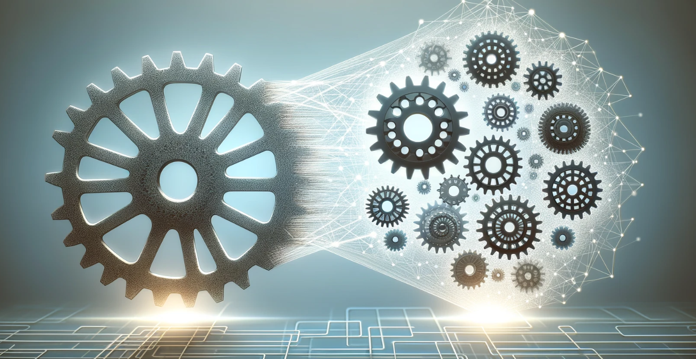
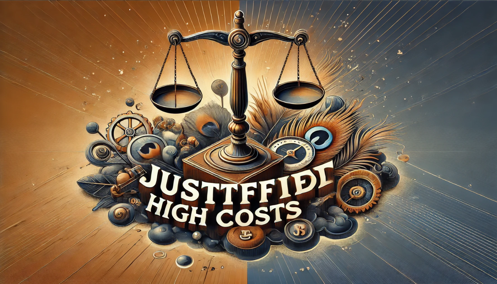
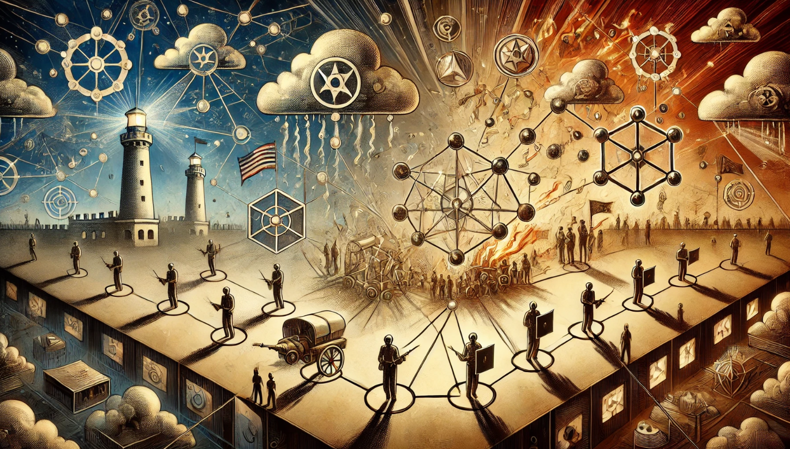
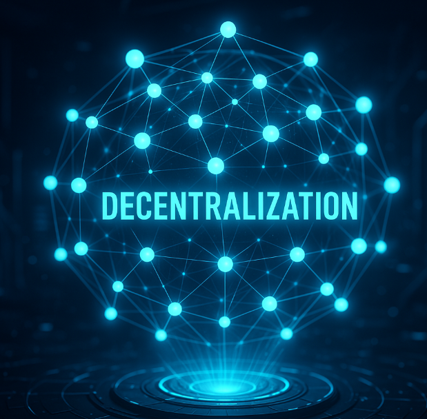
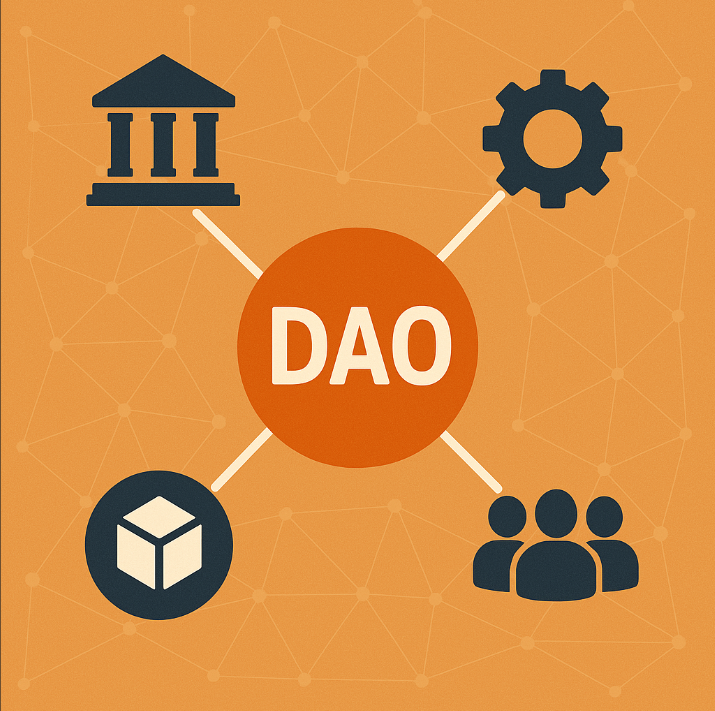
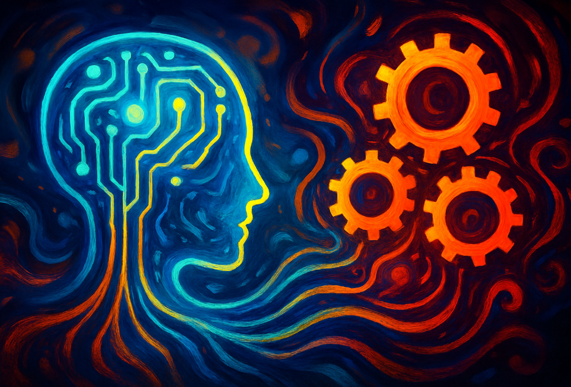
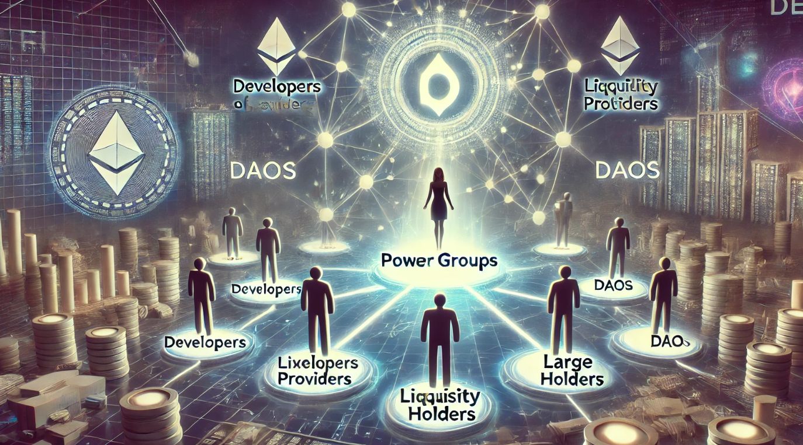
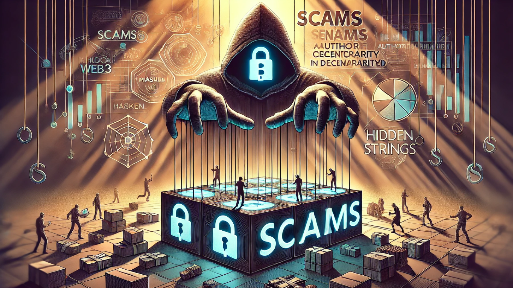
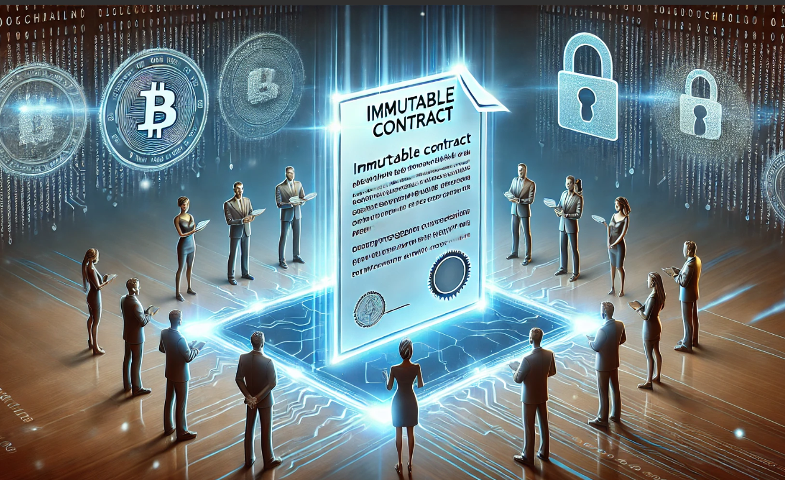

# El punto único de fallo (SPOF) y la descentralización

> También puedes ver este contenido en [el vídeo del canal proyectos web3](https://www.youtube.com/watch?v=h7qadsJrZbY).

Hablaremos sobre la necesidad de la descentralización frente al punto único de fallo.

## Un proceso de transformación

La descentralización, es el proceso de transformar un sistema centralizado a uno donde existen participantes de una red, con propósitos comunes, que actúan de forma autónoma y ordenada, siguiendo un protocolo predefinido, el cual ha sido consensuado.

Deja de existir la necesidad de depender de la decisión o coordinación con un elemento central. Este elemento central puede fallar de diversas maneras: desde volverse inaccesible hasta ser vulnerable a la corrupción o abuso de poder, es por eso que decimos que la descentralización es la solución al SPOF, Single Point of failure o punto único de fallo.

## El protocolo

El principal desafío de la descentralización radica en diseñar y acordar un protocolo que permitan a los participantes de la red operar de manera confiable, autónoma y sostenible en ausencia de una autoridad central, proceso crucial que se consensúa en [la gobernanza de la red](https://es.wikipedia.org/wiki/Gobernanza_mundial).

Por esta razón, la descentralización suele aplicarse inicialmente a casos de uso simples, donde las reglas son básicas y los objetivos están claramente definidos para que el consenso en la organización sea posible.

## Se debe justificar

Los casos de uso deben resolver problemas reales, la necesidad por trasformar a un sistema descentralizado debe existir, no debe ser un problema inventado que nadie había pedido, que ninguna comunidad lo apoye y que sólo existe como reclamo.

Porque lo cierto es que diseñar e implementar **bien** un sistema descentralizado, que esté consensuado con los participantes de su red y que se mantenga en el tiempo, es costoso debido a su complejidad, como la de tener en cuenta todas las variables del protocolo, las dificultad técnica, costos operativos, etc.

Además, en fases tempranas, la funcionalidad está muy acotada, los participantes deben adaptarse al protocolo y se debe esperar a que evolucione correctamente.

Por estas razones, se aplica cuando los beneficios como transparencia, resilencia y resistencia a la censura lo justifiquen, aunque, en mí opinión, el escenario geopolítico lo justifica.

## El sistema resiliente

En cualquier sistema descentralizado, ya sea un libro contable o un servicio de emergencias, hablamos de una red donde existen lo que conocemos como nodos. Estos nodos pueden entenderse como agentes, delegados o participantes que desempeñan roles específicos, como cubrir un área concreta, procesar información, o colaborar en un propósito más amplio.

Este sistema descentralizado, sin punto único de fallo, es más [resiliente](https://es.wikipedia.org/wiki/Resiliencia_(inform%C3%A1tica)) que uno centralizado, ya que ante fallos o posibles ataques, siempre que se cumplan las condiciones optimas, se podrá seguir ofreciendo el servicio demandado por parte de cualquier nodo de la red.

Es simple de entender, existiendo varios nodos, ninguno más importante que el otro, todos siguiendo el protocolo, aunque caiga un nodo o varios, el resto que sigan activos darán servicio y esto no se consigue en un sistema centralizado, donde si cae un nodo central que tiene una función específica, el resto del sistema deja de funcionar.

## Condiciones optimas para un sistema descentralizado

Pero es cierto que existen condiciones que tenemos que cumplir en un sistema descentralizado.

Para empezar debe existir la suficiente cantidad de nodos, por ejemplo una red de 4 nodos asegura menos descentralización que una de 100.

Esos nodos deben ser independientes y se debe asegurar que siga así. No sirve de nada una red de multiples nodos si en realidad los actores que están detrás son unos pocos, no solo es cantidad de nodos, también calidad. Pero además, se deben crear los mecanismos para asegurar el servicio bajo todas las circunstancias, por ejemplo, es muy común la crítica de la comunidad web3, sobre el hecho de alojar multiples nodos en proveedores en la nube, ya que la decisión unilateral del proveedor o fallas podría hacer que en un momento dado los nodos alojados dejen de funcionar.

Lo cierto es que las condiciones perfectas no existen, lo normal es que siempre nos encontremos con la decisión de elegir lo menos malo o lo que se adapte a la necesidad o lo más práctico, y es donde debemos considerar [el trilema](https://www.coinbase.com/es-es/learn/crypto-glossary/what-is-the-blockchain-trilemma) que exploraremos en otro capítulo.

## El protocolo de consenso

Estos nodos, que no dependen de un elemento central, se deben coordinar y llegar a una decisión sobre el estado único de la red. No puede ser inconsistente, por ejemplo, si es una red para gestionar los saldos de personas, no pueden existir una serie de nodos que digan que yo tengo 3 euros y otros que tengo 200 y según preguntes te digan un saldo diferente.

Además estos nodos no están exentos de fallos o de actores maliciosos, algo que se explora con [el problema de los generales bizantinos](https://es.wikipedia.org/wiki/Problema_de_los_generales_bizantinos).

Para abordar estos desafíos, se elige resolverlo normalmente con las [decisiones por consenso](https://es.wikipedia.org/wiki/Decisi%C3%B3n_por_consenso) que se implementan en los diferentes [protocolos de consenso](https://discover.luno.com/what-is-a-consensus-protocol/) que vemos en la web3 y que son mecanismos diseñados para garantizar que los nodos puedan ponerse de acuerdo sobre un estado único de la red.

Dicho estado, normalmente, se guarda en un registro contable que está distribuido y por facilidad de diseño, seguridad para el consenso de la red, transparencia y resistencia a la censura, [es inmutable](https://telefonicatech.com/blog/blockchain-y-ciberseguridad-la-inmutabilidad).

Estos protocolos, que veremos en otros capítulos, son variados y está diseñados según las condiciones de la red, teniendo en cuenta el trilema. Por ejemplo, no es lo mismo una red de nodos abierta y muy expuesta a actores maliciosos, que una privada, donde incluso no es necesario considerar las [fallas bizantinas](https://academy.bit2me.com/que-es-tolerancia-fallas-bizantinas-bft/), lo que serían un `no-BFT`.

## La seguridad por el propio interés

Para hacer el sistema sostenible, Los participantes de la red hacen un trabajo porque son parte interesada.

Lo son por diferentes motivos, pero la más común es por el interés económico, donde es más beneficios aportar seguridad y honestidad que delinquir.

Por eso se dice que la seguridad de una red descentralizada basada en criptomonedas es seguridad criptoeconómica, porque es la propia [criptoeconomía](https://en.wikipedia.org/wiki/Cryptoeconomics) y su beneficio la que da interés a los participantes en generar seguridad a la red.

## La organización de la red

Hablamos de una red, que tiene participantes y que suele tener intereses, normalmente económicos, los cuales crean o adaptan un protocolo, que además está consensuado y que se debe seguir, por lo tanto, existe una organización que gobierna, y además para evitar el punto único de fallo, es descentralizada y autónoma, es decir, existen las [DAO](https://academy.bit2me.com/que-es-una-dao/), las Organizaciones Autónomas Descentralizadas, siendo el modelo de gobernanza que más asegura las descentralización.

## La soberanía

El propósito final es [declarar la soberanía personal](https://www.sovs.xyz/). Podemos o no estar de acuerdo con participar en el registro de [consensys](https://consensys.io/), pero el propósito es ese.

Empezamos a ver la narrativa sobre la necesidad de recuperar el control de nuestros datos y transacciones, que están en mano de las grandes tecnológicas. Narrativa que proviene del gobierno en algunos casos, aunque lo cierto es que recuperarla, también es de un gobierno intervencionista que ha empezado a romper la [neutralidad de la red](https://es.wikipedia.org/wiki/Neutralidad_de_red), permitiendo que grupos de poder, lobbies o ideólogos decidan unilateralmente.

Es cierto que estos son principios de un idealismo cyber punk que posiblemente ya fueron olvidados, es posible que nunca sean alcanzados, pero nuestra responsabilidad es y será siempre trabajar por nuestra soberanía, de lo contrario, será de otro. Ese otro puede ser alguien que nos guste hoy, pero igual no nos guste mañana o es posible que sea un delincuente que tome el control por la fuerza, sea cual sea la circunstancia, la soberanía siempre debe ser nuestra.

La descentralización no es completa, eliminar el punto único de fallo no es posible, sin declarar la soberanía. Y comento esto, porque en el camino muchos se quedan en lo que denominan ellos mismos "la tecnología subyacente de la web3 o la tecnología detrás de blockchain". Se quedan en la parte técnica, que es perfectamente lícito, pero se quedan a medio camino en el proceso de cambio.

## La IA y su importancia en la automatización

Todos sabemos que la IA y sus agentes son una herramienta increíble que ayuda en el ciclo de desarrollo, ayudando en crear aplicaciones, contratos inteligentes y un gran etcétera.

Pero la IA será pieza clave en la automatización en los protocolos, condición clave en la descentralización y que ayudará en la gobernanza de las DAO, como el análisis de sentimiento de mercado y reputación, contratos inteligentes que responda a patrones, seguridad con detección de anomalías y fraude, UX avanzada, etc.

Los algoritmos hacen cumplir las reglas de forma determinista y siempre serán necesarios, pero existen capas de decisión, donde las decisiones basadas en entrenamiento de datos y no tanto en un algoritmo cerrado va a ser necesario.

Entrenamiento de datos crucial, porque gran parte de las decisiones correctas se basan en el entrenamiento y validación, por lo tanto, los modelos de IA también tendrán un sesgo, la gran duda es, si será uno que la propia DAO haya validado o será impuesto o dado por un tercero. La clave será transparencia en los datos, auditoría del entrenamiento, y que la DAO tenga mecanismos para ajustar o rechazar el sesgo según sus valores y objetivos. Aún estamos lejos, pero se está abriendo ese camino.

---

Comprendiendo todo esto, podemos tener un mejor criterio para analizar el ecosistema de la web3.

## Los grupos de poder

En la web3, vemos constantemente sistemas que realmente no son suficientemente descentralizados, los cuales usan tecnologías descentralizadas (como blockchain) y realmente pueden ser sistemas resilientes, pero las decisiones siguen siendo tomadas por grupos de poder y no hay consenso.

## Evitar las estafas

En las fases iniciales de un proyecto, estamos acostumbrados a tolerar cierta centralización e incluso llega a ser necesaria, pero un sistema no será descentralizado hasta que no desaparezcan las decisiones centrales, y seguir por ese camino, puede llegar a ser una estafa o scam, donde la fundación omnipresente es la única que toma decisiones, incluso de carácter económico.

## Los acuerdos se deben cumplir

No nos engallemos, muchos proyectos existen por sus fundadores y esto está bien. Los participantes de una red descentralizada, toleran que ciertos aspectos no lo estén, pero lo que nunca puede variar son las condiciones por las que se forma parte de la red.

Si las condiciones cambian sin ningún criterio predefinido o consenso, entonces estamos en un sistema centralizado y es precisamente lo que queremos evitar por el punto único de fallo...

## La vuelta de la tele-tienda

Aunque no lo consideremos estafa, lo cierto es que el exceso interés económico y las excesivas "ganas" de hacerse rico, provoca que muchos proyectos de la web3 sean económicamente perfectos pero sin [intangibles](https://es.wikipedia.org/wiki/Activo_intangible).

Muchos esperan encontrar la proxima [gema](https://crypto.ro/es/glosario/gemas/) y por lo tanto, muchos se encargan en ofrecerlas, es decir, ofrecen al comprador lo que buscan, no lo que necesitan o es posible...

Y lo cierto, es que muchas veces no es intencionado, simplemente puede ser un equipo inexperto que busque una oportunidad de negocio, y esto no es nada nuevo para un grupo de inversión riesgo, el problema es cuando nosotros, tú y yo como usuarios inexpertos queremos participar, sin conocer nada del ecosistema, por eso, por favor, antes de participar estudia.
