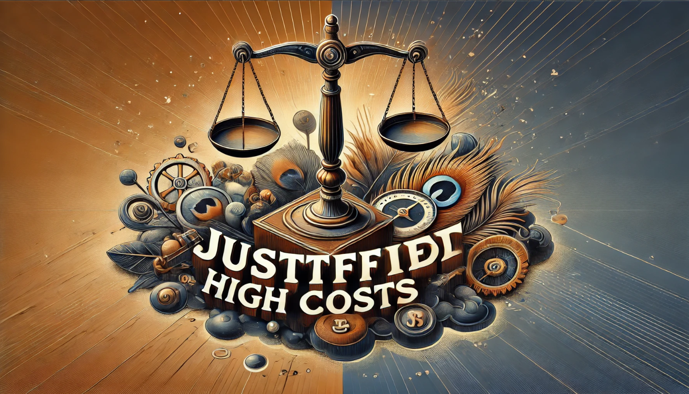
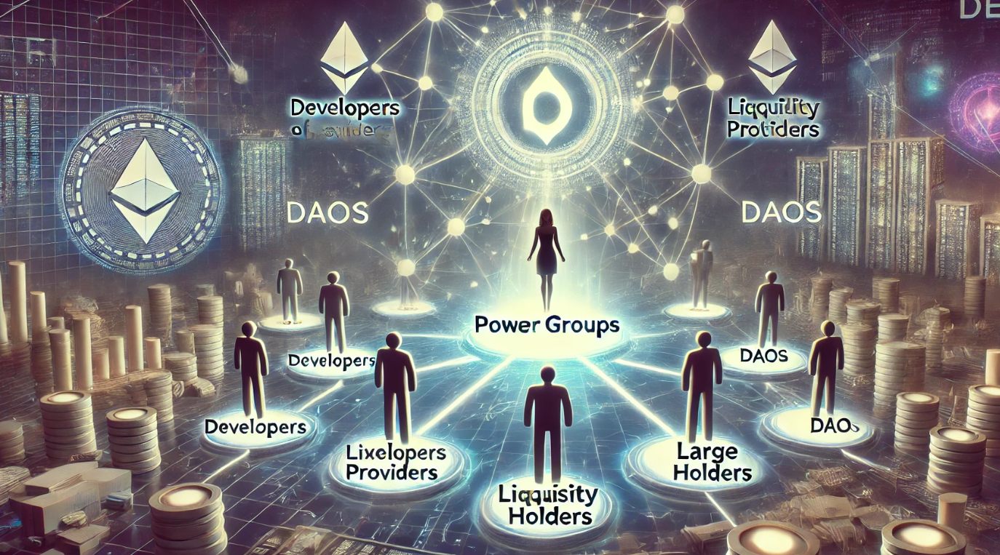

# El punto único de fallo (SPOF) y la descentralización

Hablaremos sobre la necesidad de la descentralización frente al punto único de fallo.

La descentralización, es el proceso de transformar un sistema centralizado a uno donde existen participantes de una red, con propósitos comunes, que actúan de forma autónoma y ordenada, siguiendo un protocolo predefinido, el cual ha sido consensuado.

Deja de existir la necesidad de depender de la decisión o coordinación con un elemento central. Este elemento central puede fallar de diversas maneras: desde volverse inaccesible hasta ser vulnerable a la corrupción o abuso de poder, es por eso que decimos que la des-centralización es la solución al SPOF, Single Point of failure o punto único de fallo.

El principal desafío de la descentralización radica en diseñar y acordar un protocolo que permitan a los participantes de la red operar de manera confiable, autónoma y sostenible en ausencia de una autoridad central, proceso crucial denominado [la gobernanza de la red](https://crypto.com/glossary/es/governance).

Por esta razón, la descentralización suele aplicarse inicialmente a casos de uso simples, donde las reglas son básicas y los objetivos están claramente definidos.

Diseñar e implementar un sistema descentralizado es costoso debido a su complejidad, como la de tener en cuenta todas las variables del protocolo, las dificultad técnica, costos operativos, etc.
Además suelen tener menor rendimiento y en muchos casos al usarlos es necesario adaptarse a lo que proporcione el protocolo.
Por estas razones, por el coste que conlleva y por su aveces, limitada usabilidad, solo se aplica cuando los beneficios como transparencia, resilencia y resistencia a la censura lo justifiquen, aunque, en mí opinión, vivimos en una situación económica y social que lo justifica...

En cualquier sistema descentralizado, ya sea un libro contable o un servicio de actuación contra incendios hablamos de una red, por lo tanto, suelen existir lo que conocemos como nodos. Estos nodos pueden entenderse como agentes, delegados o participantes que desempeñan roles específicos como cubrir un área concreta, procesar información, o colaborar en un propósito mas amplio. Sin embargo, la descentralización no elimina la necesidad de coordinación, y aquí es donde surge un desafío importante: [el problema de los generales bizantinos](https://es.wikipedia.org/wiki/Problema_de_los_generales_bizantinos). Este problema, que deberías explorar, plantea cómo los agentes pueden coordinarse de manera efectiva incluso en presencia de fallos o comportamientos maliciosos.

Para abordar este desafío, nacen los protocolos de consenso, mecanismos diseñados para garantizar que los nodos puedan ponerse de acuerdo sobre un estado único de la red.

Estos protocolos son fundamentales, ya que permiten generar evidencias de honestidad y confianza entre los participantes que, de otro modo, no se conocerían ni confiarían entre sí. Así, la descentralización no solo minimiza el punto único de fallo, sino que también maximiza la resiliencia del sistema frente a ataques o errores.

Un sistema descentralizado no depende de un promotor central y además existen participantes que hacen un trabajo o son parte interesada en el propósito de la red, por eso, para hacer todo esto sostenible, es necesario incorporar la economía al protocolo, estando además estrechamente relacionada la economía con la seguridad, apareciendo el término de seguridad criptoeconómica o [criptoeconomía](https://en.wikipedia.org/wiki/Cryptoeconomics).

---

Comprendiendo todo esto, podemos tener un mejor criterio para analizar el ecosistema de la web3.

En la web3, vemos constantemente sistemas que realmente no son suficientemente descentralizados, los cuales usan tecnologías descentralizadas (como blockchain) y realmente pueden ser sistemas resilientes, pero las decisiones siguen siendo tomadas por grupos de poder y no hay consenso.

En las fases iniciales de un proyecto, estamos acostumbrados a tolerar cierta centralización e incluso llega a ser necesaria, pero un sistema no será descentralizado hasta que no desaparezcan las decisiones centrales, y seguir por ese camino, puede llegar a ser una estafa o scam, donde la fundación omnipresente es la única que toma decisiones, incluso de carácter económico.

No nos engallemos, muchos proyectos existen por sus fundadores y esto está bien, los participantes de una red descentralizada, toleran que ciertos aspectos no lo estén, pero lo que nunca puede variar son las condiciones por las que se forma parte de la red.

Si las condiciones cambian sin ningún criterio predefinido o consenso, entonces estamos en un sistema centralizado y es precisamente lo que queremos evitar por el punto único de fallo...

