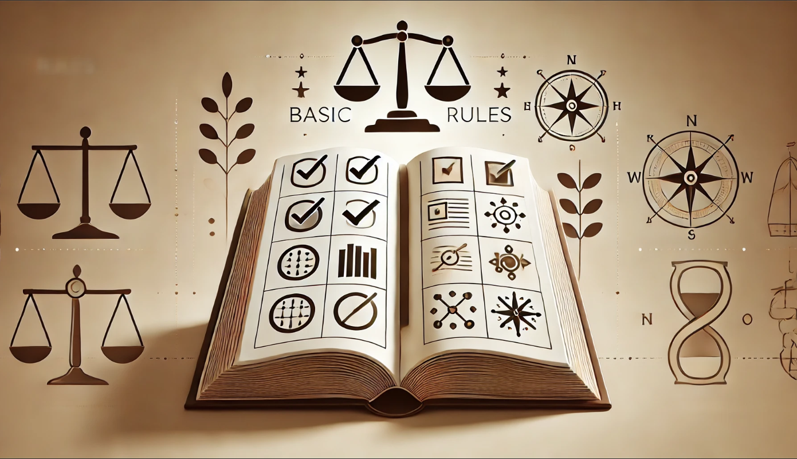

# El punto único de fallo (SPOF) y la descentralización

> También puedes este contenido en [el vídeo del canal proyectos web3](https://www.youtube.com/watch?v=h7qadsJrZbY).

Hablaremos sobre la necesidad de la descentralización frente al punto único de fallo.

## Un proceso de transformación

La descentralización, es el proceso de transformar un sistema centralizado a uno donde existen participantes de una red, con propósitos comunes, que actúan de forma autónoma y ordenada, siguiendo un protocolo predefinido, el cual ha sido consensuado.

Deja de existir la necesidad de depender de la decisión o coordinación con un elemento central. Este elemento central puede fallar de diversas maneras: desde volverse inaccesible hasta ser vulnerable a la corrupción o abuso de poder, es por eso que decimos que la descentralización es la solución al SPOF, Single Point of failure o punto único de fallo.

## El protocolo

El principal desafío de la descentralización radica en diseñar y acordar un protocolo que permitan a los participantes de la red operar de manera confiable, autónoma y sostenible en ausencia de una autoridad central, proceso crucial que se consigue gracias a [la gobernanza de la red](https://crypto.com/glossary/es/governance).

Por esta razón, la descentralización suele aplicarse inicialmente a casos de uso simples, donde las reglas son básicas y los objetivos están claramente definidos.

## Se debe justificar

Diseñar e implementar un sistema descentralizado es costoso debido a su complejidad, como la de tener en cuenta todas las variables del protocolo, las dificultad técnica, costos operativos, etc.
Además suelen tener menor rendimiento y en muchos casos al usarlos es necesario adaptarse a lo que proporcione el protocolo.
Por estas razones, por el coste que conlleva y por su aveces, limitada usabilidad, solo se aplica cuando los beneficios como transparencia, resilencia y resistencia a la censura lo justifiquen, aunque, en mí opinión, vivimos en una situación económica y social que lo justifica...

## El sistema resiliente

En cualquier sistema descentralizado, ya sea un libro contable o un servicio de emergencias, hablamos de una red donde existen lo que conocemos como nodos. Estos nodos pueden entenderse como agentes, delegados o participantes que desempeñan roles específicos, como cubrir un área concreta, procesar información, o colaborar en un propósito más amplio.

Este sistema descentralizado, sin punto único de fallo, es más [resiliente](https://es.wikipedia.org/wiki/Resiliencia_(inform%C3%A1tica)) que uno centralizado, ya que ante fallos o posibles ataques, siempre que exista la suficiente cantidad de nodos, se podrá seguir ofreciendo el servicio demandado. Si lo vemos en un ejemplo hipotético, en el suministro energético de una red eléctrica, si cuando haya una caída de tensión por la alta demanda, con el propósito de evitar un apagón general, la red de forma autónoma y siguiendo su protocolo, desconectará a demandantes no esenciales, sin esperar la decisión  de un coordinador central, estaríamos hablando de uns sistema descentralizado y resiliente, que evita un mal mayor y que no espera una decisión única, sino que actúa de forma autónoma.

Pero estos nodos, que no dependen de un elemento central, se deben coordinar, y no están exentos de fallos o de actores maliciosos, y es donde surge [el problema de los generales bizantinos](https://es.wikipedia.org/wiki/Problema_de_los_generales_bizantinos). Este problema, que deberías explorar, plantea cómo los nodos pueden coordinarse de manera efectiva incluso en presencia de fallos o comportamientos maliciosos.

## El protocolo de consenso

Para abordar este desafío están las [decisiones por consenso](https://es.wikipedia.org/wiki/Decisi%C3%B3n_por_consenso) que se implementan en los diferentes [protocolos de consenso](https://discover.luno.com/what-is-a-consensus-protocol/) que vemos en la web3, que son mecanismos diseñados para garantizar que los nodos puedan ponerse de acuerdo sobre un estado único de la red.

Estos protocolos son fundamentales, ya que permiten generar evidencias de honestidad y confianza entre los participantes que, de otro modo, no se conocerían ni confiarían entre sí.

## La seguridad por el propio interés

Para hacer el sistema sostenible, Los participantes de la red hacen un trabajo porque son parte interesada.

Lo son por diferentes motivos, pero la más común es por el interés económico, donde es más beneficios aportar seguridad y honestidad que delinquir.

Por eso se dice que la seguridad de una red descentralizada basada en criptomonedas es seguridad criptoeconómica, porque es la propia [criptoeconomía](https://en.wikipedia.org/wiki/Cryptoeconomics) y su beneficio la que da interés a los participantes en generar seguridad a la red.

---

Comprendiendo todo esto, podemos tener un mejor criterio para analizar el ecosistema de la web3.

## Los grupos de poder

En la web3, vemos constantemente sistemas que realmente no son suficientemente descentralizados, los cuales usan tecnologías descentralizadas (como blockchain) y realmente pueden ser sistemas resilientes, pero las decisiones siguen siendo tomadas por grupos de poder y no hay consenso.

## Evitar las estafas

En las fases iniciales de un proyecto, estamos acostumbrados a tolerar cierta centralización e incluso llega a ser necesaria, pero un sistema no será descentralizado hasta que no desaparezcan las decisiones centrales, y seguir por ese camino, puede llegar a ser una estafa o scam, donde la fundación omnipresente es la única que toma decisiones, incluso de carácter económico.

## Los acuerdos se deben cumplir

No nos engallemos, muchos proyectos existen por sus fundadores y esto está bien, los participantes de una red descentralizada, toleran que ciertos aspectos no lo estén, pero lo que nunca puede variar son las condiciones por las que se forma parte de la red.

Si las condiciones cambian sin ningún criterio predefinido o consenso, entonces estamos en un sistema centralizado y es precisamente lo que queremos evitar por el punto único de fallo...
