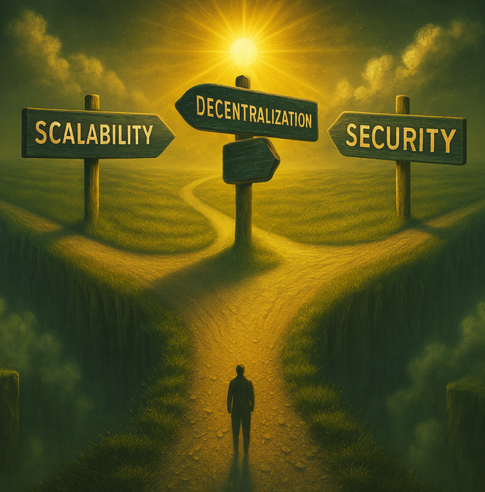
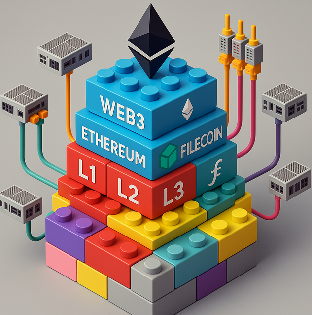
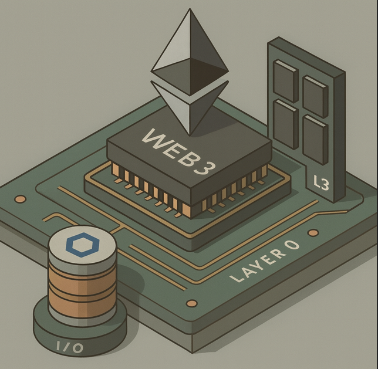

# Desafíos de la descentralización: El trilema y la solución modular

Ahora que conocemos los sistemas descentralizados, es importante identificar los principales desafíos que enfrentan. Uno de los más relevantes es el llamado trilema de la blockchain.

> Aunque se asocia principalmente con blockchain, el trilema afecta a todos los sistemas descentralizados. Blockchain es, por definición, el sistema descentralizado más representativo.

Si investigas en línea, encontrarás abundante información sobre este concepto. En esencia, el trilema plantea que un sistema descentralizado debe equilibrar tres aspectos clave: escalabilidad, descentralización y seguridad.

Resulta prácticamente imposible optimizar los tres simultáneamente, por lo que siempre se deben hacer concesiones en alguno de ellos.

Por ejemplo, en un sistema muy descentralizado y seguro, con una cantidad significativa de nodos, el consenso de la red afecta la escalabilidad, limitando el número de operaciones por segundo que puede procesar la red.

Asimismo, en un sistema excesivamente descentralizado, la falta de una autoridad central complica la coordinación necesaria para responder a un ataque, volviéndolo inseguro.

Igualmente, un sistema descentralizado y rápido puede llegar a ser inseguro, como Solana, no tanto por su capacidad para defenderse de ataques sino inseguridad operativa en la estabilidad de la red.

En general, un sistema descentralizado suele priorizar la seguridad como requisito mínimo. Por ejemplo, un sistema puede ser descentralizado y suficientemente seguro, o escalable y suficientemente seguro, pero no debería ser escalable, descentralizado e inseguro; esto último carecería de sentido, sobre todo porque, como veremos, los sistemas descentralizados suelen ser atacados.

Teniendo en cuenta esta limitación, la solución habitual es crear un ecosistema modular interconectado que se complementa entre sí. Por ejemplo, la red principal de Ethereum prioriza la descentralización y la seguridad, mientras que las cadenas laterales (sidechains) o [las segundas capas](https://academy.bit2me.com/que-son-las-layers-o-capas-en-blockchain/)(como las [Layer 2](https://metlabs.io/layer-2-blockchain-ethereum/) o [Layer 3](https://academy.bit2me.com/que-son-las-layer-3-cadena-bloques-capa/)) se enfocan en la escalabilidad, delegando parte de la seguridad y descentralización a la red principal. Por lo tanto, cada proyecto debe decidir dónde colocar su énfasis para cumplir su propósito dentro de un ecosistema más amplio.

Esta filosofía modular permite crear capas adicionales que también son descentralizadas y cuentan con sus propios mecanismos de consenso, operando en redes de nodos independientes. De esta forma se ajusta solo el grado de descentralización según el contexto.

Por ejemplo, las soluciones de capa 2, aunque más escalables, siguen utilizando una red de nodos, como en las rollups, donde una red descentralizada de validadores detecta el fraude posteriormente y luego consolida un resumen en la red principal; de esta forma, continúa siendo un sistema descentralizado, con menor grado, pero igualmente seguro y más rápido.

Estas soluciones modulares permiten crear un sistema interconectado donde las carencias de uno son completadas por otro, pero también generan un gran desafío: conocer el ecosistema y los protocolos subyacentes.

Comprender este enfoque modular es uno de los mayores retos de la Web3: visualizarlo como un conjunto de piezas de lego que se conectan entre sí. Así, la limitación de escalabilidad en un sistema no representa un obstáculo insalvable, ya que siempre puede apoyarse en otros componentes del ecosistema que suplan esa necesidad.

Este enfoque modular culmina en la composabilidad, que se refleja en las aplicaciones descentralizadas que el usuario final utiliza. La composabilidad permite que diferentes protocolos y servicios se integren fácilmente, facilitando la creación de nuevas aplicaciones funcionales desde el principio.

En conclusión, al observar esta complejidad de sistemas especializados e interconectados, muchos vemos la Web3 como un gran ordenador mundial descentralizado. Por ejemplo, Ethereum puede considerarse la CPU que ejecuta programas (smart contracts), IPFS funciona como el sistema de archivos distribuido, Filecoin sería el disco duro, Chainlink actúa como el sistema de entrada/salida de datos (oráculos), y las soluciones de capa 2 serían como coprocesadores que aceleran tareas específicas... Así, cada protocolo cumple una función similar a los componentes de un ordenador, pero de forma abierta, colaborativa y global.
