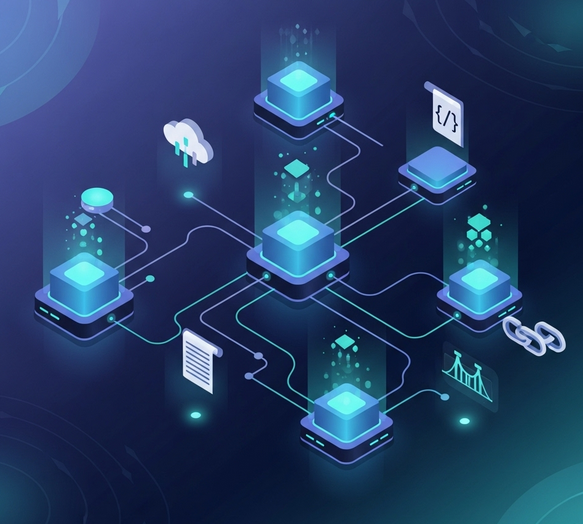

# Ecosistema Web3

El ecosistema Web3 es complejo de entender, además está en construcción y evoluciona rápidamente. Está formado por una amplia variedad de redes, protocolos, infraestructuras, organizaciones y aplicaciones que interactúan de manera modular y descentralizada. Esta diversidad, aunque puede resultar abrumadora al principio, es clave para comprender las oportunidades y desafíos que ofrece Web3. Además, cada capa —desde las blockchains y soluciones de infraestructura, hasta los protocolos, organizaciones y aplicaciones descentralizadas— cumple una función específica y una vez comprendido resulta más fácil participar en el ecosistema.

Pero también es cierto que Web3 está impulsada por organizaciones, comunidades, empresas, big tech, startups, DAOs, agencias, laboratorios y, en ocasiones, gobiernos. Estos actores o jugadores llegan a acuerdos, pero también impulsan el ecosistema en distintas direcciones, lo que genera diversidad y dinamismo. Sin embargo, esta variedad también dificulta su comprensión y, en cierta forma, ante tantas posibilidades, debes elegir tu propio path u hoja de ruta.

Conocer el panorama general te permitirá identificar las áreas más relevantes según tus intereses, ya sea el desarrollo de aplicaciones, la participación en comunidades, la exploración de nuevas tecnologías o la contribución a la descentralización.

Este artículo busca ofrecer una visión de conjunto, pero también concreta eligiendo un camino o "path" a seguir, definiendo el stack que este repositorio `web3-101` va a adoptar. De lo contrario, tanta dispersión haría imposible avanzar y obtener resultados prácticos.

## Ecosistema de redes blockchain

Las redes blockchain son la base de Web3. Bitcoin fue la pionera, considerada como "oro digital" por su escasez programada y su enfoque en la reserva de valor. Es el ejemplo de blockchain de primera generación, centrada en la seguridad y la resistencia a la censura, pero con capacidades limitadas de programación. Ethereum, como blockchain de segunda generación, introdujo los contratos inteligentes y la programabilidad Turing-completo, permitiendo el desarrollo de DApps y protocolos complejos.

En este contexto, diferentes actores desarrollaron soluciones blockchain orientadas a mejorar la escalabilidad y reducir las comisiones. Un ejemplo destacado es Solana, que introduce enfoques propios para optimizar la eficiencia, utilizando una variante de Proof of Stake conocida como Proof of History (PoH) y otras innovaciones técnicas. Sin embargo, este diseño ha recibido críticas por su menor estabilidad y por la concentración de nodos, lo que genera dudas sobre su grado de descentralización. Estas redes de segunda generación también suelen ofrecer modelos de gobernanza más flexibles, buscando atraer comunidades mediante casos de uso específicos.

Posteriormente, aunque ya se estaban desarrollando desde hace tiempo, aparecen redes de tercera generación que, desde su diseño inicial, abordan el desafío de la escalabilidad, la sostenibilidad, comisiones bajas y casos de uso específicos e incluso cadenas para usos específicos como [appchains](https://cointelegraph.com/learn/articles/appchain-application-specific-blockchain). Este grupo incluye tanto arquitecturas modulares con interoperabilidad nativa (como [Polkadot](https://es.wikipedia.org/wiki/Polkadot) o [Cosmos](https://cointelegraph.com/learn/articles/what-is-cosmos-a-beginners-guide-to-the-internet-of-blockchains)) como [blockchains monolíticas optimizadas](https://www.alchemy.com/overviews/modular-vs-monolithic-blockchains) (como [Cardano](https://cardano.org/discover-cardano), con un enfoque académico y orientado a la sostenibilidad, [Avalanche](https://www.avax.network/about), [Algorand](https://algorand.co/learn), [Near](https://www.near.org/) o [Aptos](https://academy.bit2me.com/que-es-aptos/)). Ethereum, por su parte, continúa adaptándose e incorporando tecnologías de tercera generación para mantenerse competitiva.

  > No es fácil generalizar, cada red blockchain tiene su propio enfoque y busca atraer comunidades específicas. Las blockchains monolíticas suelen centrarse en el marketing y en ofrecer una experiencia Web3 completa e integrada. Otras, en cambio, actúan como redes de infraestructura, sin priorizar necesariamente la ejecución de contratos inteligentes. Muchas adoptan compatibilidad con la EVM para facilitar la interoperabilidad y atraer a las comunidades ya existentes en Ethereum y otras tienen enfoques diferentes...en realidad es un ecosistema tan amplio que es difícil de definir.

Muchas de estas redes de segunda y tercera generación, especialmente las monolíticas, suelen adoptar una arquitectura que integra todas las funciones principales junto con un ecosistema completo de aplicaciones. Esta aproximación ofrece un “stack” más accesible, que abarca desde herramientas para el desarrollo y despliegue de contratos inteligentes, ayudas o grants para hacer crecer el ecosistema, hasta la gestión de identidades y cualquier necesidad para crear soluciones Web3, generando un entorno propio más amigable. Sin embargo, esta integración puede derivar en ecosistemas más cerrados y una mayor dependencia de los equipos fundadores, lo que genera dudas sobre su compromiso real con la descentralización. Ethereum, por su parte, mantiene un modelo más abierto y comunitario —aunque no exento de desafíos como la concentración de validadores— y, en términos generales, refleja mejor los ideales de Web3.

  > Tampoco es fácil generalizar. Aunque muchas redes monolíticas enfrentan el desafío de depender de sus equipos fundadores, algunas avanzan hacia modelos de gobernanza más descentralizados. Es fundamental analizar cada caso, ya que existen excepciones y grados muy distintos de descentralización.

//Todo 4º generacion, seguridad mejorada zkproof
//Todo    - appchains: Cadenas de bloques diseñadas para aplicaciones específicas.
    - application-specific blockchains: Blockchains específicas para aplicaciones particulares.
    - custom blockchains: Blockchains personalizadas para ciertas funcionalidades.
    - vertical blockchains: Blockchains centradas en una industria o función específica

//todo servicios off-chain

Como comentamos, Ethereum evoluciona constantemente para alcanzar la escalabilidad y conectividad y mejorar la experiencia de usuario. Aunque no avanza tan rápido como otras redes de tercera generación, prioriza la seguridad, no solo de la red, sino también en la consolidación de cada paso evolutivo, guiado por una visión clara de lo que debería ser una blockchain abierta y neutral. Por eso, muchos la consideramos como la red de referencia, especialmente en lo que respecta a descentralización y robustez del ecosistema.

Ethereum, para abordar los problemas de escalabilidad y costes, ha impulsado soluciones de segunda capa (Layer 2), como Optimistic Rollups, ZK-Rollups y sidechains. Estas tecnologías permiten procesar transacciones fuera de la cadena principal (Layer 1) y luego consolidar los resultados en ella, lo que incrementa la capacidad de procesamiento y reduce las comisiones. Las Layer 2 alivian la congestión de la red principal y utilizan mecanismos más eficientes, aunque suelen implicar menor grado de descentralización y seguridad. Además, existen propuestas de tercera capa (Layer 3) orientadas a casos de uso específicos y mayor personalización.

  > Si quieres saber qué soluciones de capa 2 (L2) tienen mayor adopción y actividad, puedes consultar [L2Beat](https://l2beat.com/scaling/summary), donde encontrarás un resumen actualizado de las principales redes y su evolución.

Las soluciones de segunda capa (Layer 2) y presumiblemente capa 3 (Layer 3) permiten adaptar la red a casos de uso concretos, ofreciendo flexibilidad y escalabilidad sin sacrificar la seguridad de Ethereum como capa base. Ejemplos destacados de redes Layer 2 son [Optimism](https://optimism.io/), [Arbitrum](https://arbitrum.io/), [StarkNet](https://www.starknet.io/) y [Polygon](https://polygon.technology/), cada una con enfoques técnicos propios para optimizar costes, velocidad y privacidad. Estas redes procesan transacciones fuera de la cadena principal y consolidan los resultados en Ethereum, lo que reduce comisiones y congestión. Aunque dependen de Ethereum para la liquidación y seguridad final, las Layer 2 y 3 (cuando se consoliden) permiten desarrollar aplicaciones especializadas y resolver problemas de escalabilidad, manteniendo la interoperabilidad dentro del ecosistema EVM.

Además, Ethereum se ha consolidado como la principal red de liquidación (settlement layer), donde se registran y validan las transacciones más relevantes, incluso aquellas originadas en otras redes compatibles con la EVM. Este estatus no se debe solo a su adopción, sino a que su modelo descentralizado (aunque con imperfecciones) sigue siendo el más resistente a ataques y censura.

Esta es una reflexión personal e implica tomar posición sobre una solución concreta. Debemos reconocer que, por adopción y comunidad, Bitcoin se ha consolidado como la opción ganadora en su propósito, al igual que Ethereum en su rol como red programable. Si bien depender de una única red puede parecer contrario al ideal de descentralización, en la práctica representa una decisión pragmática para no quedar paralizado ante la amplitud del ecosistema. Esto no descarta otras visiones de la Web3, como un ecosistema compuesto por múltiples redes monolíticas compatibles con la EVM, interconectadas mediante arquitecturas como Polkadot o Cosmos. Es probable que el tiempo y el uso terminen posicionando cada enfoque. Lo que sí parece poco probable es que Ethereum y sus soluciones en capas pierdan su relevancia.

  > Siempre hace falta un plan B; cualquier solución con una comunidad fuerte es necesaria en el ecosistema. No se debe malinterpretar la elección personal de Ethereum, con considerar que el resto son innecesarias o poco valiosas.

### Modelos de redes P2P y blockchain

> Te animo a leer más en [introducción a redes p2p](https://github.com/open3diy/web3-101-edu-projects/blob/main/web3-infrastructure-technology/_misc/p2p_overview.md)

En este repositorio nos centramos en redes P2P y, por extensión, en redes blockchain que adoptan un modelo de confianza "trustless". Estas redes suelen ser de autorización pública, aunque existen variantes permisionadas, y emplean modelos de gobernanza descentralizada, como las DAOs, que resultan especialmente útiles en una Web3 abierta. Sin embargo, también existen otros tipos de redes orientadas a empresas, gobiernos u organizaciones, que pueden ser privadas o permisionadas, con gobernanza centralizada o federada. Aunque estos modelos son relevantes, no constituyen el foco principal de este repositorio, al menos en esta fase inicial.

### Modularidad vs Interoperabilidad en el ecosistema Web3

// revisar

Uno de los debates clave en la evolución del ecosistema Web3 es el enfoque entre modularidad y interoperabilidad. Ambos conceptos buscan mejorar la escalabilidad, flexibilidad y conectividad entre redes y aplicaciones, pero lo hacen desde perspectivas diferentes:

- **Interoperabilidad:** Se refiere a la capacidad de diferentes blockchains y sistemas para comunicarse y transferir datos o activos entre sí de forma segura y eficiente. Ejemplo destacado es [Polkadot](https://polkadot.network/), que permite la interconexión de múltiples blockchains (parachains) bajo una arquitectura común, facilitando la transferencia de información y activos entre redes independientes.

- **Modularidad:** Implica diseñar blockchains y sistemas como componentes independientes que pueden combinarse y personalizarse según las necesidades de cada aplicación. [Celestia](https://celestia.org/) es un ejemplo de blockchain modular, separando la capa de consenso y disponibilidad de datos, lo que permite a los desarrolladores crear sus propias cadenas especializadas (appchains) sobre una infraestructura común. En el ecosistema Ethereum, la modularidad se refleja en stacks como [OP Stack](https://stack.optimism.io/), que permiten construir rollups y soluciones personalizadas sobre la base de Ethereum, facilitando la especialización y escalabilidad.

En resumen, la interoperabilidad busca conectar diferentes redes para compartir recursos y liquidez, mientras que la modularidad permite construir soluciones especializadas y adaptables sobre infraestructuras compartidas. Ambos enfoques son complementarios y están impulsando la innovación en Web3, permitiendo la creación de ecosistemas más abiertos, flexibles y escalables.

muchos proyectos “modulares” terminan siendo híbridos: dicen que se especializan pero acaban metiendo todo.

| Categoría                                         | Ejemplos                                                               | Cómo funciona                                                         | En qué se enfocan                                                           | Analogía                                                               |
| ------------------------------------------------- | ---------------------------------------------------------------------- | --------------------------------------------------------------------- | --------------------------------------------------------------------------- | ---------------------------------------------------------------------- |
| **Monolíticas (L1 “todo en uno”)**                | Bitcoin, Ethereum L1, Solana                                           | Consenso + ejecución + datos en una sola capa                         | Seguridad y simplicidad, pero limitadas en escalabilidad                    | “Un PC donde todo está en la misma torre”                              |
| **Modulares (L1 + capas especializadas)**         | Celestia, EigenLayer, rollups en Ethereum                              | Separan funciones (datos, ejecución, consenso) en distintas capas     | Escalabilidad y flexibilidad                                                | “Un PC armado por piezas: CPU, GPU, RAM, disco separados”              |
| **Appchains**                                     | dYdX (Cosmos), DeFi Kingdoms (Avalanche subnet), juegos en Polygon CDK | Blockchain dedicada a una aplicación concreta                         | Personalización, control de la app, rendimiento específico                  | “Un servidor privado para una app”                                     |
| **Layer 0 (infraestructuras para crear cadenas)** | Polkadot (relay + parachains), Cosmos (SDK + IBC), Avalanche (subnets) | Red base que coordina muchas blockchains (appchains o L1s)            | Interoperabilidad y coordinación                                            | “Una autopista con muchos carriles, cada carril es una cadena”         |
| **Ethereum + L2**                                 | Optimism, Arbitrum, zkSync, Base                                       | Rollups que se apoyan en Ethereum para seguridad, pero ejecutan fuera | Escalabilidad manteniendo seguridad de Ethereum                             | “Un anexo a un banco central: trámites rápidos fuera, respaldo dentro” |
| **Stacks (frameworks para crear L2)**             | OP Stack (Optimism), zk Stack (zkSync)                                 | Plantillas para lanzar tu propia L2                                   | Facilitar ecosistema de muchas cadenas conectadas (Superchain, Hyperchains) | “Un kit de Lego para montar tu propia blockchain”                      |

👉 Una forma de no perderse es siempre hacerse dos preguntas antes de estudiar un proyecto:

¿Este proyecto es una red base (L1, L0) o se apoya en otra? ¿se intectonecta en una superchain o que posibildiades hay?

¿Su foco principal es escalabilidad, interoperabilidad o un caso de uso concreto?

## Ecosistema de infraestructura

Se considera infraestructura Web3 a las redes, blockchains o aplicaciones que proporcionan servicios, recursos o conectividad al resto del ecosistema Web3 y que es aceptado como tal por su adopción.

  > Es cierto que verás mencionadas varias redes en diferentes apartados, pero esto se hace para clarificar la explicación.

### Orientado a la personalización: appchain

Las [appchains](https://cointelegraph.com/learn/articles/appchain-application-specific-blockchain), o cadenas de aplicaciones, representan una evolución en la infraestructura blockchain orientada a la personalización. A diferencia de las blockchains públicas y generalistas, las appchains están diseñadas para servir a aplicaciones o comunidades específicas, permitiendo adaptar parámetros como la gobernanza, el consenso, la privacidad y el rendimiento según las necesidades concretas del caso de uso.

Este enfoque modular facilita la creación de redes independientes que pueden optimizarse para requisitos particulares, como escalabilidad, comisiones bajas, reglas de validación personalizadas o integración con sistemas externos. Las appchains suelen desplegarse sobre arquitecturas que soportan interoperabilidad nativa, como [Cosmos](https://cosmos.network/) (mediante el protocolo IBC), [Polkadot](https://polkadot.network/) (parachains), [Avalanche](https://www.avax.network/) (subnets) o mediante frameworks como [Polygon CDK](https://polygon.technology/polygon-cdk/) y [OP Stack](https://stack.optimism.io/) en el ecosistema Ethereum.

La principal ventaja de las appchains es la flexibilidad: cada aplicación puede definir su propio entorno, reglas y recursos, sin depender de las limitaciones de una red principal. Esto permite casos de uso avanzados en gaming, DeFi, identidad, privacidad, gestión de datos o comunidades autónomas, donde la personalización es clave para la adopción y el éxito.

Sin embargo, la proliferación de appchains plantea retos en interoperabilidad, seguridad y liquidez, ya que cada red debe garantizar su conectividad y protección frente a ataques. Por ello, las soluciones de infraestructura que facilitan la comunicación entre appchains y la reutilización de seguridad (como EigenLayer en Ethereum) son cada vez más relevantes en el ecosistema Web3.

### Orientados en la interoperabilidad

En cuanto a interoperabilidad, una de las soluciones más relevantes —y también la más problemática en términos de seguridad— son los bridges o puentes. Los bridges permiten transferir activos y datos entre diferentes blockchains o capas, facilitando la interoperabilidad entre ecosistemas que, de otro modo, serían incompatibles. Sin embargo, estos puentes suelen ser el punto más vulnerable de la infraestructura Web3; de hecho, la mayoría de los mayores hackeos en Web3 han ocurrido en bridges.

Para evitar el uso de puentes como mecanismo de interoperabilidad han surgido soluciones más seguras y nativas conocidas como Capa 0 (Layer 0). Estas redes permiten la interconexión y comunicación directa entre diferentes blockchains, facilitando la interoperabilidad y el desarrollo de aplicaciones multired sin depender de bridges externos. Ejemplos destacados, que ya hemos mencionado, de Layer 0 son [Polkadot](https://polkadot.network/), [Cosmos](https://cosmos.network/) y [Celestia](https://celestia.org/) (destaca por separa la capa de consenso y disponibilidad de datos), que proporcionan una base modular para que otras blockchains y aplicaciones puedan interactuar, compartir información y transferir activos de forma segura y descentralizada.

Si pensamos en soluciones de interoperabilidad en Ethereum, no se destaca por ofrecer una interoperabilidad amplia entre diferentes redes de capa 2 (Layer 2). En la práctica, la aproximación predominante es conectar ecosistemas L2 intra-stack, es decir, dentro del mismo stack tecnológico, como ocurre con las soluciones de rollups compatibles entre sí, por ejemplo [Optimism](https://optimism.io/) y [Base](https://base.org/), que comparten el [OP Stack](https://stack.optimism.io/). De manera similar, [ZkSync](https://zksync.io/) impulsa la [Elastic Chain](https://launchpad.ripio.com/blog/elastic-chain-la-nueva-era-de-la-interoperabilidad-en-blockchain) para rollups creados con [ZK Stack](hhttps://zkstack.io/), y [Polygon](https://polygon.technology/) desarrolla [AggLayer](https://www.agglayer.dev/) para los basados en su [CDK (Chain Development Kit)](https://polygon.technology/polygon-cdk/). Estos modelos permiten que los rollups construidos con la misma infraestructura se comuniquen y compartan liquidez de forma nativa. Lo cierto es que la interoperabilidad entre diferentes stacks o arquitecturas L2 sigue siendo un reto pendiente.

### Orientados en la escalabilidad: sub‑10 ms / 100.000+ TPS

Dentro del ecosistema se busca un objetivo claro para la adopción masiva que soporte el mismo volumen de transacciones de la web2, con una medida clara: latencia inferior a 10 ms y capacidad mayor de 100.000 transacciones por segundo (TPS).

En esa competición, dentro de las redes monolíticas, el principal candidato es [Solana](https://solana.com/), que con su arquitectura basada en Proof of History y ejecución paralela apuesta por alcanzar esos niveles directamente en capa 1, sacrificando en parte la modularidad a cambio de rendimiento extremo. También destacan otras redes como [Aptos](https://aptosfoundation.org/), [Sui](https://sui.io/), [Celestia](https://celestia.org/) (mas como L0) y [Avalanche](https://www.avax.network/), que exploran diferentes enfoques para lograr alta escalabilidad y baja latencia, cada una con innovaciones propias en consenso, procesamiento y diseño de red.

En el ecosistema de Ethereum, en cambio, la estrategia se orienta hacia soluciones de capa 2. [MegaEth](https://www.megaeth.com/) busca ofrecer velocidad y procesamiento en tiempo real con un diseño propio que rompe con los stacks tradicionales, [OP Stack](https://stack.optimism.io/) persigue construir una red de rollups interoperables y estandarizados bajo la filosofía [Superchain](https://docs.optimism.io/superchain/superchain-explainer), y [zkStack](https://zkstack.io/) se centra en aprovechar la seguridad criptográfica de las pruebas de validez para escalar de forma más segura.

La competencia no solo está en el rendimiento bruto, sino en la combinación de descentralización, seguridad, escalabilidad y experiencia de usuario que cada enfoque pueda ofrecer al desarrollador y al usuario final.

### El ecosistema Ethereum en construcción 🚧

La organización Ethereum incentiva y mantiene en su hoja de ruta el desarrollo de un ecosistema capaz de alcanzar en conjunción con el resto de capas, como la L2 MegaEth, un rendimiento superior a 100.000 TPS y latencias cercanas a 10 ms, con el objetivo de soportar volúmenes de transacciones similares a la Web2. Este objetivo se conoce en la hoja de ruta como "The Surge".

Para lograrlo, uno de los principales desafíos es escalar la capa 1. Esto se aborda mediante la implementación del sharding, que ahora se centra en optimizar la disponibilidad de datos para las soluciones de capa 2 (L2s), en lugar de procesar transacciones directamente. Esta estrategia, conocida como danksharding, permite que las L2s, como los rollups, procesen transacciones en paralelo y luego publiquen los datos en la Capa 1 de forma más eficiente, lo que reduce significativamente las tarifas. Además, la propia Capa 1 está explorando la ejecución de transacciones en paralelo dentro de la EVM para aumentar su propio rendimiento, una iniciativa complementaria al sharding que, en conjunto, ayuda a reducir las tarifas de gas.

Además, Ethereum está integrando tecnologías de Zero-Knowledge Proofs (ZK Proofs) en los validadores de la capa principal, que permiten verificar información sin revelar su contenido, mejorando la escalabilidad, seguridad y privacidad de las transacciones. Este enfoque es crucial para la fase "The Verge", que busca mejorar la verificación de la red utilizando Verkle Trees para hacerla más ligera.

En cuanto a la experiencia de usuario y la seguridad, Ethereum avanza con iniciativas como la abstracción de cuentas y la autenticación reforzada mediante técnicas de conocimiento cero aplicadas a dispositivos móviles, como ZK ID. Estas mejoras forman parte de la fase "The Splurge", que busca pulir la red para garantizar una experiencia fluida y robusta.

La hoja de ruta de Ethereum también incluye fases como "The Scourge", centrada en la resistencia a la censura y la centralización, es decir evitar que grandes validadores o pools de staking bloqueen transacciones, y "The Purge", que busca limpiar el historial de la red para reducir el almacenamiento de datos y hacer los nodos más eficientes a largo plazo.

Este resumen, incompleto y posiblemente con fallos y matices, solo pretende evidenciar que el ecosistema de Ethereum está en plena evolución. El desafío actual es identificar qué arquitectura será la más estable, segura y escalable para una adopción masiva. Aún no está claro si serán [Base](https://base.org/), [OP Stack](https://stack.optimism.io/), [Polygon](https://polygon.technology/) las que lideren el desarrollo de aplicaciones a gran escala. Se perfila que Polygon tiende al sector empresarial, OP Stack a comunidades abiertas, y Base a captar usuarios masivos desde productos Web2. Sin embargo, el ecosistema permanece abierto y en pleno desarrollo, y no hay una respuesta definitiva a día de hoy. Por otra parte [MegaEth](https://www.megaeth.com/) parece que se perfila como una pieza de infraestructura, no como una plataforma de adopción masiva, para aplicaciones de alta frecuencia.

### IOTA: La red IoT de coste ~0 / ~real-time para el RWA automatizado

Esto es una apuesta personal a futuro sobre una necesidad real que afecta a la cadena de suministro: la tokenización de activos del mundo real ([RWA, Real World Assets](https://academy.bit2me.com/que-son-real-world-assets-rwa/)) que no afecta al usuario final y que no accede por una web.

En este ámbito, las implicaciones contables no son tan determinantes como en la Web enfocada en usuarios y trámites, sino en un mundo donde los dispositivos [IoT](https://es.wikipedia.org/wiki/Internet_de_las_cosas), potenciados por la automatización y la IA cognitiva, podrían marcar un antes y un después. En ese contexto surge la necesidad de nuevas redes.

En la búsqueda de una red de coste casi cero y ejecución rápida y paralela, podemos pensar en las soluciones ya mencionadas, que están orientados en la escalabilidad, que son validas para un entorno Web donde la criptoeconomía es esencial, pero en un entorno industrial IOT quizás no sea lo adecuado.

IOTA ha tenido problemas graves: [vulnerabilidades de seguridad](https://cointelegraph.com/news/iota-founder-confirms-he-will-repay-victims-of-197-million-hack), disputas internas, cambios de orientación, ajustes monetarios y una centralización que intenta superar con [Coordicide](https://eurocoinpay.io/blog/iota-presenta-coordicide-y-se-convierte-en-una-red-100-descentralizada/). El mercado decidirá si lo logra.

Hay muchas razones para ignorarla, pero lo cierto es que, por sus fundamentos, intangibles y propósito, IOTA sigue siendo la candidata natural en la visión IoT: ejecución paralela y coste casi cero en dispositivos conectados a internet. No obstante, en mi opinión, hoy está algo perdida y lejos del posicionamiento comunitario o de marketing que sí tienen otros proyectos.

### Infraestructura de seguridad compartida: restaking de Ethereum y EigenLayer

Como parte del ecosistema de infraestructura de Ethereum, surge el concepto de seguridad compartida mediante restaking, que permite reutilizar el ETH ya apostado en la red para proteger otras aplicaciones o servicios construidos sobre el ecosistema. EigenLayer es la plataforma que habilita este modelo: los validadores de Ethereum pueden “restakear” sus fondos y, a cambio, asegurar servicios adicionales (como oráculos o puentes o appchains) sin necesidad de crear nuevas redes de validación. Así, se amplía la seguridad de Ethereum al ecosistema, generando mayores garantías de confianza y reduciendo la fragmentación en la infraestructura Web3.

### Oráculos

Como ya comentamos, como solución de infraestructura, los oráculos como [Chainlink](https://chain.link/), que conectan la blockchain con datos externos son fundamentales en la infraestructura.

### Almacenamiento distribuido

Como redes de almacenamiento, destacan [IPFS](https://ipfs.tech/), que permite guardar y compartir archivos de forma distribuida y resistente a la censura, y [Filecoin](https://filecoin.io/), que añade una capa de incentivos económicos para asegurar la permanencia de los datos mediante pagos a quienes ofrecen espacio de almacenamiento. También sobresale [Arweave](https://www.arweave.org/), orientada a la preservación permanente de información, donde los datos se almacenan de forma inmutable y accesible a largo plazo gracias a su propio modelo de incentivos.

### DePIN: Infraestructura física descentralizada

La Infraestructura Física Descentralizada (DePIN, Decentralized Physical Infrastructure Networks) extiende el paradigma de la descentralización al ámbito de los servicios físicos y la conectividad. Ejemplos destacados incluyen [Helium](https://www.helium.com/) (red inalámbrica descentralizada), [Render Network](https://rendernetwork.com/) (renderizado distribuido) y [Akash](https://akash.network/) (cloud computing descentralizado). Estas redes permiten que proveedores independientes ofrezcan recursos físicos de forma descentralizada y bajo modelos de incentivos, reemplazando a los proveedores tradicionales en la nube.

## Ecosistema de protocolos

Los protocolos son la columna vertebral de Web3, definiendo reglas y estándares para la interacción entre aplicaciones, usuarios y servicios.

En Web3, los protocolos son esenciales y abarcan una amplia variedad de tipos y funciones. Existen protocolos técnicos que definen el funcionamiento de las redes blockchain, como los de consenso, o la integración entre capas (por ejemplo, la comunicación entre Layer 2 y Layer 1 en Ethereum mediante Optimism). También hay protocolos de gobernanza, gestión de tesorerías, solicitud de ayudas (grants), lanzamiento de proyectos con launchpads, financiación mediante DeFi, marketing o ingeniería social como los airdrops, protocolos de identidad autosoberana, de experiencia de usuario, de resolución de conflictos e incluso más técnicos cuando desarrollas una DApp, como la interacción con contratos mediante el estándar ERC-20, entre otros.

En esencia, casi todo en Web3 opera sobre protocolos, conocerlos facilita el desarrollo, la interoperabilidad y la adopción de buenas prácticas. Sin embargo, muchos de estos protocolos no están documentados formalmente, sino que se consolidan por consenso comunitario y uso. Por eso, entender y seguir los protocolos es clave para desenvolverse con éxito en el ecosistema Web3.

Como vemos, existen protocolos de base técnica y de stack tecnológico que son cruciales al desarrollar una DApp, pero que irás aprendiendo inevitablemente cuando inicies un proyecto. Igualmente, otros protocolos técnicos como los de consenso, [Proof of Work (PoW)](https://academy.bit2me.com/que-es-proof-of-work-pow/), o protocolos como [Rollup](https://es.cointelegraph.com/news/ethereum-rollups-what-should-you-know-about-optimism-and-arbitrum), [Sidechain](https://academy.bit2me.com/que-es-cadena-lateral-sidechain/), etc., son fundamentales para entender el funcionamiento de la red y su ecosistema, aunque no son esenciales para iniciar un nuevo proyecto. Lo más importante es comprender los protocolos que permiten la interacción de la DApp y su comunidad en el ecosistema, es decir, conocer los estándares de esta industria, y al respecto, podemos intentar enumerarlos con:

### Protocolos de gobernanza descentralizada (DAO) y financiamiento

Definen estructuras y estándares para la toma de decisiones colectiva sobre el futuro de proyectos y protocolos, generalmente mediante la posesión y el voto con tokens. Permiten la gestión transparente de tesorerías, propuestas y votaciones. Ejemplos: [MolochDAO](https://molochdao.com/), [Compound Governance](https://compound.finance/governance), [Gitcoin Grants](hhttps://grants.gitcoin.co/) y [Aragon](https://aragon.org/).

### Protocolos DeFi

Los protocolos DeFi definen un ecosistema más amplio de reglas y estándares para servicios financieros descentralizados, como préstamos, trading, derivados y stablecoins, eliminando intermediarios mediante contratos inteligentes. Los protocolos DeFi han evolucionado desde [DeFi 1.0 a 3.0](https://www.gate.com/es/blog/456/DeFi-1.0-to-3.0--What-is-next), incorporando mayor eficiencia, interoperabilidad y nuevos modelos de incentivos. Ejemplos de protocolos clave: [Aave](https://aave.com/), [MakerDAO](https://makerdao.com/), [Curve](https://curve.fi/).

Es importante distinguir entre protocolos y aplicaciones: mientras que los protocolos establecen las bases técnicas y operativas, muchas aplicaciones como los DEX (intercambios descentralizados) implementan estos protocolos, pero no necesariamente constituyen un protocolo en sí mismas.

### Protocolos de identidad, reputación y resolución de conflictos

Gestionan la identidad digital autosoberana, credenciales verificables y reputación on-chain, facilitando la confianza y la interoperabilidad entre aplicaciones. Incluyen sistemas de identidad descentralizada ([ENS](https://ens.domains/), [DID](https://www.w3.org/TR/did-1.0/)), reputación ([Gitcoin Passport](https://passport.gitcoin.co/)), y mecanismos de escrow para la resolución de disputas y protección de fondos como [Kleros](https://kleros.io/), que utiliza jurados descentralizados para arbitrar disputas y gestionar fondos de forma segura.

### Protocolos de experiencia de usuario

Mejoran la seguridad, privacidad y usabilidad de las carteras y aplicaciones, simplificando la interacción para el usuario final. Incluyen abstracción de cuentas ([ERC-4337](https://eips.ethereum.org/EIPS/eip-4337)), wallets sociales, recuperación de cuentas, firmas simplificadas y onboarding sin custodia. Ejemplos: [Safe](https://safe.global/), [Argent](https://www.argent.xyz/), [Metamask Snaps](https://snaps.metamask.io/).

### Protocolos de lanzamiento y financiación (Launchpad)

Facilitan el lanzamiento justo y descentralizado de nuevos proyectos, tokens y comunidades, gestionando la recaudación de fondos, la distribución inicial y la participación comunitaria. Ejemplos: [DAOMaker](https://daomaker.com/), [CoinList](https://coinlist.co/), [Balancer LBP](https://balancer.gitbook.io/balancer-v2/products/balancer-pools/liquidity-bootstrapping-pools-lbps).

### Protocolos de incentivos y marketing (Growth)

Diseñan mecanismos para distribuir tokens, incentivar la participación y el crecimiento de la comunidad, como airdrops, quests, campañas de recompensas y gamificación. Ejemplos: [Galxe](https://galxe.com/), [Layer3](https://layer3.xyz/), [RabbitHole](https://rabbithole.gg/).

## Ecosistema de Organizaciones

El ecosistema de organizaciones en Web3 es diverso y refleja la descentralización y modularidad que caracteriza a este entorno. Las organizaciones pueden adoptar múltiples formas, desde DAOs (Organizaciones Autónomas Descentralizadas) hasta fundaciones, comunidades, empresas y laboratorios de innovación.

Las organizaciones Web3 aspiran, en su ideal, a la descentralización, reduciendo la dependencia de intermediarios; a la transparencia, basada en registros abiertos e inmutables; a formas de participación permisionada, es decir, condicionadas por requisitos como la tenencia de tokens aunque abierto en la participación; y a incentivos alineados, que buscan distribuir de manera más justa el valor generado.

Como tipos de organizaciones destacadas tenemos:

### DAOs (Decentralized Autonomous Organizations)

Las DAOs son el modelo organizativo más representativo de Web3. Funcionan mediante contratos inteligentes y reglas programadas, permitiendo la toma de decisiones colectiva y transparente. Existen varios tipos de DAOs según su propósito:

- DAOs de tesorería: Gestionan fondos colectivos y deciden su uso mediante votaciones. Ejemplo: [MolochDAO](https://molochdao.com/).
- DAOs de gobernanza: Dirigen el desarrollo y evolución de protocolos, como [Compound Governance](https://compound.finance/governance).
- DAOs de comunidad: Agrupan usuarios en torno a intereses comunes, impulsando proyectos, educación o iniciativas sociales. Ejemplo: [Friends With Benefits](https://www.fwb.help/).
- DAOs de inversión (Venture DAOs): Financian startups y proyectos Web3, como [The LAO](https://www.thelao.io/).
- DAOs de servicios: Ofrecen servicios como auditoría, desarrollo o marketing de forma descentralizada. Ejemplo: [RaidGuild](https://www.raidguild.org/).
- DAOs de grants: Distribuyen ayudas y subvenciones para el desarrollo de ecosistemas, como [Gitcoin Grants](https://grants.gitcoin.co/).

### Formadores, Fundaciones y Laboratorios

Las fundaciones y laboratorios desempeñan un papel fundamental en el desarrollo y sostenibilidad del ecosistema Web3. Las fundaciones, como la [Ethereum Foundation](https://ethereum.foundation/) o la [Solana Foundation](https://solana.org/foundation), son entidades sin ánimo de lucro que promueven la investigación, el desarrollo de protocolos y el crecimiento de comunidades abiertas. Los laboratorios, como [Consensys](https://consensys.io/) y [Parity Technologies](https://www.parity.io/), lideran la creación de herramientas, infraestructuras y soluciones técnicas que impulsan la innovación en Web3.

Además, existen iniciativas educativas y comunidades de formadores que facilitan el aprendizaje y la adopción de tecnologías descentralizadas. Ejemplos incluyen [ETHGlobal](https://ethglobal.com/) (hackathons y formación), [Open3DIY](https://open3diy.org/) (comunidad y recursos educativos), y programas de formación impulsados por DAOs, universidades y colectivos independientes.

La colaboración entre fundaciones, laboratorios y comunidades educativas es clave para fortalecer el ecosistema, fomentar la participación y acelerar la adopción de Web3 a nivel global.

### Empresas y startups

Muchas empresas tradicionales y startups innovadoras participan en Web3, desarrollando infraestructuras, aplicaciones, servicios y soluciones de integración entre Web2 y Web3. Ejemplos: [Alchemy](https://www.alchemy.com/), [Infura](https://infura.io/), [OpenSea](https://opensea.io/).

### Comunidades y colectivos

Las comunidades son esenciales en Web3, agrupando usuarios, desarrolladores y entusiastas para compartir conocimiento, organizar eventos, hackathons y fomentar la adopción. Ejemplo: [ETHGlobal](https://ethglobal.com/), [BanklessDAO](https://www.bankless.community/).

### Agencias y redes de colaboración

Existen agencias y redes que facilitan la colaboración entre diferentes actores del ecosistema, impulsando la interoperabilidad, la educación y la adopción de estándares abiertos. Ejemplo: [Enterprise Ethereum Alliance](https://entethalliance.org/), que fomenta la adopción de Ethereum en empresas mediante estándares y colaboración; Ejemplo: [Ethereum Cat Herders](https://ethereumcatherders.com/), grupo comunitario que coordina la gestión de actualizaciones y educación en Ethereum; Ejemplo: [Ethereum Foundation](https://ethereum.foundation/), fundación sin ánimo de lucro que impulsa el desarrollo y la investigación en el ecosistema Ethereum.

### Gobiernos y compliance

//todo revisar

Aunque Web3 promueve la descentralización y la autonomía, los gobiernos y organismos reguladores juegan un papel cada vez más relevante en el ecosistema. Su participación se centra en establecer marcos legales, normativas de cumplimiento (compliance) y políticas fiscales que afectan tanto a usuarios como a desarrolladores y empresas.

Los gobiernos pueden impulsar la adopción de tecnologías blockchain mediante regulaciones claras, proyectos públicos, emisión de monedas digitales (CBDC) o integración de sistemas de identidad digital. Sin embargo, también pueden limitar la innovación con restricciones excesivas, requisitos de KYC/AML (conoce a tu cliente / prevención de lavado de dinero), o prohibiciones sobre ciertos activos y servicios.

El compliance en Web3 implica cumplir con normativas locales e internacionales sobre privacidad, protección de datos, fiscalidad, prevención de delitos financieros y transparencia. Plataformas y protocolos deben adaptarse a estos requisitos, especialmente si operan en sectores regulados como finanzas, identidad o activos tokenizados.

En la práctica, el equilibrio entre innovación y regulación es clave para el crecimiento sostenible de Web3. La colaboración entre comunidades, empresas y gobiernos puede facilitar la adopción masiva, garantizar la protección de los usuarios y fomentar la confianza en el ecosistema.

### Inversores

//todo revisar

El ecosistema Web3 cuenta con una amplia variedad de inversores, que juegan un papel fundamental en su desarrollo y expansión. Estos actores pueden agruparse en diferentes perfiles según su enfoque, recursos y objetivos:

- **Traders y especuladores:** Participan activamente en mercados de tokens y criptomonedas, buscando rentabilidad a corto plazo mediante trading, arbitraje y estrategias de inversión. Su actividad aporta liquidez y dinamismo, aunque también puede aumentar la volatilidad y el riesgo especulativo.

- **Inversores minoristas:** Usuarios individuales que invierten en proyectos Web3, tokens, NFTs o DAOs, motivados por el potencial de crecimiento, la innovación tecnológica o el interés en comunidades específicas. Su participación es clave para la adopción masiva y la validación de nuevos modelos.

- **Capital riesgo (Venture Capital, VC):** Fondos especializados que financian startups y proyectos Web3 en etapas tempranas, aportando capital, asesoría y conexiones estratégicas. Los VC suelen influir en la dirección de los proyectos y en la consolidación de estándares, acelerando el crecimiento del ecosistema.

- **Fondos institucionales:** Empresas, bancos y fondos de inversión tradicionales que exploran Web3 como nueva clase de activo, diversificando portafolios y participando en rondas de financiación, adquisiciones o asociaciones estratégicas.

- **Inversores ángeles:** Individuos con experiencia y recursos que apoyan proyectos emergentes, aportando capital inicial y mentoría. Su rol es especialmente relevante en la fase de incubación y validación de ideas innovadoras.

- **DAOs de inversión (Venture DAOs):** Organizaciones descentralizadas que agrupan capital colectivo para invertir en proyectos Web3, permitiendo la toma de decisiones democrática y transparente. Ejemplo: [The LAO](https://www.thelao.io/).

- **Comunidades y fondos de grants:** Ecosistemas que distribuyen ayudas y subvenciones para impulsar el desarrollo de aplicaciones, protocolos y soluciones Web3, como [Gitcoin Grants](https://grants.gitcoin.co/).

En conjunto, los inversores son una fuerza motriz que puede acelerar la innovación, pero también influir en la gobernanza, la orientación y la sostenibilidad de los proyectos. Su presencia es clave para el crecimiento del ecosistema, aunque es importante equilibrar sus intereses con los valores de descentralización y participación comunitaria que definen Web3.

## Ecosistema del stack tecnológico

El stack tecnológico de Web3 incluye herramientas y servicios para el desarrollo, despliegue y gestión de contratos inteligentes y aplicaciones descentralizadas.

El desarrollo en Web3 abarca desde plataformas en la nube fáciles de usar como [Remix IDE](https://remix.ethereum.org/), hasta entornos locales configurados por el propio desarrollador usando frameworks o librerías disponibles con tu IDE favorito, como [vscode](https://es.wikipedia.org/wiki/Visual_Studio_Code). Las herramientas de inteligencia artificial (IA) están comenzando a asistir tanto en la generación de código, con [vibe coding](https://en.wikipedia.org/wiki/Vibe_coding), como en la auditoría de seguridad y son muy útiles, aunque también existen opciones no-code que permiten crear aplicaciones sin necesidad de saber programar, como [Thirdweb](https://thirdweb.com/) y [Moralis](https://moralis.io/) entre otras.

Como en cualquier entorno de desarrollo, dispones de recursos para el desarrollador como documentación oficial, tutoriales, foros y comunidades especializadas que facilitan el aprendizaje y la resolución de problemas. Algunos recursos recopilados los puedes consultar en <https://github.com/open3diy/web3-101/blob/main/COMMUNITY.md>.

Además, en Web3, por el desafío que supone la descentralización, han surgido recursos en línea que, mediante APIs, facilitan y agilizan el uso de soluciones blockchain o infraestructura, aunque penalizando en descentralización. Al respecto, destacan servicios como [Infura](https://infura.io/), [Alchemy](https://www.alchemy.com/) y [QuickNode](https://www.quicknode.com/), que permiten interactuar con la infraestructura web3 sin necesidad de operar nodos propios.

Por supuesto, para el desarrollo local, dispones de frameworks y librerías de desarrollo como [Hardhat](https://hardhat.org/), [Foundry](https://book.getfoundry.sh/), [Truffle](https://trufflesuite.com/), [web3.js](https://github.com/ChainSafe/web3.js), [ethers.js](https://docs.ethers.org/v5/), y [OpenZeppelin](https://docs.openzeppelin.com/contracts/4.x/), que simplifican la creación, prueba y despliegue de contratos inteligentes.

Adicionalmente, tendrás que revisar el estado de las transacciones y contratos con exploradores de blockchain con [Etherscan](https://etherscan.io/) o [Blockscout](https://blockscout.com/), que permiten auditar y verificar la actividad en la red.

Si realizas un desarrollo complejo, deberás auditar tu código mediante una entidad externa de auditoría, ya que la inmutabilidad y la implicación económica son fundamentales. Sin embargo, en muchos casos de uso, puedes apoyarte en plantillas ya validadas y auditadas, como las que provee [OpenZeppelin](https://docs.openzeppelin.com/contracts/4.x/), para reducir riesgos y acelerar el desarrollo y evitarte además esa auditoria externa.

## Ecosistema de aplicaciones descentralizadas: la experiencia de usuario

El ecosistema Web3 es un entorno de capas superpuestas. En su base se encuentran los protocolos e infraestructuras descentralizadas (blockchains, oráculos, almacenamiento, DEFI). Sobre ellos, se construyen las aplicaciones descentralizadas (DApps), que son la interfaz que interactúa directamente con el usuario final.

La fortaleza fundamental de este modelo reside en la composabilidad, es decir, la capacidad de que las aplicaciones descentralizadas (DApps) integren y combinen diversos protocolos como módulos interoperables. Esta característica permite construir servicios complejos e innovadores a partir de componentes existentes, facilitando el desarrollo ágil y la evolución del ecosistema.

Esta arquitectura abierta y modular permite una especialización muy amplia, dando lugar a un vasto y diverso panorama de aplicaciones que podemos agrupar en categorías.

Dispones de buscadores de aplicaciones que pueden ayudarte a determinar las categorías posibles y, además, conocer casos de uso en [Alchemy DApps](https://www.alchemy.com/dapps), [DAppRadar](https://dappradar.com/) o, más centrados en DeFi, como [DefiPrime](https://defiprime.com/), entre otros.

A continuación, a modo de ejemplo, se muestra una lista de categorías de aplicaciones y ejemplos. Esta lista es una simplificación; cualquier comunidad puede identificar una necesidad y, aprovechando los protocolos base existentes, crear una aplicación especializada para resolverla.

### Finanzas Descentralizadas (DeFi)

Soluciones financieras descentralizadas, basados en protocolos DEFI, que replican servicios tradicionales como préstamos, intercambio de activos y seguros, etc.

Muchos ejemplos los vemos ya como protocolos, como [Aave](https://aave.com/), [MakerDAO](https://makerdao.com/), [Curve](https://curve.fi/) pero podemos ampliar la lista con:

- Intercambios Descentralizados (DEXs): [Uniswap](https://uniswap.org/), [PancakeSwap](https://pancakeswap.finance/), [dYdX](https://dydx.exchange/)
- Mercados de Préstamos: [Aave](https://aave.com/), [Compound](https://compound.finance/)
- Staking y Derivados de Rendimiento: [Lido](https://lido.fi/), [Rocket Pool](https://rocketpool.net/)
- Seguros: [Nexus Mutual](https://nexusmutual.io/), [InsureAce](https://insureace.io/)

### Juegos y Finanzas (GameFi)

Videojuegos que se combinan con incentivos económicos, permitiendo a los jugadores poseer, intercambiar y monetizar activos digitales (NFTs) obtenidos en el juego.

- Videojuegos Play-to-Earn: [Axie Infinity](https://axieinfinity.com/), [Gods Unchained](https://godsunchained.com/)
- Juegos de cartas y estrategia: [Splinterlands](https://splinterlands.com/)
- Plataformas de gaming NFT: [Immutable X](https://www.immutable.com/)
- Mercados de activos in-game: [Fractal](https://fractal.is/)

### Coleccionables de NFT

Los coleccionables de NFT representan activos digitales únicos, como tarjetas, arte, objetos de juego o memorabilia (cosas memorables), que pueden ser adquiridos, intercambiados y verificados en blockchain. Este sector ha impulsado la adopción masiva de Web3 al ofrecer experiencias de propiedad digital y comunidades activas en torno a colecciones.

Plataformas de Coleccionables son: [OpenSea](https://opensea.io/), [Rarible](https://rarible.com/), [NBA Top Shot](https://nbatopshot.com/), [Sorare](https://sorare.com/), [CryptoKitties](https://www.cryptokitties.co/), [Autograph](https://autograph.io/)

### Metaversos y mundos virtuales

Como vimos, los metaversos y mundos virtuales permiten a los usuarios explorar, construir y socializar en mundos digitales abiertos, impulsando nuevas formas de interacción, creatividad y economía digital.

En el ecosistema Web3 podemos encontrar entre otros [Decentraland](https://decentraland.org/), [The Sandbox](https://sandbox.game/), [Somnium Space](https://somniumspace.com/), [Voxels](https://www.voxels.com/), [Spatial](https://spatial.io/), [OnCyber](https://oncyber.io/), etc..

### Redes Sociales y Creación de Contenido (SocialFi & Creator Economy)

Plataformas donde los usuarios son dueños de su identidad, datos, relaciones sociales y pueden monetizar su contenido directamente.

- Protocolos Sociales: [Lens Protocol](https://lens.xyz/), [Farcaster](https://www.farcaster.xyz/)
- Aplicaciones Sociales: [friend.tech](https://friend.tech/), [Orbis](https://orbis.club/)
- Plataformas de Contenido Descentralizado: [Audius](https://audius.co/), [Mirror](https://mirror.xyz/)

### Mercados y Economía Digital (NFTs & Marketplaces)

Mercados para crear, comprar, vender e intercambiar activos digitales únicos (NFTs), desde arte hasta activos tokenizados del mundo real.

- Arte y Coleccionables: [OpenSea](https://opensea.io/), [Blur](https://blur.io/), [Rarible](https://rarible.com/)
- NFTs de Acceso y Ticketing: [Gatemio](https://gatemio.com/)
- Tokenización de Activos Reales (RWA): Plataformas que tokenizan bienes raíces, arte físico o materias primas

### Infraestructura de Datos y Medios (Data & Media Infrastructure)

La "capa de servicios" descentralizada que da soporte a otras DApps, ofreciendo almacenamiento, streaming, indexación y acceso a datos.

- Almacenamiento: [Filecoin](https://filecoin.io/), [Arweave](https://www.arweave.org/)
- Indexación y Consultas: [The Graph](https://thegraph.com/)
- Streaming de Video: [Livepeer](https://livepeer.org/), [Theta Network](https://www.thetatoken.org/)

### Identidad, Reputación y Gobernanza (Identity & Governance)

Aplicaciones que gestionan la identidad digital soberana, la reputación on-chain y los procesos de toma de decisiones colectivas.

- Identidad Descentralizada: [ENS](https://ens.domains/), [Gitcoin Passport](https://passport.gitcoin.co/), [Proof of Humanity](https://proofofhumanity.id/)
- Organizaciones Autónomas Descentralizadas (DAOs): [MakerDAO](https://makerdao.com/)
- Plataformas de Votación: [Snapshot](https://snapshot.org/), [Tally](https://www.tally.xyz/)

### Utilidades y Herramientas de Desarrollo (Utilities & Dev Tools)

Aplicaciones esenciales para que los usuarios naveguen el ecosistema y los desarrolladores construyan en él.

- Carteras (Wallets): [MetaMask](https://metamask.io/), [Phantom](https://phantom.app/), [Trust Wallet](https://trustwallet.com/)
- Herramientas de Desarrollo: [Hardhat](https://hardhat.org/), [Foundry](https://book.getfoundry.sh/), [Remix IDE](https://remix.ethereum.org/)
- Exploradores de Bloques: [Etherscan](https://etherscan.io/), [Solscan](https://solscan.io/)

### Ciencia, Filantropía y Bienes Públicos (Public Goods)

Plataformas que utilizan mecanismos económicos descentralizados para financiar y coordinar proyectos de impacto social, científico o comunitario.

- Financiamiento Cuadrático: [Gitcoin Grants](https://grants.gitcoin.co/)
- Ciencia Descentralizada (DeSci): Plataformas para financiar e investigar de forma colaborativa
- Registros Públicos Verificables: Aplicaciones para cadenas de suministro, títulos de propiedad o credenciales académicas

## Ecosistema de infraestructura Web3 como servicio

Aunque estos servicios contradicen el ideal de descentralización, es importante mencionarlos porque cumplen una función relevante: facilitan el acceso y la interoperabilidad entre Web3 y Web2 o también permitir experimentar y facilitar el desarrollo de una DApp Web3 en etapas tempranas.

Entre los servicios más habituales en este ecosistema destacan soluciones especializadas como Blockchain-as-a-Service ([Infura](https://infura.io/), [Alchemy](https://www.alchemy.com/)), Storage-as-a-Service ([Pinata](https://www.pinata.cloud/), [web3.storage](https://web3.storage/)), Identity-as-a-Service ([Ceramic](https://ceramic.network/)), DeFi-as-a-Service ([Aave SDK](https://docs.aave.com/developers/)), NFT-as-a-Service ( [Rarible Protocol](https://docs.rarible.org/)), DAO-as-a-Service ([Aragon](https://aragon.org/)), Payments-as-a-Service ([MoonPay](https://www.moonpay.com/), [Ramp](https://ramp.network/)) e Indexing-as-a-Service ([The Graph](https://thegraph.com/)), entre otros...que facilitan la integración y el desarrollo mediante APIs y herramientas específicas.

## La elección del stack

En este sistema en construcción no es fácil, pero es necesario tomar una decisión personal para no dispersar el conocimiento. Siendo pragmáticos y centrándonos en el enfoque comunitario —que es la apuesta principal de Web3—, el stack elegido para este repositorio `web3-101-edu-projects` y de su laboratorio `web3-101` será OP Stack, la evolución de Optimism, la capa 2 en la que desplegaremos contratos inteligentes.

Para no reinventar la rueda, se utilizarán los protocolos básicos del ecosistema Web3 que son esenciales en el ciclo de vida de cualquier producto descentralizado. Esto incluye servicios de escrow y resolución de disputas como [Kleros](https://kleros.io/), protocolos de gobernanza y gestión de tesorería como [Compound Governance](https://compound.finance/governance) o [Aragon](https://aragon.org/), soluciones DeFi para crear liquidez y facilitar pagos como [Uniswap](https://uniswap.org/) y [Aave](https://aave.com/), sistemas de identidad autosoberana como [ENS](https://ens.domains/), y mecanismos de incentivos y distribución de tokens como [Galxe](https://galxe.com/) o [Layer3](https://layer3.xyz/). Estos protocolos permiten construir aplicaciones seguras, transparentes y alineadas con los principios de Web3, sin necesidad de desarrollar soluciones desde cero.

Igualmente, teniendo en cuenta el perfil de la audiencia de este repositorio o canal y la gran ayuda que supone la IA y el vibe coding, nos basaremos en programación local usando un IDE como Visual Studio Code, empleando librerías y frameworks comunes. Utilizaremos plantillas de OpenZeppelin, evitando casos de uso complejos que requieran salirse de esas plantillas y necesitar una auditoría externa. Así, cubrimos un amplio espectro de necesidades sin un coste elevado.

Sobre la necesidad de utilizar servicios de infraestructura, está claro que la arquitectura descentralizada te permite ser parte activa de la red, no solo un usuario pasivo. La elección ideal, si el escenario lo permite, es participar directamente, por ejemplo, creando tu propio nodo de IPFS y, posteriormente, integrando Filecoin como incentivo. Sin embargo, en etapas iniciales, especialmente durante la experimentación y para asegurar la disponibilidad del servicio, puede ser necesario recurrir a servicios externos, aunque no representen el ideal de descentralización. Con la solución consolidada, se podría escalar con una infraestructura propia y dejar la dependencia de servicios externos.

  > Esta es, al menos, la visión de este repositorio: no ser un actor pasivo, sino contribuir activamente a la descentralización.
