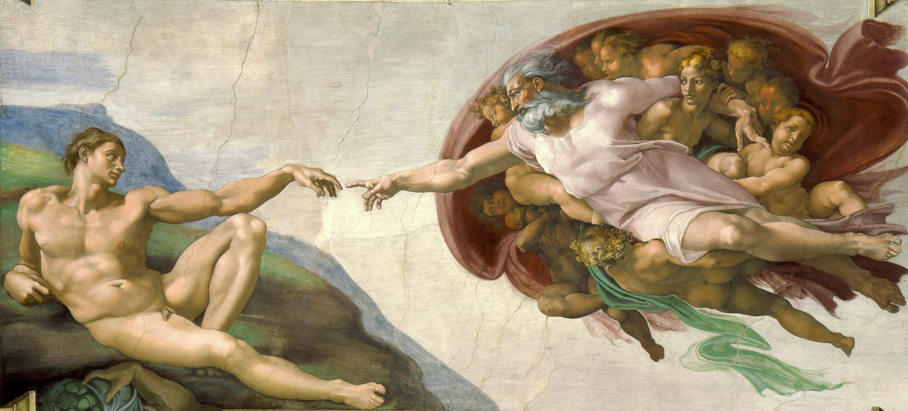

# El onanismo tecnológico de la humanidad

> El espejo narcisista del progreso moderno

La humanidad ha transformado la innovación en un acto de autocomplacencia. Cada ola tecnológica se anuncia como progreso, pero repite un ciclo ancestral: sustituimos sistemas sin reconstruir sus cimientos. La automatización, la inteligencia artificial y la digitalización no son males en sí mismos, sino el reflejo de un error más profundo en nuestra naturaleza: la creencia de que podemos dominar todas las variables del mundo. Esa ilusión de control —la misma que Da Vinci plasmó en la Creación de Adán— es nuestro impulso creador y también nuestro fracaso constante. Porque el verdadero poder no está en controlar lo que nos rodea, sino en aprender a convivir con lo incontrolable y reconocer que el límite es parte de la creación.

Napster fue el primer espejo de este comportamiento, marcando también el inicio de la economía digital contemporánea basada en la desintermediación y el acceso masivo. Surgió en 1999 con una idea liberadora: compartir música entre iguales, sin intermediarios. Aquello que parecía democratizar la cultura acabó por desmantelar los cimientos que la sostenían. Las discográficas se hundieron, los músicos perdieron ingresos y el sistema no ofreció una alternativa justa. La innovación técnica se celebró, pero nadie se ocupó en rediseñar el valor del arte ni de cuidar su ecosistema. Napster no destruyó la música, destruyó la estructura que le daba vida. Fue el primer síntoma del onanismo tecnológico: crear por placer de crear, sin fecundar un futuro común.

Las redes sociales representaron el segundo acto de esta dinámica. Nacieron con una promesa luminosa: conectar al mundo, unir culturas, amplificar voces. Sin embargo, esa conexión se transformó en un gran espejo. Lo que empezó como comunicación se convirtió en onanismo; el yo se volvió producto, la atención, moneda. Las plataformas comprendieron que la estimulación constante era más rentable que la reflexión, y el pensamiento fue reemplazado por la inmediatez. El debate público se fragmentó, la empatía se diluyó, y la política se volvió espectáculo. Las redes no nos unieron: nos devolvieron una imagen distorsionada de nosotros mismos. Así nació el onanismo digital, una masturbación colectiva de identidad que alimenta el vacío con su propio reflejo.

Tras la saturación del yo y la atención en las redes, la inteligencia artificial emerge como el clímax de este proceso, continuando el mismo impulso narcisista hacia la automatización y el control absoluto. Promete liberarnos del trabajo mecánico, pero en su aplicación inmediata repite el patrón: automatizar primero, reflexionar después. La máquina se convierte en espejo de nuestra razón, y su perfección matemática refuerza la fantasía de control que siempre nos ha seducido. Lo inquietante no es que la IA sustituya tareas humanas, sino que empiece a definir el sentido mismo de lo que es ser humano. En lugar de usarla como herramienta para ampliar la conciencia, la convertimos en un reflejo que nos devuelve nuestra propia imagen, solo que más eficiente y menos consciente.

El sistema financiero encarna otra forma de onanismo aún más peligrosa. En lugar de servir al desarrollo, se ha convertido en un circuito cerrado de emisión y especulación, donde los flujos de capital giran entre los mismos actores generando riqueza sin producción. Es la masturbación del dinero: movimiento perpetuo sin creación de valor real, una ilusión de crecimiento sostenida por el deseo de poder. Este fenómeno comparte la misma raíz que el tecnológico: la adoración del control, la creencia de que lo cuantificable es sinónimo de lo valioso.

El patrón se repite: cada avance técnico, económico o social se convierte en un espejo narcisista. No fecundamos el futuro, lo consumimos. No planificamos el mañana, lo sacrificamos por la inmediatez del presente. El onanismo tecnológico —y su versión económica— son expresiones de una humanidad que aún no ha aprendido a crear sin destruir.

Romper este ciclo no significa renunciar al progreso, sino redefinir su propósito. No basta con regular la tecnología; es necesario repensar el horizonte de lo humano. La innovación debe volver a medirse por su capacidad de generar sentido, no solo eficiencia. La educación debe reconciliar la técnica con la filosofía, la ciencia con la ética, la invención con la empatía. Debemos aprender a diseñar sin querer dominar, a crear sin necesidad de poseer.

Romper el onanismo tecnológico es recuperar la fertilidad de la creación: dejar de mirarnos en el espejo y comenzar a sembrar. Porque solo cuando comprendamos que el límite no es una derrota, sino la condición misma de la vida, la inteligencia —artificial o humana— podrá dejar de imitar y empezar a imaginar.

---

