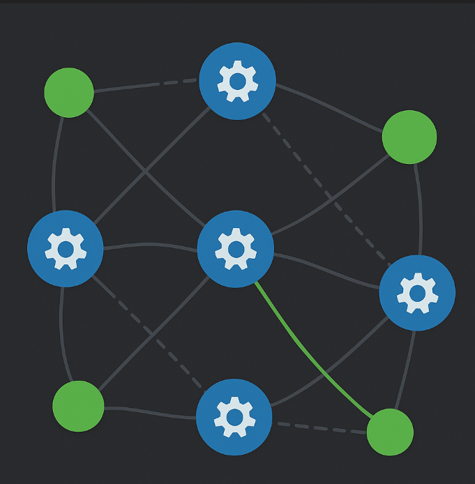
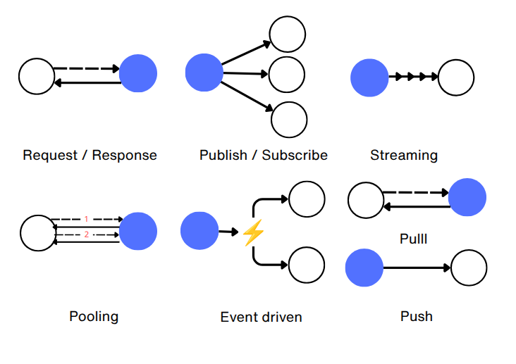

# Fundamentos de redes de computadoras y comunicación entre nodos

🌐 Como visión inicial, conviene resumir qué son las redes de nodos, para luego centrarnos en las redes P2P, introduciendo sus características principales.

En el contexto de internet, en el estudio de las [redes de computadoras](https://es.wikipedia.org/wiki/Red_de_computadoras) (dentro de la [ciencia de redes](https://es.wikipedia.org/wiki/Ciencia_de_redes)), existen dispositivos que son [nodos](https://es.wikipedia.org/wiki/Nodo_(inform%C3%A1tica)), es decir, pueden enviar y recibir información, y gracias a que disponen de una dirección pública, como la [IP](https://es.wikipedia.org/wiki/Protocolo_de_Internet), generalmente en un [nombre de dominio](https://es.wikipedia.org/wiki/Nombre_de_dominio) registrado en un [DNS](https://es.wikipedia.org/wiki/Sistema_de_nombres_de_dominio), pueden conocerse; o pueden comunicarse sin conocerse en una [difusión amplia](https://es.wikipedia.org/wiki/Difusi%C3%B3n_amplia).

> Debido a la limitada cantidad de direcciones IPv4, lo normal es que muchos de estos nodos, que acceden mediante un [ISP](https://es.wikipedia.org/wiki/Proveedor_de_servicios_de_internet), solo puedan usar su IP para hacer peticiones-respuestas, pero no para recibir conexiones entrantes, ya que están detrás de un [CGNAT](https://es.wikipedia.org/wiki/Carrier_Grade_NAT).

Algunos de esos nodos actúan como [host](https://es.wikipedia.org/wiki/Host) o anfitriones de servicios, y cuando es continuado, se denominan [servidores](https://es.wikipedia.org/wiki/Servidor) que suelen estar en [centros de datos](https://es.wikipedia.org/wiki/Centro_de_procesamiento_de_datos).

> 💡O en tu propio hogar o negocio si decides participar en una red lo mas descentralizada posible.

⚠️ Es importante no confundir un host con un dominio. Un host es un dispositivo o servidor que ejecuta servicios y aplicaciones en la red, mientras que un dominio es simplemente un nombre legible (por ejemplo, ejemplo.com) registrado en el DNS para facilitar el acceso. El dominio suele apuntar a la dirección IP del host y, en muchos casos, el acceso se gestiona a través de un proxy inverso que enruta las peticiones al servicio adecuado dentro del host, o incluso a múltiples hosts o clústeres distribuidos.

En los servidores se alojan los [servicios](https://es.wikipedia.org/wiki/Daemon_(inform%C3%A1tica)), compuestos por [aplicaciones](https://es.wikipedia.org/wiki/Aplicaci%C3%B3n_inform%C3%A1tica) y [componentes](https://es.wikipedia.org/wiki/Componente_de_software) contenidos en [servidores de aplicaciones](https://es.wikipedia.org/wiki/Servidor_de_aplicaciones), que implementan funciones específicas para atender peticiones de otros nodos en la red.

Los servidores de aplicaciones han evolucionado desde contenedores pesados y modulares hasta aplicaciones autocontenidas y, finalmente, binarios independientes, reduciendo la dependencia del entorno de ejecución.

Estos servicios se pueden ofrecer a clientes bajo términos de licencia en la nube, siguiendo modelos como [SaaS (Software as a Service)](https://es.wikipedia.org/wiki/Software_como_servicio), o mediante despliegue [On Premise](https://en.wikipedia.org/wiki/On-premises_software) en la infraestructura del cliente.

Las aplicaciones pueden seguir arquitecturas de [microservicios](https://es.wikipedia.org/wiki/Arquitectura_de_microservicios), ser [SPAs](https://en.wikipedia.org/wiki/Single-page_application) siguiendo el patrón [BFF](https://bff-patterns.com/), [dApps](https://es.wikipedia.org/wiki/Aplicaci%C3%B3n_descentralizada), [gateways](https://es.wikipedia.org/wiki/Puerta_de_enlace), [proxies](https://es.wikipedia.org/wiki/Servidor_proxy), [VPNs](https://es.wikipedia.org/wiki/Red_privada_virtual), [APIs REST](https://es.wikipedia.org/wiki/Transferencia_de_Estado_Representacional), servidores [GraphQL](https://es.wikipedia.org/wiki/GraphQL), servicios RPC (usando formatos de serialización como JSON, XML, o Protocol Buffers), [servicios de mensajería](https://es.wikipedia.org/wiki/Mensajer%C3%ADa_instant%C3%A1nea), sistemas de [autorización](https://es.wikipedia.org/wiki/OAuth), [orquestadores de tareas](https://es.wikipedia.org/wiki/Motor_de_flujo_de_trabajo), nodos P2P, [indexadores de blockchain](https://www.alchemy.com/overviews/blockchain-indexer) o servicios de almacenamiento distribuido como IPFS, entre otros.

Estos servidores se ejecutan sobre un [sistema operativo](https://es.wikipedia.org/wiki/Sistema_operativo), utilizando uno o varios [puertos](https://es.wikipedia.org/wiki/Puerto_de_red) locales para abrir [sockets](https://es.wikipedia.org/wiki/Socket_de_Internet) con el resto de nodos para establecer comunicación.

💬 La comunicación se realiza a través de protocolos organizados en niveles según el modelo [OSI](https://es.wikipedia.org/wiki/Modelo_OSI). En la capa de aplicación encontramos protocolos como [HTTP](https://en.wikipedia.org/wiki/HTTP) (en sus versiones HTTP/1.1 con conexiones persistentes, HTTP/2 con multiplexación de streams, y HTTP/3 sobre QUIC para menor latencia), [gRPC](https://es.wikipedia.org/wiki/GRPC), [JSON-RPC](https://en.wikipedia.org/wiki/JSON-RPC), [WebSocket](https://es.wikipedia.org/wiki/WebSocket) o [MQTT](https://en.wikipedia.org/wiki/MQTT), que pueden operar sobre protocolos de seguridad como [TLS](https://es.wikipedia.org/wiki/Seguridad_de_la_capa_de_transporte). Estos, a su vez, utilizan protocolos de transporte como [TCP](https://es.wikipedia.org/wiki/Protocolo_de_control_de_transmisi%C3%B3n) para conexiones confiables, [UDP](https://es.wikipedia.org/wiki/Protocolo_de_datagramas_de_usuario) para transmisiones rápidas sin garantías, o [QUIC](https://es.wikipedia.org/wiki/QUIC), un protocolo moderno basado en UDP que combina confiabilidad y velocidad. Finalmente, todo se encapsula en paquetes IP ([IPv4](https://es.wikipedia.org/wiki/IPv4)/[IPv6](https://es.wikipedia.org/wiki/IPv6)) enrutados por la red física.

La red física tiene una [topología física](https://es.wikipedia.org/wiki/Topolog%C3%ADa_de_red) que puede ser de estrella, bus, anillo, malla, árbol o híbrida. Aunque podríamos generalizar que la topología predominante en Internet es una malla parcial, lo realmente importante es que los nodos pueden interconectarse entre sí. Cuando la conexión directa no es posible (por routers, firewalls o CGNAT), existen técnicas como [NAT traversal](https://es.wikipedia.org/wiki/NAT_traversal) y [relay](https://en.wikipedia.org/wiki/Traversal_Using_Relays_around_NAT) para facilitar la comunicación.

Los protocolos de comunicación siguen diferentes estilos de interacción:

* **Procedural ([RPC - Remote Procedure Call](https://en.wikipedia.org/wiki/Remote_procedure_call))**: Permite llamar funciones remotas como si fueran locales, abstrayendo la comunicación de red. El proceso implica *serialización* (marshalling) de argumentos para transmitirlos, ejecución remota, y *deserialización* (unmarshalling) del resultado. Existen implementaciones **síncronas** (el cliente espera bloqueado) y **asíncronas** (el cliente continúa ejecutando). Protocolos históricos incluyen ONC RPC y DCE/RPC; protocolos web incluyen XML-RPC y SOAP (basados en XML); y protocolos modernos como JSON-RPC (ligero, popular en blockchain) y gRPC (alto rendimiento con Protocol Buffers sobre HTTP/2, ideal para microservicios).

* **Orientado a recursos (REST)**: Las APIs REST sobre HTTP utilizan métodos estándar (GET, POST, PUT, DELETE) para manipular recursos identificados por URLs.

* **Declarativo (GraphQL)**: El cliente declara mediante queries qué información necesita, y el motor del API procesa la respuesta, evitando over-fetching y under-fetching.

Además, se emplean diversos [patrones de comunicación de mensajes](https://en.wikipedia.org/wiki/Messaging_pattern):

Y si los describimos son:

* [Request/Response](https://en.wikipedia.org/wiki/Request%E2%80%93response): un nodo, pide y otro responde, como puede ser en HTTP o el resto de protocolos de aplicación.
* [Publish/Subscribe](https://en.wikipedia.org/wiki/Publish%E2%80%93subscribe_pattern): ideal para peticiones asíncronas, un nodo publica, otros suscritos reciben como puede ser [MQTT](https://en.wikipedia.org/wiki/MQTT).
* Streaming: datos enviados continuamente, como puede ser [RTSP](https://es.wikipedia.org/wiki/Protocolo_de_transmisi%C3%B3n_en_tiempo_real), [WebRTC](https://es.wikipedia.org/wiki/WebRTC) o [SRT](https://en.wikipedia.org/wiki/Secure_Reliable_Transport).
* [Polling](https://es.wikipedia.org/wiki/Polling): el cliente consulta periódicamente si hay datos.
* [Event-driven](https://en.wikipedia.org/wiki/Event-driven_architecture): los datos se envían como reacción a eventos.
* Pull / Push: donde en el modelo pull, el nodo emisor transmite la carga útil (payload) solo cuando otro nodo la solicita. En cambio, en push, el emisor envía la carga útil de forma proactiva, sin solicitud previa. Esto no debe confundirse con la topología cliente-servidor, la asincronía en las respuestas, ni con el simple hecho de que siempre haya transmisión de datos en la capa de transporte; nos referimos específicamente a cómo se gestiona la entrega de la carga útil.
* Y otros muchos más...

📨 Sobre la comunicación del nodo, si puede enviar y además recibir un mensaje, se le considera [doble o duplex](https://es.wikipedia.org/wiki/D%C3%BAplex_(telecomunicaciones)), y además si es simultaneo Full-duplex, si no puede ser al mismo tiempo Half-duplex y si es en un único sentido Simplex.

Mensaje que se considera la carga útil ([payload](https://es.wikipedia.org/wiki/Carga_%C3%BAtil_(inform%C3%A1tica))) de la comunicación porque aunque en el [Handshake](https://es.wikipedia.org/wiki/Establecimiento_de_comunicaci%C3%B3n) hay mucha información transmitida, no es el propósito del intercambio.

🫱🏻‍🫲🏽 Además, un conjunto de nodos puede organizarse para ejecutar funciones específicas mediante [computación distribuida](https://es.wikipedia.org/wiki/Computaci%C3%B3n_distribuida). Esta abarca distintos modelos: el modelo cliente-servidor con coordinación central; los [clústers](https://es.wikipedia.org/wiki/Cl%C3%BAster_de_computadoras) —donde los nodos cooperan como un único sistema lógico, usualmente con coordinación central y, en muchos casos, compartiendo estado o almacenamiento—; el [grid computing](https://es.wikipedia.org/wiki/Computaci%C3%B3n_en_malla), donde varios nodos colaboran de forma coordinada para resolver tareas (pudiendo ser centralizado o descentralizado según el diseño); el [edge computing](https://en.wikipedia.org/wiki/Edge_computing), que acerca el procesamiento al nodo cliente para reducir latencia; y finalmente, las redes peer-to-peer (P2P), cuando no se requiere coordinación centralizada.

Estos nodos organizados pueden estar **tightly coupled** (fuertemente acoplados), con memoria o estado compartido y baja latencia; o **loosely coupled** (débilmente acoplados), siendo más independientes, sin memoria compartida directa, con mayor latencia y mayor heterogeneidad.

La forma en que estos nodos se conectan para comunicarse sigue una estructura denominada [topología lógica](https://techriders.tajamar.es/topologia-fisica-vs-topologia-logica/). Las topologías lógicas más comunes incluyen: Cliente-Servidor o Cliente-Servidor Distribuido (en redes centralizadas), P2P (en redes descentralizadas), Multicast/Broadcast (en redes de [difusión](https://es.wikipedia.org/wiki/Difusi%C3%B3n_amplia) o streaming), anillo, entre otras.

> ∞ Adicionalmente, las aplicaciones pueden seguir diversos [estilos arquitectónicos](https://reactiveprogramming.io/blog/es/estilos-arquitectonicos/monolitico#) y [patrones de diseño](https://es.wikipedia.org/wiki/Patr%C3%B3n_de_dise%C3%B1o), adaptándose a [protocolos](https://www.imagar.com/blog-desarrollo-web/que-es-el-protocolo-en-informatica/) específicos como los que [abundan en internet](https://es.wikipedia.org/wiki/Familia_de_protocolos_de_internet). Sin embargo, profundizar en todos estos aspectos excedería el alcance de este documento 🤯

---
