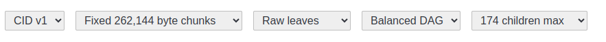
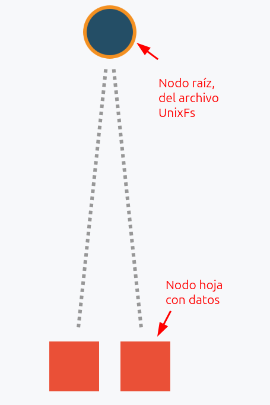
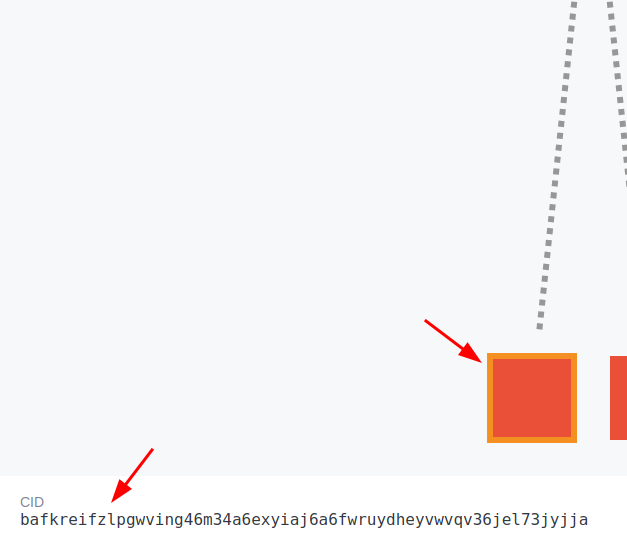
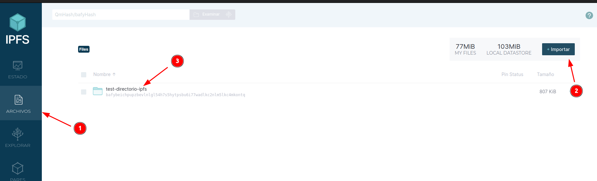
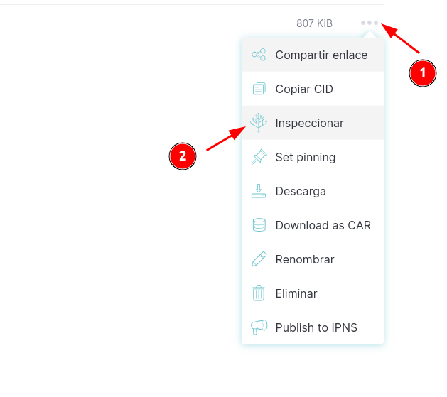
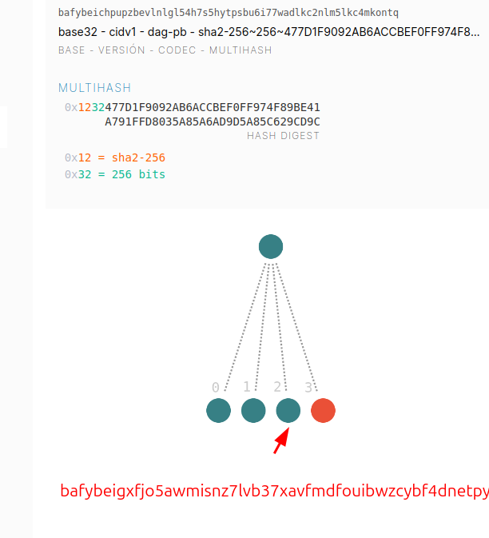
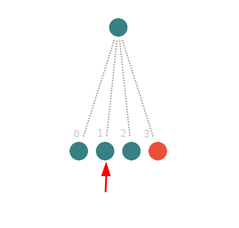
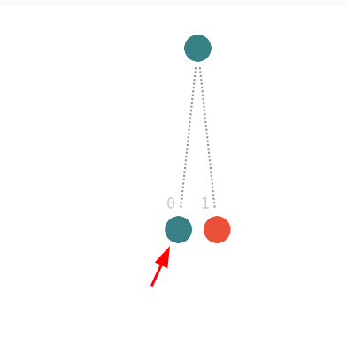

# Práctica para entender el modelo IPLD

🛠️ En esta práctica:

* Usaremos los [siguientes archivos y directorios](./assets/ejemplo.zip) a modo ejemplo.
* Vamos a conocer DAG Builder <https://dag.ipfs.tech/> y CID Inspector <https://cid.ipfs.tech/> que son aplicaciones Web que ayudarán a practicar con los conceptos de merkle-dag y CID.
* Necesitaremos instalar [IPFS Desktop](https://docs.ipfs.tech/install/ipfs-desktop/) que nos permitirá probar IPFS en una interfaz gráfica sin terminal.
  > Veremos más a fondo esta aplicación, inicialmente solo la instalaremos para entender IPLD visualizando la representación de un directorio porque DAG Builder no lo permite.

---

Debemos ir primero a <https://dag.ipfs.tech/>.

Esta aplicación Web permite simular cómo se fragmentaría un archivo en diferentes bloques cuando es agregado en una implementación de IPFS.

Los bloques o nodos, la estructura de árbol Merkle que forman, se puede concretar que tiene estos niveles, que te explico a continuación:

* Root node: nodo raíz (archivo o directorio principal) siempre será codificado en formato `dag-pb` y dentro contendrá serializado la estructura UnixFs que contiene metadatos como tipo (File, Directory, etc.), realmente no contiene datos binarios.

  > `pb` Protocol Buffers, es un formato binario de serialización de datos creado por Google.

* Internal nodes: nodos intermedios que referencian a nodos hoja si fuera necesario. Pueden ser nodos intermedios `dag-pb` de sub-directorios o simplemente los nodos intermedios necesarios cuando se ha superado la cantidad máxima de nodos hoja (`children max`).

  > En este ejemplo no los veremos porque ni hay subdirectorios ni una cantidad excesiva de hijos.

* Leaf nodes: nodos hoja, contienen los datos crudos y son nodos finales.

En la cabecera de la aplicación Web de pruebas, aparecen los parámetros que se usan para fragmentar un archivo cuando es agregado, que de izquierda a derecha, te resumo a continuación:

* [Versión de CID](https://docs.ipfs.tech/concepts/content-addressing/#cid-versions). El propio código CID, la forma de generarse tiene diferentes versiones, donde actualmente la 0 suele ser por defecto en los clientes y la 1 es la más reciente y mejorada.
* Criterio para fragmentar, que pueden ser 2 opciones fijo (fixed) o usando el algoritmo Rabin. Usando un algoritmo [Karp-Rabin](https://es.wikipedia.org/wiki/Algoritmo_Karp-Rabin), es el algoritmo de chunking que detecta patrones y produce fragmentos de tamaño variable o puede ser fijo por un tamaño concreto de bytes.
* Codificación de los nodos hoja, que pueden ser solo datos (raw data) o con de metadatos de objetos UnixFX. Realmente si el nodo representa la entrada del directorio o un archivo, siendo la codificación `dag-pb`, siempre contiene metadatos de objeto UnixFs, esto aplica solo para nodos que realmente solo son datos, para indicar si incluir estos metadatos de UnixFs, quizás por consistencia o herramientas que lo necesiten.
* Cómo es el layaout del DAG, siendo balanced (equilibrado), bueno para acceso aleatorio o trickle (lineal) optimizado para streaming. La opción flat (plano), es para ver la representación sin nodos, realmente no se usa al agregar un contenido.
* El nº máximo de nodos que se pueden referenciar a un nodo padre, si el valor supera, se crearía nodos intermedios. Es una forma de controlar si tener más o menos propagación del contenido, menos propagación mejor rendimiento, mas propagación mas reutilización y deduplicación.

Si quieres probar cómo genera en concreto una implementación IPFS el árbol de nodos para CID v1, a continuación, te muestro cómo:

Si probamos con el archivo de texto de ejemplo <test1-ipfs.txt>, vemos lo siguiente:

En la raíz está el bloque codificado como `dag-pb`con metadato UnixFs del archivo <test1-ipfs.txt>.

Luego se fragmenta en 2 nodos hojas de datos binarios.

En cada nodo, sea raíz, intermedios (en su caso) u hoja se identifica con un CID, y si haces clic en el valor del CID, accederás a la otra utilidad de CID inspector <https://cid.ipfs.tech/>.

> 🛠️ En CID inspector, si quieres profundizar, dispones del enlace de documentación, especificación y tutorial, que podrás acceder, aunque en el siguiente cuaderno de [jugando con CID](./ipfs_cid_playground.ipynb) intento explicarlo.

**Aclaraciones**.

El archivo se ha fragmentado, no solo porque facilita replicar el contenido en diferentes nodos, lo cierto es que fragmentar siempre es más optimo para distribuir archivos en una red, como puede ser internet. Puedes leer el artículo de `Trust Jamin` al respecto <https://uploadcare.com/blog/handling-large-file-uploads/>.

> Fragmentar archivos en IPFS no solo permite descargas paralelas y deduplicación (por ejemplo, cuando el mismo archivo está presente en varias carpetas), sino que también facilita que un nodo descargue únicamente los bloques (CIDs) que aún no posee. Así, al actualizar un sitio web o un conjunto de datos grande, solo los bloques nuevos o modificados requieren ser transferidos, mientras que los bloques ya existentes pueden ser reutilizados, haciendo la distribución mucho más eficiente.

Como vimos en [jugando con árbol Merkle](../_misc/merkle_playground.ipynb) uno de los propósitos de crear esta estructura es facilitar la posterior Merkle proof en una red trustless. Realmente en IPFS no es para esto, se crea un árbol de Markle como estructura para direccionar el contenido.

IPFS aplica una optimización si un archivo cabe completamente en un bloque (por defecto ≤ 256 KiB), se guarda como un solo nodo raw (datos binarios sin envoltura dag-pb). Esto ahorra espacio y procesamiento.

---

La siguiente prueba interesante es subiendo el directorio <test-directorio-ipfs> en IPFS Desktop.

Iremos a inspeccionar.

Aquí podremos examinar el árbol...no es tan intuitivo como DAG Builder, pero nos servirá para navegar en los diferentes nodos.

> Los nodos de color verde son otros directorios o archivos y los nodos rojos, los datos binarios finales.

Sin querer entrar en más detalle, lo interesante es este nodo que es del archivo <test1-ipfs.txt>.

Si, entramos en otro nodo que representa un directorio:

Existe el mismo archivo <test1-ipfs.txt>, en dos directorios diferentes:

Podemos probar como no se repite el contenido, el CID es el mismo en ambos casos, por lo tanto, probamos lo que se conoce como deduplicación. Este hecho es por lo que se conoce IPLD como un Merkle-DAG, porque un mismo nodo hijo puede estar en diferentes nodos intermedios padre.
