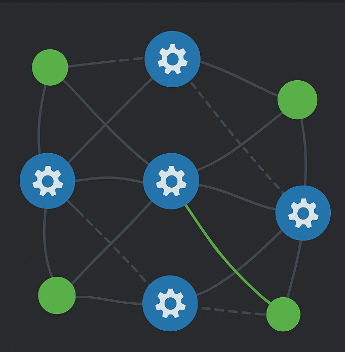
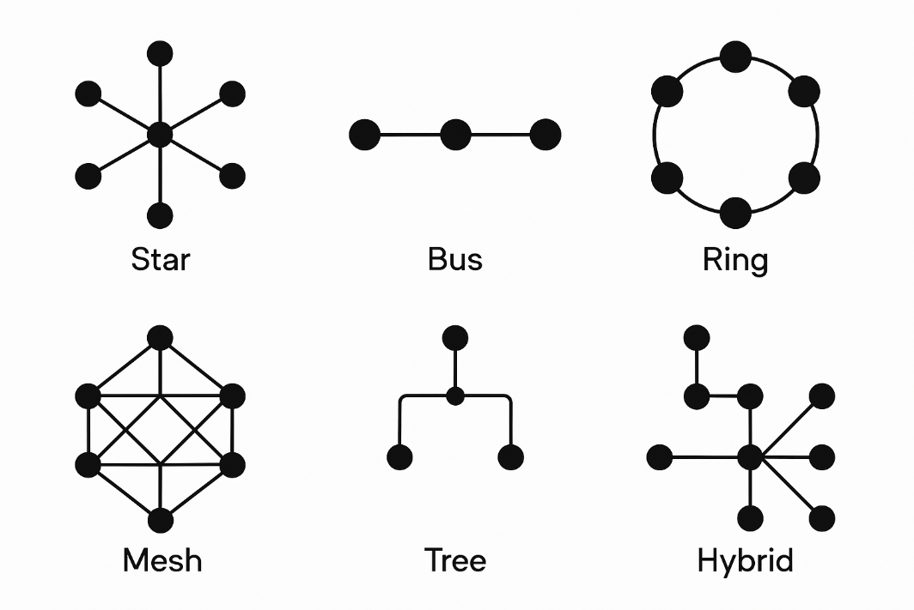
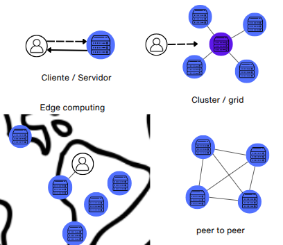
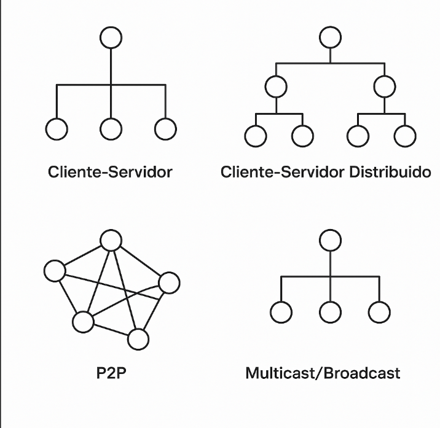
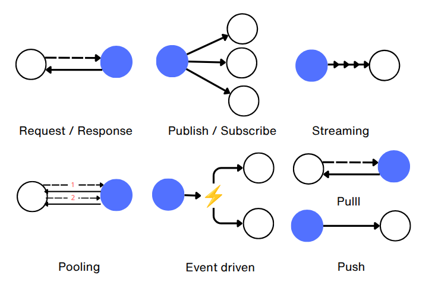
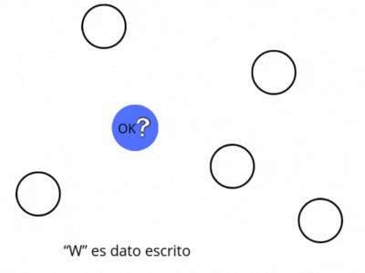
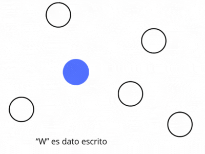
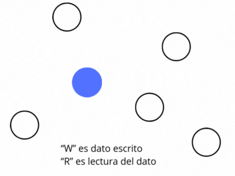
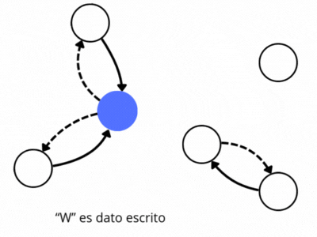

# Introducción a redes peer to peer (p2p)

Como visión inicial, conviene resumir qué son las redes de nodos, para luego centrarnos en las redes P2P, introduciendo sus características principales.

En el contexto de internet, en el estudio de las [redes de computadoras](https://es.wikipedia.org/wiki/Red_de_computadoras) (dentro de la [ciencia de redes](https://es.wikipedia.org/wiki/Ciencia_de_redes)), existen dispositivos que son [nodos](https://es.wikipedia.org/wiki/Nodo_(inform%C3%A1tica)), es decir, pueden enviar y recibir información, gracias a que disponen de una dirección pública, como la IP y generalmente un nombre de dominio registrado en un DNS.

> Debido a la limitada cantidad de direcciones IPv4, lo normal es que muchos de estos nodos, que acceden mediante un [ISP](https://es.wikipedia.org/wiki/Proveedor_de_servicios_de_internet), solo puedan usar su IP para hacer peticiones-respuestas, pero no para recibir conexiones entrantes, ya que están detrás de un [CGNAT](https://es.wikipedia.org/wiki/Carrier_Grade_NAT).

Algunos de esos nodos actúan como [host](https://es.wikipedia.org/wiki/Host) o anfitriones de servicios, y cuando es de forma continuada, se denominan [servidores](https://es.wikipedia.org/wiki/Servidor) que suelen estar en [centros de datos](https://es.wikipedia.org/wiki/Centro_de_procesamiento_de_datos).

En los servidores se alojan los servicios, compuestos por aplicaciones y componentes que implementan funciones específicas para atender peticiones de otros nodos en la red.

Servicios, que se pueden ofrecer a clientes, bajo términos de licencia, en lo que se denomina la nube y que pueden seguir un modelo como [SaaS (Software as a Service)](https://es.wikipedia.org/wiki/Software_como_servicio), o puede ser [On Premise](https://en.wikipedia.org/wiki/On-premises_software) si se entrega para la infraestructura cliente.

Y aplicaciones que pueden seguir una arquitectura de [microservicios](https://es.wikipedia.org/wiki/Arquitectura_de_microservicios), o ser una [SPA](https://en.wikipedia.org/wiki/Single-page_application) siguiendo un patrón [BFF](https://bff-patterns.com/), o una [dApp](https://es.wikipedia.org/wiki/Aplicaci%C3%B3n_descentralizada),o un [gateway](https://es.wikipedia.org/wiki/Puerta_de_enlace), [proxy](https://es.wikipedia.org/wiki/Servidor_proxy), VPN, o API REST, servidor [GraphQL](https://es.wikipedia.org/wiki/GraphQL), o un servicio de mensajería, sistema de autenticación, orquestador de tareas, o un nodo P2P, [un indexador de blockchain](https://www.alchemy.com/overviews/blockchain-indexer) o incluso un servicio de almacenamiento distribuido como IPFS, etc...

Estos servidores se ejecutan sobre un sistema operativo, utilizando uno o varios puertos locales para abrir [sockets](https://es.wikipedia.org/wiki/Socket_de_Internet) con el resto de nodos.

Comunicación a través de protocolos, según [OSI](https://es.wikipedia.org/wiki/Modelo_OSI), de aplicación, como HTTP, gRPC, JSON-RPC, WebSocket o MQTT, etc, que puede operar sobre otro protocolo de aplicación de seguridad como [TLS](https://es.wikipedia.org/wiki/Seguridad_de_la_capa_de_transporte) y que en general operan sobre servicios de transporte como TCP para conexiones confiables o UDP para transmisiones rápidas sin garantías o QUIC un protocolo actual que usa UDP, que es confiable y rápido. Estos, a su vez, se encapsulan en paquetes IP (IPv4/IPv6), que son enrutados por la red física.

Red física que tiene una topología, denominada [topología física](https://es.wikipedia.org/wiki/Topolog%C3%ADa_de_red), que normalmente conocemos como de estrella, bus, anillo, malla, árbol o híbrida, etc:

Y quizás podemos generalizar que la topología física predominante en Internet es una malla parcial, pero eso no es relevante. Lo importante es que los nodos de una red pueden interconectarse entre sí, y si no es posible, existen técnicas como NAT traversal y [relay](https://en.wikipedia.org/wiki/Traversal_Using_Relays_around_NAT) para facilitar la conexión a través de routers, cortafuegos o CGNAT .

Además vemos que un conjunto de nodos puede organizarse para ejecutar funciones específicas, como ocurre en la [computación distribuida](https://es.wikipedia.org/wiki/Computaci%C3%B3n_distribuida). Esta puede requerir coordinación central, como en el modelo cliente-servidor, en un clúster o en grid computing, donde recursos heterogéneos colaboran bajo una gestión común. También existe el [edge computing](https://en.wikipedia.org/wiki/Edge_computing), entre otros, que acerca el procesamiento al nodo cliente para reducir latencia. Y si no requiere coordinación centralizada, el modelo puede ser descentralizado, como en las redes peer-to-peer (P2P).

Y estos nodos organizados, se conectan de forma lógica, donde su estructura o enlace se conoce como topología lógica e igualmente tenemos de nuevo, como topología, Cliente-Servidor o Cliente-Servidor Distribuido, en redes centralizadas, P2P (peer-to-peer) en redes descentralizadas o Multicast/broadcast en redes de difusión o streaming, etc...

Sobre cómo fluye la información en el enlace, es lo que se conoce como [patrones de comunicación de mensajes](https://en.wikipedia.org/wiki/Messaging_pattern), donde podemos ver algunos:

Si los describimos son:

* [Request/Response](https://en.wikipedia.org/wiki/Request%E2%80%93response): un nodo, pide y otro responde, como puede ser en HTTP o el resto de protocolos de aplicación.
* [Publish/Subscribe](https://en.wikipedia.org/wiki/Publish%E2%80%93subscribe_pattern): un nodo publica, otros suscritos reciben como puede ser [MQTT](https://en.wikipedia.org/wiki/MQTT).
* Streaming: datos enviados continuamente, como puede ser [RTSP](https://es.wikipedia.org/wiki/Protocolo_de_transmisi%C3%B3n_en_tiempo_real), [WebRTC](https://es.wikipedia.org/wiki/WebRTC) o [SRT](https://en.wikipedia.org/wiki/Secure_Reliable_Transport).
* [Polling](https://es.wikipedia.org/wiki/Polling): el cliente consulta periódicamente si hay datos.
* [Event-driven](https://en.wikipedia.org/wiki/Event-driven_architecture): los datos se envían como reacción a eventos.
* [Push / pull](https://es.wikipedia.org/wiki/Tecnolog%C3%ADa_push): Si entendemos a un nodo como cliente y otro como servidor, en pull, el cliente receptor inicia la solicitud de datos; Push, el servidor emisor envía datos.

Y otros muchos más...

## Redes entre pares - peer-to-peer o p2p

En las redes entre pares, [peer-to-peer o p2p](https://academy.bit2me.com/que-es-una-red-p2p/), todos los nodos funcionan como iguales.

Suelen funcionar mediante un protocolo, implementado en un programa que se ejecuta como servicio en cada nodo, permitiendo la interacción entre nodos según las reglas definidas por el protocolo.

Si lo vemos de forma menos abstracta, podemos ver el ejemplo de BitTorrent, donde cada persona instala un programa en su PC, que sería un nodo. Cuando quieres un archivo, tu programa busca otros usuarios (otros nodos) que ya tienen partes de ese archivo para descargar varias partes a la vez.
Al mismo tiempo, tú también compartes las partes que ya tienes con otros, sin depender de un servidor central.

Que las redes p2p sean descentralizadas, hacen que sean muy relevantes en la web3, pero en realidad se combina con distintas soluciones, que he intentado resumir con anterioridad, según su necesidad, incluso tomando modelos centralizados si es necesario.

> En esta definición, no tenemos que confundir redes p2p con blockchain, ya que no es lo mismo y spoiler, blockchain es una estructura de datos diseñada para operar como libro contable distribuido (ledger) en redes P2P, donde existe un consenso, es decir, que opere en una red p2p, no implica que sean lo mismo, simplemente blockchain opera sobre una red p2p y suele confundirse.

### Características de una red p2p

Existen propiedades o cualidades que definen una red p2p y que son elegidas según su propósito, que podemos enumerar a continuación como:

#### Modelo de confianza

Define cómo y en quién confían los nodos para interactuar, validar información y alcanzar consenso. Determina si la red requiere identidad, reputación o prueba criptográfica para garantizar seguridad y funcionamiento correcto. Puede ser normalmente:

* Sin confianza (Trustless), donde los nodos interactúan sabiendo que no pueden confiar entre sí y gracias a mecanismos criptográficos y reglas de consenso verificables pueden hacerlo. Ejemplos, Bitcoin, Ethereum, IPFS + FileCoin.
* Confiable o basado en confianza (Trusted), los nodos interactúan basándose en relaciones de confianza previa, donde existe identidad verificada o autoridad central parcial que ayuda a autenticar al nodo, reduciendo la necesidad de mecanismos criptográficos o consenso complejo. Por ejemplo, redes corporativas o Hyperledger Fabric con Proof of Authority (PoA).
* Parcialmente confiable (Partially trusted), combina nodos confiables con nodos anónimos o no verificados, aplicando confianza selectiva. Usa mecanismos criptográficos y validación, pero permite ciertos roles privilegiados o relaciones basadas en confianza. Por ejemplo, Lightning Network (sobre Bitcoin):
* Confianza híbrida (Hybrid trust), combina modelos trustless y trusted, donde algunas funciones dependen de nodos confiables o autoridades, y otras se descentralizan mediante consenso y criptografía. Ejemplo Ripple, donde usa un conjunto confiable de nodos validadores (UNL), pero con comunicación P2P.

#### Modelo de autorización

Define quién puede participar y con qué permisos, lo cual influye en la resistencia a la censura, tolerancia a fallos y gobernanza. Puede ser normalmente:

* Pública, cualquier participante puede unirse y participar sin restricciones y es descentralizada y abierta a nuevos participantes.
* Privada, acceso limitado a entidades previamente autorizadas, suele tener un control centralizado dentro de una organización o grupo.
* Permisionada, participación permitida solo a nodos verificados y aprobados, donde combina descentralización con control de acceso.

  > Una red permisionada es una red privada que además define roles o permisos específicos.

* Consorcio, gobernada por un grupo seleccionado de entidades confiables.

  > Es un tipo de red privada, pero gestionada por un grupo de entidades (no una sola).

* Híbrida, mezcla características de modelos públicos y privados.

#### Grado de descentralización

Define cuánto control está distribuido entre los nodos de la red. Puede ser normalmente:

* Centralizadas (Centralized), control total por una entidad, son redes cliente-servidor P2P con controlador central.
* Parcialmente descentralizadas (Partially decentralized), varios nodos controlan la red, pero no todos. Ej: consorcios, supernodos, federaciones.
* Totalmente descentralizadas (Fully decentralized), todos los nodos tienen el mismo rol, sin jerarquía. Ej: Bitcoin, IPFS (sin bootstrap central), Gnutella.

Normalmente, un mayor grado de centralización suele buscar:

* Mejor rendimiento (menor latencia y mayor throughput).

  > throughput es la cantidad de datos o transacciones procesadas por unidad de tiempo en una red. En redes P2P, suele medirse en transacciones por segundo (TPS) o bloques por segundo. Cuanto mayor el throughput, mayor la capacidad de procesamiento de la red.

* Control más sencillo (gobernanza y actualizaciones).
* Seguridad operativa (menos superficie de ataque si los nodos son confiables).

  > Mas seguridad operativa, pero menor descentralización y menor resilencia al existir punto único de falla.

* Menor complejidad de consenso (menos nodos que coordinar).

### Problemas en redes p2p

Las redes p2p vienen a resolver principalmente el problema de la centralización y el punto único de fallo y para ello deben comunicarse entre iguales entre ellos siguiendo el protocolo, pero esto también tiene ciertos desafíos que se deben considerar y que podemos resumir como:

#### Problemas de seguridad

Una red p2p no está exento de problemas de seguridad, sobre todo si es pública, por lo tanto, se debe considerar que puede existir:

* Fragmentación de la red (network partitioning), donde los nodos están aislados en subgrupos, lo que impide una vista global coherente o sincronización entre ellos. Es sobre todo un problema físico de conectividad
* Estado paralelo de la red (forks o view divergence), donde pueden coexistir versiones distintas, es decir, un conjunto de nodos entienden que exista un estado concreto y otros otro diferente, aunque normalmente el consenso resuelve el problema. Es diferente a la fragmentación de la red, en este caso hay conectividad, no es problema de comunicación, sino de consenso.
* Ataques que puede recibir una red p2p, como [MITM (Man-in-the-Middle)](https://es.wikipedia.org/wiki/Ataque_de_intermediario), [Sybil](https://academy.bit2me.com/que-es-un-ataque-sybil/), [Eclipse](https://academy.bit2me.com/que-es-ataque-eclipse-eclipse-attack/), [DoS](https://academy.bit2me.com/que-son-ataques-dos/), [Erebus](https://academy.bit2me.com/que-es-ataque-erebus/) o [envenenamiento de DHT](https://www.semanticscholar.org/paper/Conducting-routing-table-poisoning-attack-in-DHT-Lin-Ma/3882e35b71bef5e8327574b3940279c7df3f3d8e), y aunque sobre todo se relaciona con blockchain, tenemos ataques como [Replay](https://academy.bit2me.com/que-es-un-ataque-replay/) o [del 51%](https://academy.bit2me.com/ataque-51-bitcoin/).

#### Problema de disponibilidad o rotación: Churn

Churn (o "rotación de nodos") se refiere al fenómeno en el que los nodos de una red P2P se unen, abandonan o fallan con frecuencia, afectando la estabilidad y el rendimiento de la red.

> Quizás es un problema de seguridad, pero lo menciono como categoría nueva.

Causas del Churn:

* Nodos dinámicos: Usuarios que apagan sus dispositivos (ej. laptops, móviles) o cierran aplicaciones P2P.
* Fallos aleatorios: Conexiones inestables, cortes de energía o crashes de software.
* Comportamiento egoísta: Nodos que abandonan la red después de descargar un archivo (problema común en *file-sharing*).
* Ataques: Nodos maliciosos que entran y salen para sabotear la red (ej. ataques Sybil).

### Clasificación principal de redes p2p

En base a las características iniciales con los problemas que pueden surgir, las redes p2p se clasifican en dos categorías, que también corresponden con su topología lógica —o, si se prefiere, con su modelo de red superpuesta (overlay network): estructuradas y no estructuradas.

En la topología estructurada, la conexión y posterior escritura o consulta entre nodos sigue un patrón definido y determinista, basado en el valor de los datos (en su hash), lo que permite búsquedas eficientes y un uso optimizado del almacenamiento, siendo especialmente adecuado para redes estables (bajo churn) donde los nodos permanecen disponibles con regularidad.

Para entender mejor una red estructurada, analizaremos el caso de las [DHT](https://es.wikipedia.org/wiki/Tabla_de_hash_distribuida) (tablas de hash distribuidas), como en [IPFS](pendiente), donde cada nodo mantiene una relación entre los datos (identificados por su hash) y las direcciones de los nodos responsables o más cercanos a esos datos, determinado mediante el cálculo de la distancia con XOR. Esto implica que en las redes estructuradas existe una correspondencia directa entre nodo, dirección y el contenido a buscar.

> Esta explicación la veremos más en detalle en [los procesos y mecanismos de las redes p2p](#procesos-y-mecanismos-de-las-redes-p2p).

Además de las DHT, existen otras redes estructuradas basadas en jerarquías, con topologías de árbol, anillo o grafo, muchas de las cuales han sido exploradas principalmente en el ámbito académico o en sistemas distribuidos tradicionales. En el contexto de la web3, donde priman la descentralización, la tolerancia a fallos y el direccionamiento por contenido, las DHT resultan más adecuadas y son, por ello, las más utilizadas en la práctica.

En las topologías no estructuradas, las conexiones entre nodos son aleatorias o sin un patrón definido, lo que las hace más adecuadas para consultas complejas y además es mas optimo para entornos inestables donde los nodos se conectan y desconectan con frecuencia (alto churn). Son redes más resilientes, pero al no existir una estructura lógica que relacione directamente el contenido con nodos específicos, las consultas deben propagarse entre múltiples nodos para localizar la información, aunque lo cierto es que permite consultas más complejas que las estructuradas.

**¿Cuando se usa una red no estructurada o estructurada?**

Depende principalmente del propósito de la red, definido inicialmente al establecer sus características. Por ejemplo, una red pública, con alto grado de descentralización y posiblemente alto churn, que requiera resiliencia, será no estructurada; mientras que una red más estable, con bajo churn, donde la eficiencia sea clave, optará por una topología estructurada.

**¿Existen soluciones mixtas de redes p2p no estructuradas y estructuradas?**

Sí, como veremos, una red p2p puede usar parte del protocolo de red estructurada, por ejemplo para el descubrimiento de nodos, y para el resto de casos ser realmente una red no estructurada.
Es decir, cada red implementa lo que mejor sirva para su propósito, y en general, no tiene que existir una doctrina fijada.

> 📌 Este resumen de redes p2p intenta generalizar y clasificar, pero no tenemos que olvidar que cada red tiene sus peculiaridades.

### Procesos y mecanismos de las redes p2p

En cualquier red p2p, sea no estructurada o estructurada, existen procesos o mecanismos esenciales para su funcionamiento, que forman parte de la implementación del protocolo.

A continuación, se describen los más relevantes, considerando que algunos aplican específicamente a redes no estructuradas y otros a estructuradas.

#### Conexión inicial de nodos (Bootstrapp)

Indistintamente si la red es estructurada o no estructurada, cuando un nodo se inicia por primera vez, en el arranque, conocido como bootstrap, se establece la conexión a otros nodos, denominados nodos semilla o [nodos bootstrap](https://en.wikipedia.org/wiki/Bootstrapping_node), que están normalmente preconfigurados en el propio programa del nodo.

Estos nodos semilla suelen suelen ser confiables y frecuentemente pertenecen a los fundadores o mantenedores del protocolo. A través de ellos, un nodo no solo puede establecer su primera conexión, sino también descubrir el resto de nodos de la red, proceso (descubrimiento de nodos) que describiremos a continuación...

Lo común usar nodos semilla, sobre todo en modelos descentralizados como la web3, pero también existen opciones como servidores de arranque (bootstrap servers), que son servidores centralizados o cachés que proporcionan direcciones de nodos activos o en redes locales mediante la difusión broadcast/multicast.

#### Descubrimiento de nodos (Node Discovery)

Es el proceso por el cual un nodo localiza los otros nodos con los que puede comunicarse o interactuar.

Inicialmente, el nodo parte de una lista de nodos conocidos, normalmente los nodos semilla, y el proceso consiste en consultar a esos nodos para descubrir otros nuevos y ampliar y actualizar así su red de relaciones.

Este proceso se repite periódicamente para refrescar el conocimiento de la red, adaptándose a caídas o cambios en los nodos.

También otra técnica adicional conocida como Peer Exchange (PEX) que se basa en el intercambio directo de información entre pares **ya conectados**, a diferencia del método de descubrimiento de nodos que implican consultar fuentes externas para obtener listas de nodos.

Este proceso depende de que sean redes no estructuradas o estructuradas, que es lo que veremos a continuación:

**Redes no estructuradas**.

En redes no estructuradas, el descubrimiento de nodos se realiza mediante comunicación directa o intercambio de listas de vecinos, sin reglas deterministas. Aunque lo describimos como un proceso aparte, en redes no estructuradas este proceso forma parte también del mecanismo de propagación de consultas.

**Redes estructuradas**.

En redes estructuradas, es imprescindible disponer de un mecanismo determinista que establezca con qué nodos debe relacionarse un nodo dado, asegurando que siempre se obtengan resultados consistentes y repetibles.

En primer lugar, a cada nodo se le asigna un identificador único (ID), y el proceso consiste en la consulta a otros nodos sobre los nodos "más cercanos" que conozcan respecto a su propio ID.

La "cercanía entre nodos", es la forma de hacer que siempre la consulta sea determinista, es decir, que siempre devuelva lo mismo, y se basa en la operación binario XOR, que si lo vemos en un ejemplo simple:

Si un nodo tiene el ID binario 1010 y otro el ID binario 1000, al realizar XOR entre ambos (1010 XOR 1000) se obtiene 0010, un resultado numéricamente bajo que indica una alta cercanía. Por el contrario, un resultado mayor señalaría una mayor distancia.

Esto aunque es una generalización, nos da una idea de lo que se busca, es tener un mecanismo para que un nodo dado, no se relacione con todos los nodos de la red, solo los que se pueda considerar "afines" y se basa en "la cercanía", que no deja de ser una operación simple para tener un mismo criterio.

#### Propagación de consultas (Query Propagation)

Es un proceso que solo afecta a redes no estructuradas, ya que en estructuradas se le conoce como Routing.

Es el proceso de difundir peticiones de consulta (Read) entre nodos para localizar información, es decir, un nodo recibe la pregunta y si no lo sabe, consulta a sus próximos nodos.

El descubrimiento entre nodos permite conocer a quién consultar, y la propagación usa ese conocimiento para difundir la petición. A veces, la propia consulta sirve para descubrir nodos y son procesos que se ejecutan a la vez.

#### Enrutamiento (Routing)

Ponemos como ejemplo la DHT (Distributed Hash Table), que es un registro diccionario, tipo clave/valor, que mantiene cada nodo para relacionar (enrutar) de forma determinista el dato (representado con el hash) con las direcciones de los nodos que lo guardan de forma parcial.

Como vimos en el descubrimiento de nodos, igualmente se busca que sea determinista y se basa en la cercanía de un ID de nodo con el hash del dato. Esto quiero decir, que un nodo cuando tenga que elegir el conjunto de nodos que propagará (conjunto por redundancia) usará este criterio determinado.

Si lo ovemos en un ejemplo, si el nodo actual tiene ID 1010 y busca el dato 1000, calcula 1010 XOR 1000 = 0010. Luego compara este valor con el XOR entre sus vecinos y el objetivo, eligiendo el más cercano (el de menor resultado).

#### Establecimiento de la conexión

Es el proceso mediante el cual un nodo inicia comunicación directa (por ejemplo, vía TCP o UDP) con otro nodo previamente descubierto o conocido.

Este proceso ocurre después del bootstrap y del descubrimiento de nodos, cuando el nodo necesita formar relaciones activas para intercambiar mensajes o participar en la red.

La conexión puede establecerse inicialmente para simplemente mantener presencia (por ejemplo, en una tabla de vecinos) o para preparar futuras transferencias de datos, pero no implica que la transferencia ocurra inmediatamente: el establecimiento y la transferencia son procesos independientes.

Este proceso puede incluir el uso de comunicación cifrada (TLS, Noise, etc.), así como técnicas de NAT traversal (como UDP hole punching) o el uso de relays cuando la comunicación directa no es posible.
Además, el establecimiento de conexión puede repetirse durante el tiempo de vida del nodo para refrescar vecinos, reconectar tras caídas, o adaptarse a cambios en la topología de red.

#### Transferencia de datos (Data Transfer)

La transferencia de datos en redes P2P es un proceso mayoritariamente de tipo pull, en el que un nodo ya conectado solicita y recibe fragmentos de información directamente desde otro nodo mediante peticiones específicas y validación de integridad (por hash o checksum), aunque algunos protocolos también permiten push controlado para escenarios como pub/sub o propagación proactiva.

#### Difusión de contenido

Es el proceso de replicar y distribuir datos (archivos, metadatos o bloques) hacia múltiples nodos, ya sea mediante mecanismos estructurados o no estructurados, independientemente del descubrimiento de nodos o el enrutamiento de consultas.

En redes no estructuradas: Similar a un broadcast o replicación epidémica.

En redes estructuradas: Más cercano a un almacenamiento distribuido basado en claves (DHT).

##### Modelos de replicación

En la difusión de contenido, son estrategias que determinan cómo se distribuyen los datos entre los nodos. Buscan mejorar disponibilidad y fallos antes problemas:

* Replicación Total (Full Replication), cada nodo almacena una copia completa de todos los datos. Muy seguro pero costoso en almacenamiento y ancho de banda. Aplica principalmente en redes no estructuradas o en arquitecturas que requieren alta disponibilidad local del historial completo. Ejemplos: Bitcoin full nodes, Ethereum full nodes.
* Replicación Parcial (Partial Replication), cada nodo almacena solo una parte de los datos. Permite escalar reduciendo la carga en los nodos individuales. Es el modelo por defecto en redes estructuradas (DHTs, sharding) y también aplicable en redes no estructuradas más eficientes. Ejemplos: IPFS (modo por defecto), Ethereum light clients.
* Replicación Basada en Demanda (Demand-based Replication), los datos se replican dinámicamente solo cuando se solicitan, mejorando eficiencia. Común en redes no estructuradas que aprovechan caching oportunista o replicación reactiva. Ejemplos: IPFS cuando los datos son recuperados por otros usuarios.
* Replicación Dirigida por el Usuario (User-driven Replication), los usuarios deciden manualmente qué datos desean mantener replicados. Flexible pero dependiente de decisiones externas o de aplicación. Aplica principalmente en redes no estructuradas. Ejemplos: IPFS pinning manual.
* Replicación Basada en Fiabilidad (Reliability-based Replication), los datos se replican preferentemente en nodos más confiables y disponibles. Optimiza disponibilidad según la reputación, el rendimiento o contratos incentivados. Aplica típicamente en redes estructuradas con capas adicionales de selección de nodos. Ejemplos: Filecoin, Storj.
* Replicación Basada en Redundancia Controlada (Controlled Redundancy Replication), se establece un número fijo o mínimo de copias para cada dato para garantizar disponibilidad. Común en redes estructuradas que utilizan parámetros como el factor k para redundancia. Ejemplos: Filecoin (deals con niveles de replicación), Kademlia (k-nodes).
* Modelo Híbrido, coexistencia de nodos con diferentes niveles de replicación (full, light, cache). Combina seguridad y eficiencia operando con roles diferenciados. Aplica en ambos tipos de red, especialmente en arquitecturas por capas. Ejemplos: Ethereum (full nodes y light clients), IPFS (gateways y pinning services).

> Hay muchos más modelos, estos son los relevantes en el contexto web3.

##### Modelos de consistencia

Son reglas que definen cómo y cuándo los cambios en los datos replicados se reflejan en los distintos nodos de la red. Puede ser normalmente:

* Consistencia fuerte (Strong consistency), implica que después de una escritura, todas las lecturas en cualquier nodo reflejan el valor más reciente, por lo tanto, se espera confirmación de los nodos relevantes (como nodos validadores)  antes de finalizar la escritura
  
  

  > En este ejemplo, un dato escrito (W) por el nodo emisor que es cliente, debe ser replicado y luego confirmado por el conjunto de nodos relevantes, como serían los nodos validadores, en este ejemplo solo habría un nodo validador, de color azul.

* Consistencia eventual (Eventual consistency), los nodos se sincronizan con el tiempo, sin garantizar cuándo y no se espera una confirmación de escritura.

   

  > En consistencia eventual, no espera confirmación.

* Consistencia de lectura tras escritura (Read-your-writes consistency), es comp en consistencia eventual, pero garantiza que un nodo emisor cliente si consulta posteriormente consultará el mismo dato que escribió. No implica que el cliente siempre vea su dato si otro nodo lo sobrescribió después.

  

  > En este ejemplo, el nodo emisor pregunta de forma posterior y se asegura la respuesta correcta gracias a que guardó una caché. No significa que consistencia eventual no lo haga, simplemente aquí se asegura.

* Consistencia causal (Causal consistency), garantiza que los eventos relacionados por causa-efecto se vean en el mismo orden por todos los nodos. Es decir, si un evento A influye en B, todos los nodos deben ver A antes que B.

   

  > Se logra controlando el orden de entrega, en el ejemplo, se entrega C cuando llega porque no tiene una causa y efecto, sin embargo, sólo entrega B si entrego antes A. Además no se espera confirmación de escritura.

* Consistencia secuencial (Sequential consistency), asegura que todas las operaciones se vean en el mismo orden global, aunque ese orden no sea necesariamente el real (cronológico). En causal, solo se respeta el orden entre operaciones que tienen dependencia (causa-efecto), pero en secuencial, todas las operaciones (incluso no relacionadas) deben verse en el mismo orden global por todos los nodos.

  

  > Se logra controlando el orden de entrega, en el ejemplo, como el orden es A, B y C, asi debe hacerlo el nodo que debe replicar la escritura.

En la práctica, las redes P2P rara vez implementan consistencia fuerte debido a sus problemas en rendimiento y disponibilidad, por lo tanto, suelen preferir consistencia eventual.

Una red p2p puede seguir varios modelos, si es que no son contradictorios, por ejemplo, ser causal y eventual, etc.

#### Modelos de almacenamiento

Definen cómo se organiza y guarda la información entre los nodos participantes. Buscan optimizar la disponibilidad, localización eficiente de datos y equilibrio de carga. Puede ser normalmente:

* Almacenamiento Centralizado (Centralized Storage), un nodo central guarda los datos, otros actúan como clientes. Ejemplo: redes híbridas antiguas como Napster.
* Almacenamiento Distribuido (Distributed Storage), los datos se fragmentan y reparten entre múltiples nodos, sin un punto central. Ejemplo: IPFS, Filecoin.
* Almacenamiento Basado en DHT (DHT-based Storage), los datos se almacenan en nodos según tablas hash distribuidas (DHT), permitiendo búsqueda eficiente. Ejemplo: BitTorrent DHT, Kademlia.
* Almacenamiento Replicado (Replicated Storage), varias copias completas o parciales de los datos se mantienen en diferentes nodos para tolerancia a fallos. Ejemplo: Storj, sistemas de respaldo en P2P.
* Almacenamiento Erasure Coding (Erasure Coding Storage), los datos se codifican en fragmentos con redundancia matemática, permitiendo recuperación sin almacenar copias completas. Ejemplo: Filecoin (opcional), Tahoe-LAFS.
* Almacenamiento Basado en Proximidad (Proximity-based Storage), los datos se almacenan preferentemente en nodos cercanos geográficamente o en red para mejorar el acceso. Ejemplo: redes de distribución de contenido P2P localizadas.

Diferencia entre replicación y almacenamiento en redes P2P

Modelos de Replicación definen cómo se copian y distribuyen los datos entre los nodos para garantizar disponibilidad, tolerancia a fallos y eficiencia y modelos de Almacenamiento cómo y dónde se organizan físicamente los datos en los nodos. Ambos son complementarios.

### Subredes lógicas en redes p2p

Las subredes lógicas son agrupaciones funcionales de nodos dentro de una red P2P que, compartiendo la misma infraestructura base, cooperan para cumplir roles específicos o ejecutar subprotocolos distintos sin interferir con el resto de la red.

#### Roles funcionales de los nodos en la red p2p

Aunque las redes P2P son descentralizadas, eso no implica que todos los nodos tengan el mismo rol en todo momento. Se pueden clasificar según su comportamiento en un momento dado:

* Emisores (initiators): son aquellos que inician nuevas transacciones en la red. Pueden ser nodos completos o clientes ligeros, como smartphones, que generan y transmiten transacciones al resto de la red.
* Receptores (listeners), solo reciben y realizan la tarea que tenga asignada en la red, no emiten ni retransmiten. Se usa, por ejemplo, para el proceso interno que tenga asignado, monitoreo, auditoría o análisis pasivo, sin contribuir activamente a la propagación de datos.
* Retransmisores (relays), es cuando un nodo actúa como intermediario, recibiendo mensajes (como bloques o transacciones) y propagándolos a otros nodos. No genera contenido propio ni necesariamente lo valida, solo lo reenvía para facilitar la difusión en la red. Su utilidad es clave en entornos con nodos detrás de NAT o con conectividad limitada.
* Validadores, verifican y validan lo recibido (bloques, transacciones) y luego lo propagan normalmente.

#### Tipos de roles específicos en infraestructura de nodos

Esta categoría agrupa nodos con funciones especializadas que no forman parte del modelo P2P básico, pero son esenciales para la operación, escalabilidad o interoperabilidad de redes más complejas. No están definidos por el comportamiento típico de emitir, propagar o validar, sino por su papel estructural o auxiliar dentro del ecosistema. Podemos encontrar normalmente:

* Nodo puente (Bridge node): facilita la comunicación entre redes distintas (por ejemplo, Ethereum ↔ Cosmos), ya sea transfiriendo tokens, mensajes o sincronizando eventos.
* Oráculo: proporciona datos externos (off-chain) a la blockchain, permitiendo que contratos inteligentes reaccionen a información del mundo real.
* Indexador: organiza y expone datos on-chain de forma eficiente para consultas (ej. The Graph). No afecta al consenso, pero mejora el acceso a la información.

Estos nodos no siempre son requeridos por el protocolo base, pero son fundamentales en muchas implementaciones modernas.

#### Tipos de nodos p2p por capacidad y funcionalidad extendida

Un nodo puede ejercer varios roles, pero existen casos donde el nodo se puede especializar en un rol, o tener más capacidad y presencia en la red e incluso poder ejercer funciones que otro nodo de la red no tiene, por eso a continuación, listamos estos tipos de nodos y podemos resumirlo como:

* Nodo completo (Full node), mantiene el estado completo y todo el historial reciente. Puede validar, ejecutar, propagar transacciones y bloques, y servir datos a otros nodos. Está capacitado para ejercer cualquier rol funcional dentro de la red.
* Supernodo (Supernode), es un nodo, que incluso puede ser un nodo completo, que además puede ejecuta operaciones que otros nodos no pueden o no están autorizados, como en tareas de coordinación, es, en esencia, una solución técnica que introduce centralización parcial.
* Nodo ligero (Light client), no almacena todo el estado ni el historial completo. Depende de nodos completos para verificar información mediante pruebas (ej. Merkle proofs). Está limitado a roles como emisor o receptor.
* Nodo de archivo (Archive node), similar a un full node, pero conserva todo el historial completo de la red desde el bloque génesis. Es útil para auditoría, análisis, indexación o exploradores de bloques. Tiene alta demanda de almacenamiento.
* Nodo bootstrap, nodo con una dirección conocida y accesible, usado por nodos nuevos para descubrir y conectarse inicialmente a la red. No desempeña un rol funcional continuo, pero es esencial para el arranque de la red.

### Topologías y ejemplos de redes p2p no estructuradas

Dentro de las redes no estructuradas, podemos ver otras topologías que ayudan a ver cómo se establecen las relaciones entre otros nodos, a continuación vemos las relevantes:

* Malla parcial, cada nodo se conecta a un subconjunto aleatorio de nodos vecinos. No hay reglas fijas, pero se mantiene cierta conectividad general. Ejemplo: Bitcoin — cada nodo mantiene ~8 conexiones salientes y acepta múltiples entrantes, lo que crea una red robusta y dispersa.
  * Ventaja: buena tolerancia al churn y propagación rápida.
  * Desventaja: alto tráfico redundante en búsquedas.
* Malla completa (full mesh), todos los nodos están conectados entre sí directamente. Ejemplo: muy raro en P2P reales, pero puede aparecer en redes pequeñas, como testnets o simulaciones.
  * Ventaja: latencia mínima, máxima disponibilidad de datos.
  * Desventaja: no escalable, crece O(n²).
* Topología aleatoria (random graph), las conexiones se generan al azar sin mantener una estructura o patrón. Ejemplo: Gnutella v0 — los nodos conectaban sin control a otros disponibles.
  * Ventaja: simplicidad.
  * Desventaja: alto tráfico, difícil optimización.

### Topologías y ejemplos de redes p2p estructuradas

Dentro de las redes estructuradas, aparte de DHT, que es la principal, podemos ver otras topologías que ayudan a ver cómo se establecen las relaciones entre otros nodos, a continuación vemos algunas relevantes:

* DHT tipo XOR, usa XOR para calcular distancia entre nodos y claves. Ejemplo: Kademlia (IPFS, Ethereum) – clave en Web3.
  * Ventaja: altamente eficiente y tolerante a fallos.
  * Desventaja: requiere mantenimiento activo para actualizar rutas.
* Anillo, nodos ordenados circularmente por ID. Ejemplo: Chord – influyente y teóricamente sólido.
  * Ventaja: rutas simples.
  * Desventaja: débil ante churn sin estabilización.
