# Introducción a redes peer to peer (p2p)

## TL;DR

Las redes peer-to-peer (P2P) permiten que los nodos se comuniquen y colaboren directamente, sin depender de servidores centrales, lo que mejora la resiliencia y la resistencia a la censura. Existen diferentes modelos de gobernanza, descentralización, confianza y autorización, que determinan cómo se organizan y operan estas redes. Las P2P pueden ser estructuradas (con topologías e índices definidos, como DHT/Kademlia) o no estructuradas (con conexiones aleatorias y propagación de consultas, como Gossip).

Los nodos pueden asumir distintos roles (semilla, completo, ligero, coordinador, relay, etc.) y especializarse en funciones como almacenamiento, validación o auditoría. Para escalar, se usan técnicas como sharding (fragmentación en subredes coordinadas). Los principales retos de las redes P2P son la seguridad, la disponibilidad (churn), el rendimiento y la consistencia de los datos. Ejemplos conocidos incluyen BitTorrent, Bitcoin, Ethereum, IPFS y Filecoin.

## Visión inicial de redes de nodos

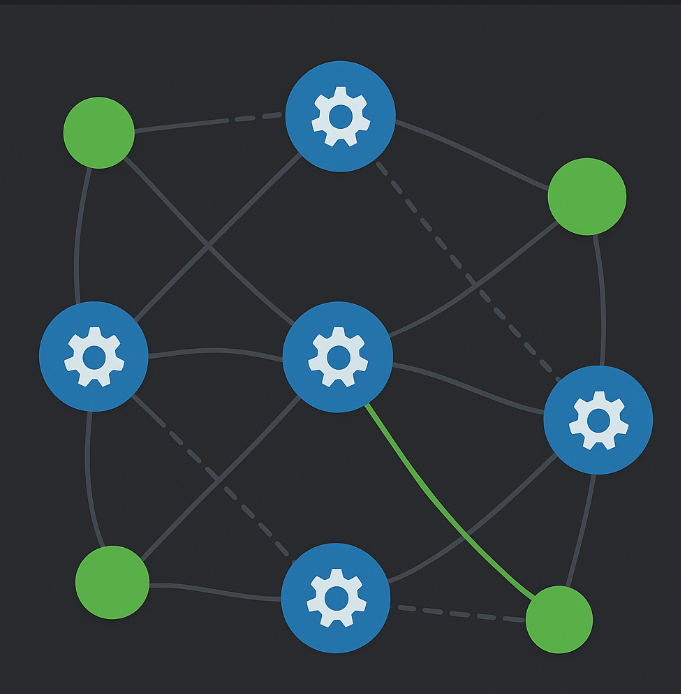

🌐 Como visión inicial, conviene resumir qué son las redes de nodos, para luego centrarnos en las redes P2P, introduciendo sus características principales.

En el contexto de internet, en el estudio de las [redes de computadoras](https://es.wikipedia.org/wiki/Red_de_computadoras) (dentro de la [ciencia de redes](https://es.wikipedia.org/wiki/Ciencia_de_redes)), existen dispositivos que son [nodos](https://es.wikipedia.org/wiki/Nodo_(inform%C3%A1tica)), es decir, pueden enviar y recibir información, y gracias a que disponen de una dirección pública, como la [IP](https://es.wikipedia.org/wiki/Protocolo_de_Internet), generalmente en un [nombre de dominio](https://es.wikipedia.org/wiki/Nombre_de_dominio) registrado en un [DNS](https://es.wikipedia.org/wiki/Sistema_de_nombres_de_dominio), pueden conocerse; o pueden comunicase sin conocerse en una [difusión amplia](https://es.wikipedia.org/wiki/Difusi%C3%B3n_amplia).

> Debido a la limitada cantidad de direcciones IPv4, lo normal es que muchos de estos nodos, que acceden mediante un [ISP](https://es.wikipedia.org/wiki/Proveedor_de_servicios_de_internet), solo puedan usar su IP para hacer peticiones-respuestas, pero no para recibir conexiones entrantes, ya que están detrás de un [CGNAT](https://es.wikipedia.org/wiki/Carrier_Grade_NAT).

Algunos de esos nodos actúan como [host](https://es.wikipedia.org/wiki/Host) o anfitriones de servicios, y cuando es continuado, se denominan [servidores](https://es.wikipedia.org/wiki/Servidor) que suelen estar en [centros de datos](https://es.wikipedia.org/wiki/Centro_de_procesamiento_de_datos).

> 💡O en tu propio hogar o negocio si decides participar en una red lo mas descentralizada posible.

⚠️ Es importante no confundir un host con un dominio. Un host es un dispositivo o servidor que ejecuta servicios y aplicaciones en la red, mientras que un dominio es simplemente un nombre legible (por ejemplo, ejemplo.com) registrado en el DNS para facilitar el acceso. El dominio suele apuntar a la dirección IP del host y, en muchos casos, el acceso se gestiona a través de un proxy inverso que enruta las peticiones al servicio adecuado dentro del host, o incluso a múltiples hosts o clústeres distribuidos.

En los servidores se alojan los [servicios](https://es.wikipedia.org/wiki/Daemon_(inform%C3%A1tica)), compuestos por [aplicaciones](https://es.wikipedia.org/wiki/Aplicaci%C3%B3n_inform%C3%A1tica) y [componentes](https://es.wikipedia.org/wiki/Componente_de_software) contenidos en [servidores de aplicaciones](https://es.wikipedia.org/wiki/Servidor_de_aplicaciones), que implementan funciones específicas para atender peticiones de otros nodos en la red.

Servidores de aplicaciones, donde pasamos de contenedores pesados y modulares a aplicaciones autocontenidas y, finalmente, a binarios independientes, reduciendo la dependencia del entorno de ejecución.

Y servicios, que se pueden ofrecer a clientes, bajo términos de licencia, en lo que se denomina la nube y que pueden seguir un modelo como [SaaS (Software as a Service)](https://es.wikipedia.org/wiki/Software_como_servicio), o puede ser [On Premise](https://en.wikipedia.org/wiki/On-premises_software) si se entrega para la infraestructura cliente.

Y aplicaciones que pueden seguir una arquitectura de [microservicios](https://es.wikipedia.org/wiki/Arquitectura_de_microservicios), o ser una [SPA](https://en.wikipedia.org/wiki/Single-page_application) siguiendo un patrón [BFF](https://bff-patterns.com/), o una [dApp](https://es.wikipedia.org/wiki/Aplicaci%C3%B3n_descentralizada),o un [gateway](https://es.wikipedia.org/wiki/Puerta_de_enlace), [proxy](https://es.wikipedia.org/wiki/Servidor_proxy), [VPN](https://es.wikipedia.org/wiki/Red_privada_virtual), o [API REST](https://es.wikipedia.org/wiki/Transferencia_de_Estado_Representacional), servidor [GraphQL](https://es.wikipedia.org/wiki/GraphQL), o un [servicio de mensajería](https://es.wikipedia.org/wiki/Mensajer%C3%ADa_instant%C3%A1nea), sistema de [autorización](https://es.wikipedia.org/wiki/OAuth), [orquestador de tareas](https://es.wikipedia.org/wiki/Motor_de_flujo_de_trabajo), o un nodo P2P, [un indexador de blockchain](https://www.alchemy.com/overviews/blockchain-indexer) o incluso un servicio de almacenamiento distribuido como IPFS, etc...

Estos servidores se ejecutan sobre un [sistema operativo](https://es.wikipedia.org/wiki/Sistema_operativo), utilizando uno o varios [puertos](https://es.wikipedia.org/wiki/Puerto_de_red) locales para abrir [sockets](https://es.wikipedia.org/wiki/Socket_de_Internet) con el resto de nodos para establecer comunicación.

💬 Comunicación a través de protocolos, según [OSI](https://es.wikipedia.org/wiki/Modelo_OSI), que tiene niveles, como el de aplicación, por ejemplo con [HTTP](https://en.wikipedia.org/wiki/HTTP), [gRPC](https://es.wikipedia.org/wiki/GRPC), [JSON-RPC](https://en.wikipedia.org/wiki/JSON-RPC), [WebSocket](https://es.wikipedia.org/wiki/WebSocket) o [MQTT](https://en.wikipedia.org/wiki/MQTT), etc, que puede operar sobre otro protocolo de aplicación de seguridad como [TLS](https://es.wikipedia.org/wiki/Seguridad_de_la_capa_de_transporte) y que en general operan sobre servicios de transporte como [TCP](https://es.wikipedia.org/wiki/Protocolo_de_control_de_transmisi%C3%B3n) para conexiones confiables o [UDP](https://es.wikipedia.org/wiki/Protocolo_de_datagramas_de_usuario) para transmisiones rápidas sin garantías o [QUIC](https://es.wikipedia.org/wiki/QUIC) un protocolo actual que usa UDP, que es confiable y rápido. Estos, a su vez, se encapsulan en paquetes IP ([IPv4](https://es.wikipedia.org/wiki/IPv4)/[IPv6](https://es.wikipedia.org/wiki/IPv6)), que son enrutados por la red física.

Red física que tiene una topología, denominada [topología física](https://es.wikipedia.org/wiki/Topolog%C3%ADa_de_red), que normalmente conocemos como de estrella, bus, anillo, malla, árbol o híbrida, etc.

Y quizás podemos generalizar que la topología física predominante en Internet es una malla parcial, pero eso no es relevante. Lo importante es que los nodos de una red pueden interconectarse entre sí, y si no es posible, existen técnicas como [NAT traversal](https://es.wikipedia.org/wiki/NAT_traversal) y [relay](https://en.wikipedia.org/wiki/Traversal_Using_Relays_around_NAT) para facilitar la conexión a través de routers, cortafuegos o CGNAT .

Protocolos de comunicación que siguen un estilo de interacción que puede ser [procedural](https://en.wikipedia.org/wiki/Remote_procedure_call), es decir llamar a una función remota como si fuera local, donde desataca JSON-RPC; orientado a recursos HTTP como un API Rest; o [declarativo](https://en.wikipedia.org/wiki/Declarative_programming) como GraphQL, donde a modo de query declaras qué consulta realizar necesitas y el propio motor del API ofrece el resultado.

Y donde se siguen [patrones de comunicación de mensajes](https://en.wikipedia.org/wiki/Messaging_pattern), donde podemos ver algunos:

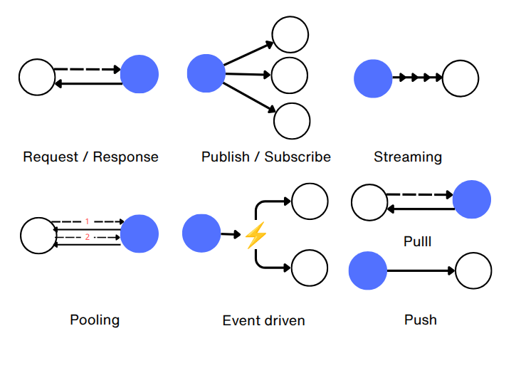

Y si los describimos son:

* [Request/Response](https://en.wikipedia.org/wiki/Request%E2%80%93response): un nodo, pide y otro responde, como puede ser en HTTP o el resto de protocolos de aplicación.
* [Publish/Subscribe](https://en.wikipedia.org/wiki/Publish%E2%80%93subscribe_pattern): ideal para peticiones asíncronas, un nodo publica, otros suscritos reciben como puede ser [MQTT](https://en.wikipedia.org/wiki/MQTT).
* Streaming: datos enviados continuamente, como puede ser [RTSP](https://es.wikipedia.org/wiki/Protocolo_de_transmisi%C3%B3n_en_tiempo_real), [WebRTC](https://es.wikipedia.org/wiki/WebRTC) o [SRT](https://en.wikipedia.org/wiki/Secure_Reliable_Transport).
* [Polling](https://es.wikipedia.org/wiki/Polling): el cliente consulta periódicamente si hay datos.
* [Event-driven](https://en.wikipedia.org/wiki/Event-driven_architecture): los datos se envían como reacción a eventos.
* Pull / Push: donde en el modelo pull, el nodo emisor transmite la carga útil (payload) solo cuando otro nodo la solicita. En cambio, en push, el emisor envía la carga útil de forma proactiva, sin solicitud previa. Esto no debe confundirse con la topología cliente-servidor, la asincronía en las respuestas, ni con el simple hecho de que siempre haya transmisión de datos en la capa de transporte; nos referimos específicamente a cómo se gestiona la entrega de la carga útil.
* Y otros muchos más...

📨 Sobre la comunicación del nodo, si puede enviar y además recibir un mensaje, se le considera [doble o duplex](https://es.wikipedia.org/wiki/D%C3%BAplex_(telecomunicaciones)), y además si es simultaneo Full-duplex, si no puede ser al mismo tiempo Half-duplex y si es en un único sentido Simplex.

Mensaje que se considera la carga útil ([payload](https://es.wikipedia.org/wiki/Carga_%C3%BAtil_(inform%C3%A1tica))) de la comunicación porque aunque en el [Handshake](https://es.wikipedia.org/wiki/Establecimiento_de_comunicaci%C3%B3n) hay mucha información transmitida, no es el propósito del intercambio.

🫱🏻‍🫲🏽 Además, un conjunto de nodos puede organizarse para ejecutar funciones específicas, como ocurre en la [computación distribuida](https://es.wikipedia.org/wiki/Computaci%C3%B3n_distribuida). Esta abarca distintos modelos: el modelo cliente-servidor con coordinación central; los [clúster](https://es.wikipedia.org/wiki/Cl%C3%BAster_de_computadoras) —donde los nodos cooperan como un único sistema lógico, usualmente con coordinación central y, en muchos casos, compartiendo estado o almacenamiento.— o en [grid computing](https://es.wikipedia.org/wiki/Computaci%C3%B3n_en_malla), donde varios nodos colaboran de forma coordinada para resolver tareas, pudiendo ser centralizado o descentralizado según el diseño. También existen enfoques como el [edge computing](https://en.wikipedia.org/wiki/Edge_computing), que acerca el procesamiento al nodo cliente para reducir latencia. Finalmente, si no se requiere coordinación centralizada, se puede optar arquitectura de redes peer-to-peer (P2P).

Estos nodos organizados pueden estar tightly coupled (fuertemente acoplados), con memoria o estado compartido y baja latencia; o loosely coupled (débilmente acoplados), siendo más independientes, sin memoria compartida directa, con mayor latencia y mayor heterogeneidad."

Y estos nodos organizados se conectan para comunicarse, siguiendo una estructura o enlace que se conoce como [topología lógica](https://techriders.tajamar.es/topologia-fisica-vs-topologia-logica/) e igualmente tenemos de nuevo, como topología, Cliente-Servidor o Cliente-Servidor Distribuido, en redes centralizadas, P2P (peer-to-peer) en redes descentralizadas o Multicast/broadcast en redes de [difusión](https://es.wikipedia.org/wiki/Difusi%C3%B3n_amplia) o streaming, anillo, etc...

> ∞ E igualmente, podríamos indicar que las aplicaciones siguen [estilos arquitectónicos](https://reactiveprogramming.io/blog/es/estilos-arquitectonicos/monolitico#), donde en concreto pueden seguir un [patrón de diseño](https://es.wikipedia.org/wiki/Patr%C3%B3n_de_dise%C3%B1o), siendo una solución más flexible o adaptarse en concreto a un [protocolo](https://www.imagar.com/blog-desarrollo-web/que-es-el-protocolo-en-informatica/), como muchos de los que [vemos en internet](https://es.wikipedia.org/wiki/Familia_de_protocolos_de_internet) y etc, etc, pero no es posible explicar todo 🤯, asi que acabamos aquí...

## Redes entre pares - peer-to-peer o p2p

En las redes entre pares, [peer-to-peer o p2p](https://academy.bit2me.com/que-es-una-red-p2p/), todos los nodos funcionan como iguales para el mismo propósito de la red.

> 💡 No debe confundirse una red P2P con una red distribuida. Como su nombre indica, una red P2P implica comunicación entre pares: si un nodo no puede conectarse en igualdad de condiciones con otro, no es una red P2P. Tampoco debe confundirse que una red P2P sea inherentemente descentralizada; una red entre pares puede tener un nodo coordinador central, y en ese caso no lo sería del todo.

Una red p2p elimina el punto único de fallo (SPOF), aumentando la resiliencia y dificultando la censura, ya que no depende de un único nodo o servidor central para funcionar.

Suelen funcionar mediante un protocolo o varios subprotocolos, implementado en un programa que se ejecuta como servicio en cada nodo, permitiendo la interacción entre nodos según las reglas definidas.

Si lo vemos de forma menos abstracta, podemos ver el ejemplo de [BitTorrent](https://es.wikipedia.org/wiki/BitTorrent), donde cada persona instala un programa en su PC, que sería un nodo. Cuando quieres un archivo, tu programa busca otros usuarios (otros nodos) que ya tienen partes de ese archivo para descargar varias partes a la vez, que ese sería el propósito de la red.
Al mismo tiempo, tú también compartes las partes que ya tienes con otros, sin depender de un servidor central.

Que una red P2P sea entre iguales facilita un diseño descentralizado, lo que la hace muy relevante en la Web3. Sin embargo, en la práctica, Web3 adopta lo que sea necesario para ofrecer la funcionalidad requerida, incluso soluciones centralizadas, ya que debe mantenerse un equilibrio entre descentralización, seguridad y escalabilidad.

> 💡 En esta definición, no tenemos que confundir redes p2p con blockchain, ya que no es lo mismo y spoiler, blockchain es una estructura de datos diseñada para operar como libro contable distribuido (ledger) en redes P2P, donde existe un consenso, es decir, que opere en una red p2p, no implica que sean lo mismo, simplemente blockchain opera sobre una red p2p y suele confundirse.

### Características de una red p2p

Existen propiedades o cualidades que definen una red p2p y que podemos enumerar.

> Asumiendo que muchos conceptos se conocen sobre todo por blockchain, también los podemos aplicar a redes p2p.

#### Modelo de gobernanza

El modelo de gobernanza en una red p2p o sistema distribuido define cómo se toman las decisiones clave sobre la evolución del protocolo, la actualización de reglas y la resolución de conflictos. La gobernanza determina quién tiene autoridad para proponer, aprobar o rechazar cambios, y cómo se implementan estos cambios en la red. Dependiendo del propósito y del grado de descentralización (que veremos mas adelante), existen diferentes enfoques de gobernanza, cada uno con sus ventajas y limitaciones.

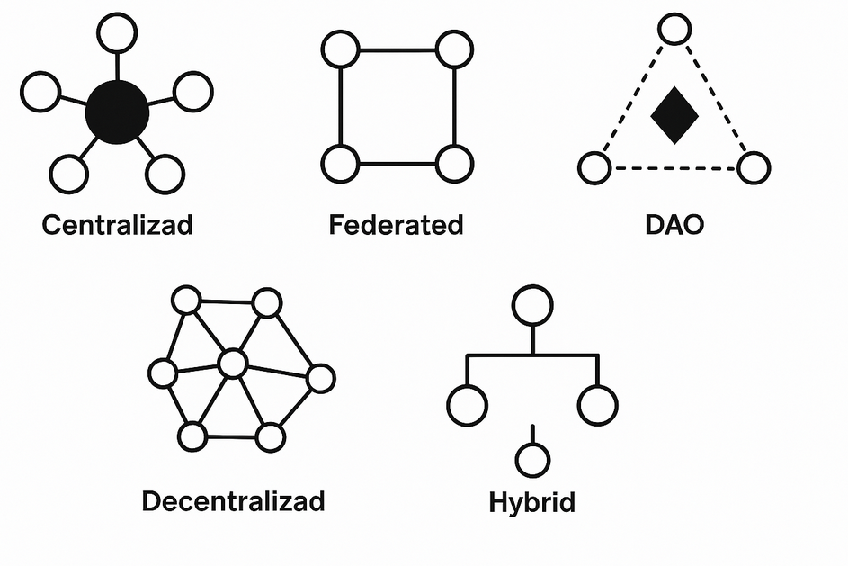

Los principales modelos de gobernanza en sistemas distribuidos o blockchain principalmente son:

* Centralizada, una única entidad o grupo reducido controla las reglas, la validación y las actualizaciones del sistema. Este modelo permite una toma de decisiones rápida y un control claro, pero introduce un punto único de fallo y reduce la descentralización.
* Federada, varias entidades coordinadas —como redes, organizaciones o nodos seleccionados— comparten la responsabilidad de la gobernanza. Las decisiones se toman de forma conjunta, lo que mejora la resiliencia y la confianza, aunque requiere mecanismos de coordinación y consenso entre las partes. Un caso común de este modelo es el consorcio, donde un grupo de entidades colabora formalmente en la gestión y operación de la red.
* Descentralizada, todos los participantes de la red pueden influir en las decisiones, normalmente a través de mecanismos de consenso abiertos. Este modelo maximiza la participación y la resistencia a la censura, pero puede hacer más lento el proceso de toma de decisiones y requerir sistemas robustos para evitar ataques o manipulaciones.
* DAO (Organización Autónoma Descentralizada), la gobernanza se automatiza mediante contratos inteligentes y procesos de votación en la propia red (on-chain), donde los participantes suelen usar tokens para votar sobre propuestas. Este enfoque permite una gestión transparente y programable, eliminando intermediarios y facilitando la evolución del sistema según la voluntad colectiva.
* Híbrida, combina elementos de los modelos anteriores, por ejemplo, una DAO que delega ciertas decisiones a un comité multisig o a un grupo de expertos, o una red federada que incorpora mecanismos de votación abiertos para algunas cuestiones. Este modelo busca equilibrar eficiencia, seguridad y participación.

La elección del modelo de gobernanza influye directamente en la seguridad, la flexibilidad y la capacidad de adaptación de la red, y suele evolucionar con el tiempo a medida que la red crece y cambian sus necesidades.

#### Grado de descentralización

Define cuánto control está distribuido entre los nodos de la red y si existen jerarquías, lo que influye en la escalabilidad y facilidad de diseño.

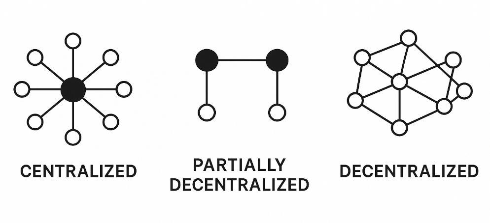

Puede ser normalmente:

* Centralizadas (Centralized), control total por una entidad, son redes cliente-servidor P2P con controlador central.
  
  > Se menciona a modo de divulgación, pero no es normal encontrarlo, aun menos en la web3.

* Parcialmente descentralizadas (Partially decentralized), varios nodos controlan la red, pero no todos. Ej: gobernanza de consorcios (como veremos en [modelo de autorización](#modelo-de-autorización)), federaciones (del [modelo de gobernanza](#modelo-de-gobernanza)); y soluciones como supernodos (como detallaremos en [clases de nodos](#clasificación-por-capacidad)) y uso de índice centralizado (como veremos en [estrategia de almacenamiento](#estrategias-de-almacenamiento-en-redes-p2p)).
* Totalmente descentralizadas (Fully decentralized), todos los nodos tienen el mismo rol, sin jerarquía. Ej: Bitcoin, IPFS (sin bootstrap central), [Gnutella](https://en.wikipedia.org/wiki/Gnutella).

Normalmente, un mayor grado de centralización suele buscar:

* Mejor rendimiento (menor latencia y mayor throughput).

  > [throughput](https://en.wikipedia.org/wiki/Network_throughput) es la cantidad de datos o transacciones procesadas por unidad de tiempo en una red. En redes blockchain, suele medirse en transacciones por segundo (TPS) o bloques por segundo. Cuanto mayor el throughput, mayor la capacidad de procesamiento de la red.

* Control más sencillo (gobernanza y actualizaciones).
* Seguridad operativa (menos superficie de ataque si los nodos son confiables).

  > Mas seguridad operativa, pero menor descentralización y menor resilencia al existir punto único de falla.

* Menor complejidad de consenso (menos nodos que coordinar).

#### Modelo de confianza

Define cómo y en quién confían los nodos para interactuar, validar información y alcanzar consenso. Determina si la red requiere identidad, reputación o prueba criptográfica para garantizar seguridad y funcionamiento correcto.

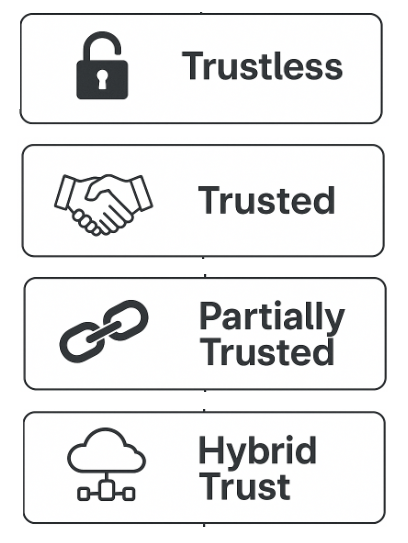

Puede ser normalmente:

* Sin confianza ([Trustless](https://academy.binance.com/es/glossary/trustless)), donde los nodos interactúan sin necesidad de confiar entre sí, ya que utilizan [mecanismos criptográficos](https://es.wikipedia.org/wiki/Criptograf%C3%ADa) y [reglas de consenso](https://www.bitstamp.net/es/learn/security/what-are-blockchain-consensus-rules/) verificables. Estos mecanismos generan pruebas objetivas, como los árboles de Merkle (para verificar integridad de datos) o las zk-proofs (para demostrar la validez de información sin revelarla). Ejemplos claros son blockchain con Bitcoin, Ethereum, IPFS + FileCoin.
* Confiable o basado en confianza (Trusted), los nodos interactúan basándose en relaciones de confianza previa, donde existe identidad verificada o autoridad central parcial que ayuda a autenticar al nodo, reduciendo la necesidad de mecanismos criptográficos o consenso complejo. Por ejemplo, igualmente en blockchain en redes corporativas como [Hyperledger Fabric](https://en.wikipedia.org/wiki/Hyperledger#Hyperledger_Fabric) con [Proof of Authority](https://en.wikipedia.org/wiki/Proof_of_authority) (PoA).
* Parcialmente confiable (Partially trusted), combina nodos confiables con nodos anónimos o no verificados, aplicando confianza selectiva. Usa mecanismos criptográficos y validación, pero permite ciertos roles privilegiados o relaciones basadas en confianza. Por ejemplo, [Lightning Network](https://es.wikipedia.org/wiki/Lightning_Network) (sobre Bitcoin):
* Confianza híbrida (Hybrid trust), combina modelos trustless y trusted, donde algunas funciones dependen de nodos confiables o autoridades, y otras se descentralizan mediante consenso y criptografía. Ejemplo [Ripple](https://es.wikipedia.org/wiki/Ripple_Labs,_Inc.), donde usa un conjunto confiable de nodos validadores (UNL), pero con comunicación P2P.

  > La diferencia entre Partially trusted e Hybrid trust, en la primera se reconoce que en ciertos nodos se puede confiar más por su propia naturaleza, en la segunda combina explícitamente componentes o mecanismos centralizados, asi que se puede decir que más que una diferencia es evolucionar de un grado de descentralización de mayor a menor.

#### Modelo de autorización

Define quién puede participar y con qué permisos, lo cual influye en la resistencia a la censura, tolerancia a fallos y gobernanza.

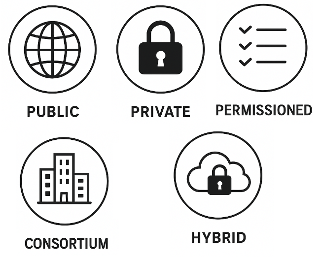

Puede ser normalmente:

* Pública, cualquier participante puede unirse y participar sin restricciones, es abierta a nuevos participantes.
* Privada, acceso limitado a entidades previamente autorizadas, suele tener un control centralizado dentro de una organización o grupo.
* Consorcio, gobernada por un grupo seleccionado de entidades confiables, es un tipo de red privada, pero gestionada por un grupo de entidades (no sólo una).
* Permisionada, participación permitida a nodos verificados y aprobados; es una red privada que se abre a mas participante bajo unas condiciones. Además define roles o permisos específicos, por ejemplo, unos nodos pueden leer solamente y otros escribir.
  > Una red se considera permisionada, y no verdaderamente pública, cuando existen restricciones que impiden a cualquier usuario operar su propio nodo local, incluso si dichas restricciones no son explícitas o requieren superar barreras adicionales para acceder a la red. En algunos casos, este carácter permisionado puede no ser evidente y puede ser presentado como una red pública por motivos de imagen o marketing.
* Híbrida, mezcla características de modelos públicos y privados.

#### Estrategias de almacenamiento en redes p2p

Definen cómo se organiza y guarda la información entre los nodos participantes. Buscan optimizar la disponibilidad, localización eficiente de datos y equilibrio de carga.

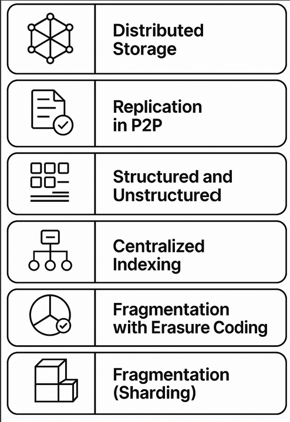

El Almacenamiento Distribuido (Distributed Storage), donde los datos se distribuyen entre múltiples nodos de la red utilizando [técnicas de replicación](#técnicas-de-replicación), como puede ser la replicación entre nodos parcial o total, es la estrategia principal aplicada en una red p2p.

Además, como veremos más adelante, la red puede ser [estructurada](#topología-estructurada), [no estructurada](#topología-no-estructurada) o una solución mixta. En las redes estructuradas, el almacenamiento y la búsqueda de datos se gestionan de forma determinista mediante índices distribuidos (como las DHT), lo que permite búsquedas rápidas y eficientes. En las no estructuradas, los datos se almacenan y localizan de manera más aleatoria, propagando consultas entre nodos; esto resulta menos eficiente, pero aporta mayor resiliencia frente a desconexiones. La elección de la topología de la red es, por tanto, una decisión clave que impacta directamente en la estrategia de almacenamiento.

Además, existen otras decisiones que pueden tomarse para optimizar el almacenamiento, aunque a veces impliquen reducir el grado de descentralización. Estas se aplican cuando las circunstancias específicas de la red lo requieren, por ejemplo:

* Indexación centralizada (Centralized indexing), un servidor central mantiene un índice de los archivos disponibles, pero los datos se transfieren directamente entre nodos. Ejemplo: [Napster](https://es.wikipedia.org/wiki/Napster) (modelo híbrido respecto a la descentralización).
* Fragmentación con [Erasure Coding](https://en.wikipedia.org/wiki/Erasure_code), los datos se dividen en fragmentos codificados matemáticamente, permitiendo recuperación incluso si se pierden algunos. Ejemplo: [Tahoe-LAFS](https://www.tahoe-lafs.org/trac/tahoe-lafs), [Filecoin](https://storj.dev/learn/concepts/file-redundancy#erasure-code) (opcional).

  > No se incluye como [técnicas de replicación](#técnicas-de-replicación) porque no copia íntegramente los datos, sino que los codifica en fragmentos con redundancia dispersa, aunque si no estás de acuerdo y lo pondrías, opina al respecto.

* Fragmentación ([Sharding](https://es.cointelegraph.com/explained/sharding-an-opportunity-for-distributed-scalability)): los datos o el estado de la red se dividen en fragmentos (shards), y cada fragmento es gestionado por un subconjunto de nodos, permitiendo procesar operaciones en paralelo y mejorar la escalabilidad. Ejemplos de sharding en redes P2P incluyen [Ethereum](https://www.bitstamp.net/es/learn/blockchain/what-is-sharding-on-ethereum/), [Polkadot](https://wiki.polkadot.network/docs/learn-parachains), [Near Protocol](hhttps://academy.bit2me.com/que-es-near-protocol/), etc.

### Desafíos y Vulnerabilidades en Redes P2P

Las redes p2p vienen a resolver principalmente, el problema de la centralización y el punto único de fallo y para ello los nodos deben comunicarse entre iguales siguiendo el protocolo, pero esto también tiene ciertos desafíos que se deben considerar y que podemos resumir como:

#### Problemas en redes p2p

Estos problemas pueden ser inherentes al diseño descentralizado de las redes P2P y pueden surgir sin intervención maliciosas:

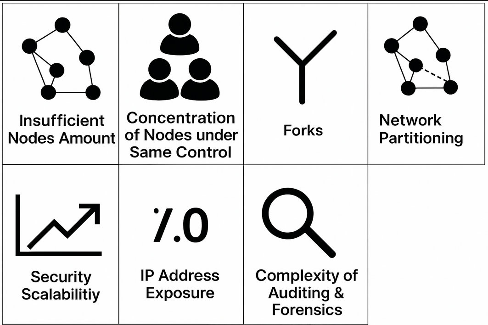

* Insuficiente cantidad de nodos: Cuando la red P2P cuenta con pocos nodos activos, se reduce la redundancia y la disponibilidad de los recursos compartidos. Esto puede provocar que ciertos archivos o servicios sean inaccesibles si los pocos nodos que los alojan se desconectan. Además, una baja cantidad de nodos limita la resiliencia ante fallos y ataques, y dificulta el escalado eficiente de la red.
* Concentración de nodos bajo un mismo control: Si un número significativo de nodos es operado o controlado por los mismos actores, se debilita la descentralización y se incrementa el riesgo de manipulación, censura o recopilación masiva de datos. Esta concentración puede facilitar ataques coordinados (como Sybil o Eclipse), reducir la diversidad de la red y comprometer la confianza en el sistema.
* Fragmentación de la red (network partitioning): Ocurre cuando los nodos se dividen en subgrupos aislados debido a fallos físicos de conectividad, como cortes de red o fallos de infraestructura. Esto impide una visión global coherente y afecta la sincronización. Por ejemplo, en una red P2P como IPFS, una fragmentación puede dificultar el acceso a ciertos contenidos si los nodos que los alojan están desconectados.
* Estado paralelo ([forks](https://es.wikipedia.org/wiki/Bifurcaci%C3%B3n_(blockchain))): Diferentes grupos de nodos pueden tener visiones contradictorias del estado de la red debido a desacuerdos en el consenso. Aunque los mecanismos de consenso suelen resolver estos forks, la divergencia temporal puede causar problemas, especialmente en blockchains como Ethereum, donde un fork puede permitir ataques como el doble gasto si no se resuelve rápidamente.
* Escalabilidad de la Seguridad (Dificultad de Aplicación de Políticas Uniformes): A medida que la red crece, la aplicación de medidas de seguridad uniformes en todos los nodos se vuelve extremadamente compleja. No hay un punto central para distribuir actualizaciones de seguridad o parches, y cada usuario es responsable de su propia configuración en el nodo, lo que lleva a un ecosistema heterogéneo.
* Exposición de Direcciones IP (en algunos modelos P2P): En muchos diseños P2P, los nodos necesitan conocer las direcciones IP de otros nodos para establecer conexiones directas. Esto expone las direcciones IP de los usuarios, lo que puede ser utilizado para ataques dirigidos, monitoreo de actividad o deanonymization si no se toman precauciones adicionales (como el uso de proxies o TOR).
* Complejidad de la Auditoría y Forense: En caso de un incidente de seguridad, la naturaleza distribuida de las redes P2P hace que sea extremadamente difícil realizar una auditoría completa o un análisis forense. No hay registros centralizados, y rastrear el origen de un problema a través de una multitud de nodos efímeros es una tarea monumental.

#### Desafíos derivados de la resistencia a la censura

Si bien la resistencia a la censura es una de las principales virtudes de las redes P2P, esta característica también conlleva efectos secundarios que pueden ser vistos como problemáticos. Más que problemas en sí mismos, son consecuencias inherentes de la descentralización y la falta de control centralizado. Los detractores suelen señalar estos aspectos como contraparte de la libertad que ofrecen las redes P2P:

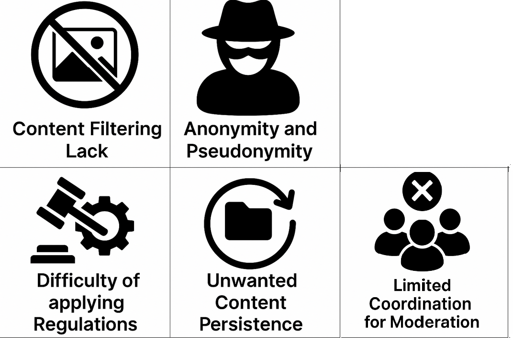

* Falta de filtro de contenido: Al no haber un servidor central que actúe como filtro, el contenido distribuido en una red P2P es en gran medida incontrolado. Esto facilita la proliferación de contenido ilegal, malware o spam, y es un desafío para la moderación.
* Anonimato y pseudonimato: La naturaleza descentralizada de muchas redes P2P dificulta la identificación real de los usuarios. Si bien esto puede ser una ventaja para la privacidad, también facilita actividades ilícitas y hace más difícil responsabilizar a los actores malintencionados. No hay una autoridad central que verifique identidades.
* Dificultad para aplicar regulaciones: La ausencia de un punto central de control complica la aplicación de normativas legales o regulatorias, lo que puede generar conflictos con legislaciones locales o internacionales.
* Persistencia de contenido no deseado: Una vez que un archivo o información se distribuye en una red P2P, puede ser extremadamente difícil eliminarlo por completo, ya que puede estar replicado en múltiples nodos fuera del alcance de cualquier autoridad.
* Coordinación limitada para la moderación: La descentralización dificulta la organización de esfuerzos coordinados para moderar o eliminar contenido dañino, lo que puede llevar a respuestas lentas o ineficaces ante incidentes.

#### Ataques a la seguridad

Además de los problemas, las redes P2P son vulnerables a ataques intencionales que explotan su diseño descentralizado. Estos incluyen:

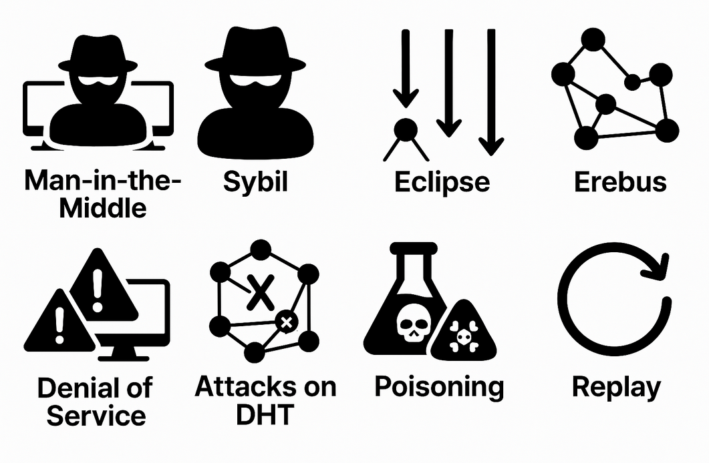

* Man-in-the-Middle ([MITM](https://es.wikipedia.org/wiki/Ataque_de_intermediario)): Un atacante intercepta y potencialmente altera la comunicación entre dos nodos sin que estos lo detecten. Por ejemplo, en una red P2P de mensajería como Tox, un MITM podría modificar mensajes para engañar a los usuarios.
* [Sybil](https://academy.bit2me.com/que-es-un-ataque-sybil/): Un atacante crea múltiples identidades falsas para influir en la red, manipular el consenso o recopilar información. Este ataque es común en redes de intercambio de archivos como BitTorrent, donde nodos falsos pueden sabotear la distribución de contenido.
* [Eclipse](https://academy.bit2me.com/que-es-ataque-eclipse-eclipse-attack/): Un nodo es rodeado por nodos maliciosos dentro de la red P2P, controlando toda su información entrante y saliente. En Ethereum, por ejemplo, un ataque Eclipse podría aislar a un nodo para evitar que valide transacciones legítimas.
* [Erebus](https://es.cointelegraph.com/explained/erebus-attack-explaining-its-scope): Similar a Eclipse, pero opera a nivel de infraestructura, manipulando rutas antes de que el tráfico llegue a la capa P2P. Esto aísla al nodo víctima y controla su percepción de la red.
* Denial of Service ([DoS](https://academy.bit2me.com/que-son-ataques-dos/)): Ataques que saturan nodos o la red con tráfico basura para interrumpir el servicio. Por ejemplo, un DoS podría colapsar nodos clave en una red de streaming P2P como PeerTube.
* [Ataques a la DHT](https://medium.com/unitychain/dht-attacks-and-defenses-e159b3d1bcf8): Manipulación o envenenamiento de tablas hash distribuidas para redirigir tráfico, censurar información o dificultar la búsqueda de recursos. En BitTorrent, un ataque a la DHT podría redirigir a los usuarios a contenido malicioso.
* Envenenamiento (Poisoning): Introducción de datos falsos o corruptos para corromper la información compartida. Por ejemplo, en una red P2P de intercambio de archivos, un atacante podría distribuir archivos falsos con malware.
* [Replay](https://academy.bit2me.com/que-es-un-ataque-replay/): Un atacante intercepta y retransmite datos válidos previamente enviados —como credenciales de conexión en redes P2P para suplantar un nodo, transacciones durante un hard fork de blockchain para duplicar transferencias en ambas cadenas, o firmas en smart contracts para re-ejecutar funciones sin consentimiento— con el fin de engañar al sistema y lograr una acción o acceso no autorizado.

##### Ataques específicos de blockchain

Cono ataques específicos en redes blockchain podemos encontrar:

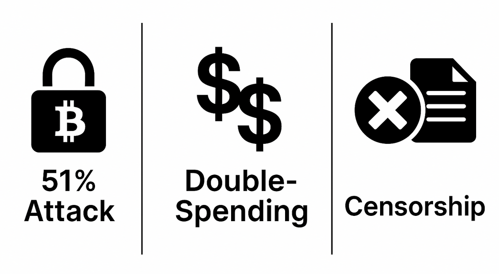

* Ataque del 51%: Un grupo controla más del 50% del poder de cómputo o participación, permitiendo revertir transacciones o censurar la red. Este ataque afectó redes como Bitcoin Gold en 2018.
* Doble gasto (Double-spending): Intento de gastar el mismo activo digital más de una vez, explotando forks o retrasos en el consenso.
* Censura: Nodos o mineros bloquean selectivamente transacciones o bloques, afectando la integridad de la red.

#### Problema de disponibilidad o rotación: Churn

Churn (o "rotación de nodos") se refiere al fenómeno en el que los nodos de una red P2P se unen, abandonan o fallan con frecuencia, afectando la estabilidad y el rendimiento de la red.

> Quizás es un problema de seguridad, pero lo menciono como categoría nueva.

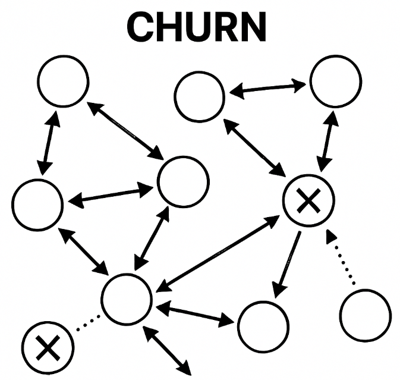

Causas del Churn:

* Nodos dinámicos: Usuarios que apagan sus dispositivos (ej. laptops, móviles) o cierran aplicaciones P2P.
* Fallos aleatorios: Conexiones inestables, cortes de energía o crashes de software.
* Comportamiento egoísta: Nodos que abandonan la red después de descargar un archivo (problema común en *file-sharing*).
* Ataques: Nodos maliciosos que entran y salen para sabotear la red (ej. ataques Sybil).

#### Problemas de rendimiento

Los problemas de rendimiento en redes p2p surgen principalmente por la naturaleza descentralizada y la variabilidad de los nodos participantes. Los más comunes incluyen:

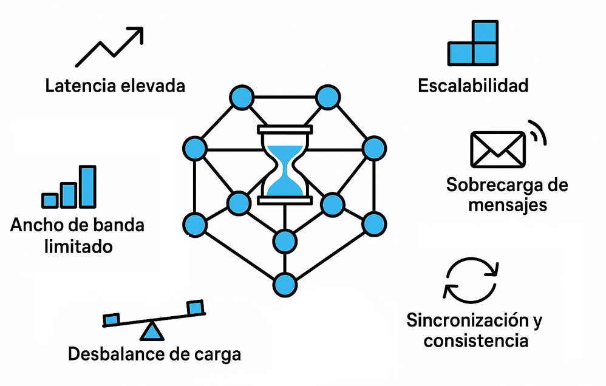

* Latencia elevada, la comunicación entre nodos puede requerir múltiples saltos, aumentando el tiempo de respuesta, especialmente en redes globales o con topologías no estructuradas (que veremos mas adelante).
* Ancho de banda limitado, los nodos pueden tener conexiones lentas o asimétricas, lo que afecta la velocidad de propagación de datos y la eficiencia general de la red.
* Sobrecarga de mensajes, protocolos de difusión como flooding o gossip (que veremos mas adelante) pueden generar un gran volumen de mensajes redundantes, saturando la red y los recursos de los nodos.
* Desbalance de carga, algunos nodos pueden recibir más solicitudes o almacenar más datos que otros, provocando cuellos de botella y afectando la disponibilidad.
* Escalabilidad, a medida que la red crece, mantener la eficiencia en la búsqueda, el [enrutamiento](#enrutamiento-routing-en-redes-estructuradas) y la replicación de datos se vuelve más complejo.
* Sincronización y consistencia, mantener datos consistentes entre nodos distribuidos puede requerir mecanismos costosos en términos de comunicación y procesamiento.

> Muchos de estos problemas son solventados, como los de seguridad, aplicando soluciones menos descentralizadas. Es decir, el trilema siempre se aplica cotejando descentralización con seguridad y escalabilidad.

### Clasificación principal de redes p2p

Las redes p2p se organizan para buscar y compartir información siguiendo dos topologías lógicas conocidas —o, si se prefiere, siguiendo un modelo de [red superpuesta](https://es.wikipedia.org/wiki/Red_superpuesta) (overlay network): estructuradas y no estructuradas.

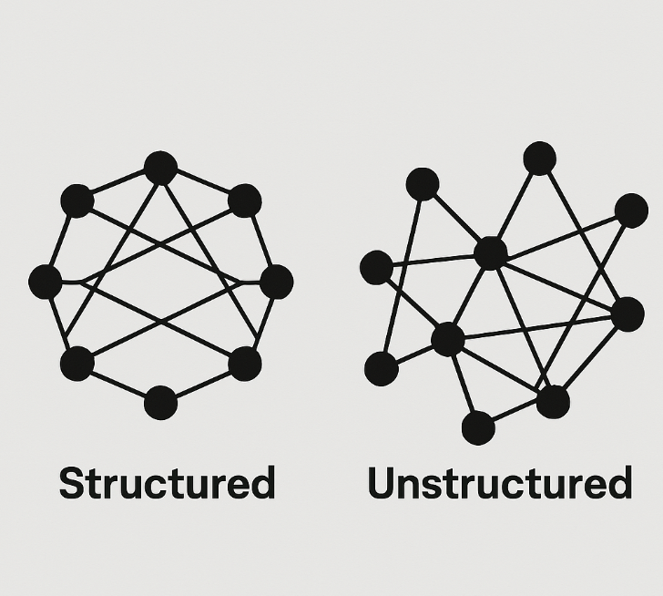

> Elegir entre estructurada o no estructurada, entre otros factores que veremos, principalmente depende de las [características iniciales](#características-de-una-red-p2p) y los [problemas que pueden surgir](#problemas-en-redes-p2p), por ejemplo, si será una red pública o trustless o si se debe seguir una estrategia de almacenamiento, que permita la disponibilidad rápida y eficiente del contenido.

#### Topología estructurada

En la topología estructurada se sigue un patrón definido y determinista, lo que permite búsquedas eficientes y uso optimizado del almacenamiento, siendo adecuado para redes estables (bajo churn), donde los nodos permanecen disponibles con regularidad.

En este tipo de redes, existe un mecanismo donde cada nodo (o su conjunto por redundancia) es responsable de almacenar un dato dado. Para ello, se emplean mecanismos de localización, que funcionan como índices distribuidos, los cuales asocian identificadores únicos (por ejemplo, hashes) con la ubicación lógica de los nodos encargados de gestionar el dato dentro de la red.

Para entender mejor estas redes, varemos la solución principal (y casi única en la práctica) de la [DHT](https://es.wikipedia.org/wiki/Tabla_de_hash_distribuida), que es un diccionario tipo clave/valor, con su implementación de [Kademlia](https://es.wikipedia.org/wiki/Kademlia), donde los nodos se organizan según la "distancia" XOR de sus identificadores y el hash del dato.

> 🤔 Entiendo que no hayas comprendido nada...esta explicación la veremos más en detalle en [los mecanismos de las redes p2p](#️-mecanismos-de-las-redes-p2p).

Existen otras implementaciones de DHT además de Kademlia, cada una con una topología lógica diferente que influye en cómo se enrutan y localizan los datos:

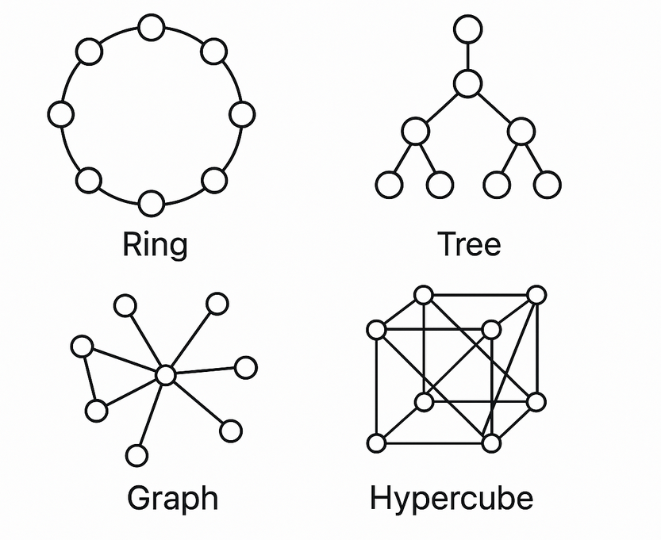

* Anillo: como en [Chord](https://es.wikipedia.org/wiki/Chord), que utiliza [Consistent Hashing](https://en.wikipedia.org/wiki/Consistent_hashing) y conecta los nodos en una estructura circular. Cada nodo es responsable de un rango de claves y el enrutamiento se realiza siguiendo el orden del anillo, logrando búsquedas eficientes y balanceo de carga.
* Árbol: aunque menos común en la práctica, existen propuestas como BATON (Balanced Tree Overlay Network), que implementan DHTs sobre árboles balanceados para optimizar búsquedas y balanceo de carga. En este modelo, los nodos se organizan jerárquicamente, donde los nodos padres coordinan a sus hijos, útil en escenarios de difusión o agregación.
* Grafo: algunas DHTs, como [Pastry](https://es.wikipedia.org/wiki/Pastry_(P2P)) y [Tapestry](https://es.wikipedia.org/wiki/Tapestry_(P2P)), emplean rutas prefijadas. Su topología combina características de árbol (por los niveles de prefijo en las rutas) y de grafo (por la redundancia y la existencia de múltiples caminos posibles entre nodos), lo que proporciona tolerancia a fallos y rutas alternativas.
* Hiperespacio (Hypercube): existen implementaciones como HyperCup y CubeNet, donde cada nodo representa un vértice de un hipercubo n-dimensional y se conecta a otros nodos que difieren en un solo bit en su identificador. Esta topología permite rutas logarítmicas y alta escalabilidad.

Y Kademlia - *¿qué topología es?*... Kademlia se considera una red que utiliza una métrica de distancia XOR para organizar y localizar nodos, en lugar de seguir una topología rígida como anillo, árbol o hipercubo. Por eso, habitualmente se clasifica aparte y no se menciona que sea una topología concreta.

> 🎓 Muchas de estas topologías han sido exploradas principalmente en el ámbito académico o en sistemas distribuidos tradicionales. En el contexto de la web3, donde priman la descentralización, la tolerancia a fallos y el direccionamiento por contenido, las DHT basadas en espacio de claves (como Kademlia) y en anillo (como Chord) resultan más adecuadas y son las más utilizadas en la práctica.

#### Topología no estructurada

En las topologías no estructuradas, las conexiones entre nodos son aleatorias o sin un patrón definido, lo que las hace más adecuadas para consultas complejas y además es mas optimo para entornos inestables donde los nodos se conectan y desconectan con frecuencia (alto churn). Son redes más resilientes, pero al no existir una estructura lógica que relacione directamente el contenido con nodos específicos, las consultas deben propagarse entre múltiples nodos para localizar la información, aunque lo cierto es que permite consultas más complejas que las estructuradas.

En la topología no estructurada se utilizan técnicas de propagación (que forma parte de las [técnicas de difusión](#técnicas-de-difusión-en-redes-no-estructurabas)) como [Flooding](https://en.wikipedia.org/wiki/Query_flooding) (malla completa), [Scoped Flooding](https://suzanbayhan.github.io/pdf/2018_wang_understanding_scoped_flooding.pdf) (malla completa) y [Random Walks](https://en.wikipedia.org/wiki/Random_walk) (random). En Web3 predomina [Gossip](https://academy.bit2me.com/que-es-gossip-protocol/) y derivados como [Gossipsub](https://github.com/libp2p/specs/tree/master/pubsub/gossipsub) y [Gossip Epidemic](https://viktoria-karamyshau.medium.com/gossip-epidemic-protocols-b1d44ce50c10) (las tres como malla parcial).

Las topologías mencionadas como malla parcial, malla completa o topología aleatoria se puede representar como:


> 🎓 Este es solo un resumen orientativo; el objetivo es ofrecer una visión general, no una explicación exhaustiva, es posible que existan fallos o generalizaciones sobre las topologías ahora explicadas, pero es un tema tan complejo y no es objetivo de este documento profundizar mucho más.

#### Aclaraciones de topología redes

**¿Cuando se usa una red no estructurada o estructurada?**

Depende principalmente del propósito de la red, definido inicialmente al establecer sus características. Por ejemplo, una red pública, con alto grado de descentralización y posiblemente alto churn, que requiera resiliencia y tiene que ser más simple, será no estructurada; mientras que una red más estable, escalable y con bajo churn, donde la eficiencia sea clave, optará por una topología estructurada, pero exigirá un diseño más complejo que permita consultas simples y directas.

**¿Existen soluciones mixtas de redes p2p no estructuradas y estructuradas?**

Sí, como veremos, una red p2p puede usar parte del protocolo de red estructurada, por ejemplo para el descubrimiento de nodos, y para el resto de casos ser realmente una red no estructurada.
Es decir, cada red implementa lo que mejor sirva para su propósito, y en general, no tiene que existir una doctrina fijada.

> 📌 Este resumen de redes p2p intenta generalizar y clasificar, pero no tenemos que olvidar que cada red tiene sus peculiaridades.

### ⚙️ Mecanismos de las redes p2p

En una red peer-to-peer (P2P), los nodos se comunican mediante el intercambio de mensajes, que pueden ser peticiones de información (lecturas, R) o entregas (escrituras, W). Un nodo puede iniciar la transacción o actuar como intermediario replicando peticiones hacia otros nodos.

Estas operaciones están reguladas por una serie de mecanismos compuestos por procesos o técnicas o estrategias o modelos, establecidos en el protocolo de la red.

> Este apartado intenta explicar las diferentes soluciones técnicas que podemos encontrarnos.

Se debe considerar que estos mecanismos no están exentos de excepcione según el [grado de descentralización](#grado-de-descentralización) o su [estrategia de almacenamiento](#estrategias-de-almacenamiento-en-redes-p2p).

Se describen los mecanismos más relevantes, considerando que algunos se aplican específicamente a redes estructuradas y otros a no estructuradas.

#### Conexión inicial de nodos (Bootstrapp)

Cuando un nodo se inicia por primera vez, durante el arranque (conocido como bootstrap), se conecta a otros nodos denominados nodos semilla o [nodos bootstrap](https://en.wikipedia.org/wiki/Bootstrapping_node), normalmente preconfigurados en el propio software del nodo. Estos nodos suelen ser confiables y frecuentemente pertenecen a los fundadores o mantenedores del protocolo.

Esta conexión inicial continua con el descubrimiento de nodos que veremos a continuación, pero como simplificación, se puede ver en el siguiente ejemplo:

https://github.com/user-attachments/assets/15d1f200-a030-4278-a5b2-bf88b2e537e2

Inicialmente, el nodo parte de una lista de nodos conocidos, por ejemplo los nodos identificados como 1, 2, 3 y 4 que son nodos semilla, y el proceso consiste en consultar a esos nodos para descubrir otros nuevos, como serían el 10, 14, 25 y 30; así sucesivamente con los nuevos nodos para ampliar y actualizar su red de relaciones.

Además de los nodos semilla, existen diversos mecanismos para el descubrimiento inicial de nodos. Entre ellos se encuentran el uso de [Rendezvous](https://docs.libp2p.io/concepts/discovery-routing/rendezvous/), el DNS seed (que resuelve dominios a direcciones IP de nodos activos), y los servidores de directorio (también llamados *bootstrap servers* o *trackers*), que ofrecen listas centralizadas de nodos disponibles. En redes locales, también se emplea difusión mediante *broadcast* o *multicast*, como [mDNS](https://docs.libp2p.io/concepts/discovery-routing/mdns/), para descubrir nodos cercanos. No obstante, en modelos descentralizados como Web3, predominan los **nodos semilla** para iniciar la conexión a la red.

#### Descubrimiento de nodos (Node Discovery)

El descubrimiento de nodos es el mecanismo que permite al nodo encontrar nuevos pares para incluirlos en su lista de confianza.

Ocurre tras el arranque inicial (bootstrap), pero también periódicamente para mantener la red actualizada y de manera reactiva, por ejemplo, cuando se detecta la caída de nodos durante la [comprobación de conectividad](#comprobación-de-conectividad).

En redes estructuradas (por ejemplo, DHTs), este proceso sigue protocolos deterministas, mientras que en redes no estructuradas se basa en la propagación de consulta —que es una [técnica de difusión](#técnicas-de-difusión-en-redes-no-estructurabas)—.

**Redes estructuradas**.

En redes estructuradas, es un mecanismo determinista que establezca con qué nodos debe relacionarse un nodo dado, asegurando que siempre se obtengan resultados consistentes y repetibles.

Tomando como ejemplo la DHT [Kademlia](https://en.wikipedia.org/wiki/Kademlia), en primer lugar, a cada nodo se le asigna un identificador único (ID), y el proceso consiste en la consulta a otros nodos sobre los nodos "más cercanos" que conozcan respecto a su propio ID para guardar esa información en una [tabla de enrutamiento](https://en.wikipedia.org/wiki/Kademlia#Fixed-size_routing_tables).

> Tabla que se usará posteriormente en el proceso [routing](#enrutamiento-routing-en-redes-estructuradas) que veremos más adelante.

La "cercanía entre nodos" permite que las consultas sean deterministas, es decir, que siempre produzcan el mismo resultado. Esta cercanía se calcula utilizando la [operación binaria XOR](https://es.wikipedia.org/wiki/Puerta_XOR).

En Kademlia, la tabla de enrutamiento almacena contactos de otros nodos organizados según su distancia XOR respecto al nodo local. Estos contactos se agrupan en estructuras llamadas k-buckets (del inglés bucket, que en este contexto equivale a 'cubeta'), donde cada bucket contiene hasta k nodos a una determinada distancia. Por convención, k suele ser 20.

> Los buckets empiezan desde 0, es decir, podemos tener desde Bucket 0 a Bucket 1, 2, 3, etc...

Si quieres entrar en detalle, lo vemos en un ejemplo:

*Ejemplo en primera ronda:*

https://github.com/user-attachments/assets/233bbec8-5ef3-4f68-a160-0fb1db433dfd

* Inicialmente, un nodo local con id 0b0001 (1) conoce al nodo semilla con ID 0b1000 (8) y lo incluye en el Bucket 3 como el único nodo que conoce.

  Si calculamos `0b0001 XOR 0b1000` es `0b1001` (9), siendo posición del bucket 3:

  | 3 ◄ | 2 | 1 | 0 |
  | - | - | - | - |
  | 1 | 0 | 0 | 1 |

  > Si la posición empieza desde 0 y buscamos de izquierda a derecha, 3 es la posición del último bit 1.

* El nodo realiza una consulta a ese nodo semilla mediante el método FIND_NODE, donde indica como ID objetivo el 0b0001 (1), siendo su propio ID de nodo, y además, se especifica k = 3 (a modo de ejemplo, lo normal seria 20) para que el nodo consultado devuelve hasta 3 nodos que conoce y que están más cercanos a 1 (0b0001) según la distancia XOR. El nodo realizará el calculo los nodos que conoce:

  ```text
  0b0001 (1) XOR 0b0011 (3) = 0b0010 (2)
  0b0001 (1) XOR 0b0010 (2) = 0b0011 (3)
  0b0001 (1) XOR 0b0110 (6) = 0b0111 (7)
  0b0001 (1) XOR 0b0111 (7) = 0b0110 (6)
  ```

  Teniendo como resultado, la siguiente lista de 3 nodos ordenados, descartando el más lejano:

  * `0b0011` (ID 3) con resultado XOR `0b0010` (2) en posición del bucket 1.
  * `0b0010` (ID 2) con resultado XOR `0b0011` (3) en posición del bucket 1.
  * `0b0111` (ID 7) con resultado XOR `0b0110` (6) en posición del bucket 2.

  > Por cierto, en el bucket 0 no hay ningún nodo en este ejemplo, pero podría ser, porque recordar que empiezan los buckets desde 0.

  > Aparte de la posición del bucket, como vemos en el ejemplo, en el bucket 1 hay dos nodos y en ese caso el 0b0010 con valor decimal 2 es más cercano que el 0b0011 con valor decimal 3.

* Se debe aclarar que, en esta petición del nodo 1, también el nodo 8 conocen al nodo 1 y lo añaden en su lista de nodos, y esto porque el descubrimiento es reciproco (reciprocal peer discovery).

*Ejemplo en segunda ronda:*

https://github.com/user-attachments/assets/04acbc7a-144a-4528-baea-a587464622d0


* En la segunda ronda, con los nuevos nodos descubiertos, se realiza α (alfa) consultas paralelas para buscar más nodos con FIND_NODE, siendo las consultas a los nodos 0b0011 (3) y 0b0010 (2).

  > El valor de α (alfa) indica el número máximo de consultas concurrentes por ronda, por ejemplo α = 2, con 2 consultas concurrentes. Por defecto en Kademlia α suele ser entre 2 y 3.

* Los nodos consultados responden con los nuevos nodos 0b0100 (4) y 0b0101 (5) y se calcula su posición de Bucket en la Routing table, siendo ambos en el Bucket 2.
* Y se repite otra ronda con el nodo con ID 7...

Esto aunque es una generalización, nos da una idea de lo que se busca, que es:

* Tener un mecanismo para que un nodo se relacione con un conjunto de nodos concretos y se basa en "la cercanía", que no deja de ser una operación simple para tener un mismo criterio y poder descartar finalmente a los nodos más lejanos.
  > En Kademlia, la cantidad total de nodos posibles con los que puede relacionarse un nodo dado, está determinada por el tamaño del identificador: con n bits, hay hasta 2ⁿ nodos posibles. Por ejemplo, con identificadores de 4 bits, los nodos van del 0 al 15, permitiendo disponer en la routing table hasta 16 nodos distintos en la red.
* Agrupar los nodos en buckets facilita y agiliza la búsqueda de nodos cercanos durante el proceso de [enrutamiento](#enrutamiento-routing-en-redes-estructuradas), como se explicará más adelante.

**Redes no estructuradas**.

En redes no estructuradas, el descubrimiento de nodos se basa en la propagación, no es determinista como en las redes estructuradas, e implica una búsqueda probabilística.

El descubrimiento de nodos es una actividad que ocurre como parte de las [técnicas de difusión](#técnicas-de-difusión-en-redes-no-estructurabas), como *Gossip* o *Flooding*, aunque inicialmente descubrir nodos no era el objetivo de dichas técnicas. Además, existen otros mecanismos que una red puede emplear, como [Peer Exchange (PEX)](https://en.wikipedia.org/wiki/Peer_exchange), implementado en BitTorrent, entre otros.

Es importante aclarar que, en redes no estructuradas, el descubrimiento de nuevos nodos ocurre principalmente durante la propagación de consultas. Como se verá en [técnicas de difusión](#técnicas-de-difusión-en-redes-no-estructurabas), cada vez que se realiza una operación de consulta (R), el nodo consultado puede aprovechar para devolver referencias a otros nodos al solicitante. Sin embargo, también este descubrimiento ocurre al arranque inicial (bootstrap) del nodo o periódicamente como se menciono.

A continuación, veremos un ejemplo tomando como referencia Gossip para explicarlo, pero entendiendo que existen muchas particularidades y esto es una generalización:

*Ejemplo en primera ronda:*

https://github.com/user-attachments/assets/384545fe-5b7f-4097-9c9f-be6032c57748


* Inicialmente un nodo consulta a un nodo semilla para conocer otros nodos, y este le responde con los nodos que conoce, por ejemplo, los 6, 2, 3 y 7. Estas consultas pueden ser en paralelo a varios nodos según el fan-out (abanico), que puede se entre 3 y 5, es decir, entre 3 y 5 consultas paralelas.

*Ejemplo en segunda ronda:*

https://github.com/user-attachments/assets/69b61fe2-8088-487d-8047-31e4363c80ac

* El nodo continua consultando a los nodos 6, 2, 3 y 7, y suponiendo que el fan-out es 2, consultaría en una ronda a los nodos 2 y 3, para conocer los nuevos nodos 4 y 5.
* En esta petición, el nodo 1 también es descubierto por los nodos 2 y 3, quienes lo agregan a su lista de nodos conocidos gracias al descubrimiento recíproco (reciprocal peer discovery).
  > Nota: En la representación anterior, cuando el nodo 1 consulta al 8, igualmente existe un descubrimiento reciproco, se ha omitido para simplificar.
* En redes no estructuradas como Gossip, este proceso de descubrimiento reciproco es continuo y se denomina diseminación push-based: por ejemplo, el nodo 2 puede enviar comunicaciones push al nodo 1 cada vez que detecta nuevos nodos, manteniendo así actualizada la topología de la red de forma proactiva.

*Ejemplo intercambio de vecinos:*

https://github.com/user-attachments/assets/1da041c8-944d-415b-b8d1-e21abe163f8b


* Como el nodo 2 ya conoce al nodo 1 gracias al descubrimiento recíproco (siendo el intercambio de vecinos), cuando detecta nuevos nodos o cambios en la topología de la red, puede notificar proactivamente al nodo 1 mediante una comunicación push. Es decir, no espera a que el nodo 1 realice una consulta, sino que le envía la información tan pronto como la tiene disponible, como en este ejemplo, donde comunica la existencia de los nodos 9 y 10.

#### Enrutamiento (Routing) en redes estructuradas

Es un proceso propio de las redes P2P estructuradas y consiste en determinar qué conjunto de nodos son responsables de gestionar una operación, lo que sería comúnmente atender una solicitud de escritura (W) o lectura (R).

El enrutamiento ocurre por lo tanto en cualquier momento que sea necesario, según sea solicitado.

Como vimos en el descubrimiento de nodos, el enrutamiento también busca ser determinista y siguiendo el ejemplo de la DHT Kademlia, se basa en la cercanía XOR entre el ID de un nodo y la key o hash del dato.

> Aunque diferentes nodos inicien una operación, el uso del XOR con la key del dato hace que converjan hacia los mismos nodos cercanos responsables del dato. Es decir, con esto es posible que los nodos responsables sean siempre un conjunto determinado.

Es complicado entenderlo, asi que lo veremos en un ejemplo:

**En el caso de escribir (W)**.

*Contexto inicial*:

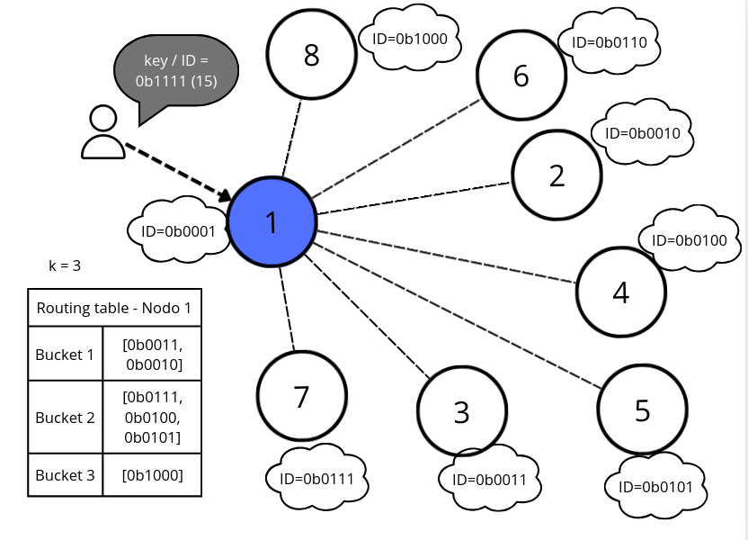

* Inicialmente existe una transacción iniciada desde el propio nodo, siendo el que podríamos denominar el nodo propietario.
* En este ejemplo no veremos cada paso de la transacción (depende de cada red p2p), nos centraremos como en base a un identificador o key que hace referencia al recurso (normalmente su hash), se realiza una solicitud para guardar en la DHT. Este recurso puede representar datos como archivos, fragmentos de archivos, metadatos, bloques de datos en una blockchain, o cualquier otro recurso específico que la red P2P esté diseñada para gestionar.
* El nodo 1, que recibe la petición, tiene inicialmente agrupados en buckets los diferentes nodos que conoce, siendo los nodos con:
  * En bucket 0: no tiene.
  * En bucket 1: ID 3 (0b0011), ID 2 (0b0010).
  * En bucket 2: ID 7 (0b0111), ID 4 (0b0100), ID 5 (0b0101).
  * En bucket 3: ID 8 (0b1000).

*Calcular cercanía según objetivo (simplificado)*:

Como comentamos se hacen a un conjunto de nodos los responsables del dato y esto se basa en la "cercanía", por lo tanto, en base al key objetivo `0b1111` (15) si lo expresamos de una forma simplificada, consiste en calcular la cercanía de ese key con todos los ID de nodos en la routing table, es decir, la operación sería:

```plaintest
0b0011 XOR 0b1111 = 0b1100 (12)
0b0010 XOR 0b1111 = 0b1101 (13)
0b0111 XOR 0b1111 = 0b1000 (8)
0b0100 XOR 0b1111 = 0b1011 (11)
0b0101 XOR 0b1111 = 0b1010 (10)
0b1000 XOR 0b1111 = 0b0111 (7)
```

Y claro está ordenados sería:

```plaintest
0b1000 XOR 0b1111 = 0b0111 (7)
0b0111 XOR 0b1111 = 0b1000 (8)
0b0101 XOR 0b1111 = 0b1010 (10)
0b0100 XOR 0b1111 = 0b1011 (11)
0b0011 XOR 0b1111 = 0b1100 (12)
0b0010 XOR 0b1111 = 0b1101 (13)
```

Y como sólo queremos 3, porque k = 3, nos quedaríamos los 3 primeros, es decir con: `[0b1000, 0b0111, 0b0101]`

*Calcular cercanía según objetivo (real)*:

Se ha expuesto cómo se calcula la cercanía para entenderlo, pero realmente no es así, es una simplificación, realmente tener los nodos agrupados por buckets sirve para algo, sirve para agilizar este proceso de enrutamiento:

Partiendo de esta información:

```plaintest
Nodo local: 0b0001 (1)
Clave objetivo: 0b1111 (15)
```

Se calcula la distancia entre el ID objetivo `0b1111` (15) y el ID de nodo (que es cómo está ordenada la routing table):

```plaintest
0b0001 XOR 0b1111 = 0b1110
```

Este resultado `0b1110`, de derecha a izquierda y empezando de 0, tiene el bit más significativo en la posición 3:

| 3 ◄ | 2 | 1 | 0 |
| - | - | - | - |
| 1 | 1 | 1 | 0 |

Sabiendo que es el bucket 3, se localiza en la routing table siendo el único, el nodo `0b1000`.

Como k = 3, aún le faltan 2 nodos, asi que luego va al bucket anterior más cercano al 3, es decir, al bucket 2 y ahora tiene que buscar la cercanía en ese bucket:

```plaintest
0b0111 XOR 0b1111 = 0b1000 (8)
0b0100 XOR 0b1111 = 0b1011 (11)
0b0101 XOR 0b1111 = 0b1010 (10)
```

Completando finalmente como nodos: `[0b1000,0b0111,0b0101]`, que si lo revisas con el método simplificado, verás que da el mismo resultado, pero claro está, ha costado menos obtenerlo.

Se debe aclarar que:

* Este cálculo determinista de la cercanía, basado en operaciones XOR, asegura que independientemente del nodo y de su tabla de enrutamiento, siempre se elijan los nodos más cercanos a la clave objetivo.
* El propio nodo que inicia la transacción, el nodo 1, no forma parte del calculo para determinar la cercanía ya que en la Routing table (tabla de enrutamiento) solo hay relación de otros nodos, no de si mismo.

*Realizando el enrutamiento (STORE)*:

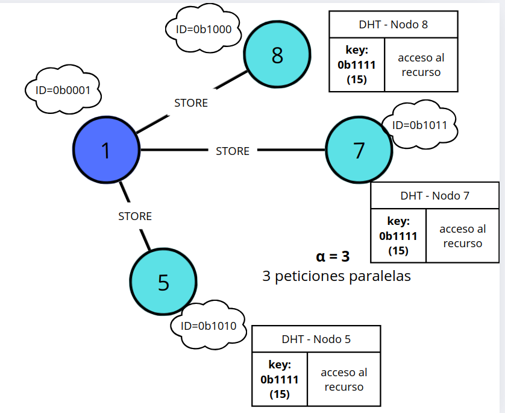

* Una vez determinados los 3 nodos más cercanos, que son los responsables del dato, el nodo 1 envía a los nodos 8, 7 y 5 el dato a guardar (W), es decir, la operación STORE en la DHT, indicando la relación key con el acceso al recurso. Se debe aclarar que:
  * El nodo 1 ha recibido la solicitud, pero como ni siquiera está entre los k nodos más cercanos, nunca puede ser responsable del dato y no lo guarda ni almacena.
  * Los nodos 8, 7 y 5 reciben el dato o recurso a guardar (el payload) y lo almacenan como corresponda, y en la DHT, siendo un índice clave/valor, se guarda normalmente la key (el hash) del dato y el acceso al payload, es decir, en la DHT no se guarda normalmente el dato o payload completo, se puede guardar su URL de recurso o IP del nodo o cualquier referencia para obtener el dato; sí se pueden guardar datos menores, pero tenemos que ver a la DHT como una especie de índice.

**En el caso de leer (R)**.

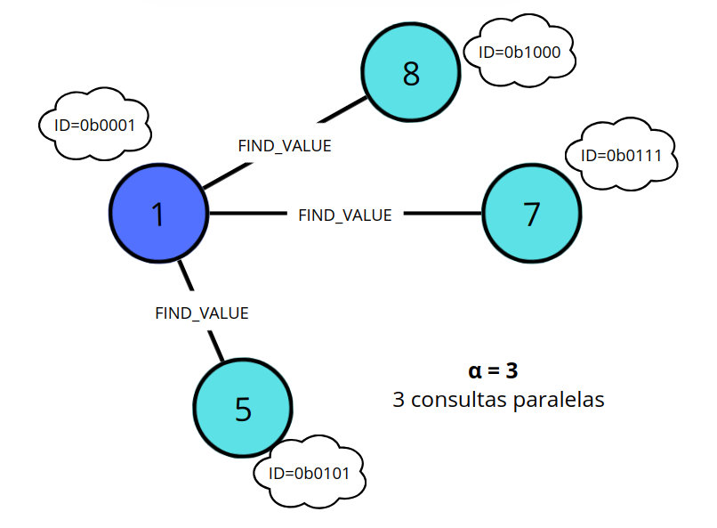

* Cuando el nodo 1 consulta a los nodos cercanos, se realizan hasta α (alfa) consultas concurrentes, FIND_VALUE, indicando el objetivo de key `0b1111` (15) para obtener el valor.

  > No existe propagación entre los nodos, el nodo 1 es el único que consulta.

*Viéndolo en detalle*:

https://github.com/user-attachments/assets/3fab399e-2cfa-4887-a180-c0b6bebadcb6

* Por ejemplo el nodo 7, al recibir la petición de consulta, en primer lugar se asegura de nuevo que es un nodo cercano a la key solicitada y luego busca en su DHT la key `0b1111` para devolver el acceso al recurso, como podría ser su propia dirección IP o cualquier otra forma que permite al nodo 1 descargar o acceder al payload del nodo 7.

  > Se asegura que es el nodo cercano aunque parezca redundante por coherencia, es una validación que suele hacer el nodo para asegurar que solo los nodos responsables al recurso lo pueden devolver. Si fuera el caso que no lo es, como veremos a continuación, lo que hará el nodo es buscar los nodos que son mas cercanos para devolver esa información.

**En el caso de leer (R) pero el nodo no es responsable**.

https://github.com/user-attachments/assets/030f762d-3a4c-470e-98d6-ca8158fcbd31


* En este ejemplo, los nodos 8, 7 y 5 son los responsables del recurso, pero en un momento dado se pueden caer varios nodos y el nodo 1 por descarte, podría usar un nodo donde no se escribió el recurso, como podría ser el nodo 3.
* El nodo 3, recibe la petición, tiene registros en la DHT para otras key, pero no para la key `0b1111` (15) porque no es el responsable del dato.
* En ese caso, el nodo 3 consultado no puede devolver el acceso al recurso, pero sí los otros nodos que conoce que podrían ser responsables del dato, por lo tanto, inicia el proceso de calcular la cercanía del key del recurso.
* Gracias a que este cálculo es determinista, el nodo 3 es capaz de devolver que los nodos con ID 8 y 5 son los responsables del recurso, como en efecto es; es decir, el calculo de cercanía XOR ha dado los mismos nodos responsables independientemente del nodo consultado.
  
##### Aclaraciones routing

**¿Es esta la forma más optima?**

El concepto de DHT se refiere a una tabla hash distribuida que permite localizar recursos entre nodos. Kademlia es una implementación concreta que organiza la información usando una métrica de distancia basada en XOR. Cada sistema puede adaptar el protocolo según sus necesidades, por ejemplo, mediante un método PROVIDE como en IPFS para anunciar la posesión de un contenido, permitiendo que otros nodos almacenen también esa asociación en la DHT según sus necesidades o demanda del usuario.

**¿La búsqueda de un dato es exponencial si el nodo no lo encuentra?**

Si el nodo consultado no es responsable del dato, consultará a otro y asi sucesivamente, podemos pensar que esto no es optimo, pero no es una consulta exponencial, es logarítmica, en concreto se le denomina tiempo logarítmico.

El tiempo logarítmico significa que el número de pasos crece como log₂(N), es decir, muy lentamente en relación al tamaño de la red.

> No voy a entrar mucho en detalle en esto y tampoco es lago que he mirado mucho, si tienes interés puede ir este enlace de [freecodecamp.org](https://www.freecodecamp.org/espanol/news/hoja-de-trucos-big-o).

En una DHT como Kademlia, esto permite localizar datos eficientemente incluso con miles o millones de nodos.

#### Técnicas de difusión en redes no estructurabas  

Son técnicas propias de las redes no estructuradas y se aplican cuando es necesario gestionar una operación, lo que sería comúnmente atender una solicitud de escritura (W) o lectura (R).

> Al igual que el enrutamiento gestiona las operaciones en redes estructuradas, en las redes no estructuradas se emplean técnicas de difusión, ya que, al no haber una relación directa entre nodos y datos, las solicitudes deben propagarse entre múltiples nodos para tratar la información.

Estas técnicas se aplican por lo tanto en cualquier momento que sea necesario, según sea solicitada la operación.

La difusión en este contexto de redes p2p, son técnicas para transmitir o consultar información desde un nodo origen hacia múltiples nodos en una red, pero además, en la mayoría de protocolos de redes no estructuras, se produce una propagación, donde a diferencia de una difusión simple, los nodos que reciben la petición se comportan como agentes intermedios que replican la petición. Cuando son consultas, se denominan comúnmente **propagación de consultas** (Query Propagation):

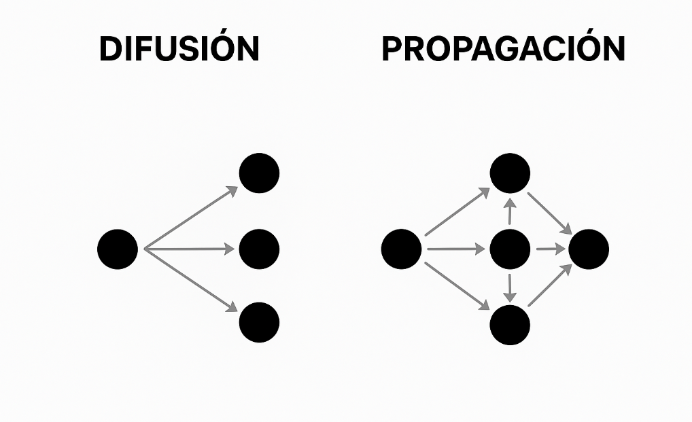

> PD: No debemos confundirlo con la [difusión amplia](https://es.wikipedia.org/wiki/Difusi%C3%B3n_amplia) de las telecomunicaciones, que se refiere a la transmisión o consulta de información desde un nodo origen hacia múltiples en una red distribuida.

Como explicamos, el protocolo que destaca en la Web3 es Gossip, y para entenderlo mejor, veremos un ejemplo:

**En el caso de escribir (W)**.

https://github.com/user-attachments/assets/3559679f-0565-4cbb-8731-9b777d0774d2

* Inicialmente existe una transacción iniciada desde el propio nodo o de un cliente ligero.
* En este ejemplo no veremos cada paso de la transacción (depende de cada red p2p), nos centraremos en lo que sería una escritura (W), donde se difunde la información desde el nodo 1 hasta el resto de nodos conocidos como el 6, 2, 3 y 5. El k o fan-out (abanico), se refire a la cantidad de peticiones paralelas que se realizan y no se debe confundir con los k-buckets de DHT...

  > Valores comunes de fan-out en gossip suelen estar entre 3 y 10, dependen del tamaño de la red y del tipo de gossip. En este ejemplo se representa una ronda de 4 peticiones.

* A modo de ejemplo, en los nodos 4 y 5 se representa el límite saltos (hops) de propagación, lo que sería el [TTL](https://es.wikipedia.org/wiki/Tiempo_de_vida_(inform%C3%A1tica)), o tiempo de vida, pero en realidad no se basa en tiempo, es un formalismo, son límites de saltos (hops), que suele ser normalmente de 3 a 8.

**En el caso de leer (R)**.

https://github.com/user-attachments/assets/5b70496b-4edb-482f-981e-10439aa5ac84

* En la propagación de consulta o Query propagation, la petición que realiza el nodo, en principio, no difiere mucho a la escritura que vimos con anterioridad, es decir, se realiza la petición a los nodos conocidos y estos devolverán el resultado **y adicionalmente** la lista de nodos conocidos, porque no debemos olvidar que la propagación de consulta se usa también para el descubrimiento de nuevos nodos.
* Se dice que se devuelve el dato, pero igualmente como ocurre en las redes estructuradas, dependiendo de la red puede ser un enlace para descargar el payload, como una IP u otra forma de acceso...
* Aunque no difiere mucho la petición, ahora veremos en detalle que es diferente la respuesta si se devuelve el primer resultado encontrado (first-match), o si se espera multiples resultados de los nodos involucrados (multi-match).

**Propagación de consulta First-match**.

https://github.com/user-attachments/assets/2cb539b1-a071-4da5-93be-d55e6acd1c64

* Si el nodo 3 recibe una petición de consulta y lo tiene disponible, proporciona la respuesta.

https://github.com/user-attachments/assets/b5f6b93a-7788-4db2-8219-58a40820b30a

* Si el nodo 3 no tiene el dato, consultará al nodo 5 y continuará hasta encontrarlo o alcanzar el límite de saltos (TTL).

**Propagación de consulta Multi-match**.

https://github.com/user-attachments/assets/7de09313-e189-456d-bcbd-d21ece7f0ddf

* Si el nodo 3 recibe la petición, continuará propagando la consulta hasta el último salto posible (TTL).
* La respuesta final que recibe el nodo 1 es la acumulación de todas las respuestas de los nodos que han participado.

##### Aclaraciones técnicas de difusión

**¿La consulta es exponencial?**

La propagación de consultas puede crecer de forma cuasi-exponencial en los primeros saltos, pero no se considera formalmente exponencial, sino ineficiente y no acotada logarítmicamente.

#### Comprobación de conectividad

La comprobación de conectividad en redes P2P es fundamental no solo para asegurar que los nodos están activos y disponibles, sino también por motivos de seguridad y resiliencia: evita ataques de enrutamiento, reduce la propagación hacia nodos muertos y permite una respuesta efectiva ante cambios dinámicos en la red (churn).

Este proceso varía según el tipo de red:

* En redes estructuradas (como DHTs), los nodos realizan comprobaciones periódicas (PING/PONG o heartbeats) a los pares en sus tablas de enrutamiento para detectar inactividad y mantener la tabla actualizada. Además, los datos almacenados en la DHT suelen tener un tiempo de vida limitado (TTL); si el nodo propietario del dato —es decir, el que lo publicó inicialmente— no lo vuelve a anunciar (por ejemplo, mediante operaciones STORE), el dato puede desaparecer. Por ello, es común que este nodo lo anuncie periódicamente.
* En redes no estructuradas, la comprobación de conectividad suele integrarse en los propios mecanismos de propagación, es decir, cuando una operación es solicitada, ya que como vimos, realizar una consulta también supone obtener información de nodos, aunque también hay comprobaciones periódicos que ayudan (por ejemplo, mediante mensajes PING/PONG o heartbeats) a identificar nodos activos y a eliminar de la lista de vecinos aquellos que no responden.

En ambos modelos, la comprobación de conectividad es clave para preservar la salud de la red, gestionar la rotación constante de nodos inactivos (churn) y garantizar la resiliencia y disponibilidad de la red.

#### Establecimiento de la conexión

Es el proceso mediante el cual un nodo inicia comunicación y abre un canal de comunicación (por ejemplo, vía TCP o UDP o QUIC) con otro nodo previamente descubierto o conocido para cualquiera de las operaciones necesarias posteriores, como realizar una consulta o propagar información.

Es importante distinguir entre el establecimiento de la comunicación y la transferencia de información: establecer comunicación entre nodos de red significa que ambos pueden reconocerse y abrir un canal de conexión, pero esto no implica que se estén transmitiendo datos útiles (payload). La transferencia de información ocurre después, cuando los nodos ya conectados intercambian mensajes o datos concretos a través del canal previamente establecido. Así, el establecimiento de la conexión es el paso previo y necesario para que la transferencia de información pueda producirse, pero ambos procesos son independientes y pueden ocurrir en momentos distintos.

La comunicación entre dos nodos puede ser activa, o mantenerse con una actividad mínima mediante mecanismos como [keep-alive](https://en.wikipedia.org/wiki/Keepalive), que permiten conservar la conexión abierta enviando mensajes periódicos para evitar su cierre por inactividad.

Este proceso puede incluir el uso de comunicación cifrada ([TLS](https://es.wikipedia.org/wiki/Seguridad_de_la_capa_de_transporte), [Noise](https://en.wikipedia.org/wiki/Noise_Protocol_Framework), etc.).

Igualmente, cuando la comunicación directa entre nodos no es posible debido a que alguno de ellos está detrás de un NAT o firewall, se emplean técnicas de [NAT traversal](https://es.wikipedia.org/wiki/NAT_traversal), como el [UDP hole punching](https://en.wikipedia.org/wiki/UDP_hole_punching). Estas técnicas permiten que los nodos establezcan conexiones entrantes a pesar de las restricciones impuestas por el NAT, facilitando la entrada y participación en la red incluso cuando otros nodos no pueden acceder directamente a ellos. Si estas técnicas no resultan efectivas, se recurre al uso de nodos relay como intermediarios para asegurar la conectividad.

Un [Relay](https://en.wikipedia.org/wiki/Traversal_Using_Relays_around_NAT) se utiliza cuando las técnicas como hole punching no son efectivas.

https://github.com/user-attachments/assets/1e094644-53d9-45d8-b557-54ef89da4327

* Cuando otros nodos no pueden acceder al nodo 1 porque está detrás de NATs o firewalls.

https://github.com/user-attachments/assets/3fc2eeb1-e80f-4f76-87cd-ff0d0bc65344

* El nodo que no puede atender peticiones, sí puede conectarse a otro nodo relay.

  > En telecomunicaciones, cuando un nodo establece una conexión de salida hacia otro, ambos pueden enviar y recibir información, logrando comunicación duplex (half o full-duplex). Esto es posible porque la conexión abre canales bidireccionales (como sockets TCP), permitiendo el intercambio continuo de datos en ambos sentidos.

  > El uso de nodos relay puede impactar el rendimiento debido a la latencia adicional en la comunicación y plantea consideraciones de seguridad, como la confianza en el nodo relay para manejar los datos de forma adecuada.

* El nodo 1 cuando anuncie su dirección, usará la del nodo relay, de esta forma, el resto de nodos cuando quieran hacer una comunicación al nodo 1, en realidad se conectaran al nodo relay.
* El nodo relay solo actúa de intermediario de comunicaciones, cualquier otra actividad de la red se la pasará al nodo 1.

#### Transferencia de datos (Data Transfer)

La transferencia de datos en redes P2P consiste en el intercambio directo de información entre nodos que ya se han descubierto, conocen sus direcciones y han establecido una conexión.
Una vez establecida la conexión, existen principalmente dos enfoques de transmisión:

* Pull: un nodo solicita activamente la información a otro.
* Push: un nodo envía activamente información a otro sin que este la haya solicitado.

Estos enfoques suelen asociarse a:

* Redes estructuradas, donde predomina el modelo pull mediante mecanismos de enrutamiento.
* Redes no estructuradas, donde es común el modelo push mediante difusión o propagación.

La información se transfiere generalmente en fragmentos, utilizando mecanismos como hashes o checksums para garantizar la integridad de los datos.

Este proceso es independiente del establecimiento de la conexión y se enfoca exclusivamente en la transmisión de la carga útil entre los pares.

#### Técnicas de replicación

En una red p2p, hemos visto que se consideran una serie de características según su propósito de la red y entre ellas esta la [estrategia de almacenamiento](#estrategias-de-almacenamiento-en-redes-p2p), siendo la principal un almacenamiento distribuido, que permite mejorar la disponibilidad, balanceo de carga y resilencia, donde se puede aplicar algunas estrategias, algo centralizadas como servidores de índices o fragmentación (sharding).

Vemos que el almacenamiento distribuido se ve condicionado por dos topológicas de redes principales, las estructuradas, basado en DHT y las no estructuradas, donde ante una operación en las estructuradas se trabaja con enrutamiento y en las no estructuradas con la replicación, que es una técnica de difusión.

Para ambos tipos de redes, estructuradas o no, cuando existe un operación de escritura (W), se usan técnicas para replicar el contenido, para que los datos estén disponibles y mejorar ante fallos, problemas de seguridad y rendimiento.

Podemos resumirlos como los siguientes técnicas:

* Replicación Total (Full Replication), ocurre cuando cada nodo de la red almacena una copia completa de todos los datos. Muy seguro pero costoso en almacenamiento y ancho de banda. Aplica principalmente en redes no estructuradas o en arquitecturas que requieren alta disponibilidad local del historial completo.

  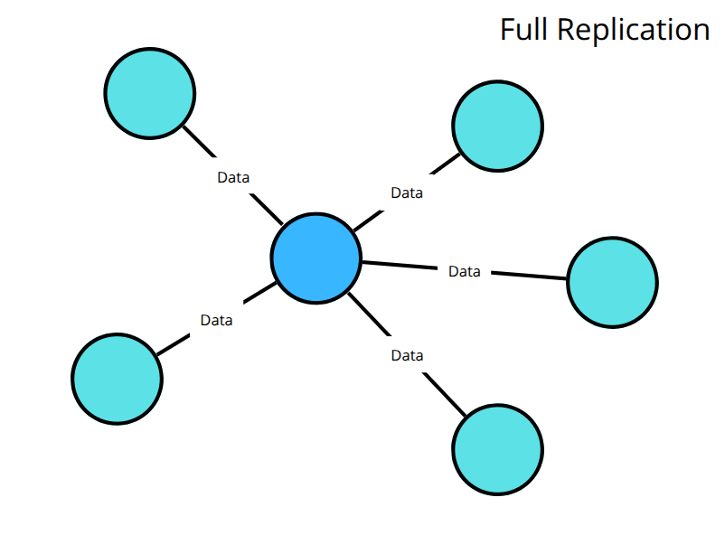

* Replicación Parcial (Partial Replication), cada nodo almacena solo una parte de los datos. Permite escalar reduciendo la carga en los nodos individuales. Es el modelo por defecto en redes estructuradas y también aplicable en redes no estructuradas más eficientes.

  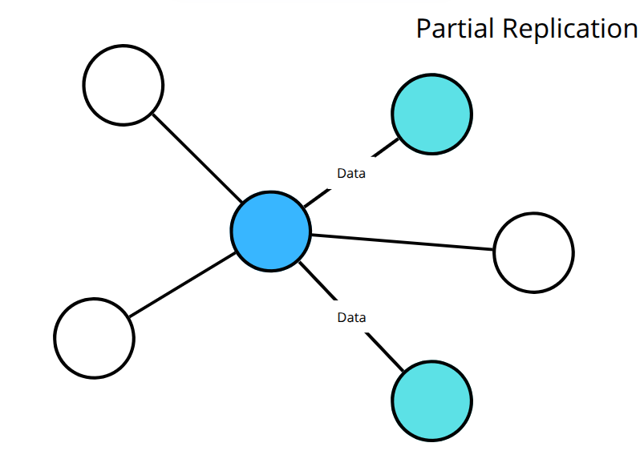

* Replicación Basada en Demanda (Demand-based Replication), los datos se replican automáticamente en los nodos que los solicitan, creando copias temporales o persistentes mediante mecanismos de caching, para que se puedan recupera para futuras solicitudes.

  

* Replicación Dirigida por el Usuario (User-driven Replication), el usuario selecciona explícitamente qué datos mantener replicados de forma persistente, independientemente de si han sido solicitados o no. Ejemplo: el pinning manual en IPFS, donde se fija contenido en un nodo incluso si no se ha accedido previamente.

  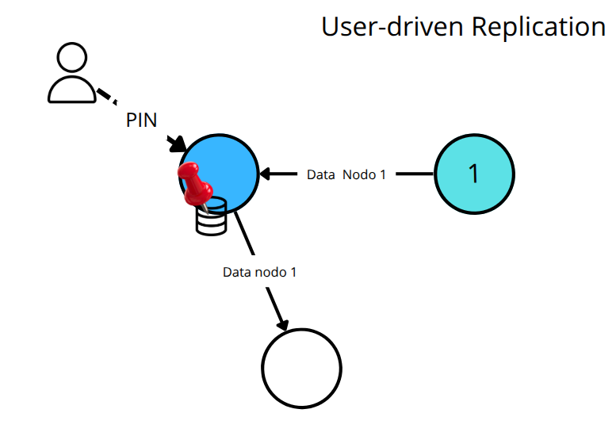

* Replicación Basada en Fiabilidad (Reliability-based Replication), los datos se replican preferentemente en nodos más confiables y disponibles. Optimiza disponibilidad según la reputación, el rendimiento o contratos incentivados. Aplica típicamente en redes estructuradas con capas adicionales de selección de nodos. Ejemplos: Filecoin, [Storj](https://www.storj.io/).

  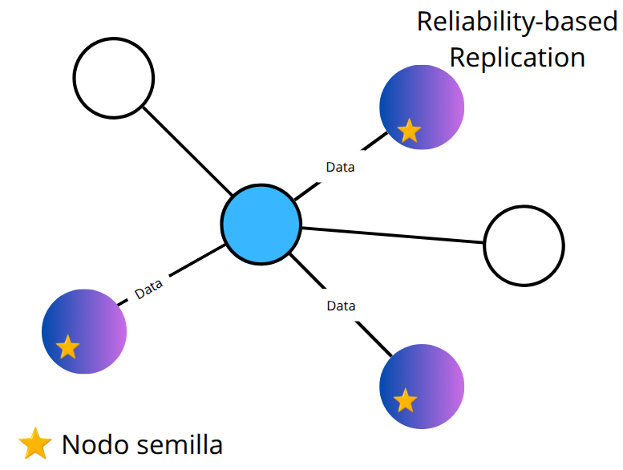

* Replicación Basada en Redundancia Controlada (Controlled Redundancy Replication), se establece un número fijo o mínimo de copias para cada dato para garantizar disponibilidad. Común en redes estructuradas que utilizan parámetros como el factor k para redundancia. Ejemplos: Filecoin (usa acuerdos de almacenamiento —deals— que especifican cuántas copias deben mantenerse del dato), Kademlia (mantiene cada valor replicado en los k nodos más cercanos al hash de la clave para asegurar redundancia y disponibilidad).

  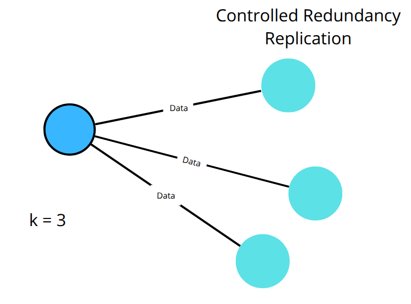

* Replicación Basado en Proximidad (Proximity-based Replication), los datos se almacenan preferentemente en nodos cercanos geográficamente o en red para mejorar el acceso. Ejemplo: redes de distribución de contenido p2p, tipo [CDN](https://es.wikipedia.org/wiki/Red_de_distribuci%C3%B3n_de_contenidos).

  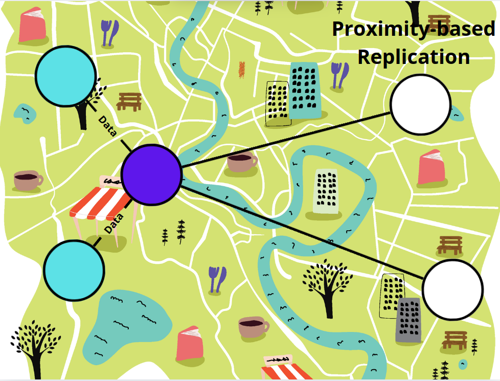

> Estas técnicas no son excluyentes, una red puede aplicar varias, a no ser que sea excluyentes y pueden existir variantes. Por ejemplo, una red podría tener replicación parcial basado en proximidad y dirigido por el usuario.

#### Modelos de consistencia

Establece el grado de consistencia con el que los datos replicados en los distintos nodos permanecen sincronizados tras una operación de escritura (W), determinando cuándo y cómo se consideran confirmados para garantizar que una lectura posterior (R) devuelva información coherente y actualizada.

Existen normalmente los siguientes modelos que una red p2p puede usar:

* Consistencia fuerte (Strong consistency), implica que después de una escritura, todas las lecturas en cualquier nodo reflejan el valor más reciente, por lo tanto, se espera confirmación de los nodos relevantes (como nodos validadores) antes de finalizar la escritura

  https://github.com/user-attachments/assets/1625d492-da22-487a-bed9-14b7df863b67

  > En este ejemplo, un dato escrito (W) por el nodo emisor que es cliente, debe ser replicado y luego confirmado por el conjunto de nodos relevantes, como serían los nodos validadores, en este ejemplo solo habría un nodo validador, de color azul.

* Consistencia eventual (Eventual consistency), los nodos se sincronizan con el tiempo, sin garantizar cuándo y no se espera una confirmación de escritura.

  https://github.com/user-attachments/assets/d470620e-c290-45c5-81ab-ffd6d2f70541

  > En consistencia eventual, no espera confirmación.

* Consistencia de lectura tras escritura (Read-your-writes consistency), es como en consistencia eventual, pero se garantiza que el nodo cliente que escribió el dato, si lo consulta posteriormente lo tendrá disponible. No implica que el cliente siempre vea su dato si otro nodo lo sobrescribió después.
  
  https://github.com/user-attachments/assets/b88b2dd3-32d7-477e-a631-db3d55d56371

  > En este ejemplo, el nodo emisor pregunta de forma posterior y se asegura la respuesta correcta gracias a que guardó una caché. No significa que consistencia eventual no lo haga, simplemente aquí se asegura.

* Consistencia causal (Causal consistency), garantiza que los eventos relacionados por causa-efecto se vean en el mismo orden por todos los nodos. Es decir, si un evento A influye en B, todos los nodos deben ver A antes que B.

  https://github.com/user-attachments/assets/ccc6366f-09fe-4088-a623-bc9b2b58a2a2

  > Se logra controlando el orden de entrega, en el ejemplo, se entrega C cuando llega porque no tiene una causa y efecto, sin embargo, sólo entrega B si entrego antes A.

* Consistencia secuencial (Sequential consistency), asegura que todas las operaciones se vean en el mismo orden global, aunque ese orden no sea necesariamente el real (cronológico). En causal, solo se respeta el orden entre operaciones que tienen dependencia (causa-efecto), pero en secuencial, todas las operaciones (incluso no relacionadas) deben verse en el mismo orden global por todos los nodos.

  https://github.com/user-attachments/assets/a21b72f0-36c0-457e-9010-6bb3670daebc

  > Se logra controlando el orden de entrega, en el ejemplo, como el orden es A, B y C, asi debe hacerlo el nodo que debe replicar la escritura, incluso aunque en un momento dado podría haber entregado C antes que B.

**Aclaraciones**:

* En la práctica, las redes P2P rara vez implementan consistencia fuerte debido a sus problemas en rendimiento y disponibilidad, por lo tanto, suelen preferir consistencia eventual.
* Una red p2p puede seguir varios modelos, si no son contradictorios, por ejemplo, ser causal y eventual, etc.

### Resumen de métodos en Kademlia y patrones de operaciones en Gossip

Tras la explicación sobre redes estructuradas y no estructuradas, presentamos un resumen claro de las principales operaciones RPC en Kademlia y los patrones de operación más comunes en Gossip. Este resumen facilita la comprensión y completa los conceptos expuestos.

**Kademlia**.

En Kademlia, los métodos principales (RPCs) son:

* PING: Verificar si un nodo está activo y disponible en la red. Ejemplo: El nodo A envía un PING al nodo B para comprobar si sigue conectado; si B responde, se considera activo.
* STORE: Solicitar a un nodo que almacene un par (clave, valor) en su DHT local. Ejemplo: El nodo A quiere guardar el archivo X, calcula su hash como clave y envía un STORE al nodo B para que almacene (hash_X, dirección_dato_X).
* FIND_NODE: Buscar los nodos más cercanos a un identificador objetivo (ID), útil para localizar responsables de una clave. Ejemplo: El nodo A busca el nodo responsable del ID 0x1234, así que envía FIND_NODE a sus vecinos; cada nodo responde con los contactos más cercanos a 0x1234 que conoce.
* FIND_VALUE: Buscar el valor asociado a una clave; si el nodo consultado no tiene el valor, responde con los nodos más cercanos a esa clave. Ejemplo: El nodo A busca el archivo con hash 0xABCD. Envía FIND_VALUE a B; si B tiene el archivo, lo devuelve, si no, responde con una lista de nodos más cercanos a 0xABCD.

**Gossip**.

En gossip no hay métodos estándar, pero suelen usarse patrones comunes:

* GOSSIP / PUSH: Enviar datos nuevos a un subconjunto de sus vecinos. Ejemplo: Cuando un nodo recibe un bloque nuevo en una blockchain, lo reenvía automáticamente a 3-5 vecinos seleccionados al azar.
* PULL: Solicitar periódicamente a sus vecinos si tienen datos nuevos o actualizaciones. Ejemplo: Un nodo pregunta cada cierto tiempo a sus pares si conocen transacciones recientes que él aún no ha recibido.
* PUSH-PULL: Combina ambos enfoques: Enviar datos nuevos a sus vecinos (push) y también solicitan actualizaciones (pull), mejorando la propagación y reduciendo redundancias. Ejemplo: Al recibir un mensaje, un nodo lo reenvía a sus vecinos y, además, les pregunta si tienen otros mensajes que él no conoce.
* IHAVE / IWANT (en algunos protocolos): Anunciar a sus vecinos qué datos posee (`IHAVE`), y los vecinos pueden solicitar explícitamente los que les faltan (`IWANT`). Ejemplo: En Gossipsub (libp2p), un nodo anuncia que tiene los bloques A, B y C; los vecinos responden pidiendo solo el bloque B si es el único que no tienen.

### Clasificación y roles de los nodos

Vemos que un nodo que participa en una red P2P debe soportar aspectos de la red como una [estrategia de almacenamiento](#estrategias-de-almacenamiento-en-redes-p2p), un [modelo de confianza](#modelo-de-confianza), un [modelo de autorización](#modelo-de-autorización), o cierto nivel de centralización según el [grado de descentralización](#grado-de-descentralización). Por eso, es normal que existan nodos especializados de una clase y sobre todo que asuman roles concretos según el contexto.

No es común hablar de “clasificar” un nodo en redes P2P con protocolos heterogéneos entre iguales. En estos casos, los nodos suelen asumir roles específicos dependiendo del contexto, incluso si su participación se centra principalmente en una función concreta dentro de la red.

Que un nodo ejerza un rol ayuda a distribuir tareas, optimizar recursos y mejorar la eficiencia del sistema.

Estos roles pueden ser dinámicos (un nodo puede cambiar de rol según las necesidades de la red) o fijos (asignados de forma permanente o por configuración).

Un mismo nodo puede desempeñar varios roles simultáneamente, dependiendo de su capacidad, permisos y configuración. La asignación de roles puede estar determinada por el protocolo, la reputación del nodo, incentivos económicos o la propia elección del usuario.

A continuación, se presentan las clasificaciones y roles que un nodo puede asumir normalmente en una red P2P:

#### Clasificación por capacidad

Un nodo puede clasificarse según su capacidad y presencia en la red e incluso ejerciendo funciones que otro nodo de la red no tiene, afectando al grado de descentralización.

> Es casi la única clasificación que se puede encontrar a un nodo en una red p2p.

A continuación, listamos estos tipos de nodos como:

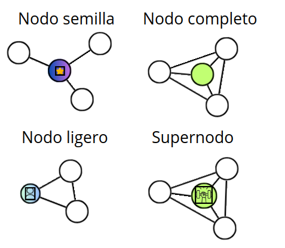

* Nodo semilla o bootstrap (como ya vimos...), nodo con una dirección conocida y accesible, usado por nodos nuevos para descubrir y conectarse inicialmente a la red. No desempeña un rol funcional continuo, pero es esencial para el arranque de la red.
* Nodo ligero (Light client), no almacena todos los datos (lo que se conoce como el estado) o el historial completo. Depende de nodos completos para verificar información mediante pruebas (ej. Merkle proofs).
  > En algunas redes modernas (ej. Mina Protocol), los light clients pueden verificar sin full nodes gracias a [zk-proofs](https://es.wikipedia.org/wiki/Prueba_de_conocimiento_cero). 🎓 Los zk-proofs requieren un estudio aparte en este repositorio, por lo tanto, no profundizaremos mucho más que este comentario.
* Nodo completo (Full node), mantiene el estado completo y todo el historial reciente o, en algunos casos, solo una parte relevante del historial si opera en modo "pruned node" (nodo podado). Puede validar, ejecutar, propagar transacciones y bloques, y servir datos a otros nodos. Está capacitado para ejercer cualquier rol funcional dentro de la red.
* Supernodo (Supernode), es un nodo completo que, además de las funciones básicas, asume tareas adicionales como coordinación, enrutamiento o gestión de recursos. Los supernodos suelen tener mayor capacidad (ancho de banda, almacenamiento, disponibilidad) y pueden actuar como intermediarios o facilitadores para otros nodos menos capaces. Su uso introduce cierto grado de centralización parcial, aunque siguen formando parte de la red P2P.
  > Supernodo se utiliza en varias redes P2P, aunque no es obligatorio en todas. Su presencia depende del diseño y necesidades de la red.

#### Roles operativos

Son las diferentes tipos de operaciones que pueden asumir los nodos durante la ejecución del protocolo. Puede ser:

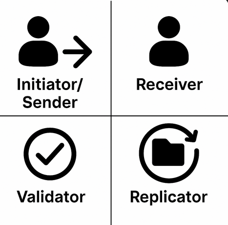

* Nodo emisor (Initiator/Sender), inicia solicitudes o transacciones, como la publicación de datos, envío de mensajes o peticiones de recursos. También puede denominarse nodo propietario del dato, especialmente cuando es quien origina o mantiene el recurso en la red.
* Nodo receptor (Receiver), recibe y procesa solicitudes o datos enviados por otros nodos.
* Nodo validador (Validator), verifica la validez de transacciones, bloques o datos antes de aceptarlos y propagarlos. Es fundamental en redes blockchain y sistemas que requieren consenso.
* Nodo replicador (Replicator), se encarga de almacenar y replicar datos para asegurar la disponibilidad y redundancia en la red.

#### Roles funcionales

Definen las funciones que los nodos asumen en la red según las necesidades operativas:

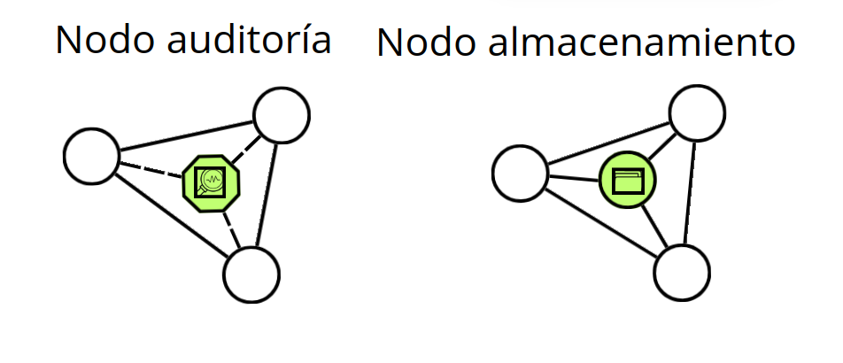

* Nodo de monitorización/auditoría (monitoring/auditing node), recopila métricas, verifica el estado de la red o audita transacciones para propósitos de análisis, seguridad o cumplimiento.
* Nodo de almacenamiento dedicado (Dedicated storage node), especializado en almacenar grandes volúmenes de datos o archivos.

> Dependerá siempre de la red p2p, existiendo, claro esta, muchos más...

#### Roles de infraestructura

Son aquellos nodos o incluso servidores que facilitan el funcionamiento básico y la conectividad de la red. Estos nodos cumplen funciones como conectar partes de la red, facilitar la comunicación entre nodos, o servir de enlace con otras redes o sistemas externos. Aunque no siempre están presentes en todas las redes P2P, su existencia puede ser clave para mejorar la accesibilidad, la interoperabilidad y la robustez de la red.

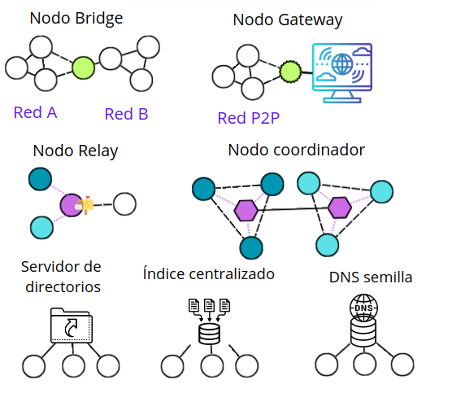

* Nodo puente (bridge), permite la comunicación entre diferentes redes P2P, facilitando el intercambio de datos o mensajes entre ellas.
* Nodo gateway o pasarela, conecta la red P2P con sistemas externos, como APIs, clientes ligeros o redes tradicionales, permitiendo la interoperabilidad y el acceso desde fuera de la red.
* Nodo coordinador, coordina y gestiona la comunicación, sincronización o reparto de tareas entre diferentes nodos o subredes. Por ejemplo, en un sistema de sharding, el nodo coordinador se encarga de asignar nodos a cada shard, coordinar la comunicación entre shards y asegurar la consistencia global de la red.
* Nodo relay, intermedia la transmisión de mensajes o datos entre nodos que no pueden establecer conexión directa, por ejemplo, cuando alguno está detrás de un NAT o firewall, o también puede actuar como relay entre subredes o shards para facilitar la comunicación y sincronización entre ellas.
* Servidor de directorios o índices centralizados, ofrece un punto de descubrimiento o consulta para que los nodos encuentren recursos, pares o contenidos dentro de la red. Aunque introduce centralización, mejora la eficiencia inicial del acceso.
* Servidor DNS semilla (seed DNS), proporciona una lista inicial de nodos conocidos (habitualmente nodos completos o bootstrap) para facilitar la incorporación de nuevos participantes. Suelen ser usados en redes como Bitcoin al inicio de la conexión.

### Dominios funcionales

Un dominio funcional en una red P2P, es una agrupación lógica de nodos que colaboran para desempeñar una función específica dentro de la red, como enrutamiento, indexación, etc **integrado dentro de la misma red**.

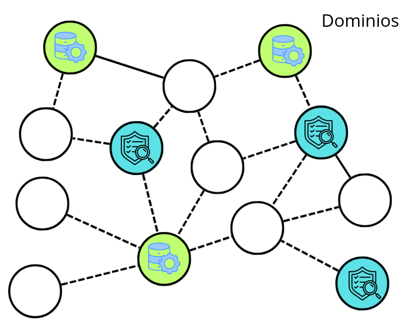

  > Por ejemplo en este nodo hay dominios de almacenamiento y auditoria integrados en la red.

Estos dominios pueden estar compuestos por nodos de distintas clases, ya sea según su [capacidad](#clasificación-por-capacidad), o más comúnmente, según su rol de [infraestructura](#roles-de-infraestructura), [funcional](#roles-funcionales) u [operativo](#roles-operativos). En menor medida, también pueden estar compuesto por nodos de diferente [nivel de autorización](#modelo-de-autorización) o [confianza](#modelo-de-confianza).

> Incluso cuando existe un conjunto de nodos semilla —que en principio no ejercen un rol funcional específico—, al integrarse en un dominio funcional su función principal es proporcionar disponibilidad y facilitar el acceso inicial al resto de la red P2P.

**Ejemplos de dominios funcionales**.

* Dominio de almacenamiento, un grupo de nodos que colaboran para almacenar y replicar archivos, independientemente de su nivel de autorización. Por ejemplo, en IPFS, cualquier nodo puede unirse al dominio de almacenamiento si cumple con los requisitos de espacio y disponibilidad.
* Dominio de auditoría, nodos de diferentes clases (algunos con autorización elevados, otros públicos) que cooperan para verificar la integridad de los datos o transacciones. En una red blockchain, pueden existir nodos auditores que revisan bloques, aunque no todos tengan el mismo nivel de confianza.
* Dominio de indexación, nodos ligeros y completos que mantienen índices distribuidos para facilitar búsquedas rápidas, sin importar su rol principal en la red.
* Dominio de validación, nodos validadores y supernodos que participan en la validación de transacciones, donde algunos pueden tener permisos especiales y otros actuar como observadores.
* Dominio de monitoreo, nodos de diferentes niveles de confianza que recopilan métricas y supervisan el estado de la red, pudiendo incluir tanto nodos internos como externos.

Estos nodos pueden cooperar activamente entre sí y establecer una topología funcional propia y dinámica, optimizada para la función que desempeñan, **pero** sin dejar de estar integrados en la topología general de la red.

Su pertenencia puede ser temporal o permanente, dependiendo de la función que se requiera en cada momento.

Un mismo nodo puede pertenecer a varios dominios funcionales simultáneamente si cumple con los requisitos de cada función.

La especialización de nodos en funciones específicas puede mejorar la eficiencia de la red, pero también puede disminuir el [grado de descentralización](#grado-de-descentralización) si un número reducido de nodos concentra dichas funciones en detrimento de la participación equitativa del resto.

### Subredes lógicas en redes p2p

Las subredes lógicas, son agrupaciones de nodos dentro de una red P2P que colaboran para cumplir una **función específica** de forma independiente a la red principal.

> A diferencia de los [dominios funcionales](#dominios-funcionales) donde los nodos cooperan en la misma red, las subredes implican una separación topológica y una segmentación de la red.

Estas subredes, cono en los dominios funcionales, pueden estar compuestos por nodos de distintas clases, ya sea según su [capacidad](#clasificación-por-capacidad), o más comúnmente, según su rol de [infraestructura](#roles-de-infraestructura), [funcional](#roles-funcionales) u [operativo](#roles-operativos). En menor medida, también pueden estar compuesto por nodos de diferente [nivel de autorización](#modelo-de-autorización) o [confianza](#modelo-de-confianza).

Las subredes lógicas pueden operar bajo el mismo protocolo principal de la red, lo cual es lo más habitual, pero también pueden implementar subprotocolos específicos para adaptarse a necesidades concretas de la subred. Por ejemplo, en algunas blockchains, ciertos shards o subredes pueden utilizar un protocolo de consenso diferente al de la red principal para optimizar el rendimiento o la seguridad en función de los requisitos de cada fragmento.

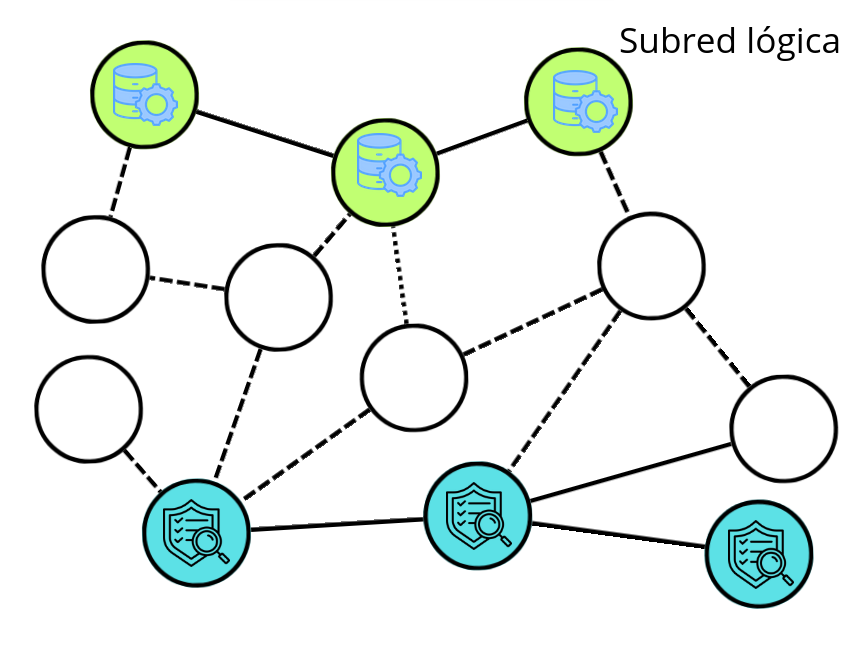

**Ejemplos de subredes lógicas**.

* Redes híbridas (público-privadas), redes con [modelo de gobernanza](#modelo-de-gobernanza) consorcios o entornos empresariales, donde se requiere restringir el acceso a determinados recursos, operaciones o datos. Por ejemplo, una red blockchain puede tener una subred pública abierta a cualquier participante y otra subred privada donde solo entidades autorizadas pueden validar transacciones o acceder a información confidencial.
* Subredes de validadores autorizados en blockchains permisionadas.
* Grupos privados de almacenamiento o intercambio de datos dentro de una red P2P pública.

Estas subredes permiten especializar a nodos en funciones  mejorando la eficiencia. Sin embargo, pueden reducir el [grado de descentralización](#grado-de-descentralización), ya que ciertos nodos o grupos asumen más responsabilidad o visibilidad. Por tanto, su uso implica un equilibrio entre rendimiento, seguridad y descentralización.

#### Subredes para la escalabilidad: Sharding

Estas subredes permiten **paralelizar** procesos, lo que mejora significativamente la escalabilidad; a este enfoque se le conoce como Sharding (fragmentación).

> 🎓 Generalmente, cuando en redes p2p se habla de redes adicionales a la principal, suele hacerse referencia al sharding, cuyo objetivo principal es mejorar la escalabilidad mediante la paralización de procesos. No es común utilizar el término "subredes lógicas"; este se emplea más bien para describir agrupaciones de nodos que, aunque forman parte de la misma red, cumplen funciones específicas o tienen restricciones de acceso, como en el caso de una red público-privada. La diferencia clave es que el sharding fragmenta la red para distribuir la carga de trabajo, mientras que las subredes lógicas segmentan la red según criterios funcionales o de acceso.

Es una técnica que divide la red en fragmentos (shards), cada uno de ellos responsable de procesar y almacenar subconjuntos de datos y transacciones en paralelo, fragmentando el estado de la red.

Mejora la escalabilidad en redes P2P al distribuir la carga, ya sea geográficamente, por tipo de operación solicitada o función concreta que se asigna a un conjunto de nodos.

> No es correcto considerar los shards como una red superpuesta (overlay network); en este contexto, los shards funcionan como subredes independientes, aunque relacionadas entre sí y con la red principal. No suponen una superposición lógica sobre la red principal, sino una fragmentación o partición de la misma para distribuir la carga y mejorar la escalabilidad.

Existen dos enfoques: el modelo estático, con asignación fija de nodos y datos, más simple pero menos adaptable; y el modelo dinámico, que redistribuye recursos según la demanda, ofreciendo mayor flexibilidad a costa de complejidad.

Esta fragmentación requiere mecanismos de coordinación entre fragmentos (cross-shard communication), existiendo dos modelos principales:

**Basado en conjunto de nodos coordinadores**.

Un conjunto de nodos gestionan la asignación y sincronización de los shards, actuando como punto de referencia para la comunicación y el reparto de datos entre fragmentos en la red p2p:

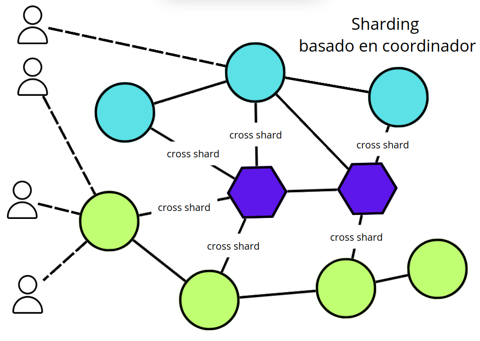

* Su función principal es ayudar a los nodos a descubrir y establecer relaciones con otros nodos dentro de su propio shard (en muchos casos actúan también como nodos semilla). Además permite la comunicación entre los diferentes fragmentos (shards) de la red, coordinando la comunicación cross-shard
  > Estos nodos coordinadores no validan, procesan o gestionan el tráfico interno de cada shard ni almacenan datos de usuario; su responsabilidad se limita a la coordinación y el enrutamiento de mensajes entre shards, especialmente para operaciones que requieren sincronización global o transferencia de datos entre fragmentos.

  > La comunicación entre shards es esencial para mantener la coherencia y la funcionalidad global de la red. Los nodos coordinadores gestionan esta comunicación, asegurando que los datos y las transacciones se transfieran correctamente entre los diferentes fragmentos, y evitando así la fragmentación del estado o la pérdida de información.
* Si un nodo intenta comunicarse con un nodo de un shard incorrecto, el nodo coordinador ayuda a redirigir la solicitud al shard adecuado o el nodo simplemente devolverá un error, dependiendo de la lógica implementada por la red.

**Basado en relé (relay)**.

Los propios nodos disponen un módulo relay que permite coordinar el sharding, a diferencia de tener un conjunto de nodos coordinadores.

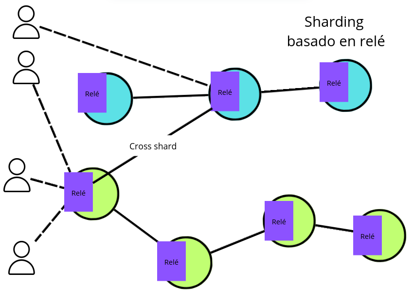

* Cada nodo está asignado a un shard de forma determinista según reglas establecidas en el protocolo; no se requiere coordinación externa.
* El módulo relay integrado en cada nodo gestiona la comunicación cross-shard, enviando y recibiendo mensajes hacia y desde el shard correspondiente.
  > Este enfoque es más descentralizado y elimina dependencias de nodos coordinadores, reduciendo complejidad. Sin embargo, puede generar cuellos de botella a nivel de nodo, ya que cada uno asume carga adicional al manejar tráfico inter-shard, existiendo más latencia.

  > Además, exige sincronización entre nodos de distintos shards y mecanismos de verificación para asegurar integridad y evitar inconsistencia.

  ### Algunos ejemplos de redes p2p

  A continuación se describen algunos ejemplos destacados de redes y nodos P2P, cada una con su propio enfoque y características técnicas:

  #### [Napster](https://es.wikipedia.org/wiki/Napster)

  

  * Propósito: Compartición de archivos de música.
  * [Modelo de autorización](#modelo-de-autorización): Pública, cualquier usuario podía unirse y compartir archivos sin restricciones.
  * [Modelo de gobernanza](#modelo-de-gobernanza): Centralizada, gestionada por la empresa creadora de Napster, que controlaba el servidor central y las reglas del sistema.
  * [Modelo de confianza](#modelo-de-confianza): Basado en confianza (trusted), los usuarios confiaban en el servidor central para indexar y localizar archivos, sin mecanismos criptográficos avanzados.
  * [Tipo principal de red](#clasificación-principal-de-redes-p2p): Híbrida, con un servidor central para el índice y transferencia directa entre pares.
  * Funcionamiento: Un servidor central mantiene un índice de los archivos disponibles, pero la transferencia de archivos ocurre directamente entre los nodos de usuarios.
  * Uso de [estrategia de almacenamiento](#estrategias-de-almacenamiento-en-redes-p2p): Indexación centralizada; los archivos permanecen en los dispositivos de los usuarios, el servidor solo almacena metadatos.
  * [Grado de descentralización](#grado-de-descentralización): Centralizada en el índice, descentralizada en la transferencia de archivos.
  * [Replicación](#técnicas-de-replicación): Basada en demanda, según los archivos que comparten los usuarios.
  * [Modelo de consistencia](#modelos-de-consistencia): Consistencia eventual; los archivos compartidos pueden variar entre nodos y no existe garantía de sincronización inmediata.

  #### [Gnutella](https://www.gnu.org/philosophy/gnutella.es.html)

  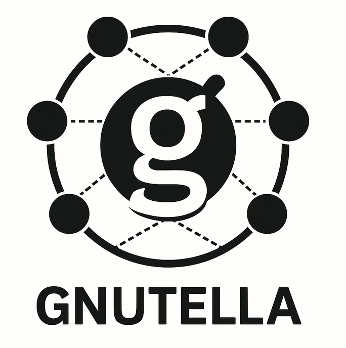

  * Propósito: Compartición de archivos de música y otros ficheros.
  * [Modelo de autorización](#modelo-de-autorización): Pública, cualquier usuario puede unirse y participar sin restricciones.
  * [Modelo de gobernanza](#modelo-de-gobernanza): Descentralizada, no existe una entidad central de control; las reglas están definidas por el protocolo abierto.
  * [Modelo de confianza](#modelo-de-confianza): Trustless, los nodos no necesitan confiar entre sí, ya que solo intercambian archivos y metadatos directamente.
  * [Tipo principal de red](#clasificación-principal-de-redes-p2p): No estructurada, basada en conexiones aleatorias y propagación de consultas por flooding.
  * Funcionamiento: Los nodos se conectan entre sí de forma aleatoria y propagan consultas de búsqueda por flooding. Los archivos se transfieren directamente entre los nodos que los poseen.
  * Uso de [estrategia de almacenamiento](#estrategias-de-almacenamiento-en-redes-p2p): Almacenamiento distribuido, cada nodo almacena los archivos que comparte localmente.
  * [Grado de descentralización](#grado-de-descentralización): Inicialmente totalmente descentralizada; versiones posteriores introdujeron jerarquía parcial con nodos ultrapeer.
  * [Replicación](#técnicas-de-replicación): Basada en demanda, los archivos se replican temporalmente en los nodos que los descargan.
  * [Modelo de consistencia](#modelos-de-consistencia): Consistencia eventual; los archivos pueden estar disponibles en algunos nodos y no en otros, sin sincronización global.

  #### [eDonkey](https://es.wikipedia.org/wiki/Red_eDonkey)/[eMule](https://es.wikipedia.org/wiki/EMule)

  

  * Propósito: Compartición de archivos de música y otros ficheros.
  * [Modelo de autorización](#modelo-de-autorización): Pública, cualquier usuario puede unirse y compartir archivos sin restricciones.
  * [Modelo de gobernanza](#modelo-de-gobernanza): Híbrida, con servidores centrales que gestionan índices y una red P2P para la transferencia de archivos.
  * [Modelo de confianza](#modelo-de-confianza): Parcialmente confiable, los usuarios confían en los servidores para la indexación, pero la transferencia de archivos es directa entre pares.
  * [Tipo principal de red](#clasificación-principal-de-redes-p2p): Híbrida, combina servidores centrales para búsqueda con transferencia P2P directa.
  * Funcionamiento: Los archivos se dividen en partes y se distribuyen entre los usuarios. Los servidores ayudan a localizar archivos, pero la transferencia es directa entre pares.
  * Uso de [estrategia de almacenamiento](#estrategias-de-almacenamiento-en-redes-p2p): Almacenamiento distribuido en los nodos, con indexación centralizada en servidores.
  * [Grado de descentralización](#grado-de-descentralización): Parcialmente descentralizada, centralización en la indexación y descentralización en la transferencia.
  * [Replicación](#técnicas-de-replicación): Basada en demanda, los archivos se replican en los nodos que los descargan.
  * [Modelo de consistencia](#modelos-de-consistencia): Consistencia eventual; la disponibilidad de archivos depende de los nodos conectados y no hay garantía de actualización inmediata.

  #### [BitTorrent](https://es.wikipedia.org/wiki/BitTorrent_(programa))

  

  * Propósito: Compartición eficiente de archivos de cualquier tipo entre usuarios.
  * [Modelo de autorización](#modelo-de-autorización): Pública, cualquier usuario puede unirse y participar sin restricciones.
  * [Modelo de gobernanza](#modelo-de-gobernanza): Descentralizada, el protocolo es abierto y no existe una entidad central de control.
  * [Modelo de confianza](#modelo-de-confianza): Trustless, los nodos no necesitan confiar entre sí; la integridad de los archivos se verifica mediante hashes.
  * [Tipo principal de red](#clasificación-principal-de-redes-p2p): Estructurada, utiliza un protocolo basado en DHT (Kademlia) para la localización de recursos, aunque puede apoyarse en trackers centralizados o descentralizados.
  * Funcionamiento: Los archivos se dividen en partes pequeñas que se distribuyen entre los usuarios (peers). Cada usuario descarga y al mismo tiempo comparte las partes que ya tiene con otros.
  * Uso de [estrategia de almacenamiento](#estrategias-de-almacenamiento-en-redes-p2p): Almacenamiento distribuido, cada nodo almacena solo las partes de los archivos que descarga y comparte.
  * [Grado de descentralización](#grado-de-descentralización): Parcialmente descentralizada, ya que puede usar trackers centralizados para facilitar la localización inicial, pero la transferencia de datos es completamente P2P.
  * [Replicación](#técnicas-de-replicación): Basada en demanda, las partes de los archivos se replican dinámicamente en los nodos que las descargan, aumentando la disponibilidad según la popularidad del archivo.
  * [Modelo de consistencia](#modelos-de-consistencia): Consistencia eventual; las partes de los archivos pueden estar disponibles en diferentes nodos en distintos momentos.

  #### [Tor](https://es.wikipedia.org/wiki/Tor_(red_de_anonimato))

  

  * Propósito: Anonimato y privacidad en la navegación y el intercambio de información.
    > Tor no es tradicionalmente considerado una red P2P en el sentido clásico (no hay compartición entre pares simétricos de recursos). Es más una red de superposición anónima.
  * [Modelo de autorización](#modelo-de-autorización): Pública, cualquier usuario puede participar como cliente o relay, aunque los nodos de salida y autoridades de directorio requieren cierto nivel de confianza.
  * [Modelo de gobernanza](#modelo-de-gobernanza): Federada, gestionada por la comunidad Tor y organizaciones independientes que operan las autoridades de directorio.
  * [Modelo de confianza](#modelo-de-confianza): Parcialmente confiable, los usuarios confían en las autoridades de directorio y en la integridad de los relays, pero el diseño minimiza la necesidad de confianza en nodos individuales mediante cifrado en capas.
  * [Tipo principal de red](#clasificación-principal-de-redes-p2p): Estructurada, basada en una red de relays organizados y autoridades de directorio centralizadas para la gestión de nodos.
  * Funcionamiento: El tráfico se enruta por circuitos cifrados a través de múltiples nodos (relays). Las autoridades de directorio mantienen una lista firmada de nodos disponibles.
  * Uso de [estrategia de almacenamiento](#estrategias-de-almacenamiento-en-redes-p2p): No almacena datos de usuario; los relays solo reenvían tráfico cifrado. Las autoridades de directorio almacenan información sobre los nodos de la red.
  * [Grado de descentralización](#grado-de-descentralización): Parcialmente descentralizada; la red de relays es descentralizada, pero la gestión de directorios está centralizada en un conjunto limitado de autoridades.
  * [Replicación](#técnicas-de-replicación): Replicación de la información de directorio entre múltiples autoridades para garantizar disponibilidad y tolerancia a fallos.
  * [Modelo de consistencia](#modelos-de-consistencia): Consistencia fuerte para la información de directorio (sincronización entre autoridades); consistencia eventual para el estado de los relays.

  #### [I2P](https://geti2p.net/es/)

  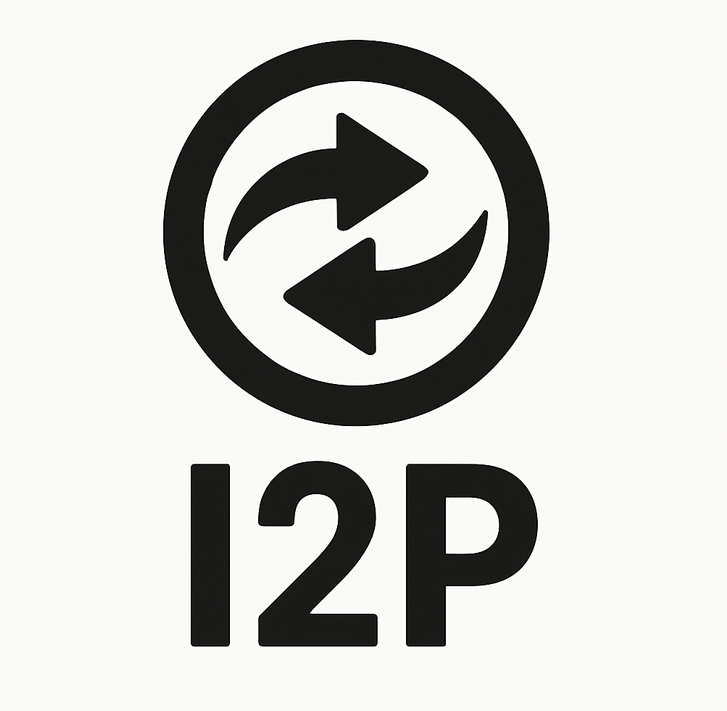

  * Propósito: Anonimato y comunicación segura entre aplicaciones y usuarios, así como compartición de archivos y servicios internos.
  * [Modelo de autorización](#modelo-de-autorización): Pública, cualquier usuario puede participar como nodo, aunque existen opciones para crear túneles privados.
  * [Modelo de gobernanza](#modelo-de-gobernanza): Descentralizada, el protocolo es abierto y mantenido por la comunidad, sin una entidad central de control.
  * [Modelo de confianza](#modelo-de-confianza): Parcialmente confiable, los nodos no necesitan confiar entre sí, ya que la privacidad y el anonimato se logran mediante túneles cifrados y rutas aleatorias; sin embargo, existen mecanismos de reputación para mitigar abusos.
  * [Tipo principal de red](#clasificación-principal-de-redes-p2p): Estructurada, basada en una red de túneles y rutas virtuales, con DHT para descubrimiento y enrutamiento.
  * Funcionamiento: Los nodos construyen túneles de entrada y salida independientes, enrutando mensajes a través de múltiples saltos cifrados. No existen nodos de salida global como en Tor; toda la comunicación es interna a la red I2P.
  * Uso de [estrategia de almacenamiento](#estrategias-de-almacenamiento-en-redes-p2p): Almacenamiento distribuido de datos y servicios internos mediante DHT (netDb) para la localización de destinos y recursos.
  * [Grado de descentralización](#grado-de-descentralización): Totalmente descentralizada, todos los nodos pueden participar en el enrutamiento y no existe jerarquía central.
  * [Replicación](#técnicas-de-replicación): Replicación parcial y basada en demanda, principalmente para la información de enrutamiento y servicios publicados en la red.
  * [Modelo de consistencia](#modelos-de-consistencia): Consistencia eventual; la información de enrutamiento y servicios puede variar entre nodos y se sincroniza progresivamente.

  #### [Freenet](https://freenet.org/)

  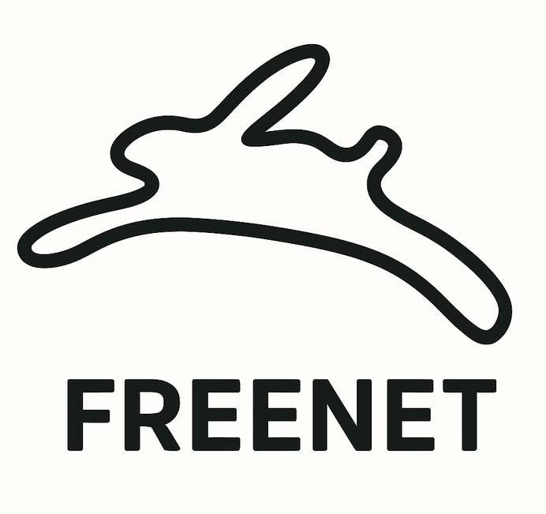

  * Propósito: Compartición anónima y resistente a la censura de archivos y publicación de contenido.
  * [Modelo de autorización](#modelo-de-autorización): Pública, cualquier usuario puede participar como nodo y compartir o acceder a contenido.
  * [Modelo de gobernanza](#modelo-de-gobernanza): Descentralizada, el protocolo es abierto y mantenido por la comunidad, sin entidad central de control.
  * [Modelo de confianza](#modelo-de-confianza): Trustless, los nodos no necesitan confiar entre sí; la privacidad y el anonimato se logran mediante enrutamiento oscuro y cifrado.
  * [Tipo principal de red](#clasificación-principal-de-redes-p2p): Estructurada, utiliza una DHT adaptativa y conexiones entre pares seleccionados para maximizar el anonimato.
  * Funcionamiento: Los datos se fragmentan y se distribuyen automáticamente entre los nodos. El enrutamiento es adaptativo y busca maximizar el anonimato y la resiliencia.
  * Uso de [estrategia de almacenamiento](#estrategias-de-almacenamiento-en-redes-p2p): Almacenamiento distribuido con replicación parcial y encriptación; los datos se almacenan en nodos aleatorios y se accede a ellos mediante claves hash.
  * [Grado de descentralización](#grado-de-descentralización): Totalmente descentralizada, no existen nodos privilegiados ni jerarquía.
  * [Replicación](#técnicas-de-replicación): Replicación parcial y basada en demanda; los datos se replican automáticamente en varios nodos para asegurar disponibilidad y resistencia a la censura.
  * [Modelo de consistencia](#modelos-de-consistencia): Consistencia eventual; los datos pueden estar disponibles en diferentes nodos y la sincronización no es inmediata.

  #### [Bitcoin](https://es.wikipedia.org/wiki/Protocolo_Bitcoin)

  

  * Propósito: Transferencia de valor digital (criptomoneda), registro inmutable de transacciones y descentralización financiera.
  * [Modelo de autorización](#modelo-de-autorización): Pública, cualquier usuario puede unirse a la red, validar y propagar transacciones y bloques sin restricciones.
  * [Modelo de gobernanza](#modelo-de-gobernanza): Descentralizada, las reglas del protocolo son mantenidas por la comunidad y los desarrolladores, y los cambios requieren consenso social y técnico.
  * [Modelo de confianza](#modelo-de-confianza): Trustless, los nodos no necesitan confiar entre sí; la seguridad se garantiza mediante criptografía y consenso por prueba de trabajo (Proof of Work).
  * [Tipo principal de red](#clasificación-principal-de-redes-p2p): Estructurada, basada en una red P2P de nodos completos que propagan bloques y transacciones usando técnicas de difusión (gossip).
  * Funcionamiento: Los nodos validan y propagan transacciones y bloques. Cada nodo mantiene una copia de la blockchain y participa en el consenso mediante prueba de trabajo (Proof of Work).
  * Uso de [estrategia de almacenamiento](#estrategias-de-almacenamiento-en-redes-p2p): Almacenamiento distribuido, cada nodo completo almacena toda la cadena de bloques; los nodos ligeros almacenan solo cabeceras y verifican mediante pruebas criptográficas.
  * [Grado de descentralización](#grado-de-descentralización): Totalmente descentralizada, todos los nodos pueden participar en la validación y propagación, sin jerarquía central.
  * [Replicación](#técnicas-de-replicación): Replicación total en nodos completos (full nodes), replicación parcial en nodos ligeros (light clients); la blockchain se replica íntegramente en miles de nodos para garantizar disponibilidad y resiliencia.
  * [Modelo de consistencia](#modelos-de-consistencia): Consistencia eventual y secuencial; la red alcanza consistencia eventual tras la propagación y validación de bloques, y mantiene el mismo orden global de transacciones en la cadena principal.

  #### [Storj](https://storj.dev/)

  

  * Propósito: Almacenamiento y compartición descentralizada de archivos en la nube, con incentivos económicos para los nodos participantes.
  * [Modelo de autorización](#modelo-de-autorización): Pública y permisionada; cualquier usuario puede almacenar datos, pero los nodos de almacenamiento deben cumplir ciertos requisitos y pasar verificaciones.
  * [Modelo de gobernanza](#modelo-de-gobernanza): Híbrida, Storj Labs mantiene el control operativo, aunque promueve apertura y participación de la comunidad.
  * [Modelo de confianza](#modelo-de-confianza): Parcialmente confiable; la integridad y disponibilidad de los datos se garantiza mediante contratos inteligentes, reputación de nodos y pruebas criptográficas (auditorías periódicas).
  * [Tipo principal de red](#clasificación-principal-de-redes-p2p): Estructurada, basada en nodos de almacenamiento distribuidos y coordinadores (satélites) que gestionan la asignación y auditoría de datos.
  * Funcionamiento: Los archivos se fragmentan y codifican (erasure coding), luego se distribuyen entre múltiples nodos de almacenamiento. Los contratos inteligentes gestionan la relación entre clientes y nodos.
  * Uso de [estrategia de almacenamiento](#estrategias-de-almacenamiento-en-redes-p2p): Almacenamiento distribuido con fragmentación y erasure coding; los fragmentos se almacenan en nodos independientes para maximizar disponibilidad y resiliencia.
  * [Grado de descentralización](#grado-de-descentralización): Parcialmente descentralizada; los nodos de almacenamiento son independientes, pero los satélites actúan como coordinadores y puntos de auditoría.
  * [Replicación](#técnicas-de-replicación): Replicación basada en erasure coding y redundancia controlada; se almacenan múltiples fragmentos redundantes para garantizar la recuperación ante fallos de nodos.
  * [Modelo de consistencia](#modelos-de-consistencia): Consistencia eventual; los fragmentos pueden sincronizarse con retraso y la disponibilidad depende de la recuperación de fragmentos redundantes.

  #### [Ethereum](https://wiki.lemon.me/blockchain/ethereum-eth-que-es-y-como-funciona/)

  

  * Propósito: Plataforma de contratos inteligentes y aplicaciones descentralizadas (dApps), además de transferencia de valor digital (Ether).
  * [Modelo de autorización](#modelo-de-autorización): Pública, cualquier usuario puede unirse, validar, propagar transacciones y desplegar contratos inteligentes sin restricciones.
  * [Modelo de gobernanza](#modelo-de-gobernanza): Híbrida, combina mecanismos descentralizados (comunidad, validadores, desarrolladores) y elementos centralizados (fundaciones, equipos de desarrollo principales). Las decisiones sobre actualizaciones y cambios en el protocolo se toman mediante propuestas abiertas (EIP), discusión comunitaria y consenso social/técnico.
  * [Modelo de confianza](#modelo-de-confianza): Trustless, la seguridad y validez se garantizan mediante criptografía y mecanismos de consenso. Inicialmente usó prueba de trabajo (Proof of Work, hasta The Merge) y actualmente utiliza prueba de participación (Proof of Stake).
  * [Tipo principal de red](#clasificación-principal-de-redes-p2p): Estructurada, basada en una red P2P de nodos completos que propagan bloques y transacciones usando técnicas de difusión (gossip) y mecanismos de descubrimiento de nodos (Kademlia-like).
  * Funcionamiento: Los nodos almacenan el estado de la blockchain, validan y propagan transacciones y bloques, ejecutan contratos inteligentes y mantienen la sincronización mediante técnicas de difusión eficientes.
  * Uso de [estrategia de almacenamiento](#estrategias-de-almacenamiento-en-redes-p2p): Almacenamiento distribuido, cada nodo completo almacena toda la cadena de bloques y el estado global; los nodos ligeros almacenan solo cabeceras y verifican mediante pruebas criptográficas.
  * [Grado de descentralización](#grado-de-descentralización): Totalmente descentralizada, todos los nodos pueden participar en la validación y propagación, sin jerarquía central.
  * [Replicación](#técnicas-de-replicación): Replicación total en nodos completos, replicación parcial en nodos ligeros; la blockchain y el estado se replican en miles de nodos para garantizar disponibilidad y resiliencia.
  * [Modelo de consistencia](#modelos-de-consistencia): Consistencia eventual y secuencial; la red alcanza consistencia eventual tras la propagación y validación de bloques, y mantiene el mismo orden global de transacciones.

  #### [IPFS (InterPlanetary File System)](https://docs.ipfs.tech/concepts/what-is-ipfs/)

  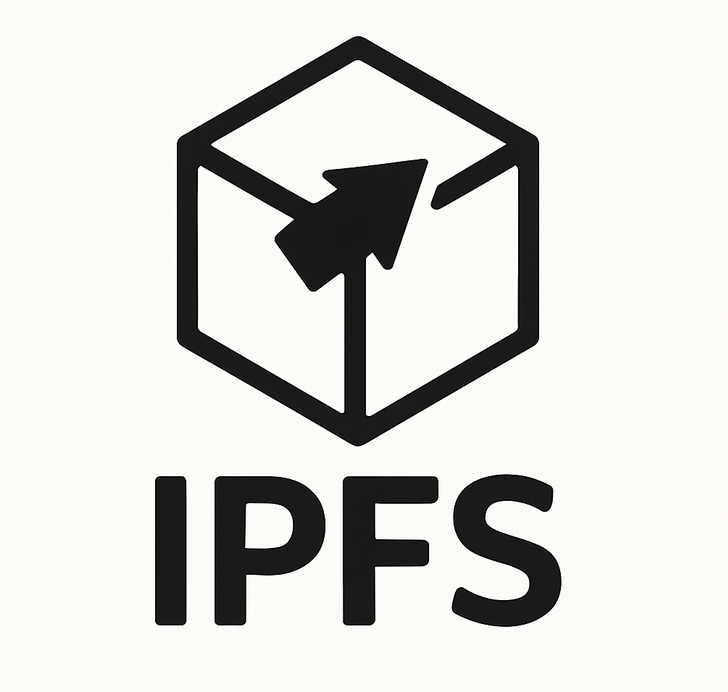

  * Propósito: Almacenamiento y compartición descentralizada de archivos, con direccionamiento por contenido y resistencia a la censura.
  * [Modelo de autorización](#modelo-de-autorización): Pública, cualquier usuario puede participar como nodo, almacenar y recuperar archivos sin restricciones.
  * [Modelo de gobernanza](#modelo-de-gobernanza): Descentralizada, el protocolo es abierto y mantenido por la comunidad, aunque Protocol Labs toma un papel relevante en las decisiones, quizás también por su autoridad al respecto.
  * [Modelo de confianza](#modelo-de-confianza): Trustless, la integridad y autenticidad de los datos se garantiza mediante hashes criptográficos; los nodos no necesitan confiar entre sí.
  * [Tipo principal de red](#clasificación-principal-de-redes-p2p): Estructurada, basada en DHT (Kademlia) para descubrimiento y localización de contenido.
  * Funcionamiento: Cada archivo se divide en fragmentos, se les asigna un hash único (dirección por contenido) y se distribuyen entre los nodos. La DHT permite localizar qué nodos almacenan cada fragmento.
  * Uso de [estrategia de almacenamiento](#estrategias-de-almacenamiento-en-redes-p2p): Almacenamiento distribuido con replicación parcial y dirigida por el usuario (pinning); los datos se almacenan en los nodos que los solicitan o fijan.
  * [Grado de descentralización](#grado-de-descentralización): Totalmente descentralizada, todos los nodos pueden almacenar, buscar y servir contenido sin jerarquía central.
  * [Replicación](#técnicas-de-replicación): Replicación parcial, basada en demanda y dirigida por el usuario (pinning); los fragmentos se replican en los nodos que los solicitan o deciden mantenerlos.
  * [Modelo de consistencia](#modelos-de-consistencia): Consistencia eventual y de lectura tras escritura; los datos replicados pueden estar disponibles en diferentes nodos en distintos momentos, pero el nodo que fija (pin) un contenido siempre podrá acceder a él.

  #### [ZeroNet](https://zeronet.io/es)

  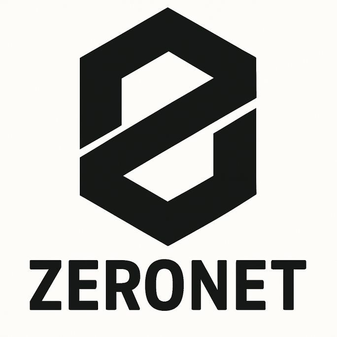

  * Propósito: Publicación y compartición descentralizada de sitios web y archivos, resistente a la censura.
  * [Modelo de autorización](#modelo-de-autorización): Pública, cualquier usuario puede crear, acceder y replicar sitios sin restricciones.
  * [Modelo de gobernanza](#modelo-de-gobernanza): Descentralizada, el protocolo es abierto y mantenido por la comunidad, sin entidad central de control.
  * [Modelo de confianza](#modelo-de-confianza): Trustless, la integridad de los contenidos se garantiza mediante firmas ECDSA y direccionamiento por clave pública.
  * [Tipo principal de red](#clasificación-principal-de-redes-p2p): Estructurada, utiliza DHT para descubrimiento y BitTorrent para distribución de contenido.
  * Funcionamiento: Cada sitio web tiene una dirección basada en clave pública. Los contenidos se distribuyen vía BitTorrent y se validan con firmas ECDSA. Cada visitante actúa como nodo replicador.
  * Uso de [estrategia de almacenamiento](#estrategias-de-almacenamiento-en-redes-p2p): Almacenamiento distribuido y replicación parcial; los archivos se almacenan en los nodos que visitan o replican los sitios.
  * [Grado de descentralización](#grado-de-descentralización): Totalmente descentralizada, todos los nodos pueden participar en la publicación, replicación y acceso sin jerarquía central.
  * [Replicación](#técnicas-de-replicación): Replicación parcial y basada en demanda; los sitios se replican automáticamente en los nodos que los visitan, aumentando la disponibilidad y resiliencia.
  * [Modelo de consistencia](#modelos-de-consistencia): Consistencia eventual y de lectura tras escritura; los sitios replicados pueden variar entre nodos, pero el creador o replicador siempre puede acceder a su copia.

  #### [Filecoin](https://filecoin.io/)

  

  * Propósito: Almacenamiento y compartición descentralizada de archivos con incentivos económicos.
  * [Modelo de autorización](#modelo-de-autorización): Pública y permisionada; cualquier usuario puede almacenar datos, pero los mineros de almacenamiento deben cumplir requisitos y pasar verificaciones.
  * [Modelo de gobernanza](#modelo-de-gobernanza): Descentralizada, gestionada por la comunidad y Protocol Labs, con propuestas y mejoras abiertas.
  * [Modelo de confianza](#modelo-de-confianza): Trustless y parcialmente confiable; la integridad y disponibilidad se garantizan mediante pruebas criptográficas (Proof of Replication, Proof of Spacetime) y reputación de los mineros.
  * [Tipo principal de red](#clasificación-principal-de-redes-p2p): Estructurada, basada en DHT (Kademlia) para descubrimiento y localización de recursos, y subredes lógicas para coordinación.
  * Funcionamiento: Los usuarios (clientes) pagan a los mineros de almacenamiento para guardar archivos. Los mineros demuestran periódicamente que almacenan los datos mediante pruebas criptográficas (Proof of Replication y Proof of Spacetime).
  * Uso de [estrategia de almacenamiento](#estrategias-de-almacenamiento-en-redes-p2p): Almacenamiento distribuido con fragmentación (sharding) y erasure coding; los datos se dividen en fragmentos codificados y se distribuyen entre múltiples mineros.
  * [Grado de descentralización](#grado-de-descentralización): Parcialmente descentralizada; los mineros son independientes, pero existen mecanismos de coordinación y subredes para gestión y auditoría.
  * [Replicación](#técnicas-de-replicación): Basada en erasure coding y redundancia controlada; se almacenan múltiples fragmentos redundantes para garantizar recuperación y disponibilidad ante fallos de nodos.
  * [Modelo de consistencia](#modelos-de-consistencia): Consistencia eventual; los fragmentos pueden sincronizarse con retraso y la disponibilidad depende de la recuperación y verificación periódica mediante pruebas criptográficas.

## Referencias

* Las referencias sobre todo son semanas de consultas a chatgpt y deepseek.
* [geeksforgeeks.com](https://www.geeksforgeeks.org/structured-and-unstructured-peer-to-peer-systems/)
* Varios autores de Wikipedia...
* [bit2me academy](https://academy.bit2me.com/).

## Aclaración y agradecimiento

La tecnología de las redes P2P realmente es muy compleja, y complicado de digerir, pero es la base de la descentralización, por lo tanto, aunque no seamos expertos, considero importare esta introducción técnica para tener una base, que puede ayudar cuando tengas que abordar un documento técnico complicado de una red P2P.

Agradecimiento a quien encuentre fallos y proponga mejoras.

Este documento tiene cierto enfoque heurístico, ha sido complicado encontrar y digerir la información, por lo tanto, disculpas por adelantado si encuentras un error, e igualmente gracias por adelantado si luego propones mejoras.

Hay partes que quizás le falta alguna explicación, pero es porque es un resumen introductorio y en algún momento tengo que parar.

Gracias ;).
