# Introducción a redes peer to peer (p2p)

## Visión inicial de redes de nodos


🌐 Como visión inicial, conviene resumir qué son las redes de nodos, para luego centrarnos en las redes P2P, introduciendo sus características principales.

En el contexto de internet, en el estudio de las [redes de computadoras](https://es.wikipedia.org/wiki/Red_de_computadoras) (dentro de la [ciencia de redes](https://es.wikipedia.org/wiki/Ciencia_de_redes)), existen dispositivos que son [nodos](https://es.wikipedia.org/wiki/Nodo_(inform%C3%A1tica)), es decir, pueden enviar y recibir información, y gracias a que disponen de una dirección pública, como la [IP](https://es.wikipedia.org/wiki/Protocolo_de_Internet), generalmente en un [nombre de dominio](https://es.wikipedia.org/wiki/Nombre_de_dominio) registrado en un [DNS](https://es.wikipedia.org/wiki/Sistema_de_nombres_de_dominio), pueden conocerse; o pueden comunicase sin conocerse en una [difusión amplia](https://es.wikipedia.org/wiki/Difusi%C3%B3n_amplia).

> Debido a la limitada cantidad de direcciones IPv4, lo normal es que muchos de estos nodos, que acceden mediante un [ISP](https://es.wikipedia.org/wiki/Proveedor_de_servicios_de_internet), solo puedan usar su IP para hacer peticiones-respuestas, pero no para recibir conexiones entrantes, ya que están detrás de un [CGNAT](https://es.wikipedia.org/wiki/Carrier_Grade_NAT).

Algunos de esos nodos actúan como [host](https://es.wikipedia.org/wiki/Host) o anfitriones de servicios, y cuando es continuado, se denominan [servidores](https://es.wikipedia.org/wiki/Servidor) que suelen estar en [centros de datos](https://es.wikipedia.org/wiki/Centro_de_procesamiento_de_datos).

> 💡O en tu propio hogar o negocio si decides participar en una red descentralizada.

En los servidores se alojan los [servicios](https://es.wikipedia.org/wiki/Daemon_(inform%C3%A1tica)), compuestos por [aplicaciones](https://es.wikipedia.org/wiki/Aplicaci%C3%B3n_inform%C3%A1tica) y [componentes](https://es.wikipedia.org/wiki/Componente_de_software) que implementan funciones específicas para atender peticiones de otros nodos en la red.

Servicios, que se pueden ofrecer a clientes, bajo términos de licencia, en lo que se denomina la nube y que pueden seguir un modelo como [SaaS (Software as a Service)](https://es.wikipedia.org/wiki/Software_como_servicio), o puede ser [On Premise](https://en.wikipedia.org/wiki/On-premises_software) si se entrega para la infraestructura cliente.

Y aplicaciones que pueden seguir una arquitectura de [microservicios](https://es.wikipedia.org/wiki/Arquitectura_de_microservicios), o ser una [SPA](https://en.wikipedia.org/wiki/Single-page_application) siguiendo un patrón [BFF](https://bff-patterns.com/), o una [dApp](https://es.wikipedia.org/wiki/Aplicaci%C3%B3n_descentralizada),o un [gateway](https://es.wikipedia.org/wiki/Puerta_de_enlace), [proxy](https://es.wikipedia.org/wiki/Servidor_proxy), [VPN](https://es.wikipedia.org/wiki/Red_privada_virtual), o [API REST](https://es.wikipedia.org/wiki/Transferencia_de_Estado_Representacional), servidor [GraphQL](https://es.wikipedia.org/wiki/GraphQL), o un [servicio de mensajería](https://es.wikipedia.org/wiki/Mensajer%C3%ADa_instant%C3%A1nea), sistema de [autorización](https://es.wikipedia.org/wiki/OAuth), [orquestador de tareas](https://es.wikipedia.org/wiki/Motor_de_flujo_de_trabajo), o un nodo P2P, [un indexador de blockchain](https://www.alchemy.com/overviews/blockchain-indexer) o incluso un servicio de almacenamiento distribuido como IPFS, etc...

Estos servidores se ejecutan sobre un [sistema operativo](https://es.wikipedia.org/wiki/Sistema_operativo), utilizando uno o varios [puertos](https://es.wikipedia.org/wiki/Puerto_de_red) locales para abrir [sockets](https://es.wikipedia.org/wiki/Socket_de_Internet) con el resto de nodos para establecer comunicación.

💬 Comunicación a través de protocolos, según [OSI](https://es.wikipedia.org/wiki/Modelo_OSI), que tiene niveles, como el de aplicación, por ejemplo con [HTTP](https://en.wikipedia.org/wiki/HTTP), [gRPC](https://es.wikipedia.org/wiki/GRPC), [JSON-RPC](https://en.wikipedia.org/wiki/JSON-RPC), [WebSocket](https://es.wikipedia.org/wiki/WebSocket) o [MQTT](https://en.wikipedia.org/wiki/MQTT), etc, que puede operar sobre otro protocolo de aplicación de seguridad como [TLS](https://es.wikipedia.org/wiki/Seguridad_de_la_capa_de_transporte) y que en general operan sobre servicios de transporte como [TCP](https://es.wikipedia.org/wiki/Protocolo_de_control_de_transmisi%C3%B3n) para conexiones confiables o [UDP](https://es.wikipedia.org/wiki/Protocolo_de_datagramas_de_usuario) para transmisiones rápidas sin garantías o [QUIC](https://es.wikipedia.org/wiki/QUIC) un protocolo actual que usa UDP, que es confiable y rápido. Estos, a su vez, se encapsulan en paquetes IP ([IPv4](https://es.wikipedia.org/wiki/IPv4)/[IPv6](https://es.wikipedia.org/wiki/IPv6)), que son enrutados por la red física.

Red física que tiene una topología, denominada [topología física](https://es.wikipedia.org/wiki/Topolog%C3%ADa_de_red), que normalmente conocemos como de estrella, bus, anillo, malla, árbol o híbrida, etc.

Y quizás podemos generalizar que la topología física predominante en Internet es una malla parcial, pero eso no es relevante. Lo importante es que los nodos de una red pueden interconectarse entre sí, y si no es posible, existen técnicas como [NAT traversal](https://es.wikipedia.org/wiki/NAT_traversal) y [relay](https://en.wikipedia.org/wiki/Traversal_Using_Relays_around_NAT) para facilitar la conexión a través de routers, cortafuegos o CGNAT .

Protocolos de comunicación que siguen un estilo de interacción que puede ser [procedural](https://en.wikipedia.org/wiki/Remote_procedure_call), es decir llamar a una función remota como si fuera local, donde desataca JSON-RPC; orientado a recursos HTTP como un API Rest; o [declarativo](https://en.wikipedia.org/wiki/Declarative_programming) como GraphQL, donde a modo de query declaras qué consulta realizar necesitas y el propio motor del API ofrece el resultado.

Y donde se siguen [patrones de comunicación de mensajes](https://en.wikipedia.org/wiki/Messaging_pattern), donde podemos ver algunos:


Y si los describimos son:

* [Request/Response](https://en.wikipedia.org/wiki/Request%E2%80%93response): un nodo, pide y otro responde, como puede ser en HTTP o el resto de protocolos de aplicación.
* [Publish/Subscribe](https://en.wikipedia.org/wiki/Publish%E2%80%93subscribe_pattern): ideal para peticiones asíncronas, un nodo publica, otros suscritos reciben como puede ser [MQTT](https://en.wikipedia.org/wiki/MQTT).
* Streaming: datos enviados continuamente, como puede ser [RTSP](https://es.wikipedia.org/wiki/Protocolo_de_transmisi%C3%B3n_en_tiempo_real), [WebRTC](https://es.wikipedia.org/wiki/WebRTC) o [SRT](https://en.wikipedia.org/wiki/Secure_Reliable_Transport).
* [Polling](https://es.wikipedia.org/wiki/Polling): el cliente consulta periódicamente si hay datos.
* [Event-driven](https://en.wikipedia.org/wiki/Event-driven_architecture): los datos se envían como reacción a eventos.
* Pull / Push: donde en el modelo pull, el nodo emisor transmite la carga útil (payload) solo cuando otro nodo la solicita. En cambio, en push, el emisor envía la carga útil de forma proactiva, sin solicitud previa. Esto no debe confundirse con la topología cliente-servidor, la asincronía en las respuestas, ni con el simple hecho de que siempre haya transmisión de datos en la capa de transporte; nos referimos específicamente a cómo se gestiona la entrega de la carga útil.
* Y otros muchos más...

📨 Sobre la comunicación del nodo, si puede enviar y además recibir un mensaje, se le considera [doble o duplex](https://es.wikipedia.org/wiki/D%C3%BAplex_(telecomunicaciones)), y además si es simultaneo Full-duplex, si no puede ser al mismo tiempo Half-duplex y si es en un único sentido Simplex.

Mensaje que se considera la carga útil ([payload](https://es.wikipedia.org/wiki/Carga_%C3%BAtil_(inform%C3%A1tica))) de la comunicación porque aunque en el [Handshake](https://es.wikipedia.org/wiki/Establecimiento_de_comunicaci%C3%B3n) hay mucha información transmitida, no es el propósito del intercambio.

🫱🏻‍🫲🏽 Además vemos que un conjunto de nodos puede organizarse para ejecutar funciones específicas, como ocurre en la [computación distribuida](https://es.wikipedia.org/wiki/Computaci%C3%B3n_distribuida). Esta puede requerir coordinación central, como en el modelo cliente-servidor, en un clúster o en grid computing, donde los nodos colaboran bajo una gestión común. También existe el [edge computing](https://en.wikipedia.org/wiki/Edge_computing), entre otros, que acerca el procesamiento al nodo cliente para reducir latencia. Y si no requiere coordinación centralizada, el modelo puede ser descentralizado, como en las redes peer-to-peer (P2P).

Y estos nodos organizados se conectan para comunicarse, siguiendo una estructura o enlace que se conoce como [topología lógica](https://techriders.tajamar.es/topologia-fisica-vs-topologia-logica/) e igualmente tenemos de nuevo, como topología, Cliente-Servidor o Cliente-Servidor Distribuido, en redes centralizadas, P2P (peer-to-peer) en redes descentralizadas o Multicast/broadcast en redes de [difusión](https://es.wikipedia.org/wiki/Difusi%C3%B3n_amplia) o streaming, anillo, etc...

> ∞ E igualmente, podríamos indicar que las aplicaciones siguen [estilos arquitectónicos](https://reactiveprogramming.io/blog/es/estilos-arquitectonicos/monolitico#), donde en concreto pueden seguir un [patrón de diseño](https://es.wikipedia.org/wiki/Patr%C3%B3n_de_dise%C3%B1o), siendo una solución más flexible o adaptarse en concreto a un [protocolo](https://www.imagar.com/blog-desarrollo-web/que-es-el-protocolo-en-informatica/), como muchos de los que [vemos en internet](https://es.wikipedia.org/wiki/Familia_de_protocolos_de_internet) y etc, etc, pero no es posible explicar todo 🤯, asi que acabamos aquí...

## Redes entre pares - peer-to-peer o p2p

En las redes entre pares, [peer-to-peer o p2p](https://academy.bit2me.com/que-es-una-red-p2p/), todos los nodos funcionan como iguales.

> 💡 No debe confundirse una red P2P con una topología de red distribuida. Como su nombre indica, una red P2P implica comunicación entre pares: si un nodo no puede conectarse en igualdad de condiciones con otro, no es una red P2P. Tampoco debe confundirse una red P2P con una red descentralizada; una red entre pares puede tener un nodo coordinador central, y en ese caso no sería descentralizada.

Suelen funcionar mediante un protocolo, implementado en un programa que se ejecuta como servicio en cada nodo, permitiendo la interacción entre nodos según las reglas definidas.

Si lo vemos de forma menos abstracta, podemos ver el ejemplo de [BitTorrent](https://es.wikipedia.org/wiki/BitTorrent), donde cada persona instala un programa en su PC, que sería un nodo. Cuando quieres un archivo, tu programa busca otros usuarios (otros nodos) que ya tienen partes de ese archivo para descargar varias partes a la vez.
Al mismo tiempo, tú también compartes las partes que ya tienes con otros, sin depender de un servidor central.

Que una red P2P sea entre iguales facilita un diseño descentralizado, lo que la hace muy relevante en la Web3. Sin embargo, en la práctica, Web3 adopta lo que sea necesario para ofrecer la funcionalidad requerida, incluso soluciones centralizadas, ya que debe mantenerse un equilibrio entre descentralización, seguridad y escalabilidad.

> 💡 En esta definición, no tenemos que confundir redes p2p con blockchain, ya que no es lo mismo y spoiler, blockchain es una estructura de datos diseñada para operar como libro contable distribuido (ledger) en redes P2P, donde existe un consenso, es decir, que opere en una red p2p, no implica que sean lo mismo, simplemente blockchain opera sobre una red p2p y suele confundirse.

### Características de una red p2p

Existen propiedades o cualidades que definen una red p2p y que son elegidas según su propósito, que podemos enumerar.

> Asumiendo que muchos conceptos se conocen sobre todo por blockchain, también los podemos aplicar a redes p2p.

#### Grado de descentralización

Define cuánto control está distribuido entre los nodos de la red lo influye en la escalabilidad y facilidad de diseño.

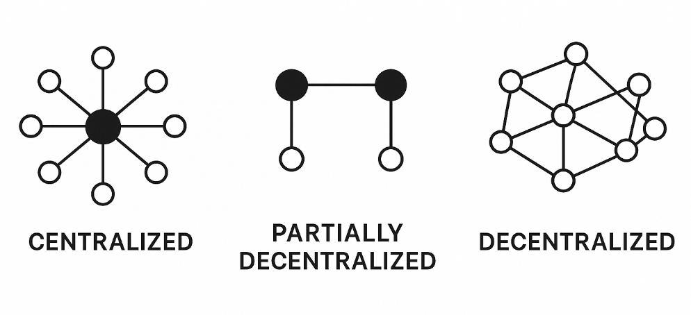

Puede ser normalmente:

* Centralizadas (Centralized), control total por una entidad, son redes cliente-servidor P2P con controlador central.
  
  > Se menciona a modo de divulgación, pero no es normal encontrarlo, aun menos en la web3.

* Parcialmente descentralizadas (Partially decentralized), varios nodos controlan la red, pero no todos. Ej: consorcios, supernodos, federaciones.
* Totalmente descentralizadas (Fully decentralized), todos los nodos tienen el mismo rol, sin jerarquía. Ej: Bitcoin, IPFS (sin bootstrap central), [Gnutella](https://en.wikipedia.org/wiki/Gnutella).

Normalmente, un mayor grado de centralización suele buscar:

* Mejor rendimiento (menor latencia y mayor throughput).

  > [throughput](https://en.wikipedia.org/wiki/Network_throughput) es la cantidad de datos o transacciones procesadas por unidad de tiempo en una red. En redes P2P, suele medirse en transacciones por segundo (TPS) o bloques por segundo. Cuanto mayor el throughput, mayor la capacidad de procesamiento de la red.

* Control más sencillo (gobernanza y actualizaciones).
* Seguridad operativa (menos superficie de ataque si los nodos son confiables).

  > Mas seguridad operativa, pero menor descentralización y menor resilencia al existir punto único de falla.

* Menor complejidad de consenso (menos nodos que coordinar).

#### Modelo de confianza

Define cómo y en quién confían los nodos para interactuar, validar información y alcanzar consenso. Determina si la red requiere identidad, reputación o prueba criptográfica para garantizar seguridad y funcionamiento correcto.

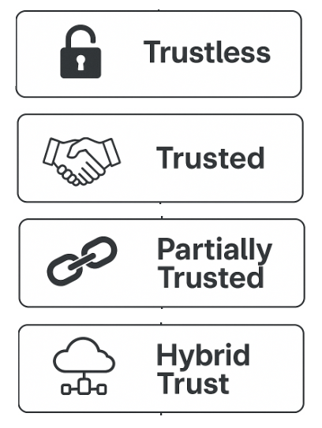

Puede ser normalmente:

* Sin confianza ([Trustless](https://academy.binance.com/es/glossary/trustless)), donde los nodos interactúan sabiendo que no pueden confiar entre sí y gracias a [mecanismos criptográficos](https://es.wikipedia.org/wiki/Criptograf%C3%ADa) y [reglas de consenso](https://www.bitstamp.net/es/learn/security/what-are-blockchain-consensus-rules/) verificables, entre otros, pueden hacerlo. Ejemplos claros son en blockchain con Bitcoin, Ethereum, IPFS + FileCoin.
* Confiable o basado en confianza (Trusted), los nodos interactúan basándose en relaciones de confianza previa, donde existe identidad verificada o autoridad central parcial que ayuda a autenticar al nodo, reduciendo la necesidad de mecanismos criptográficos o consenso complejo. Por ejemplo, igualmente en blockchain en redes corporativas o [Hyperledger Fabric](https://en.wikipedia.org/wiki/Hyperledger#Hyperledger_Fabric) con [Proof of Authority](https://en.wikipedia.org/wiki/Proof_of_authority) (PoA).
* Parcialmente confiable (Partially trusted), combina nodos confiables con nodos anónimos o no verificados, aplicando confianza selectiva. Usa mecanismos criptográficos y validación, pero permite ciertos roles privilegiados o relaciones basadas en confianza. Por ejemplo, [Lightning Network](https://es.wikipedia.org/wiki/Lightning_Network) (sobre Bitcoin):
* Confianza híbrida (Hybrid trust), combina modelos trustless y trusted, donde algunas funciones dependen de nodos confiables o autoridades, y otras se descentralizan mediante consenso y criptografía. Ejemplo [Ripple](https://es.wikipedia.org/wiki/Ripple_Labs,_Inc.), donde usa un conjunto confiable de nodos validadores (UNL), pero con comunicación P2P.

  > La diferencia entre Partially trusted e Hybrid trust, en la primera se reconoce que en ciertos nodos se puede confiar más por su propia naturaleza, en la segunda combina explícitamente componentes o mecanismos centralizados, asi que se puede decir que más que una diferencia es evolucionar de un grado de descentralización de mayor a menor.

#### [Modelo de autorización](https://worldtokencongress.com/en/entendiendo-las-redes-blockchain-publicas-permisionadas-y-privadas/)

Define quién puede participar y con qué permisos, lo cual influye en la resistencia a la censura, tolerancia a fallos y gobernanza.

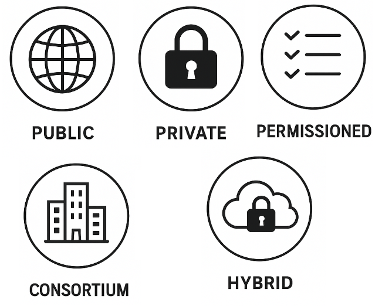

Puede ser normalmente:

* Pública, cualquier participante puede unirse y participar sin restricciones, es descentralizada y abierta a nuevos participantes.
* Privada, acceso limitado a entidades previamente autorizadas, suele tener un control centralizado dentro de una organización o grupo.
* Permisionada, participación permitida solo a nodos verificados y aprobados, es una red privada que además define roles o permisos específicos, por ejemplo, unos nodos pueden leer solamente y otros escribir.
* Consorcio, gobernada por un grupo seleccionado de entidades confiables, es un tipo de red privada, pero gestionada por un grupo de entidades (no una sola).
* Híbrida, mezcla características de modelos públicos y privados.

#### Estrategias de almacenamiento en redes p2p

Definen cómo se organiza y guarda la información entre los nodos participantes. Buscan optimizar la disponibilidad, localización eficiente de datos y equilibrio de carga. Podemos ver los siguientes:

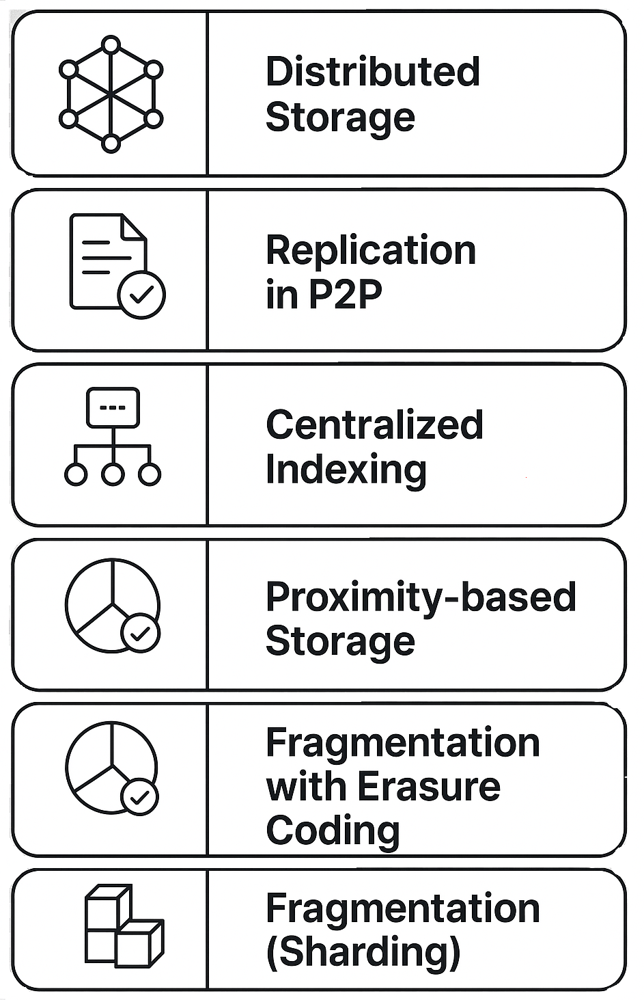

* Almacenamiento Distribuido (Distributed Storage), los datos se distribuyen entre múltiples nodos de la red, utilizando mecanismos de **replicación** (total o parcial) para aumentar la redundancia y la disponibilidad. Esta distribución puede organizarse de forma estructurada (por ejemplo, mediante DHTs) o no estructurada, según el protocolo de la red. Ejemplos: [IPFS](https://ipfs.tech/), [Filecoin](https://filecoin.io/), [Freenet](https://freenetproject.org/) (replicación automática), [Storj](https://www.storj.io/) (replicación contractual).

  > Esta es la estrategia habitual en una red P2P, y lo veremos en detalle tanto las [DHT](#enrutamiento-routing-en-redes-estructuradas) como las [técnicas de replicación](#técnicas-de-replicación).

* Indexación centralizada (Centralized indexing), un servidor central mantiene un índice de los archivos disponibles, pero los datos se transfieren directamente entre nodos. Ejemplo: [Napster](https://es.wikipedia.org/wiki/Napster) (modelo híbrido respecto a la descentralización).
* Fragmentación con [Erasure Coding](https://en.wikipedia.org/wiki/Erasure_code), los datos se dividen en fragmentos codificados matemáticamente, permitiendo recuperación incluso si se pierden algunos. Ejemplo: [Tahoe-LAFS](https://www.tahoe-lafs.org/trac/tahoe-lafs), [Filecoin](https://storj.dev/learn/concepts/file-redundancy#erasure-code) (opcional).
* Fragmentación ([Sharding](https://es.cointelegraph.com/explained/sharding-an-opportunity-for-distributed-scalability)), los datos se dividen en partes no redundantes asignadas a nodos distintos. Requiere mecanismos de reconstrucción. Ejemplo: Algunas blockchains ([Ethereum](https://www.bitstamp.net/es/learn/blockchain/what-is-sharding-on-ethereum/)), sistemas de bases de datos P2P

### Problemas en redes p2p

Las redes p2p vienen a resolver principalmente el problema de la centralización y el punto único de fallo y para ello deben comunicarse entre iguales entre ellos siguiendo el protocolo, pero esto también tiene ciertos desafíos que se deben considerar y que podemos resumir como:

#### Problemas de seguridad

Una red p2p no está exento de problemas de seguridad, sobre todo si es pública, por lo tanto, se debe considerar que puede existir

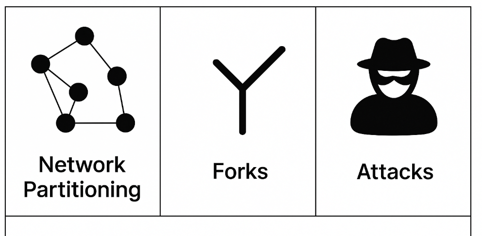

* Fragmentación de la red (network partitioning), donde los nodos están aislados en subgrupos, lo que impide una vista global coherente o sincronización entre ellos. Es sobre todo un problema físico de conectividad
* Estado paralelo de la red ([forks](https://es.wikipedia.org/wiki/Bifurcaci%C3%B3n_(desarrollo_de_software)) o view divergence), donde pueden coexistir versiones distintas, es decir, un conjunto de nodos entienden que exista un estado concreto y otros otro diferente, aunque normalmente el consenso resuelve el problema. Es diferente a la fragmentación de la red, en este caso hay conectividad, no es problema de comunicación, sino de consenso.
* Ataques que puede recibir una red p2p, como [MITM (Man-in-the-Middle)](https://es.wikipedia.org/wiki/Ataque_de_intermediario), [Sybil](https://academy.bit2me.com/que-es-un-ataque-sybil/), [Eclipse](https://academy.bit2me.com/que-es-ataque-eclipse-eclipse-attack/), [DoS](https://academy.bit2me.com/que-son-ataques-dos/), [Erebus](https://academy.bit2me.com/que-es-ataque-erebus/) o [envenenamiento de DHT](https://www.semanticscholar.org/paper/Conducting-routing-table-poisoning-attack-in-DHT-Lin-Ma/3882e35b71bef5e8327574b3940279c7df3f3d8e), y aunque sobre todo se relaciona con blockchain, tenemos ataques como [Replay](https://academy.bit2me.com/que-es-un-ataque-replay/) o [del 51%](https://academy.bit2me.com/ataque-51-bitcoin/).

#### Problema de disponibilidad o rotación: Churn

Churn (o "rotación de nodos") se refiere al fenómeno en el que los nodos de una red P2P se unen, abandonan o fallan con frecuencia, afectando la estabilidad y el rendimiento de la red.

> Quizás es un problema de seguridad, pero lo menciono como categoría nueva.

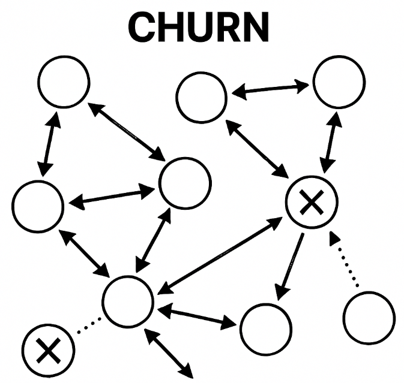

Causas del Churn:

* Nodos dinámicos: Usuarios que apagan sus dispositivos (ej. laptops, móviles) o cierran aplicaciones P2P.
* Fallos aleatorios: Conexiones inestables, cortes de energía o crashes de software.
* Comportamiento egoísta: Nodos que abandonan la red después de descargar un archivo (problema común en *file-sharing*).
* Ataques: Nodos maliciosos que entran y salen para sabotear la red (ej. ataques Sybil).

### Clasificación principal de redes p2p

En base a las [características iniciales](#características-de-una-red-p2p) y los [problemas que pueden surgir](#problemas-en-redes-p2p), las redes p2p se clasifican en dos categorías, que también corresponden con su topología lógica —o, si se prefiere, con su modelo de [red superpuesta](https://es.wikipedia.org/wiki/Red_superpuesta) (overlay network), que definen cómo se organizan los nodos para buscar y compartir recursos: [estructuradas y no estructuradas](https://www.geeksforgeeks.org/structured-and-unstructured-peer-to-peer-systems/).

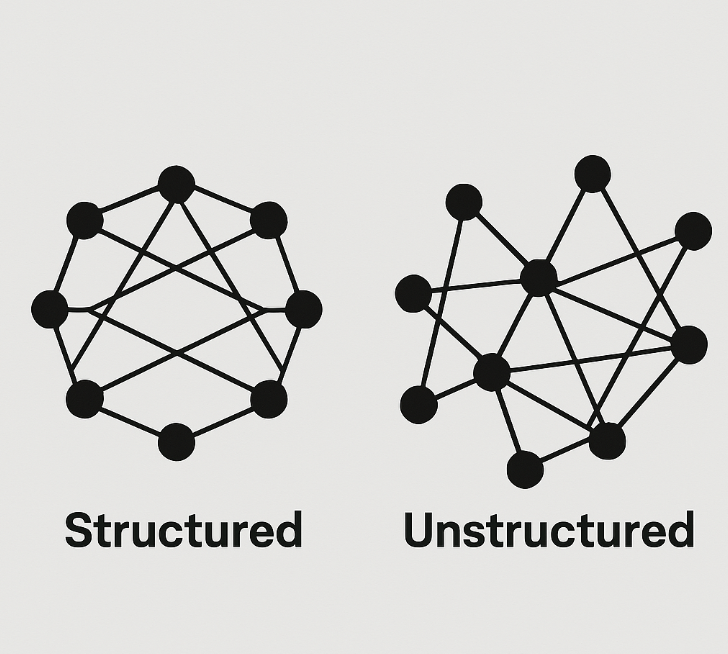

#### Topología estructurada

En la topología estructurada se sigue un patrón definido y determinista, lo que permite búsquedas eficientes y un uso optimizado del almacenamiento, siendo especialmente adecuado para redes estables (bajo churn) donde los nodos permanecen disponibles con regularidad.

En las redes P2P estructuradas, los nodos colaboran para consultar o distribuir información. Sin embargo, dado que solo un subconjunto de nodos es responsable, es necesario un mecanismo previo de localización. Para ello, los nodos emplean estructuras que actúan como índices distribuidos, asociando identificadores con la ubicación lógica de los nodos encargados.

Para entender mejor esto esto de los índices distribuidos, tomaremos como ejemplo las [DHT](https://es.wikipedia.org/wiki/Tabla_de_hash_distribuida), concretamente la implementación [Kademlia](https://es.wikipedia.org/wiki/Kademlia), donde los nodos se organizan según la "distancia" entre sus identificadores y el hash del dato buscado, manteniendo estructuras tipo diccionario clave/valor que actúan como índices distribuidos para localizar los nodos responsables de un dato en la red.

> 🤔 Entiendo que no hayas comprendido nada...esta explicación la veremos más en detalle en [los mecanismos de las redes p2p](#️-mecanismos-de-las-redes-p2p).

Existen otras implementaciones de DHT como [Chord](https://es.wikipedia.org/wiki/Chord), [Pastry](https://es.wikipedia.org/wiki/Pastry_(P2P)#:~:text=Pastry%20fue%20desarrollado%20en%20el,la%20mayor%C3%ADa%20de%20los%20casos.) y [Tapestry](https://es.wikipedia.org/wiki/Tapestry_(P2P)) que no veremos porque son menos usadas en redes p2p.

Además de las DHT, con topología de árbol, existen otras redes estructuradas basadas en jerarquías, como anillo o grafo:

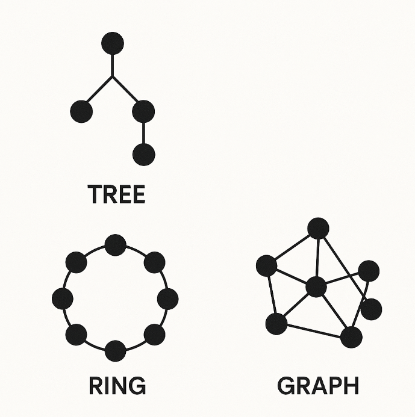

Muchas de las cuales han sido exploradas principalmente en el ámbito académico o en sistemas distribuidos tradicionales. En el contexto de la web3, donde priman la descentralización, la tolerancia a fallos y el direccionamiento por contenido, las DHT resultan más adecuadas y son, por ello, las más utilizadas en la práctica.

#### Topología no estructurada

En las topologías no estructuradas, las conexiones entre nodos son aleatorias o sin un patrón definido, lo que las hace más adecuadas para consultas complejas y además es mas optimo para entornos inestables donde los nodos se conectan y desconectan con frecuencia (alto churn). Son redes más resilientes, pero al no existir una estructura lógica que relacione directamente el contenido con nodos específicos, las consultas deben propagarse entre múltiples nodos para localizar la información, aunque lo cierto es que permite consultas más complejas que las estructuradas.

En redes no estructuradas, no hay un índice distribuido ni nodos responsables predefinidos, por lo que la consulta y localización de nodos ocurre mediante técnicas de difusión.

> Pero en el contexto de las redes p2p no debemos confundirlo con la [difusión amplia](https://es.wikipedia.org/wiki/Difusi%C3%B3n_amplia) de las telecomunicaciones, que se refiere a la transmisión o consulta de información desde un nodo origen hacia múltiples en una red distribuida. Más adelante, se explican las técnicas específicas de difusión en redes p2p.

Técnicas de difusión que se implementan en protocolos donde destacan [Flooding](https://en.wikipedia.org/wiki/Query_flooding), o su variante acotada Scoped Flooding (para reducir la sobrecarga), y los [Random Walks](https://en.wikipedia.org/wiki/Random_walk), utilizados cuando se prioriza la eficiencia y el bajo consumo. En el contexto de Web3, sin embargo, predomina el uso del protocolo [Gossip](https://academy.bit2me.com/que-es-gossip-protocol/) y sus derivados, como [Gossipsub](https://github.com/libp2p/specs/tree/master/pubsub/gossipsub), una variante optimizada empleada en libp2p para mejorar la escalabilidad y eficiencia del intercambio de mensajes o [Gossip Epidemic](https://viktoria-karamyshau.medium.com/gossip-epidemic-protocols-b1d44ce50c10).

Las topologías que pude formar una red no estructurada suele ser normalmente malla parcial, malla completa o topología aleatoria:

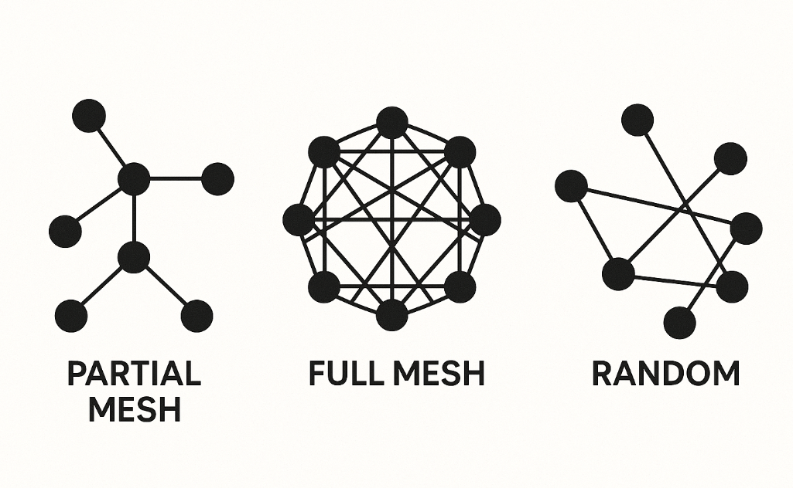

#### Aclaraciones de topología redes

**¿Cuando se usa una red no estructurada o estructurada?**

Depende principalmente del propósito de la red, definido inicialmente al establecer sus características. Por ejemplo, una red pública, con alto grado de descentralización y posiblemente alto churn, que requiera resiliencia y tiene que ser más simple, será no estructurada; mientras que una red más estable, escalable y con bajo churn, donde la eficiencia sea clave, optará por una topología estructurada, pero exigirá un diseño más complejo que permita consultas simples y directas.

**¿Existen soluciones mixtas de redes p2p no estructuradas y estructuradas?**

Sí, como veremos, una red p2p puede usar parte del protocolo de red estructurada, por ejemplo para el descubrimiento de nodos, y para el resto de casos ser realmente una red no estructurada.
Es decir, cada red implementa lo que mejor sirva para su propósito, y en general, no tiene que existir una doctrina fijada.

> 📌 Este resumen de redes p2p intenta generalizar y clasificar, pero no tenemos que olvidar que cada red tiene sus peculiaridades.

### ⚙️ Mecanismos de las redes p2p

En una red peer-to-peer (P2P), los nodos se comunican mediante el intercambio de mensajes, que pueden ser peticiones de información (lecturas, R) o entregas (escrituras, W). Un nodo puede iniciar la transacción o actuar como intermediario replicando peticiones hacia otros nodos.

Estas operaciones están reguladas por una serie de mecanismos compuestos por procesos o técnicas o estrategias o modelos establecidos en el protocolo de la red y es lo que veremos a continuación.

> Este apartado intenta explicar las diferentes soluciones técnicas que podemos encontrarnos.

> Se debe considerar que estos mecanismos no están exentos de excepcione según el [grado de descentralización](#grado-de-descentralización) o su [estrategia de almacenamiento](#estrategias-de-almacenamiento-en-redes-p2p).

Se describen los más relevantes, considerando que algunos se aplican específicamente a redes estructuradas y otros a no estructuradas.

#### Conexión inicial de nodos (Bootstrapp)

Cuando un nodo se inicia por primera vez, durante el arranque (conocido como bootstrap), se conecta a otros nodos denominados nodos semilla o [nodos bootstrap](https://en.wikipedia.org/wiki/Bootstrapping_node), normalmente preconfigurados en el propio software del nodo. Estos nodos suelen ser confiables y frecuentemente pertenecen a los fundadores o mantenedores del protocolo.

Como simplificación, podemos ver el siguiente ejemplo:

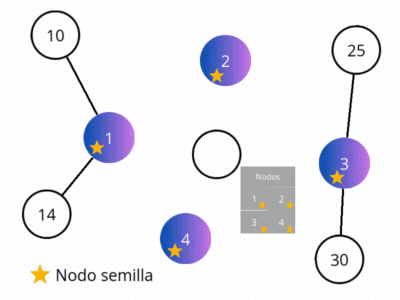

Inicialmente, el nodo parte de una lista de nodos conocidos, normalmente los nodos semilla, y el proceso consiste en consultar a esos nodos para descubrir otros nuevos y así sucesivamente con los nuevos nodos para ampliar y actualizar su red de relaciones.

Además de los nodos semilla, también es común el uso de mecanismos como seed DNS, que resuelven nombres de dominio a direcciones IP de nodos activos, [servidores de directorio](https://www.redeszone.net/tutoriales/internet/que-son-peer-seed-leech-ratio-p2p/) (también conocidos como bootstrap servers o trackers), que ofrecen listas centralizadas de nodos disponibles y también en redes locales difusión broadcast/multicast para descubrir nodos usando [mDNS](https://docs.libp2p.io/concepts/discovery-routing/mdns/), aunque en modelos descentralizados como Web3, predominan los nodos semilla.

#### Descubrimiento de nodos (Node Discovery)

El descubrimiento de nodos es el mecanismo que permite a un nodo encontrar nuevos pares a su lista de nodos activos.

Este proceso ocurre después del arranque inicial (bootstrap), pero también puede ejecutarse de forma periódica para mantener la red actualizada, o de manera reactiva, por ejemplo, cuando se detecta la caída de nodos durante la comprobación de conectividad.

En redes estructuradas (por ejemplo, DHTs), este proceso sigue protocolos deterministas, mientras que en redes no estructuradas se basa en estrategias de difusión, como veremos a continuación:

**Redes estructuradas**.

En redes estructuradas, es un mecanismo determinista que establezca con qué nodos debe relacionarse un nodo dado, asegurando que siempre se obtengan resultados consistentes y repetibles.

Tomando como ejemplo la DHT [Kademlia](https://en.wikipedia.org/wiki/Kademlia), en primer lugar, a cada nodo se le asigna un identificador único (ID), y el proceso consiste en la consulta a otros nodos sobre los nodos "más cercanos" que conozcan respecto a su propio ID para guardar esa información en una [tabla de enrutamiento](https://en.wikipedia.org/wiki/Kademlia#Fixed-size_routing_tables).

> Tabla que se usará posteriormente en el proceso [routing](#enrutamiento-routing-en-redes-estructuradas) que veremos más adelante.

La "cercanía entre nodos", es la forma de hacer que siempre la consulta sea determinista, es decir, que siempre devuelva lo mismo, y se basa en la [operación binaria XOR](https://es.wikipedia.org/wiki/Puerta_XOR).

En Kademlia, la tabla de enrutamiento almacena contactos de otros nodos organizados según su distancia XOR respecto al nodo local. Estos contactos se agrupan en estructuras llamadas k-buckets (del inglés bucket, que en este contexto equivale a 'contenedor'), donde cada bucket contiene hasta k nodos a una determinada distancia. Por convención, k suele ser 20.

> Los buckets empiezan desde 0, es decir, podemos tener desde Bucket 0 a Bucket 1, 2, 3, etc...

Esto aunque es una generalización, nos da una idea de lo que se busca, que es tener un mecanismo para que un nodo solo se relacione con un conjunto de nodos y se basa en "la cercanía", que no deja de ser una operación simple para tener un mismo criterio, pero si quieres entrar en detalle, lo vemos en un ejemplo:

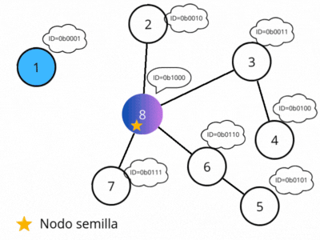

* Inicialmente, un nodo local con id 0b0001 conoce al nodo semilla con ID 0b1000 y lo incluye en el Bucket 3 como el único nodo que conoce.

  Si calculamos `0b0001 XOR 0b1000` es `0b1001` (9), siendo posición del bucket 3:

  | 3 <- | 2 | 1 | 0 |
  | - | - | - | - |
  | 1 | 0 | 0 | 1 |

  > Si la posición empieza desde 0 y de izquierda a derecha, 3 es la posición del último bit 1.

* El nodo realiza una consulta a ese nodo semilla mediante el método FIND_NODE, donde indica como ID objetivo el 0b0001, siendo su propio ID de nodo, y además, se especifica k = 3, por lo que el nodo consultado devuelve hasta 3 nodos que conoce y que están más cercanos a 0b0001 según la distancia XOR.

  Los 3 nodos más cercanos son:

  * `0b0011` con resultado XOR `0b0010` (2) y posición del bucket 1.
  * `0b0010` con resultado XOR `0b0011` (3) y posición del bucket 1.
  * `0b0111` con resultado XOR `0b0110` (6) y posición del bucket 2.

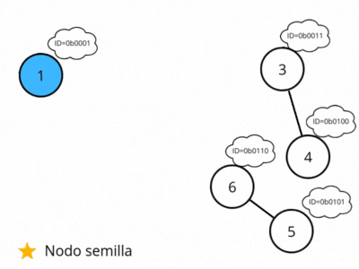

* En la segunda ronda, con los nuevos nodos descubiertos, se realiza α (alfa) consultas paralelas para buscar más nodos con FIND_NODE a los nodos 0b0011 (3) y 0b0010 (2).

  > El valor de α (alfa) indica el número máximo de consultas concurrentes por ronda, por ejemplo α = 2, con 2 consultas concurrentes. Por defecto en Kademlia α suele ser entre 2 y 3.

* Los nodos consultados responden con los nuevos nodos 0b0100 y 0b0101 y se calcula su posición de Bucket en la Routing table, siendo en el Bucket 2.
* Y se repite otra ronda con el nodo con ID 7...

**Redes no estructuradas**.

En primer lugar hay que aclarar, que en redes no estructuradas, también se realiza un descubrimiento de nuevos nodos cuando ocurre una propagación de consulta, como veremos en [técnica de difusión](#técnicas-de-difusión-en-redes-no-estructurabas), es decir, cuando un nodo realiza una petición se aprovecha para encontrar nuevos nodos.

El mecanismo es generalmente usando técnicas de difusión, ya sea por petición del nodo o mediante el intercambio de vecinos, generalmente a través de comunicación push. A continuación, veremos un ejemplo tomando como referencia Gossip para explicarlo, pero entendiendo que existen muchas particularidades y esto es una generalización:

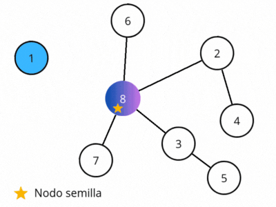

* Inicialmente un nodo consulta a un nodo semilla para conocer otros nodos, y este le responde con los nodos que conoce, por ejemplo, los 6, 2, 3 y 7. Estas consultas pueden ser en paralelo a varios nodos según el fan-out (abanico), que puede se entre 3 y 5, es decir, entre 3 y 5 consultas paralelas.

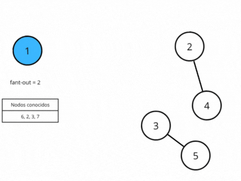

* El nodo continua consultando a los nodos 6, 2, 3 y 7, y suponiendo que el fan-out es 2, consultaría en una ronda a los nodos 2 y 3, para conocer los nuevos nodos 4 y 5.
* Es importante comprender, que en esta petición del nodo 1, también el nodo 2 y 3 conocen al nodo 1 y lo añaden en su lista de nodos, y esto porque el descubrimiento es reciproco (reciprocal peer discovery).

  > En la representación anterior, cuando el nodo 1 consulta al 8, igualmente existe un descubrimiento reciproco, se ha omitido para simplificar.

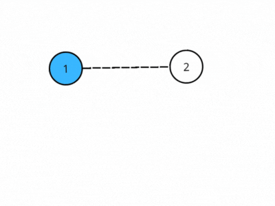

* Como el nodo 2 ya conoce al nodo 1 gracias al descubrimiento recíproco, cuando detecta nuevos nodos o cambios en la topología de la red, puede notificar proactivamente al nodo 1 mediante una comunicación push. Es decir, no espera a que el nodo 1 realice una consulta, sino que le envía la información tan pronto como la tiene disponible, como en este ejemplo, donde comunica la existencia de los nodos 9 y 10.

**Otras técnicas**.

Adicionalmente al descubrimiento de nodos, existen otras técnicas como [Peer Exchange (PEX)](https://en.wikipedia.org/wiki/Peer_exchange), que se basa en el intercambio directo de información entre pares ya conectados, a diferencia de los métodos de descubrimiento de nodos que implican consultar fuentes externas; o [Rendezvous](https://docs.libp2p.io/concepts/discovery-routing/rendezvous/), que actúa como un punto intermedio donde los nodos pueden registrarse y descubrirse mutuamente para facilitar la conexión inicial.

#### Enrutamiento (Routing) en redes estructuradas

Es un proceso propio de las redes P2P estructuradas y consiste en determinar qué conjunto de nodos son responsables de gestionar una operación o recurso específico dentro de la red, utilizando generalmente un índice distribuido.

Como vimos en el descubrimiento de nodos, el enrutamiento también busca ser determinista y siguiendo el ejemplo de la DHT Kademlia, se basa en la cercanía XOR entre el ID de un nodo y la key o hash del dato.

> Aunque diferentes nodos inicien una búsqueda, el uso del XOR con la key del dato hace que converjan hacia los mismos nodos cercanos responsables del dato. Es decir, con esto es posible que la misma consulta del mismo key en dos nodos diferentes den como nodos cercanos los mismos o los más cercanos.

Es complicado entenderlo, asi que lo veremos en un ejemplo:

**En el caso de escribir (W) un recurso**.

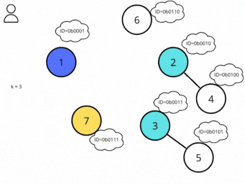

* Inicialmente existe una transacción iniciado desde el propio nodo o provenir de un cliente ligero.
* En este ejemplo no veremos cada paso de la transacción (depende de cada red p2p), nos centraremos como en base a un identificador o key que hace referencia al recurso (normalmente suele ser su hash), se realiza una solicitud para buscar o guardar en la DHT. Este recurso puede representar datos como archivos, fragmentos de archivos, metadatos, bloques de datos en una blockchain, direcciones de nodos, o cualquier otro recurso específico que la red P2P esté diseñada para gestionar.
* El nodo 1, que recibe la petición, localiza en su tabla de enrutamiento sus k nodos más cercanos (en este ejemplo 3), es decir, localiza nodos del Bucket 0, pero como no hay, busca del Bucket 1 (los ID 2 y 3) y luego del Bucket 2 (el ID 7).

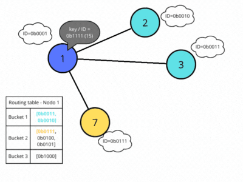

* Con los 3 nodos más cercanos, ahora tiene que buscar la cercanía con el key del recurso, realizando las operaciones binarias XOR.

  ```text
  0b0111 XOR 0b1111 = 0b1000 (8) 
  0b0011 XOR 0b1111 = 0b1100 (12)
  0b0010 XOR 0b1111 = 0b1101 (13)
  0b0001 XOR 0b1111 = 0b1110 (14)
  ```

  > Aunque el nodo 7 (0b0111) no era el más cercano según la tabla del nodo local (estaba en el Bucket 2), tras aplicar la operación XOR con la clave del recurso, se convierte en el más cercano. Esto refleja que no se propaga solo hacia nodos vecinos, sino hacia los más cercanos a la key del recurso. Así se evita que todos los datos vayan siempre a los mismos nodos, favoreciendo una distribución más descentralizada y determinista, independientemente del nodo que inicia la propagación.

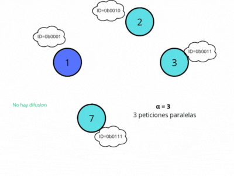

* Cuando se tiene que almacenar en la DHT (STORE), se realizan α (alfa) peticiones concurrentes a los nodos establecidos, los cuales guardan en su registro de la DHT la key del recurso y normalmente la forma de acceder al recurso, como una dirección.

  > Depende de la red, la DHT no es un lugar donde almacenar el payload, se entiende más como un índice; aunque pueden ser datos si son representativos, normalmente suelen ser metadatos o URLs o direcciones o cualquier información para localizar el recurso.

  > No existe propagación entre los nodos, el nodo 1 es el único que almacena.  

**En el caso de leer (R) un recurso**.

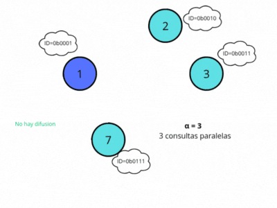

* Cuando el nodo 1 consulta a los nodos cercanos, se realizan hasta α (alfa) consultas concurrentes para obtener la información.

  > No existe propagación entre los nodos, el nodo 1 es el único que consulta.

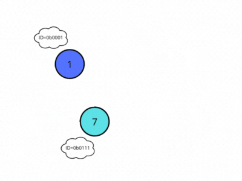

* Por ejemplo el nodo 7, al recibir la petición de consulta, en primer lugar se asegura de nuevo que es un nodo cercano a la key solicitada y luego busca en su DHT la key 0b1111 para devolver el acceso al recurso, como podría ser su propia dirección IP o cualquier otra forma que permite al nodo 1 descargar el payload (o cualquier otra comunicación) desde el nodo 7.

  > Se asegura que es el nodo cercano aunque parezca redundante por coherencia, es una validación que suele hacer el nodo para asegurar que solo los nodos responsables al recurso lo pueden devolver. Si fuera el caso que no lo es, como veremos a continuación, lo que hará el nodo es buscar los nodos que son mas cercanos para devolver esa información.

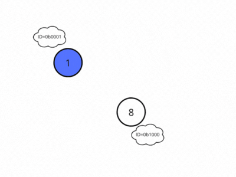

* En este ejemplo, los nodos 2, 3 y 7 son los responsables del recurso, pero en un momento dado se pueden caer uno o varios y el nodo 1 por descarte, podría usar un nodo donde no se escribió el recurso, como podría ser el nodo semilla 8.
* El nodo 8, recibe la petición, tiene registros en la DHT para otras key, pero no para la key 0b1111 (15) porque no es el responsable del dato.
* En ese caso, el nodo 8 consultado no puede devolver el acceso al recurso, pero sí los otros nodos que conoce que podrían ser responsables del dato, por lo tanto, inicia el proceso de calcular la cercanía de la key del recurso.
* Gracias a que este cálculo es determinista haciendo a ciertos nodos responsables de una key de recurso, el nodo 8 es capaz de devolver que los nodos con ID 3 y 2 son los responsables del recurso, como en efecto es, junto al nodo 7; es decir, el calculo de cercanía XOR ha dado los mismos nodos responsables (3 y 2) pese a que para el nodo 8 no eran inicialmente sus nodos más cercanos en la Routing table.
  
##### Aclaraciones routing

**¿Es esta la forma más optima?**

El concepto de DHT se refiere a una tabla hash distribuida que permite localizar recursos entre nodos. Kademlia es una implementación concreta que organiza la información usando una métrica de distancia basada en XOR. Cada sistema puede adaptar el protocolo, por ejemplo, mediante un método PROVIDE para anunciar la posesión de un contenido, permitiendo que otros nodos almacenen también esa asociación en la DHT según sus necesidades.

**¿Es una consulta exponencial la que tiene que hacer el nodo para encontrar un dato?**

No, no es una consulta exponencial; es logarítmica.

El tiempo logarítmico significa que el número de pasos crece como log₂(N), es decir, muy lentamente en relación al tamaño de la red.

> No voy a entrar mucho en detalle en esto y tampoco es lago que he mirado mucho, si tienes interés puede ir este enlace de [freecodecamp.org](https://www.freecodecamp.org/espanol/news/hoja-de-trucos-big-o).

En una DHT como Kademlia, esto permite localizar datos eficientemente incluso con miles o millones de nodos.

#### Técnicas de difusión en redes no estructurabas  

Es una técnica que solo afecta a redes no estructuradas, porque el enrutamiento de las redes estructuradas permite localizar nodos o datos sin necesidad de difundir mensajes indiscriminadamente.

La difusión en este contexto de redes p2p, son técnicas para transmitir o consultar información desde un nodo origen hacia múltiples nodos en una red distribuida, pero además en la mayoría de protocolos de redes no estructuras, se produce una propagación, donde a diferencia de una difusión simple, los nodos que reciben la petición se comportan como agentes intermedios que replican la petición.

 > Cuando son consultas de denominan comúnmente propagación de consultas (Query Propagation)

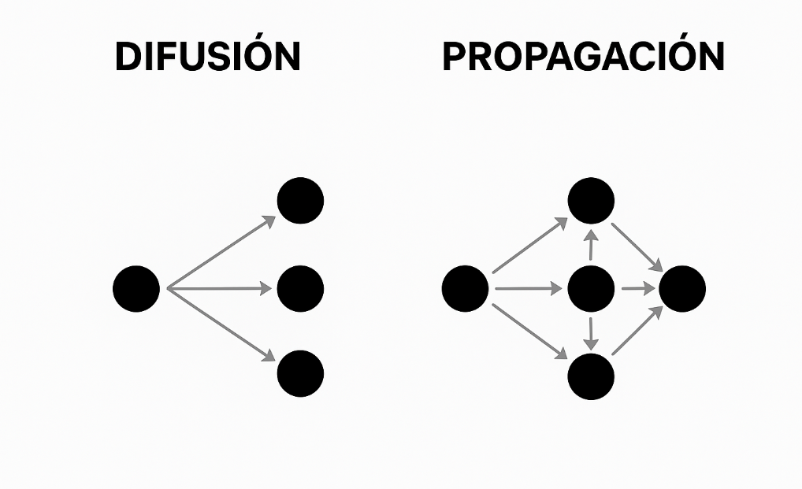

Como explicamos, el protocolo que destaca en la Web3 es Gossip, y para entender mejor las redes no estructuradas, veremos un ejemplo:

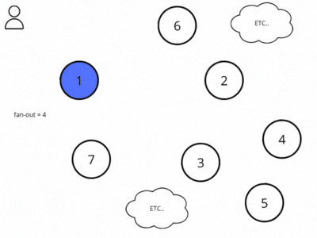

* Inicialmente existe una transacción iniciado desde el propio nodo o provenir de un cliente ligero.
* En este ejemplo no veremos cada paso de la transacción (depende de cada red p2p), nos centraremos primero en lo que sería una escritura, donde se difunde la información desde el nodo 1 hasta el resto de nodos conocidos como el 6, 2, 3 y 5. El k o fan-out (abanico), se refire a la cantidad de peticiones paralelas que se realizan y no se debe confundir con los k-buckets de DHT...

  > Valores comunes de fan-out en gossip suelen estar entre 3 y 10. Dependen del tamaño de la red y del tipo de gossip.

  > En este ejemplo se representa una ronda de 4 peticiones, pero obviamente suele ser varias dependiendo de los nodos conocidos.

* A modo de ejemplo, en los nodos 4 y 5 se representa el límite de propagación de saltos (hops) denominado [TTL*](https://es.wikipedia.org/wiki/Tiempo_de_vida_(inform%C3%A1tica)). Para que la consulta no se extienda hasta el fin, existe un límite, (*) como si sería el tiempo de vida de la petición, que en realidad no se basa en el tiempo, sino en el límite de saltos, que suele ser normalmente de 3 a 8 saltos.


* En la propagación de consulta o Query propagation, la petición que realiza el nodo, en principio, no difiere mucho a la escritura que vimos con anterioridad, es decir, se realiza la petición a los nodos conocidos y estos devolverán el resultado **y adicionalmente** la lista de nodos conocidos, porque no debemos olvidar que la propagación de consulta se usa también para el descubrimiento de nuevos nodos.
* Se dice que se devuelve el dato, pero igualmente como ocurre en las redes estructuradas, dependiendo de la red puede ser un enlace para descargar el payload, como una IP u otra forma de acceso...
* Aunque no difiere mucho la petición, ahora veremos en detalle que es diferente la respuesta si se devuelve el primer resultado encontrado (first-match), o si se espera multiples resultados de los nodos involucrados (multi-match).

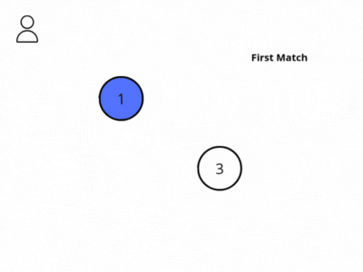

* En First-match, por ejemplo, si el nodo 3 recibe una petición de consulta y lo tiene disponible, proporciona la respuesta.


* En First-match, si el nodo 3 no tiene el dato, consultará al nodo 5 y continuará hasta encontrarlo o alcanzar el límite de saltos (TTL).

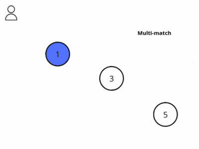

* En Multi-match, por ejemplo si el nodo 3 recibe la petición, continuará propagando la consulta hasta el último salto posible (TTL).
* La respuesta final que recibe el nodo 1 es la acumulación de todas las respuestas de los nodos que han participado.

#### Comprobación de conectividad

La comprobación de conectividad en redes P2P es fundamental para asegurar que los nodos están activos y disponibles, y para mantener la topología de la red actualizada. Este proceso varía según el tipo de red:

* En redes estructuradas (como DHTs), los nodos realizan comprobaciones periódicas (por ejemplo, mediante mensajes PING/PONG o heartbeats) a los pares registrados en sus tablas de enrutamiento. Esto permite detectar nodos caídos y reemplazarlos por otros, manteniendo la integridad y eficiencia del enrutamiento. Además, estas comprobaciones pueden servir para refrescar la información de los buckets y descubrir nuevos nodos cercanos.

* En redes no estructuradas, la comprobación de conectividad suele integrarse en los propios mecanismos de difusión y descubrimiento de nodos. Los mensajes periódicos (heartbeats) o intercambios de mensajes PING/PONG ayudan a identificar nodos activos y a eliminar de la lista de vecinos aquellos que no responden. En protocolos como Gossip, la conectividad se verifica de forma implícita durante la propagación de mensajes, y los nodos actualizan dinámicamente sus listas de pares en función de la respuesta a estas comunicaciones.

En ambos casos, la comprobación de conectividad es clave para gestionar la rotación de nodos (churn), evitar la propagación de mensajes a nodos inactivos y garantizar la resiliencia y disponibilidad de la red.

#### Establecimiento de la conexión

Es el proceso mediante el cual un nodo inicia comunicación y abre un canal de comunicación (por ejemplo, vía TCP o UDP) con otro nodo previamente descubierto o conocido para cualquiera de las operaciones necesarias posteriores, como realizar una consulta o propagar información.

Es importante distinguir entre el establecimiento de la comunicación y la transferencia de información: establecer comunicación entre nodos de red significa que ambos pueden reconocerse y abrir un canal de conexión, pero esto no implica que se estén transmitiendo datos de aplicación aún. La transferencia de información ocurre después, cuando los nodos ya conectados intercambian mensajes o datos concretos a través del canal previamente establecido. Así, el establecimiento de la conexión es el paso previo y necesario para que la transferencia de información pueda producirse, pero ambos procesos son independientes y pueden ocurrir en momentos distintos.

La comunicación entre dos nodos puede ser activa o mantenerse pasiva mediante mecanismos como "keep-alive", que permiten conservar la conexión abierta enviando mensajes periódicos para evitar su cierre por inactividad.

Este proceso puede incluir el uso de comunicación cifrada ([TLS](https://es.wikipedia.org/wiki/Seguridad_de_la_capa_de_transporte), [Noise](https://en.wikipedia.org/wiki/Noise_Protocol_Framework), etc.).

Igualmente, cuando la comunicación directa entre nodos no es posible debido a que alguno de ellos está detrás de un NAT o firewall, se emplean técnicas de [NAT traversal](https://es.wikipedia.org/wiki/NAT_traversal), como el [UDP hole punching](https://en.wikipedia.org/wiki/UDP_hole_punching). Estas técnicas permiten que los nodos establezcan conexiones entrantes a pesar de las restricciones impuestas por el NAT, facilitando la entrada y participación en la red incluso cuando otros nodos no pueden acceder directamente a ellos. Si estas técnicas no resultan efectivas, se recurre al uso de nodos relay como intermediarios para asegurar la conectividad.

Un [Relay](https://en.wikipedia.org/wiki/Traversal_Using_Relays_around_NAT) se utiliza cuando las técnicas como hole punching no son efectivas.

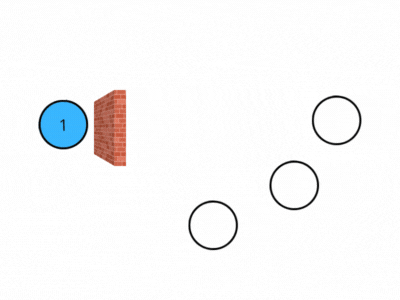

* Cuando otros nodos no pueden acceder al nodo 1 porque está detrás de NATs o firewalls.

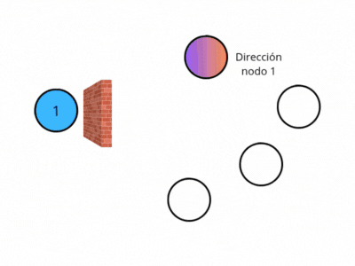

* El nodo que no puede atender peticiones, sí puede conectarse a otro nodo relay.

  > En telecomunicaciones, cuando un nodo establece una conexión de salida hacia otro, ambos pueden enviar y recibir información, logrando comunicación dúplex (half o full-duplex). Esto es posible porque la conexión abre canales bidireccionales (como sockets TCP), permitiendo el intercambio continuo de datos en ambos sentidos.

  > El uso de nodos relay puede impactar el rendimiento debido a la latencia adicional en la comunicación y plantea consideraciones de seguridad, como la confianza en el nodo relay para manejar los datos de forma adecuada.

* El nodo 1 cuando anuncie su dirección, usará la del nodo relay, de esta forma, el resto de nodos cuando quieran hacer una comunicación al nodo 1, en realidad se conectaran al nodo relay.
* El nodo relay solo actúa de intermediario de comunicaciones, cualquier otra actividad de la red se la pasará al nodo 1.

#### Transferencia de datos (Data Transfer)

La transferencia de datos en redes P2P consiste en el intercambio directo de información entre nodos que ya se han descubierto y conocen sus direcciones.

Una vez establecida la relación, existen varios enfoques, un nodo puede solicitar información activamente (pull) y recibirlo de otro nodo. Aunque también un nodo puede propagar y enviarlo activamente (push) y el nodo recibiría la información sin solicitarlo.

> Estos dos enfoques se relacionan normalmente a redes estructuradas con el enrutamiento (pull) y a la propagación en redes no estructuradas.

Los datos transferidos normalmente en fragmentos, asegurando la integridad mediante mecanismos como hashes o checksums.

Este proceso es independiente del establecimiento de la conexión y se centra únicamente en el envío y recepción de la carga útil entre pares.

#### Técnicas de replicación

La replicación del contenido puede seguir una estrategia que determine cómo se distribuyen los datos entre los nodos para buscar mejorar disponibilidad y fallos antes problemas.

> Este apartado intenta explicar técnicas de replicación comunes, pero debemos considerar la característica inicial de [estrategia de almacenamiento](#estrategias-de-almacenamiento-en-redes-p2p), porque podrían existir excepciones o ajustes sobre lo que se explique a continuación, por ejemplo, la red podría crear un índice centralizado, o una fragmentación con [Erasure Coding](https://en.wikipedia.org/wiki/Erasure_code)  o [fragmentación en otro nodos con sharding](#subredes-con-diferentes-protocolos-sharding)...

Podemos resumirlos como los siguientes técnicas:

* Replicación Total (Full Replication), ocurre cuando cada nodo de la red almacena una copia completa de todos los datos. Muy seguro pero costoso en almacenamiento y ancho de banda. Aplica principalmente en redes no estructuradas o en arquitecturas que requieren alta disponibilidad local del historial completo.

  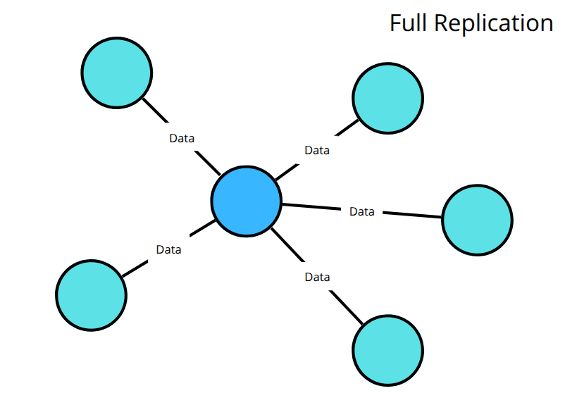

* Replicación Parcial (Partial Replication), cada nodo almacena solo una parte de los datos. Permite escalar reduciendo la carga en los nodos individuales. Es el modelo por defecto en redes estructuradas y también aplicable en redes no estructuradas más eficientes.

  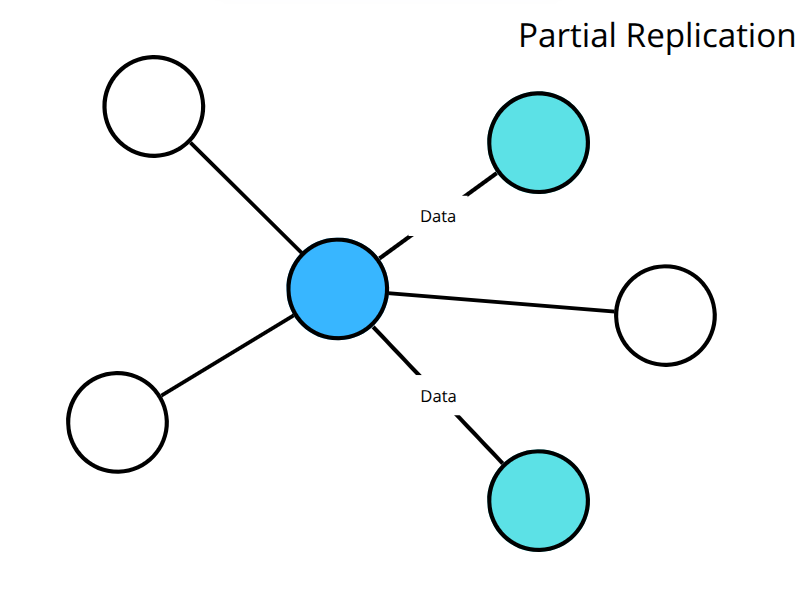

* Replicación Basada en Demanda (Demand-based Replication), los datos se replican automáticamente en los nodos que los solicitan, creando copias temporales o persistentes mediante mecanismos de caching, para que se puedan recupera para futuras solicitudes.

  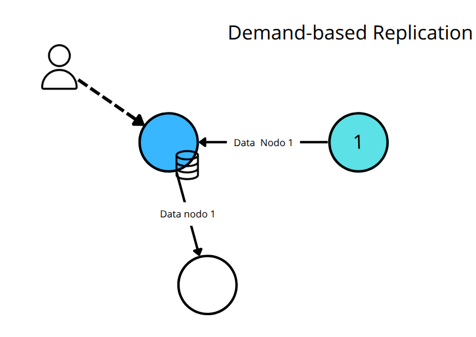

* Replicación Dirigida por el Usuario (User-driven Replication), el usuario selecciona explícitamente qué datos mantener replicados de forma persistente, independientemente de si han sido solicitados o no. Ejemplo: el pinning manual en IPFS, donde se fija contenido en un nodo incluso si no se ha accedido previamente.

  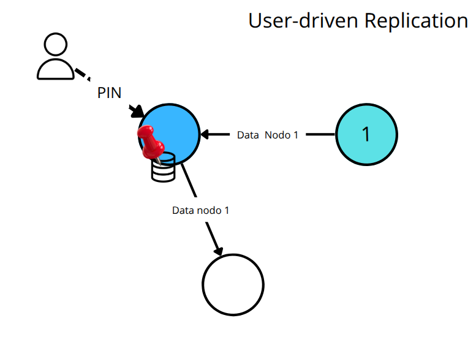

* Replicación Basada en Fiabilidad (Reliability-based Replication), los datos se replican preferentemente en nodos más confiables y disponibles. Optimiza disponibilidad según la reputación, el rendimiento o contratos incentivados. Aplica típicamente en redes estructuradas con capas adicionales de selección de nodos. Ejemplos: Filecoin, [Storj](https://www.storj.io/).

  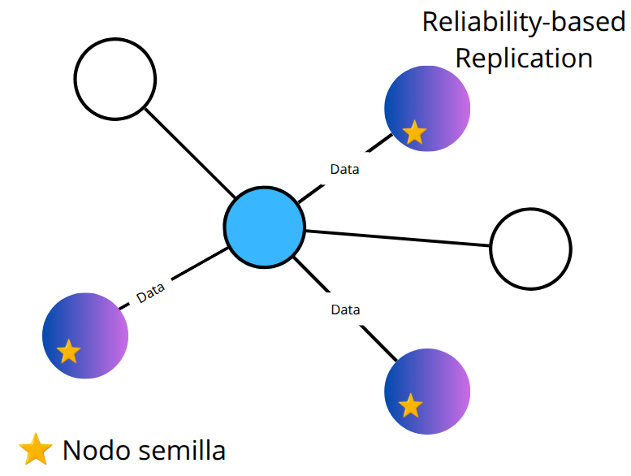

* Replicación Basada en Redundancia Controlada (Controlled Redundancy Replication), se establece un número fijo o mínimo de copias para cada dato para garantizar disponibilidad. Común en redes estructuradas que utilizan parámetros como el factor k para redundancia. Ejemplos: Filecoin (usa acuerdos de almacenamiento —deals— que especifican cuántas copias deben mantenerse del dato), Kademlia (mantiene cada valor replicado en los k nodos más cercanos al hash de la clave para asegurar redundancia y disponibilidad).

  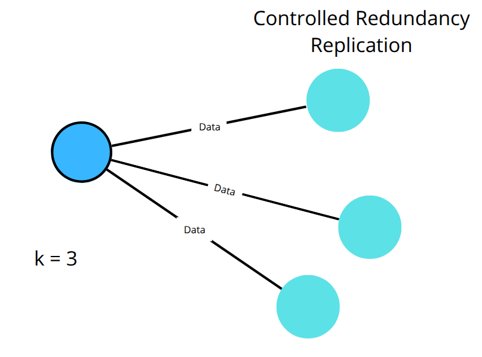

* Replicación Basado en Proximidad (Proximity-based Replication), los datos se almacenan preferentemente en nodos cercanos geográficamente o en red para mejorar el acceso. Ejemplo: redes de distribución de contenido p2p, tipo [CDN](https://es.wikipedia.org/wiki/Red_de_distribuci%C3%B3n_de_contenidos).

  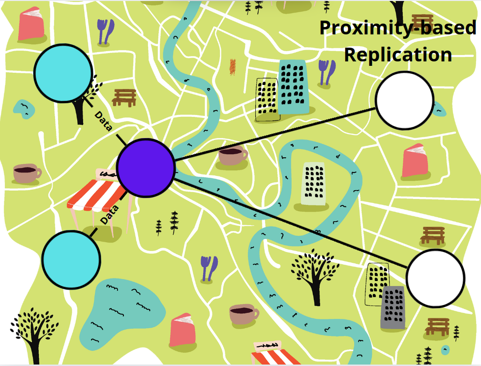

> Estas técnicas no son excluyentes, una red puede aplicar varias, a no ser que sea excluyentes y pueden existir variantes. Por ejemplo, una red podría tener replicación parcial basado en proximidad y dirigido por el usuario.

#### Modelos de consistencia

Son reglas que definen cómo y cuándo los cambios en los datos replicados se propagan y se reflejan en los distintos nodos de la red, y bajo qué condiciones esos cambios se consideran consistentes o confirmados. Puede ser normalmente:

* Consistencia fuerte (Strong consistency), implica que después de una escritura, todas las lecturas en cualquier nodo reflejan el valor más reciente, por lo tanto, se espera confirmación de los nodos relevantes (como nodos validadores)  antes de finalizar la escritura
  
  

  > En este ejemplo, un dato escrito (W) por el nodo emisor que es cliente, debe ser replicado y luego confirmado por el conjunto de nodos relevantes, como serían los nodos validadores, en este ejemplo solo habría un nodo validador, de color azul.

* Consistencia eventual (Eventual consistency), los nodos se sincronizan con el tiempo, sin garantizar cuándo y no se espera una confirmación de escritura.

   

  > En consistencia eventual, no espera confirmación.

* Consistencia de lectura tras escritura (Read-your-writes consistency), es comp en consistencia eventual, pero garantiza que un nodo emisor cliente si consulta posteriormente consultará el mismo dato que escribió. No implica que el cliente siempre vea su dato si otro nodo lo sobrescribió después.

  

  > En este ejemplo, el nodo emisor pregunta de forma posterior y se asegura la respuesta correcta gracias a que guardó una caché. No significa que consistencia eventual no lo haga, simplemente aquí se asegura.

* Consistencia causal (Causal consistency), garantiza que los eventos relacionados por causa-efecto se vean en el mismo orden por todos los nodos. Es decir, si un evento A influye en B, todos los nodos deben ver A antes que B.

   

  > Se logra controlando el orden de entrega, en el ejemplo, se entrega C cuando llega porque no tiene una causa y efecto, sin embargo, sólo entrega B si entrego antes A. Además no se espera confirmación de escritura.

* Consistencia secuencial (Sequential consistency), asegura que todas las operaciones se vean en el mismo orden global, aunque ese orden no sea necesariamente el real (cronológico). En causal, solo se respeta el orden entre operaciones que tienen dependencia (causa-efecto), pero en secuencial, todas las operaciones (incluso no relacionadas) deben verse en el mismo orden global por todos los nodos.

  

  > Se logra controlando el orden de entrega, en el ejemplo, como el orden es A, B y C, asi debe hacerlo el nodo que debe replicar la escritura.

**Aclaraciones**:

En la práctica, las redes P2P rara vez implementan consistencia fuerte debido a sus problemas en rendimiento y disponibilidad, por lo tanto, suelen preferir consistencia eventual.

Una red p2p puede seguir varios modelos, si no son contradictorios, por ejemplo, ser causal y eventual, etc.

### Clasificación de nodos

Hemos visto que existen características iniciales en una red p2p que sigue una [estrategia de almacenamiento](#estrategias-de-almacenamiento-en-redes-p2p), [modelo de confianza](#modelo-de-confianza) o [autorización](#modelo-de-autorización) y además existiendo un [grado de descentralización](#grado-de-descentralización) para aplicar algunas excepciones que mejoren el rendimiento o seguridad de la red.
Igualmente vimos que los nodos pueden adoptar distintas funciones o rol según su topología estructurada o no estructurada.

Como una red se sustenta en nodos, podemos concretarlo con un resumen de los posibles clases o tipos de nodos que existen:

#### Por capacidad

Un nodo puede tener más capacidad y presencia en la red e incluso poder ejercer funciones que otro nodo de la red no tiene, afectando al grado de descentralización.

A continuación, listamos estos tipos de nodos como:

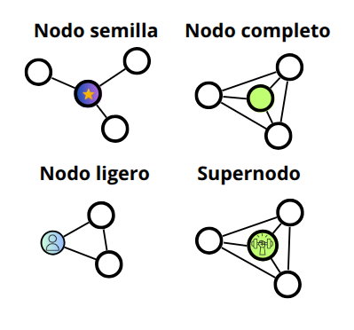

* Nodo semilla o bootstrap (como ya vimos...), nodo con una dirección conocida y accesible, usado por nodos nuevos para descubrir y conectarse inicialmente a la red. No desempeña un rol funcional continuo, pero es esencial para el arranque de la red.
* Nodo ligero (Light client), no almacena todo el estado ni el historial completo. Depende de nodos completos para verificar información mediante pruebas (ej. Merkle proofs). Está limitado a roles como emisor o receptor.
  > En algunas redes modernas (ej. Mina Protocol), los light clients pueden verificar sin full nodes gracias a [zk-proofs](https://es.wikipedia.org/wiki/Prueba_de_conocimiento_cero).
* Nodo completo (Full node), mantiene el estado completo y todo el historial reciente o, en algunos casos, solo una parte relevante del historial si opera en modo "pruned node" (nodo podado). Puede validar, ejecutar, propagar transacciones y bloques, y servir datos a otros nodos. Está capacitado para ejercer cualquier rol funcional dentro de la red.
* Supernodo (Supernode), es un nodo completo que, además de las funciones básicas, asume tareas adicionales como coordinación, enrutamiento o gestión de recursos. Los supernodos suelen tener mayor capacidad (ancho de banda, almacenamiento, disponibilidad) y pueden actuar como intermediarios o facilitadores para otros nodos menos capaces. Su uso introduce cierto grado de centralización parcial, aunque siguen formando parte de la red P2P.
  > Supernodo se utiliza en varias redes P2P, aunque no es obligatorio en todas. Su presencia depende del diseño y necesidades de la red.

#### Por rol en la red

Un nodo puede ejercer roles específicos dentro de la red p2p, lo que permite distribuir tareas, optimizar recursos y mejorar la eficiencia y resiliencia del sistema. Estos roles pueden ser dinámicos (un nodo puede cambiar de rol según las necesidades de la red) o fijos (asignados de forma permanente o por configuración).

Los roles más comunes que pueden encontrarse en una red p2p incluyen:

**Roles operativos**.

Asumidos durante la ejecución del protocolo, según el contexto.

* Nodo emisor (Initiator/Sender), inicia solicitudes o transacciones, como la publicación de datos, envío de mensajes o peticiones de recursos.
* Nodo receptor (Receiver), recibe y procesa solicitudes o datos enviados por otros nodos.
* Nodo validador (Validator), verifica la validez de transacciones, bloques o datos antes de aceptarlos y propagarlos. Es fundamental en redes blockchain y sistemas que requieren consenso.
* Nodo replicador (Replicator), se encarga de almacenar y replicar datos para asegurar la disponibilidad y redundancia en la red.

> En muchas redes p2p, un mismo nodo puede desempeñar varios roles simultáneamente, dependiendo de su capacidad, permisos y configuración. La asignación de roles puede estar determinada por el protocolo, la reputación del nodo, incentivos económicos o la propia elección del usuario.

Esta diferenciación de roles permite que las redes p2p sean flexibles, escalables y adaptables a distintos escenarios de uso, desde el intercambio de archivos hasta sistemas de consenso distribuidos o almacenamiento descentralizado.

**Roles de infraestructura**.

Relacionados con la estructura de conexión y soporte de red.

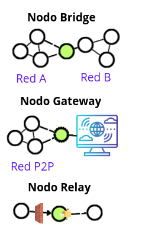

* Nodo puente (Bridge node), facilita la comunicación entre redes distintas.
* Nodo de gateway/pasarela, conecta la red P2P con sistemas externos, APIs, clientes ligeros o redes tradicionales, facilitando la interoperabilidad y el acceso.
* Nodo relay (que ya vimos), actúa como intermediario para transmitir mensajes o datos entre nodos que no pueden comunicarse directamente, por ejemplo, por estar detrás de NAT/firewall.

**Roles funcionales**.

Definen tareas especializadas dentro del diseño lógico de la red.


* Nodo de monitorización/auditoría (monitoring/auditing node), recopila métricas, verifica el estado de la red o audita transacciones para propósitos de análisis, seguridad o cumplimiento.
* Nodo de almacenamiento dedicado (Dedicated storage node), especializado en almacenar grandes volúmenes de datos o archivos.

> Dependerá siempre de la red p2p, existiendo, claro esta, muchos más...

### Dominios funcionales

Un dominio funcional en una red P2P, es una agrupación lógica de nodos que colaboran para desempeñar una función específica dentro de la red, como enrutamiento, indexación, etc **integrado dentro de la misma red**.

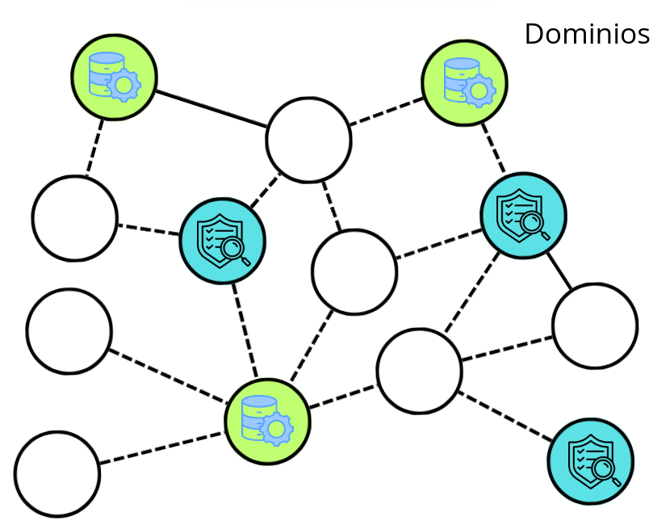

  > Por ejemplo en este nodo hay dominios de almacenamiento y auditoria integrados en la red.

Estos dominios pueden estar formados por nodos de diferentes clases, según la [clasificación de nodos](#clasificación-de-nodos) pero incluso aunque menos común, pueden estar formados por nodos de diferente [autorización](#modelo-de-autorización) o [confianza](#modelo-de-confianza).

**Ejemplos de dominios funcionales**.

* Dominio de almacenamiento, un grupo de nodos (completos y dedicados) que colaboran para almacenar y replicar archivos, independientemente de su nivel de autorización. Por ejemplo, en IPFS, cualquier nodo puede unirse al dominio de almacenamiento si cumple con los requisitos de espacio y disponibilidad.
* Dominio de auditoría, nodos de diferentes clases (algunos con permisos elevados, otros públicos) que cooperan para verificar la integridad de los datos o transacciones. En una red blockchain, pueden existir nodos auditores que revisan bloques, aunque no todos tengan el mismo nivel de confianza.
* Dominio de indexación, nodos ligeros y completos que mantienen índices distribuidos para facilitar búsquedas rápidas, sin importar su rol principal en la red.
* Dominio de validación, nodos validadores y supernodos que participan en la validación de transacciones, donde algunos pueden tener permisos especiales y otros actuar como observadores.
* Dominio de monitoreo, nodos de diferentes niveles de confianza que recopilan métricas y supervisan el estado de la red, pudiendo incluir tanto nodos internos como externos.

Estos nodos pueden cooperar activamente entre sí y establecer una topología funcional propia y dinámica, optimizada para la función que desempeñan, **pero** sin dejar de estar integrados en la topología general de la red.

Su pertenencia puede ser temporal o permanente, dependiendo de la función que se requiera en cada momento.

Un mismo nodo puede pertenecer a varios dominios funcionales simultáneamente si cumple con los requisitos de cada función.

La especialización de nodos en funciones específicas puede mejorar la eficiencia de la red, pero también puede disminuir el [grado de descentralización](#grado-de-descentralización) si un número reducido de nodos concentra dichas funciones en detrimento de la participación equitativa del resto.

### Subredes lógicas en redes p2p

Las subredes lógicas, son agrupaciones de nodos dentro de una red P2P que colaboran para cumplir una función específica de forma independiente a la red principal.

> A diferencia de los [dominios funcionales](#dominios-funcionales) donde los nodos cooperan en la misma red, las subredes implican una separación topológica y una segmentación de la red.

Estas subredes pueden estar formados por nodos de diferentes clases, según la [clasificación de nodos](#clasificación-de-nodos) e igualmente por nodos de diferente [autorización](#modelo-de-autorización) o [confianza](#modelo-de-confianza).

Las subredes lógicas pueden operar bajo el mismo protocolo principal de la red, lo cual es lo más habitual, pero también pueden implementar subprotocolos específicos para adaptarse a necesidades concretas de la subred. Por ejemplo, en algunas blockchains, ciertos shards o subredes pueden utilizar un protocolo de consenso diferente al de la red principal para optimizar el rendimiento o la seguridad en función de los requisitos de cada fragmento.

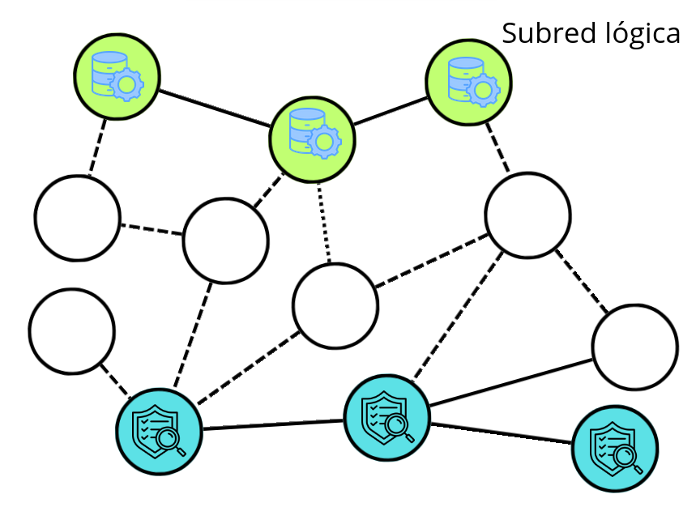

**Ejemplos de subredes lógicas**.

* Redes híbridas (público-privadas), consorcios o entornos empresariales, donde se requiere restringir el acceso a determinados recursos, operaciones o datos. Por ejemplo, una red blockchain puede tener una subred pública abierta a cualquier participante y otra subred privada donde solo entidades autorizadas pueden validar transacciones o acceder a información confidencial.
* Subredes de validadores autorizados en blockchains permisionadas.
* Grupos privados de almacenamiento o intercambio de datos dentro de una red P2P pública.

Estas subredes permiten especializar a nodos en funciones  mejorando la eficiencia. Sin embargo, pueden reducir el [grado de descentralización](#grado-de-descentralización), ya que ciertos nodos o grupos asumen más responsabilidad o visibilidad. Por tanto, su uso implica un equilibrio entre rendimiento, seguridad y descentralización.

#### Subredes con procesamiento paralelo: Sharding

Estas subredes permiten **paralelizar** procesos, lo que mejora significativamente la escalabilidad; a este enfoque se le conoce como Sharding (fragmentación).

Es una técnica que divide la red en fragmentos (shards), cada uno de ellos responsable de procesar y almacenar subconjuntos de datos y transacciones en paralelo, fragmentando el estado de la red.

Mejora la escalabilidad en redes P2P al distribuir la carga, ya sea geográficamente, por tipo de operación solicitada o función concreta que se asigna a un conjunto de nodos.

> No es correcto llamar a los shards una red superpuesta (overlay network); en este contexto, los shards son subredes lógicas dentro de la misma red P2P, no redes superpuestas independientes.

Existen dos enfoques: el modelo estático, con asignación fija de nodos y datos, más simple pero menos adaptable; y el modelo dinámico, que redistribuye recursos según la demanda, ofreciendo mayor flexibilidad a costa de complejidad.

Esta fragmentación requiere mecanismos de coordinación entre fragmentos (cross-shard communication), existiendo dos modelos principales:

* Basado en conjunto de nodos coordinadores que gestionan la asignación y sincronización de los shards, actuando como punto de referencia para la comunicación y el reparto de datos entre fragmentos en la red p2p:

  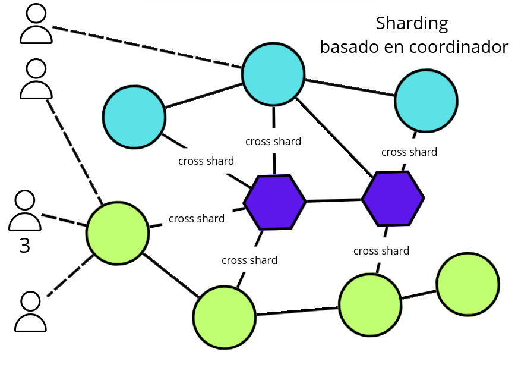

  > Por ejemplo, si el motivo del sharding es una distribución geográfica, cuando el usuario 3 inicia una transacción que involucra datos o nodos de diferentes shards, el nodo que recibe la petición primero identifica los shards relevantes, luego, se comunica con un conjunto de nodos coordinadores (representados en hexágonos) que gestionan la sincronización entre shards, y estos nodos coordinadores actúan como intermediarios, asegurando que los datos necesarios se transfieran entre los shards involucrados y que la transacción se procese correctamente.

* Basado en relé:

  * Basado en relé (relay):

    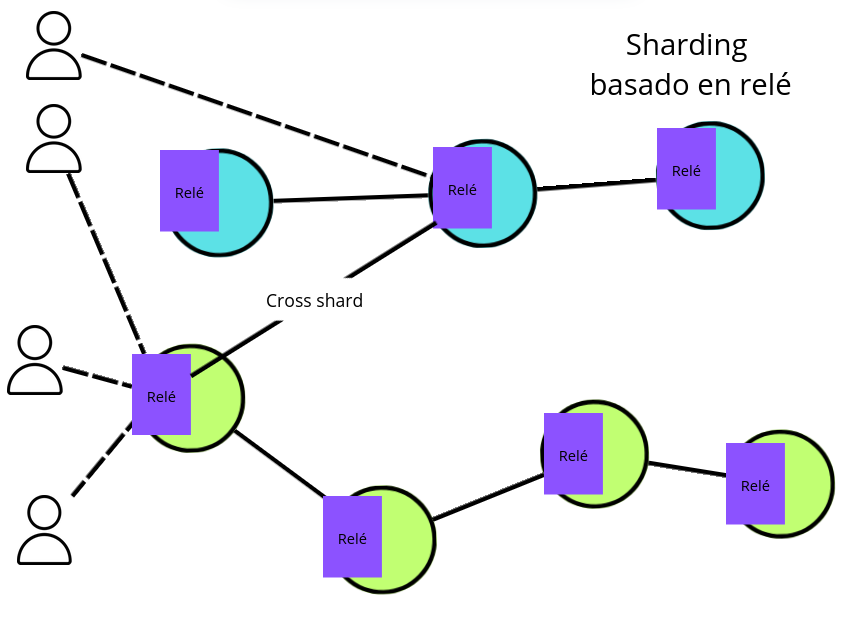

    > En la comunicación inter-shard de redes P2P, los nodos no se conectan directamente entre sí, sino que envían los datos a un nodo relé dentro de su shard. Este los retransmite al nodo relé del shard de destino, que a su vez los entrega al nodo correspondiente. Este mecanismo facilita la coordinación entre fragmentos, mejora la escalabilidad y reduce la complejidad, aunque introduce dependencia en los nodos relé para la transmisión de datos.

### Algunos ejemplos de nodos p2p

A continuación se describen algunos ejemplos destacados de redes y nodos P2P, cada una con su propio enfoque y características técnicas:

#### IPFS (InterPlanetary File System)

* Tipo de red: P2P estructurada (basada en DHT Kademlia).
* Propósito: Almacenamiento y distribución de archivos de forma descentralizada.
* Funcionamiento: Cada archivo se divide en fragmentos, se les asigna un hash único (dirección por contenido) y se distribuyen entre los nodos. La DHT permite localizar qué nodos almacenan cada fragmento.
* Replicación: Parcial y dirigida por el usuario (pinning). Los archivos se replican en los nodos que los solicitan o los fijan manualmente.
* Nodos: Cualquier usuario puede ejecutar un nodo IPFS, que puede actuar como emisor, receptor, replicador y, opcionalmente, como nodo de almacenamiento dedicado.

#### Filecoin

* Tipo de red: P2P estructurada (basada en IPFS y DHT).
* Propósito: Almacenamiento descentralizado incentivado mediante criptomonedas.
* Funcionamiento: Los usuarios (clientes) pagan a los mineros de almacenamiento para guardar archivos. Los mineros demuestran periódicamente que almacenan los datos mediante pruebas criptográficas (Proof of Replication y Proof of Spacetime).
* Replicación: Contratada y basada en fiabilidad. El número de copias y la duración se negocian en acuerdos (deals) y se puede usar erasure coding para fragmentar y distribuir los datos.
* Nodos: Existen nodos de almacenamiento, clientes ligeros y nodos de recuperación de datos.

#### Freenet

* Tipo de red: P2P no estructurada (con topología de malla).
* Propósito: Almacenamiento y publicación anónima de información.
* Funcionamiento: Los datos se fragmentan y se distribuyen automáticamente entre los nodos. El enrutamiento es adaptativo y busca maximizar el anonimato y la resiliencia.
* Replicación: Automática y basada en demanda. Los datos populares se replican más ampliamente, y los menos accedidos pueden ser eliminados para liberar espacio.
* Nodos: Todos los nodos pueden almacenar, buscar y replicar datos, y la red prioriza la privacidad y la resistencia a la censura.

#### Storj

* Tipo de red: P2P estructurada (basada en DHT y contratos inteligentes).
* Propósito: Almacenamiento descentralizado en la nube, con incentivos económicos.
* Funcionamiento: Los archivos se fragmentan y codifican (erasure coding), luego se distribuyen entre múltiples nodos de almacenamiento. Los contratos inteligentes gestionan la relación entre clientes y nodos.
* Replicación: Contractual y basada en redundancia controlada. Se asegura que cada fragmento esté replicado en varios nodos, y la integridad se verifica periódicamente.
* Nodos: Cualquier usuario puede ofrecer espacio de almacenamiento y recibir recompensas por alojar fragmentos de archivos.

#### BitTorrent

* Tipo de red: P2P no estructurada (con topología de enjambre).
* Propósito: Compartición eficiente de archivos entre usuarios.
* Funcionamiento: Los archivos se dividen en partes pequeñas que se distribuyen entre los usuarios (peers). Cada usuario descarga y al mismo tiempo comparte las partes que ya tiene con otros.
* Replicación: Basada en demanda y popularidad. Cuantos más usuarios descargan un archivo, más copias existen en la red.
* Nodos: Cualquier usuario puede ser peer (descargar y compartir archivos) o seed (mantener una copia completa del archivo).

#### Gnutella

* Tipo de red: P2P no estructurada (malla plana).
* Propósito: Búsqueda y compartición de archivos sin servidores centrales.
* Funcionamiento: Los nodos se conectan entre sí de forma aleatoria y propagan consultas de búsqueda por flooding. Los archivos se transfieren directamente entre los nodos que los poseen.
* Replicación: Basada en demanda, sin control central.
* Nodos: Todos los nodos pueden buscar, compartir y almacenar archivos.

#### Napster

* Tipo de red: P2P híbrida (índice centralizado, transferencia directa entre pares).
* Propósito: Compartición de archivos de música.
* Funcionamiento: Un servidor central mantiene un índice de los archivos disponibles, pero la transferencia de archivos ocurre directamente entre los usuarios.
* Replicación: Basada en demanda, según los archivos que comparten los usuarios.
* Nodos: Usuarios que comparten y descargan archivos, y un servidor central para el índice.

#### eDonkey/eMule

* Tipo de red: P2P híbrida (servidores de índice y red de pares).
* Propósito: Compartición de archivos de gran tamaño.
* Funcionamiento: Los archivos se dividen en partes y se distribuyen entre los usuarios. Los servidores ayudan a localizar archivos, pero la transferencia es directa entre pares.
* Replicación: Basada en demanda y popularidad.
* Nodos: Usuarios que pueden actuar como clientes y servidores de archivos.

#### Bitcoin

* Tipo de red: P2P estructurada (basada en DHT y flooding).
* Propósito: Red de pagos y libro contable distribuido (blockchain).
* Funcionamiento: Los nodos validan y propagan transacciones y bloques. Cada nodo mantiene una copia de la blockchain y participa en el consenso mediante prueba de trabajo (Proof of Work).
* Replicación: Total (todos los nodos completos almacenan la blockchain), con nodos ligeros que solo validan encabezados.
* Nodos: Nodos completos, nodos ligeros (SPV), mineros y nodos de escucha.

#### Ethereum

* Tipo de red: P2P estructurada (basada en DHT Kademlia y protocolos de flooding/gossip).
* Propósito: Plataforma de contratos inteligentes y aplicaciones descentralizadas.
* Funcionamiento: Los nodos almacenan el estado de la blockchain, validan y propagan transacciones y bloques, y ejecutan contratos inteligentes. Utiliza mecanismos de descubrimiento de nodos y propagación eficiente de mensajes.
* Replicación: Total para nodos completos, parcial para nodos ligeros.
* Nodos: Nodos completos, nodos ligeros, validadores (en proof of stake), clientes de archivo y nodos de infraestructura.

## Referencias

* Las referencias son tan pobres que se puede decir que ha sido chatgpt la referencia principal.
* [geeksforgeeks.com](https://www.geeksforgeeks.org/structured-and-unstructured-peer-to-peer-systems/)
* Varios autores de Wikipedia...
* [bit2me academy](https://academy.bit2me.com/).
