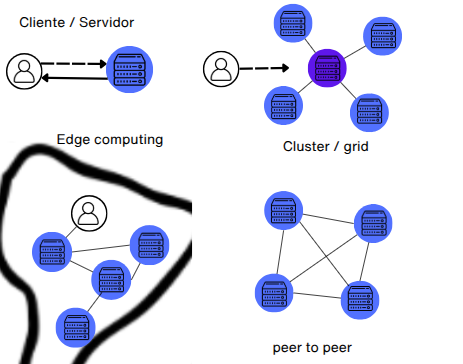

# Introducción a redes peer to peer (p2p)

Como visión inicial, conviene resumir qué son las redes de nodos, para luego centrarnos en las redes P2P, introduciendo sus características principales.

En el contexto de internet, en el estudio de las [redes de computadoras](https://es.wikipedia.org/wiki/Red_de_computadoras) (dentro de la [ciencia de redes](https://es.wikipedia.org/wiki/Ciencia_de_redes)), existen dispositivos que son [nodos](https://es.wikipedia.org/wiki/Nodo_(inform%C3%A1tica)), es decir, pueden enviar y recibir información, gracias a que disponen de una dirección pública, como la IP y generalmente un nombre de dominio registrado en un DNS.

> Debido a la limitada cantidad de direcciones IPv4, lo normal es que muchos de estos nodos, que acceden mediante un [ISP](https://es.wikipedia.org/wiki/Proveedor_de_servicios_de_internet), solo puedan usar su IP para hacer peticiones-respuestas, pero no para recibir conexiones entrantes, ya que están detrás de un [CGNAT](https://es.wikipedia.org/wiki/Carrier_Grade_NAT).

Algunos de esos nodos actúan como [host](https://es.wikipedia.org/wiki/Host) o anfitriones de servicios para otros nodos, y cuando es de forma continuada se denominan [servidores](https://es.wikipedia.org/wiki/Servidor) que suelen estar en [centros de datos](https://es.wikipedia.org/wiki/Centro_de_procesamiento_de_datos).

En los servidores se alojan los servicios, compuestos por aplicaciones y componentes que implementan funciones específicas para atender peticiones de otros nodos en la red.

Servicios, que se pueden ofrecer a clientes, bajo términos de licencia, en lo que se denomina la nube y que pueden seguir un modelo como [SaaS (Software as a Service)](https://es.wikipedia.org/wiki/Software_como_servicio), o puede ser [on premise](https://en.wikipedia.org/wiki/On-premises_software) si se entrega para la infraestructura cliente.

Y aplicaciones que pueden seguir una arquitectura de [microservicios](https://es.wikipedia.org/wiki/Arquitectura_de_microservicios), o ser una [SPA](https://en.wikipedia.org/wiki/Single-page_application) siguiendo un patrón [BFF](https://bff-patterns.com/), o una [dApp](https://es.wikipedia.org/wiki/Aplicaci%C3%B3n_descentralizada),o un [gateway](https://es.wikipedia.org/wiki/Puerta_de_enlace), [proxy](https://es.wikipedia.org/wiki/Servidor_proxy), VPN, o API REST, servidor [GraphQL](https://es.wikipedia.org/wiki/GraphQL), o un servicio de mensajería, sistema de autenticación, orquestador de tareas, o un nodo P2P, [un indexador de blockchain](https://www.alchemy.com/overviews/blockchain-indexer) o incluso un servicio de almacenamiento distribuido como IPFS, etc...

Estos servidores se ejecutan sobre un sistema operativo, utilizando uno o varios puertos locales para abrir [sockets](https://es.wikipedia.org/wiki/Socket_de_Internet) con el resto de nodos.

Comunicación a través de protocolos, según [OSI](https://es.wikipedia.org/wiki/Modelo_OSI), de aplicación, como HTTP, gRPC, JSON-RPC, WebSocket o MQTT, etc, que puede operar sobre otro protocolo de aplicación de seguridad como [TLS](https://es.wikipedia.org/wiki/Seguridad_de_la_capa_de_transporte) y que en general operan sobre servicios de transporte como TCP para conexiones confiables o UDP para transmisiones rápidas sin garantías o QUIC un protocolo actual que usa UDP, que es confiable y rápido. Estos, a su vez, se encapsulan en paquetes IP (IPv4/IPv6), que son enrutados por la red física.

Red física que tiene una topología, denominada [topología física](https://es.wikipedia.org/wiki/Topolog%C3%ADa_de_red), que normalmente conocemos como de estrella, bus, anillo, malla, árbol o híbrida, etc:

Y quizás podemos generalizar que la topología física predominante en Internet es una malla parcial, pero eso no es relevante. Lo importante es que los nodos de una red pueden interconectarse entre sí, y si no es posible, existen técnicas como NAT traversal y [relay](https://en.wikipedia.org/wiki/Traversal_Using_Relays_around_NAT) para facilitar la conexión a través de routers, cortafuegos o CGNAT .

Además vemos que un conjunto de nodos puede organizarse para ejecutar funciones específicas, como ocurre en la [computación distribuida](https://es.wikipedia.org/wiki/Computaci%C3%B3n_distribuida). Esta puede requerir coordinación central, como en el modelo cliente-servidor, en un clúster o en grid computing, donde recursos heterogéneos colaboran bajo una gestión común. También existe el [edge computing](https://en.wikipedia.org/wiki/Edge_computing), entre otros, que acerca el procesamiento al nodo cliente para reducir latencia. Y si no requiere coordinación centralizada, el modelo puede ser descentralizado, como en las redes peer-to-peer (P2P).

Y estos nodos organizados, se conectan de una forma lógica, donde su estructura o forma de enlace que forma se conoce como topología lógica e igualmente tenemos de nuevo, como topología, Cliente-Servidor o Cliente-Servidor Distribuido, en redes centralizadas, P2P (peer-to-peer) en redes descentralizadas o Multicast/broadcast en redes de difusión o streaming, etc...

Sobre cómo fluye la información en el enlace, es lo que se conoce como [patrones de comunicación de mensajes](https://en.wikipedia.org/wiki/Messaging_pattern), donde podemos ver algunos:

Si los describimos son:

* [Request/Response](https://en.wikipedia.org/wiki/Request%E2%80%93response): un nodo, pide y otro responde, como puede ser en HTTP o el resto de protocolos de aplicación.
* [Publish/Subscribe](https://en.wikipedia.org/wiki/Publish%E2%80%93subscribe_pattern): un nodo publica, otros suscritos reciben como puede ser [MQTT](https://en.wikipedia.org/wiki/MQTT).
* Streaming: datos enviados continuamente, como puede ser [RTSP](https://es.wikipedia.org/wiki/Protocolo_de_transmisi%C3%B3n_en_tiempo_real), [WebRTC](https://es.wikipedia.org/wiki/WebRTC) o [SRT](https://en.wikipedia.org/wiki/Secure_Reliable_Transport).
* [Polling](https://es.wikipedia.org/wiki/Polling): el cliente consulta periódicamente si hay datos.
* [Event-driven](https://en.wikipedia.org/wiki/Event-driven_architecture): los datos se envían como reacción a eventos.
* [Push / pull](https://es.wikipedia.org/wiki/Tecnolog%C3%ADa_push): Si entendemos a un nodo como cliente y otro como servidor, en pull, el cliente receptor inicia la solicitud de datos; Push, el servidor emisor envía datos.

Y otros muchos más...

## Redes entre pares peer-to-peer

En las redes entre pares, [peer-to-peer o p2p](https://academy.bit2me.com/que-es-una-red-p2p/), todos los nodos funcionan como iguales.

Suelen funcionar mediante un protocolo, implementado en un programa que se ejecuta como servicio en cada nodo, permitiendo la interacción entre nodos según las reglas definidas por el protocolo.

> Cuando hablamos de un protocolo P2P, en realidad nos referimos a un conjunto de protocolos que lo componen.

Las redes entre pares p2p son las relevantes en la web3, pero en realidad se combina con distintas soluciones, que he intentado resumir con anterioridad, según su necesidad, incluso tomando modelos centralizados si es necesario.

> En esta definición, no tenemos que confundir redes p2p con blockchain, ya que no es lo mismo y spoiler, blockchain es una estructura de datos diseñada para operar como libro contable distribuido (ledger) en redes P2P, donde existe un consenso, es decir, que opere en una red p2p, no implica que sean lo mismo, simplemente blockchain opera sobre una red p2p y suele confundirse.

### Características iniciales de una red p2p

Antes de clasificar una red P2P, es necesario entender que existen ciertas características que se suelen tener en cuenta en el diseño en base a su propósito, que podemos resumir como las siguientes:

**Modelo de confianza**.

Define cómo y en quién confían los nodos para interactuar, validar información y alcanzar consenso. Determina si la red requiere identidad, reputación o prueba criptográfica para garantizar seguridad y funcionamiento correcto. Puede ser normalmente:

* Trustless (sin confianza), donde los nodos interactúan sabiendo que no pueden confiar entre sí y gracias a mecanismos criptográficos y reglas de consenso verificables pueden hacerlo. Ejemplos, Bitcoin, Ethereum, IPFS + FileCoin.
* Trusted (confiable o basado en confianza), los nodos interactúan basándose en relaciones de confianza previa, donde existe identidad verificada o autoridad central parcial que ayuda a autenticar al nodo, reduciendo la necesidad de mecanismos criptográficos o consenso complejo. Por ejemplo, redes corporativas o Hyperledger Fabric con Proof of Authority (PoA).
* Partially trusted (parcialmente confiable), combina nodos confiables con nodos anónimos o no verificados, aplicando confianza selectiva. Usa mecanismos criptográficos y validación, pero permite ciertos roles privilegiados o relaciones basadas en confianza. Por ejemplo, Lightning Network (sobre Bitcoin):
* Hybrid trust (confianza híbrida), combina modelos trustless y trusted, donde algunas funciones dependen de nodos confiables o autoridades, y otras se descentralizan mediante consenso y criptografía. Ejemplo Ripple, donde usa un conjunto confiable de nodos validadores (UNL), pero con comunicación P2P.

**Modelo de autorización**.

Define quién puede participar y con qué permisos, lo cual influye en la resistencia a la censura, tolerancia a fallos y gobernanza. Puede ser normalmente:

* Pública, cualquier participante puede unirse y participar sin restricciones y es descentralizada y abierta a nuevos participantes.
* Privada, acceso limitado a entidades previamente autorizadas, suele tener un control centralizado dentro de una organización o grupo.
* Permisionada, participación permitida solo a nodos verificados y aprobados, donde combina descentralización con control de acceso.
* Consorcio, gobernada por un grupo seleccionado de entidades confiables.
* Híbrida, mezcla características de modelos públicos y privados.

**Grado de descentralización**.

Cuánto control está distribuido entre los nodos de la red. Puede ser normalmente:

* Centralized (centralizadas), control total por una entidad, son redes cliente-servidor P2P con controlador central.
* Partially decentralized (parcialmente descentralizadas), varios nodos controlan la red, pero no todos. Ej: consorcios, supernodos, federaciones.
* Fully decentralized (totalmente descentralizadas), todos los nodos tienen el mismo rol, sin jerarquía. Ej: Bitcoin, IPFS (sin bootstrap central), Gnutella.

Normalmente, un mayor grado de centralización suele buscar:

* Mejor rendimiento (menor latencia y mayor throughput).

  > throughput es la cantidad de datos o transacciones procesadas por unidad de tiempo en una red. En redes P2P, suele medirse en transacciones por segundo (TPS) o bloques por segundo. Cuanto mayor el throughput, mayor la capacidad de procesamiento de la red.

* Control más sencillo (gobernanza y actualizaciones).
* Seguridad operativa (menos superficie de ataque si los nodos son confiables).

  > Mas seguridad operativa, pero menor descentralización y menor resilencia al existir punto único de falla.

* Menor complejidad de consenso (menos nodos que coordinar).

**Roles de los nodos en la red p2p**.

Aunque las redes P2P son descentralizadas, eso no implica que todos los nodos tengan el mismo rol en todo momento. Se pueden clasificar según su comportamiento en un momento dado:

* Nodos emisores (initiators), generan y propagan nuevas transacciones.
* Nodos retransmisores (relays), solo propagan lo que reciben.
* Nodos receptores (listeners), solo reciben, no emiten ni retransmiten.
* Nodos validadores, verifican y validan lo recibido (bloques, transacciones).

**Modelos de consistencia**.

Son reglas que definen cómo y cuándo los cambios en los datos replicados se reflejan en los distintos nodos de la red. Puede ser normalmente:

* Strong consistency (consistencia fuerte), implica que después de una escritura, todas las lecturas en cualquier nodo reflejan el valor más reciente, por lo tanto, se espera confirmación de todos los nodos involucrados antes de finalizar la escritura
  
  

  > En consistencia fuerte, un dato escrito (W) debe ser replicado y confirmado por todos los nodos antes de ser considerado válido, como vemos en el ejemplo del nodo azul.

* Eventual consistency (consistencia eventual), los nodos se sincronizan con el tiempo, sin garantizar cuándo y no se espera una confirmación de escritura.

   

  > En consistencia eventual, no espera confirmación.

* Causal consistency (consistencia causal), garantiza que los eventos relacionados por causa-efecto se vean en el mismo orden por todos los nodos. Es decir, si un evento A influye en B, todos los nodos deben ver A antes que B.

   

  > Se logra controlando el orden de entrega, en el ejemplo, se entrega C cuando llega porque no tiene una causa y efecto, sin embargo, sólo entrega B si entrego antes A. Además no se espera confirmación de escritura.

* Sequential consistency (consistencia secuencial), asegura que todas las operaciones se vean en el mismo orden global, aunque ese orden no sea necesariamente el real (cronológico). En causal, solo se respeta el orden entre operaciones que tienen dependencia (causa-efecto), pero en secuencial, todas las operaciones (incluso no relacionadas) deben verse en el mismo orden global por todos los nodos.

  

  > Se logra controlando el orden de entrega, en el ejemplo, como el orden es A, B y C, asi debe hacerlo el nodo que debe replicar la escritura.

* Read-your-writes consistency (consistencia de lectura tras escritura), garantiza que un nodo que realiza una escritura siempre verá esa escritura reflejada en sus lecturas posteriores, incluso si la red es eventual o distribuida.

> En la práctica, las redes P2P rara vez implementan consistencia fuerte debido a sus problemas en rendimiento y disponibilidad, por lo tanto, suelen preferir consistencia eventual.

**Modelos de replicación y almacenamiento**.

Definen cómo se distribuyen y almacenan los datos entre los nodos para lograr un equilibrio entre eficiencia, resiliencia y descentralización. Puede ser normalmente:

* Replicación parcial, los datos se almacenan solo en nodos responsables o cercanos, lo que reduce duplicación y mejora escalabilidad. Ejemplo: IPFS, Ethereum, BitTorrent.
* Replicación total, cada nodo almacena todo el estado de la red, garantizando disponibilidad y verificación completa. Ejemplo: Bitcoin, Monero.
* Modelo híbrido, combina fragmentación de datos (sharding) y validación delegada, equilibrando escalabilidad y seguridad. Ejemplo: Ethereum 2.0, Near, Celestia.
* Friend-to-Friend (F2F), los datos solo se comparten entre nodos de confianza directa, priorizando privacidad. Ejemplo: Retroshare.

**Problemas de seguridad a resolver**.

Una red p2p no está exento de problemas, sobre todo si es pública, que son considerados inicialmente. Se podrían enumerar por los siguientes:

* Fragmentación de la red, donde los nodos están aislados en subgrupos, lo que impide una vista global coherente o sincronización entre ellos.
* Volatilidad en la disponibilidad de nodos, los que reduce el rendimiento y replicación entre ellos y en general el correcto funcionamiento.
* Estado paralelo de la red, donde pueden coexistir versiones distintas, es decir, un conjunto de nodos entienden que exista un estado concreto y otros otro diferente, aunque normalmente el consenso resuelve el problema.
* Ataques que puede recibir una red p2p, como [MITM (Man-in-the-Middle)](https://es.wikipedia.org/wiki/Ataque_de_intermediario), [Sybil](https://academy.bit2me.com/que-es-un-ataque-sybil/), [Eclipse](https://academy.bit2me.com/que-es-ataque-eclipse-eclipse-attack/), [DoS](https://academy.bit2me.com/que-son-ataques-dos/), [Erebus](https://academy.bit2me.com/que-es-ataque-erebus/) o [envenenamiento de DHT](https://www.semanticscholar.org/paper/Conducting-routing-table-poisoning-attack-in-DHT-Lin-Ma/3882e35b71bef5e8327574b3940279c7df3f3d8e), y aunque sobre todo se relaciona con blockchain, tenemos ataques como [Replay](https://academy.bit2me.com/que-es-un-ataque-replay/) o [del 51%](https://academy.bit2me.com/ataque-51-bitcoin/).

**Problema de disponibilidad o rotación: Churn**.

Churn (o "rotación de nodos") se refiere al fenómeno en el que los nodos de una red P2P se unen, abandonan o fallan con frecuencia, afectando la estabilidad y el rendimiento de la red.

Causas del Churn:

* Nodos dinámicos: Usuarios que apagan sus dispositivos (ej. laptops, móviles) o cierran aplicaciones P2P.
* Fallos aleatorios: Conexiones inestables, cortes de energía o crashes de software.
* Comportamiento egoísta: Nodos que abandonan la red después de descargar un archivo (problema común en *file-sharing*).
* Ataques: Nodos maliciosos que entran y salen para sabotear la red (ej. ataques Sybil).

### Clasificación principal de redes p2p

En base a las características descritas, y especialmente al modelo de replicación y almacenamiento, las redes P2P se clasifican en dos categorías, que también corresponden con su topología lógica —o, si se prefiere, con su modelo de red superpuesta (overlay network): estructuradas y no estructuradas.

En la topología estructurada, la conexión y consulta entre nodos sigue un patrón definido y determinista para un contenido replicado de forma parcial, basado en el valor de los datos (en su hash), lo que permite búsquedas eficientes y un uso optimizado del almacenamiento, siendo especialmente adecuado para redes estables (bajo churn) donde los nodos permanecen disponibles con regularidad.

Para entender mejor una red estructurada, analizaremos el caso de las [DHT](https://es.wikipedia.org/wiki/Tabla_de_hash_distribuida) (tablas de hash distribuidas), donde cada nodo mantiene una relación entre los datos (identificados por su hash) y las direcciones de los nodos responsables o más cercanos a esos datos, determinada mediante el cálculo de la distancia con XOR. Esto implica que en las redes estructuradas existe una correspondencia directa entre nodo, dirección y el contenido a buscar

Además de las DHT, existen otras redes estructuradas basadas en jerarquías, árboles, anillos o grafos, muchas de las cuales han sido exploradas principalmente en el ámbito académico o en sistemas distribuidos tradicionales. En el contexto de la Web3, donde priman la descentralización, la tolerancia a fallos y el direccionamiento por contenido, las DHT resultan más adecuadas y son, por ello, las más utilizadas en la práctica.

En las topologías no estructuradas, las conexiones entre nodos son aleatorias o sin un patrón definido, lo que las hace más adecuadas para consultas complejas y además es mas optimo para entornos inestables donde los nodos se conectan y desconectan con frecuencia (alto churn). Son redes más resilientes, pero al no existir una estructura lógica que relacione directamente el contenido con nodos específicos, las consultas deben propagarse entre múltiples nodos para localizar la información, aunque lo cierto es que permite consultas más complejas que las estructuradas.

**Topologías comunes de las redes estructuradas**.

Dentro de las redes estructuradas, aparte de DHT, que es la principal, podemos ver otras topologías que ayudan a ver cómo se establecen las relaciones entre otros nodos, a continuación vemos algunas relevantes:

* DHT tipo XOR, usa XOR para calcular distancia entre nodos y claves. Ejemplo: Kademlia (IPFS, Ethereum) – clave en Web3.
  * Ventaja: altamente eficiente y tolerante a fallos.
  * Desventaja: requiere mantenimiento activo para actualizar rutas.
* Anillo, nodos ordenados circularmente por ID. Ejemplo: Chord – influyente y teóricamente sólido.
  * Ventaja: rutas simples.
  * Desventaja: débil ante churn sin estabilización.

**Topologies comunes de las redes no estructuradas**.

Dentro de las redes no estructuradas, podemos ver otras topologías que ayudan a ver cómo se establecen las relaciones entre otros nodos, a continuación vemos las relevantes:

* Malla parcial, cada nodo se conecta a un subconjunto aleatorio de nodos vecinos. No hay reglas fijas, pero se mantiene cierta conectividad general. Ejemplo: Bitcoin — cada nodo mantiene ~8 conexiones salientes y acepta múltiples entrantes, lo que crea una red robusta y dispersa.
  * Ventaja: buena tolerancia al churn y propagación rápida.
  * Desventaja: alto tráfico redundante en búsquedas.
* Malla completa (full mesh), todos los nodos están conectados entre sí directamente. Ejemplo: muy raro en P2P reales, pero puede aparecer en redes pequeñas, como testnets o simulaciones.
  * Ventaja: latencia mínima, máxima disponibilidad de datos.
  * Desventaja: no escalable, crece O(n²).
* Topología aleatoria (random graph), las conexiones se generan al azar sin mantener una estructura o patrón. Ejemplo: Gnutella v0 — los nodos conectaban sin control a otros disponibles.
  * Ventaja: simplicidad.
  * Desventaja: alto tráfico, difícil optimización.

### Subredes lógicas en redes p2p

Las subredes lógicas son agrupaciones funcionales de nodos dentro de una red P2P que, compartiendo la misma infraestructura base, cooperan para cumplir roles específicos o ejecutar subprotocolos distintos sin interferir con el resto de la red.

### Protocolos de comunicación de las redes p2p

Es el conjunto de reglas y mecanismos que que se implementa en las redes p2p y que pueden resumierse en los siguientes procesos:

* Enrutamiento de pares, es decir, el proceso por el que un nodo sabe con qué otros nodos comunicarse.
  tambien es propagacion de consultas?
  un tipo determinista, basado en distancia euclidiana.
* Conexión y establecimiento de enlaces con el resto de nodos con los que intercambiar información.
* Propagación de información o enrutamieto de contenido, normalmente con el patrón push, es el proceso mediante el cual un nodo distribuye datos a otros nodos en una red para que estos los conozcan o almacenen.
* Propagación de consultas, normalmente con patrón pull, implica solicitudes recursivas entre nodos cuando se necesita localizar información en la red, se puede decir que el nodo actua como cliente. En muchas veces conlleva la creación de un indice en el nodo con un TTL determinado para reducir el exceso de trafico
* Prevencion de seguridad, suelen tener mecanismo para evitar ataques debido a la naturaleza de una red p2p

### Características técnicas comunes en las redes p2p

* Normalmente funcionan directamente sobre TCP (para conexiones estables), aunque algunas usan UDP para mensajería rápida (ej. DHTs como Kademlia). No suelen funcionar de forma nativa sobre HTTP o RPC o cualquier otro protocolo de aplicación.
* Se diseñan con tolerancia a fallos, incluyendo la reconexión dinámica, replicación de datos y redundancia de datos o rutas de acceso.

