# Primer acercamiento a IPFS: la red de contenido descentralizado

## TL;DR

IPFS (InterPlanetary File System, o Sistema de Archivos Interplanetario) es un sistema descentralizado para compartir contenido que también está descentralizado.

Es un protocolo abierto, debidamente documentado y además una red P2P descentralizada para almacenar y compartir archivos, eliminando la dependencia de servidores centrales. Utiliza el modelo de datos IPLD y CIDs (hashes de contenido) para garantizar integridad, inmutabilidad y deduplicación. Los usuarios pueden fijar (pin) contenido para asegurar su persistencia, y existen servicios y herramientas para facilitar su uso tanto en redes públicas como privadas. IPFS se basa en tecnologías como libp2p, DHT (Kademlia), Bitswap y UnixFS, y permite la publicación de nombres dinámicos mediante IPNS. Es ampliamente adoptado en el ecosistema Web3 para aplicaciones descentralizadas, almacenamiento de archivos, integración con blockchains y distribución de contenido resistente a la censura.

🔗 Si quieres saber qué es IPFS y qué resuelve, accede al siguiente contenido de referencia:

* <https://docs.ipfs.tech/concepts/what-is-ipfs>.
* <https://docs.ipfs.tech/concepts/ipfs-solves>.

## Ficha de la solución

El fundador es [Protocol Labs](https://www.protocol.ai/>), pero IPFS es una [solución abierta](https://docs.ipfs.tech/concepts/faq/#ipfs-and-protocol-labs).

  > Protocol Labs también impulsa iniciativas relacionadas, como el laboratorio de innovación [Probelab](https://probelab.io/), [libp2p](https://libp2p.io/) y [Filecoin](https://filecoin.io/),

La web de IPFS: <https://ipfs.tech/>.

Es una solución [libre](https://es.wikipedia.org/wiki/Software_libre), de [código abierto](https://es.wikipedia.org/wiki/C%C3%B3digo_abierto) con [licencia MIT](https://es.wikipedia.org/wiki/Licencia_MIT) con repositorio en <https://github.com/ipfs>.

* Las propuestas de mejora se denominan `IPIP` (IPFS Improvement Proposal): <https://specs.ipfs.tech/meta/ipip-process/>.

El estándar y especificaciones están en <https://specs.ipfs.tech/>.

Como tipo de solución, IPFS se considera como [infraestructura](https://en.wikipedia.org/wiki/IT_infrastructure) del ecosistema Web3.

## Casos de uso

Podemos resumir los principales casos de uso principales de IPFS en:

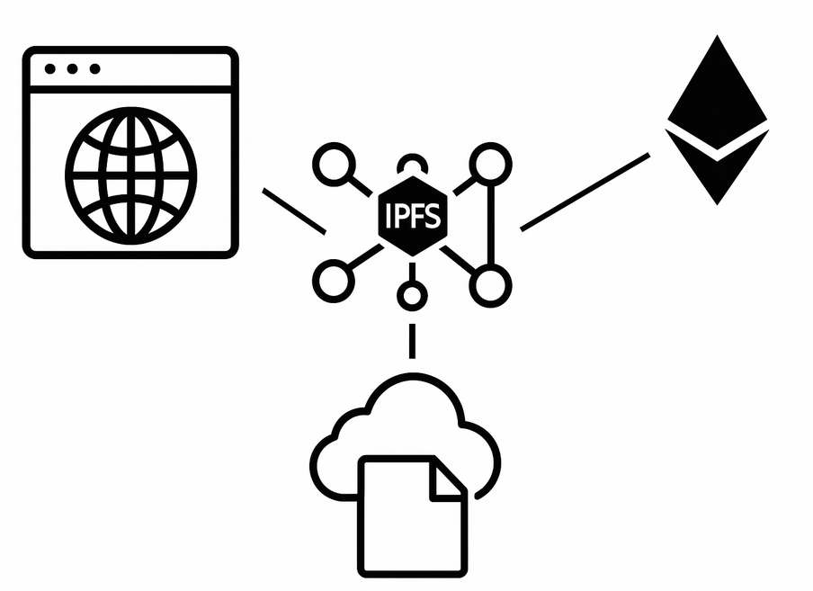

* Web descentralizada, el caso de uso más natural para IPFS, donde los sitios Web se sirven sin servidores centrales.
* Almacenamiento de archivos para dApps o smart contracts o servicios multimedia, etc., considerando que el contenido es público y es necesario cifrarlo si se requiere privacidad.
* Representación de datos de Ethereum usando el modelo IPLD, por ejemplo, el proyecto [go-ipld-eth-import](https://github.com/ipfs/go-ipld-eth-import) permite explorar la blockchain de Ethereum como un grafo de datos interconectados.

> Puedes comparar IPFS con otros sistemas con propósitos parecidos, tal como indica su web <https://docs.ipfs.tech/concepts/comparisons/#comparing-the-key-features-of-other-solutions-to-ipfs>.

## Los principios de IPFS

En IPFS podemos enumerar los siguientes principios fundamentales:

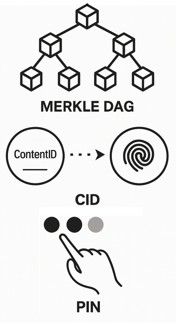

* División del contenido, siguiendo el modelo Merkle DAG, para permitir almacenamiento **descentralizado**, facilitando verificación, descargas paralelas y deduplicación.
* Identificación del contenido basado en su [hash](https://docs.ipfs.tech/concepts/hashing/), denominado [CID](https://docs.ipfs.tech/concepts/content-addressing/#what-is-a-cid) (Content Identifier), en lugar de su ubicación como una URL, asegurando la [inmutabilidad](https://docs.ipfs.tech/concepts/immutability/) del contenido.
* Potestad al usuario para fijar el contenido que considere que debe mantenerse en la red mediante el fijado o pin.

Y como solución técnica:

* Suite modular de protocolos abiertos como [lip2p](https://libp2p.io/) y [bitswap](https://specs.ipfs.tech/bitswap-protocol/).
* Red de [nodos](https://docs.ipfs.tech/concepts/nodes/#nodes) P2P con una [DHT](https://docs.ipfs.tech/concepts/dht/) que implementa el algoritmo Kademlia para una búsqueda eficiente.

Algunos de estos principios se pueden explicar mejor con las siguientes conceptos:

### Descentralizando el contenido con [IPLD](https://docs.ipfs.tech/concepts/how-ipfs-works/#how-ipfs-represents-and-addresses-data)


IPFS se dice que es interplanetario porque permite distribuir el contenido a lo largo del planeta con su modelo IPLD (InterPlanetary Linked Data).

**IPLD el estándar de estructura de datos**.

IPLD es la propuesta de Protocol Labs de un estándar de estructura de datos descentralizado.

🔗 <https://ipld.io/>.

En IPLD, cada contenido, como un archivo o directorio, es fragmentado (chunks) en diferentes bloques codificados, los cuales son identificados por su hash, llamado [CID](https://docs.ipfs.tech/concepts/content-addressing/#what-is-a-cid) (Content Identifier).

> *Una aclaración sobre la terminología*, un bloque es un conjunto de datos codificados almacenados como unidad mínima. Al deserializarlo, se interpreta como un nodo dentro del grafo de datos enlazados. Comúnmente nos referimos sobre lo mismo llamándolo bloque o nodo.

ℹ️ Para entender mejor que es un CID: puedes acceder a esta práctica de [Jugando con CID](./_first-approach-to-IPFS-attachments/ipfs_cid_playground.ipynb) ([](https://mybinder.org/v2/gh/open3diy/web3-101-edu-projects/main?filepath=web3-infrastructure-technology/_first-approach-to-IPFS-attachments/ipfs_cid_playground.ipynb)).

Por lo tanto, tenemos un contenido que se fragmenta en diferentes bloques o nodos, donde se parte uno raíz, con su CID, el cual enlaza con otros bloques hijos correspondientes, para reconstruir el contenido completo.

IPFS para fragmentar tiene en cuenta los objetos [UnixFS](https://docs.ipfs.tech/concepts/file-systems/#unix-file-system-unixfs), es decir, si el contenido es un archivo o directorio, es considerado como un nodo en sí, siendo un objeto UnixFs, que referencia a otros nodos intermedios o de datos.

Teniendo en cuenta esto, un mismo nodo con un CID puede estar referenciado en diferentes nodos padre, con el ejemplo más claro de dos directorios diferentes que tienen el mismo archivo, en ese caso, ocurre lo que se conoce como **deduplicación** y consigue evitar almacenar datos idénticos, ahorrando espacio y haciéndolo más eficiente.

Como podemos ver, el contenido se divide porque así es más óptimo de replicar y distribuir, facilita la verificación, permite descarga paralela y además la deduplicación optimiza no repetir información y sobre todo es más descentralizado.

Este contenido dividido y organizado en nodos enlazados entre sí, la estructura que forma, es un árbol de Merkle y es acíclico dirigido, es decir, un DAG (Directed Acyclic Graph). por lo tanto, se dice que el modelo IPLD sigue el modelo Merkle-DAG.

* 🔗 <https://docs.ipfs.tech/concepts/merkle-dag/>

ℹ️ Para entender Merkle DAG, aquí tienes estas explicaciones con las que puedes practicar:

* [Jugando con DAG](./_misc/dag_playground.ipynb) ([](https://mybinder.org/v2/gh/open3diy/web3-101-edu-projects/main?filepath=web3-infrastructure-technology/_misc/dag_playground.ipynb)).
* [Jugando con árbol Merkle](./_misc/merkle_playground.ipynb) ([](https://mybinder.org/v2/gh/open3diy/web3-101-edu-projects/main?filepath=web3-infrastructure-technology/_misc/merkle_playground.ipynb)).

🤔 Es confuso de entender que sea un árbol de Merkle y además DAG, cuando un árbol ya es en sí un tipo de DAG, esto es así por dos razones:

* Es un árbol de Merkle, cada nodo (bloque) tiene un único nodo padre, formando una estructura jerárquica. Además, cada nodo tiene un CID calculado a partir de su propio contenido y de las referencias (CIDs) de sus nodos hijos, asegurando la integridad y verificabilidad del árbol Merkle.
* Sin embargo, también se denomina DAG (grafo acíclico dirigido) porque un mismo nodo (por ejemplo, un bloque de datos o archivo) puede ser referenciado por varios padres distintos, como ocurre en la deduplicación cuando un archivo idéntico está presente en varias carpetas. Por eso, aunque la estructura general es un árbol, la posibilidad de referencias múltiples hace que por conveniencia se le llame también un DAG, aunque rompa con la definición estricta de lo que sun árbol.

**Como resumen**:

En IPFS, el contenido se divide en bloques para formar una estructura Merkle-DAG, proceso conocido como *Merkleizing* (o *Merkledizar*). Esto implica fragmentar el contenido en bloques, calcular el hash de cada uno y construir un árbol (o grafo acíclico dirigido) donde cada nodo referencia los hashes de sus bloques hijos. Así, cada nodo de la red puede verificar la integridad del contenido completo a partir de los hashes individuales.

ℹ️ Es normal que tanta explicación teórica pueda resultar confusa. Por eso, te recomiendo realizar la siguiente [práctica para entender IPLD](./_first-approach-to-IPFS-attachments/practice-understand-IPLD.md), que te ayudará a comprender estos conceptos de forma más clara y práctica.

### Fijando el contenido

IPFS da al usuario la potestad de elegir qué contenido puede ser fijado en un nodo.

Desde cualquier cliente IPFS, puedes seleccionar un CID y fijarlo (pinning) para que el contenido asociado (incluido sus bloques hijos) permanezca almacenado de forma permanente en el peer o nodo, evitando que sea eliminado por las políticas de caché o limpieza automática.

> Si me permites la expresión, puede entenderse como un consenso sobre el contenido fijado, son los usuarios los que a su voluntad o interés se encargan de acordar qué contenido puede perdurar en la red.

Esto implica que, si quieres que el contenido exista y se mantenga en el tiempo, debes encargarte de fijarlo tú mismo o utilizar servicios de terceros que lo hagan, por lo tanto, debes considerar alguna de estas opciones:

* Subir el contenido en un cliente IPFS y usar la capa de incentivos [Filecoin](https://docs.ipfs.tech/concepts/faq/#ipfs-and-filecoin) para que el contenido siga siendo mantenido en el tiempo en una red descentralizada.
* Igualmente subir el contenido, pero fijarlo por un tercereo [Pinning Services](https://docs.ipfs.tech/how-to/work-with-pinning-services/#use-a-third-party-pinning-service), que es un servicio de fijado centralizado con las condiciones particulares de cada proveedor, a diferencia de Filecoin, que es una red descentralizada.
* Crear tus propia infraestructura y nodos de IPFS para almacenar contenido, preferiblemente gestionados mediante [IPFS Cluster](https://docs.ipfs.tech/install/server-infrastructure/).
* Usarlo como suele ser más conocido, mediante servicios SaaS como [Infura](https://www.infura.io/product/ipfs) o [Web3.Storage](https://web3.storage/).

## Escenarios de uso

Después de conocer los casos de uso y los principios de IPFS, podemos conocer algunos escenarios o contextos de uso donde IPFS puede ser utilizado.

> 🎓 Los escenarios de uso ayudan a concretar y ejemplificar los casos de uso, para que puedas entender mejor qué ofrece IPFS en contextos concretos.

Estos escenarios muestran la flexibilidad de IPFS, que puede adaptarse tanto a contextos públicos y abiertos como a entornos privados o híbridos, y servir de base para aplicaciones web3, almacenamiento distribuido, y sistemas de publicación de contenido descentralizado.

En lineas generales, los principales escenarios se resumen como:

**Red pública de nodos P2P**.

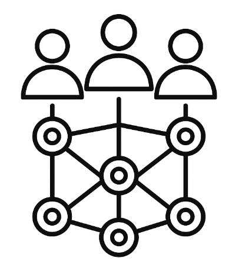

El escenario más habitual es la participación en la red pública de IPFS, donde nodos locales se conectan entre sí, comparten y replican contenido siguiendo el protocolo, y permiten la búsqueda y descarga de archivos mediante CIDs.

**Redes privadas de nodos IPFS**.

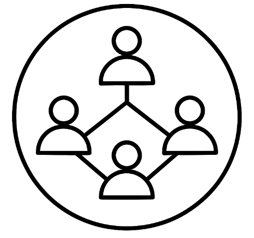

Es posible crear redes IPFS privadas, donde solo ciertos nodos participan y comparten contenido, por ejemplo, en entornos empresariales o académicos.

**Acceso a contenido mediante el protocolo IPFS**.

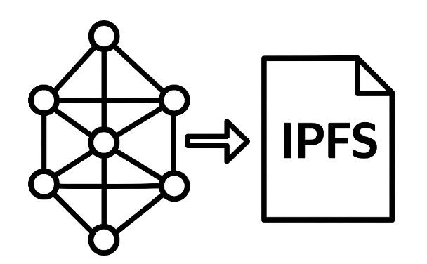

Ya sea desde un [navegador compatible con IPFS](https://github.com/ipfs/in-web-browsers) o mediante una consulta desde cualquier App o DApp, IPFS permite obtener el contenido completo solicitado a partir de un CID gracias a su protocolo de transporte descentralizado.

El proceso es transparente para el usuario: al proporcionar un CID, el sistema localiza automáticamente los nodos que almacenan ese contenido en la red y descarga los bloques necesarios para reconstruir el archivo o recurso solicitado.

**Acceso a contenido mediante un gateway IPFS**.


Los [gateways IPFS](https://docs.ipfs.tech/concepts/public-utilities/#public-ipfs-gateways) permiten acceder al contenido de la red IPFS desde navegadores web tradicionales, actuando como puente entre el protocolo IPFS y HTTP. Esto facilita la integración de IPFS en aplicaciones web y el acceso a usuarios sin cliente IPFS instalado.

Ademas, organizaciones o usuarios pueden desplegar sus propios gateways IPFS privados para controlar el acceso, aplicar filtros o integrar IPFS en infraestructuras internas.

> 🎓 Aprovecho para presentarte el laboratorio de IPFS de [open3diy.org sobre web3-101](https://github.com/open3diy/web3-101/blob/main/IPFS/README.md). Ahí verás entre otros casos, como crear un [nodo IPFS que sea un gateway](https://github.com/open3diy/web3-101/blob/main/IPFS/ipfs-testing-public-and-desktop-node/public-ipfs-node-install.md).

**Compartir contenido gracias a la colaboración de un nodo relay**.

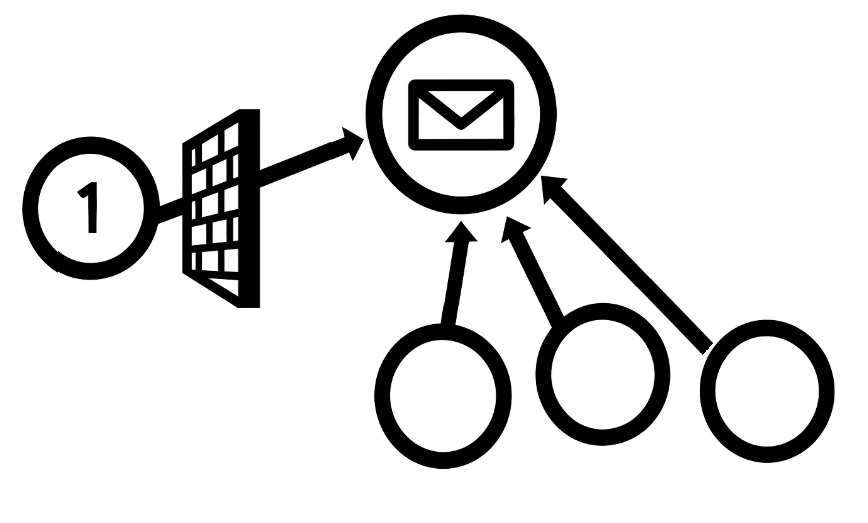

Algunos [nodos](https://docs.ipfs.tech/concepts/nodes/) pueden actuar como [relay](https://docs.ipfs.tech/concepts/nodes/#relay), facilitando la conexión a otro nodo que está detrás de NAT o firewalls y no puede recibir peticiones de entrada. Este escenario es clave para mejorar la conectividad y accesibilidad de la red, permitiendo que nodos con conectividad limitada puedan publicar y compartir contenido a través de la red IPFS utilizando nodos relay como intermediarios.

**Integración con blockchains (por ejemplo, Ethereum)**.

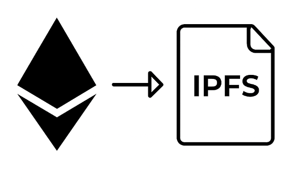

IPFS se utiliza para almacenar archivos o metadatos que se referencian desde contratos inteligentes, evitando cargar la blockchain con grandes volúmenes de datos. Además, el proyecto [go-ipld-eth-import](<https://github.com/ipfs/go-ipld-eth-import)>) permite importar datos públicos de Ethereum (bloques, transacciones, estado) al formato IPLD, haciéndolos navegables y accesibles en IPFS de forma estructurada y descentralizada, sin alterar la cadena original.

**Servicios de pinning y almacenamiento persistente**.

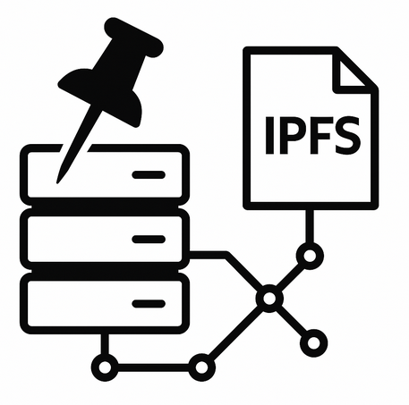

Como ya mencionamos, existen servicios de terceros que ofrecen pinning gestionado, asegurando que el contenido permanezca disponible en la red IPFS sin depender de un nodo propio siempre encendido.

**Acceso al API para configurar un nodo u organizar un clúster**.

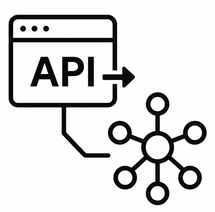

IPFS expone una [API HTTP](https://docs.ipfs.tech/reference/http/api/) que permite la gestión del nodo, añadir contenido y hacer pin sobre el. Además, esta API es utilizada por interfaces gráficas como [IPFS Desktop](https://docs.ipfs.tech/install/ipfs-desktop/)..

Además esta API es fundamental para la administración remota de nodos y la [coordinación de clústeres](<https://ipfscluster.io/)>), donde se requiere orquestar el pinning y la monitorización de múltiples nodos de forma centralizada o automatizada.

El uso de la API es especialmente relevante en despliegues empresariales, laboratorios o proyectos donde se necesita un control granular y automatizado sobre la infraestructura IPFS.

**Publicar un contenido en IPNS (InterPlanetary Name System)**.


Consiste en la publicación de nombres dinámicos que apuntan a diferentes CIDs por parte de un nodo, permitiendo la actualización de contenido mutable bajo una misma dirección.

> 🎓 Como característica de la red, explicaremos este escenario mejor mas adelante.

**Uso como backend de aplicaciones descentralizadas (dApps)**.

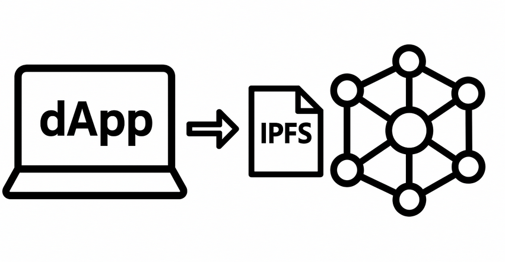

IPFS puede ser el sistema de almacenamiento de archivos, imágenes o datos para aplicaciones descentralizadas, facilitando la distribución y persistencia de la información.

> 🎓 Esta puede ser una buena práctica que podríamos ver mas adelante dentro de `web3-101-edu-projects`.

**Servicio de índice centralizado InterPlanetary Network Indexer (IPNI)**.

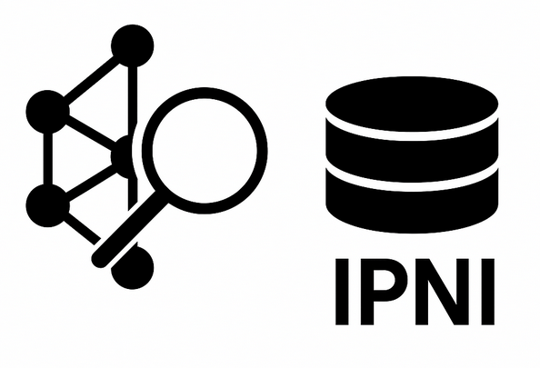

[IPNI](https://docs.ipfs.tech/concepts/ipni/) es una iniciativa que proporciona un sistema de indexación de proveedores de contenido en IPFS, permitiendo a los nodos que utilizan este servicio realizar búsquedas de CIDs en la red de forma más rápida y eficiente.

> Si lo recuerdas, es similar a lo que hacía Napster, pero adaptado al contexto de IPFS.

IPNI resulta especialmente útil en escenarios donde se requiere la búsqueda de contenido a gran escala, como en redes privadas, clústeres empresariales o servicios de pinning que necesitan indexar y servir grandes volúmenes de datos de manera eficiente.

Puedes probar a utilizar el servicio IPNI: <https://cid.contact/>.

> Es público supuestamente y la documentación de IPFS la menciona, pero como introducción a IPFS, no he realizado pruebas.

También puedes desplegar tu propio servidor IPNI para tu red siguiendo la documentación disponible en: <https://github.com/ipni>.

> Para usar IPNI, primero debes crear el servicio que publica los datos en el servidor IPNI desde el nodo cliente de IPFS y luego configurar el nodo para utilizar la consulta delegada. En esta introducción a IPFS, no profundizaremos más en este tema.

**Cliente sin acceso directo a la DHT: consulta delegada ("Delegated DHT")**.

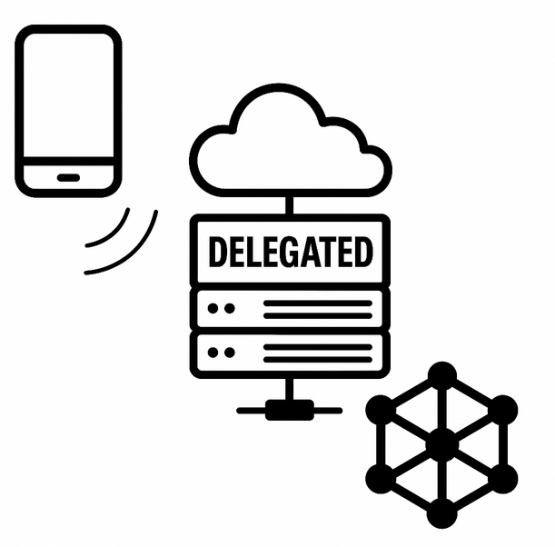

En algunos escenarios, como aplicaciones web o dispositivos con recursos limitados, los clientes no acceden directamente a la DHT de IPFS. En su lugar, utilizan la llamada ["Delegated DHT"](https://docs.ipfs.tech/concepts/how-ipfs-works/#delegated-routing-over-http), que consiste en delegar tanto la publicación (añadir contenido) como la consulta (búsqueda de CIDs/proveedores) a servicios externos en vez de operar directamente sobre la DHT.

En la práctica, cuando un cliente no tiene acceso directo a la DHT (por ejemplo, aplicaciones web o móviles), el proceso suele ser el siguiente:

1. **Añadir contenido:** El cliente utiliza la API de un nodo remoto (por ejemplo, Infura, Web3.Storage, etc.) que sí tiene acceso a la DHT. Este nodo se encarga de publicar el contenido y anunciarlo en la red IPFS.
  
  > En ambos casos, normalmente se requiere una API key proporcionada por el servicio remoto para autenticar y autorizar las operaciones.

2. **Consulta de proveedores:** Para localizar el contenido, el cliente consulta un servicio de indexación como [IPNI](https://docs.ipfs.tech/concepts/ipni/), que le proporciona las direcciones de los nodos proveedores que almacenan el CID solicitado.
3. **Descarga del contenido:** Una vez obtenidas las direcciones, la descarga se realiza directamente desde el proveedor mediante el protocolo Bitswap, sin intermediarios.

## La red de nodos p2p

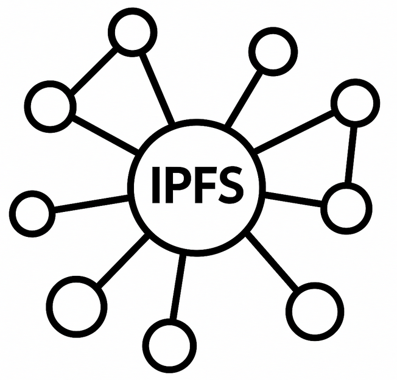

IPFS es un protocolo para una red P2P diseñada para almacenar, compartir y localizar contenido de forma descentralizada. Puedes usarlo para crear tu propia red privada de nodos, pero también existe una red pública llamada `Amino DHT`, que está configurada por defecto al [iniciar el nodo](https://docs.ipfs.tech/concepts/public-utilities/#amino-dht-bootstrappers).

La red pública de nodos `Amino DHT` es monitorizada para asegurar su correcto funcionamiento por [ProbeLab](https://probelab.io/ipfs/amino/), una iniciativa impulsada por los fundadores de Protocol Labs.

IPFS es una red pública P2P que usa una adaptación de la [DHT Kademlia](https://docs.ipfs.tech/concepts/dht/), lo que facilita la localización eficiente de contenidos y nodos dentro de un espacio distribuido, siendo más eficiente que una red no estructurada como Gossip o Flooding, aunque requiere que la red sea más estables, con nodos que permanezcan disponibles con regularidad.

> 🎓 Si quieres conocer más sobre redes P2P, puedes acceder a la siguiente [introducción](_misc/p2p_overview.md), donde intentaré despejar todas las dudas.

### Elementos clave de la red IPFS

Como toda red P2P, IPFS está compuesta por [nodos](https://docs.ipfs.tech/concepts/nodes/#nodes) que se comunican entre sí para compartir y enrutar contenido. Cada nodo posee un identificador único llamado PeerId, generado a partir de una clave pública derivada de su clave privada, la cual es única e intransferible. Este identificador permite reconocer y autenticar de forma segura a cada nodo en la red.

Para conectarse entre sí, los nodos anuncian una o más direcciones en formato [multiaddr](httpis://docs.libp2p.io/concepts/fundamentals/addressing/), un sistema de direccionamiento flexible que describe cómo alcanzar al nodo a través de distintas capas de red. Un nodo puede tener múltiples direcciones (por ejemplo, IPv4, IPv6, WebSocket, QUIC), lo que le permite operar en distintos entornos y facilitar la conectividad.

Cada dirección multiaddr incluye información como el protocolo de red, el puerto, y el PeerId del nodo. Por ejemplo:
`/ip4/192.0.2.1/tcp/4001/p2p/QmPeerId`.

> Si quieres hacer la prueba, instala un cliente de IPFS y ejecuta en una terminal `ipfs id`. En el apartado `Addresses` verás todas las direcciones en las que el nodo está escuchando.

Así, mediante la combinación de PeerId y multiaddr, los nodos pueden descubrirse, autenticarse y establecer conexiones entre sí en la red IPFS.

#### Publicar con IPNS

Aunque el contenido es identificado por un CID, este puede variar, por eso, es posible relacionarlo a un nombre de dirección pública, lo que sería un [IPNS](https://docs.ipfs.tech/concepts/ipns/) (InterPlanetary Name System).

Al crear un nodo IPFS, se genera una clave privada, donde su clave pública da lugar al PeerId (que es el hash de la clave publica). Este PeerId actúa como IPNS por defecto y puede representarse en base58btc (ej. Qm...) o en base36/base32 (ej. bafy...). A ese IPNS puedes asociar cualquier CID, siempre que esté pineado.

> 🎓 Veremos y practicaremos todo esto más adelante.

En un nodo IPFS, además del IPNS basado en el PeerId por defecto, puedes generar claves privadas adicionales. Cada nueva clave privada tendrá su propia clave pública, lo que te permitirá crear múltiples nombres IPNS independientes y asociar a cada uno el CID que desees.

La analogía de IPNS es como crear direcciones de una wallet, en ambos casos se generan en base a la parte pública, son un código ilegible y sirven para autenticar al creador. En realidad si quieres un nombre mas legible para una web, quizás debas crear un [DNSLink](https://docs.ipfs.tech/concepts/dnslink/), que sirve para asociar una dirección DNS a un contenido relacionado a un CID que se publica en un [gateway IPFS](https://docs.ipfs.tech/concepts/ipfs-gateway/), ya sea público o uno propio.

> 🎓 Practica que puedes revisar en el laboratorio de la web3 en open3diy, en <https://github.com/open3diy/web3-101/blob/main/IPFS/ipfs-testing-public-and-desktop-node/public-ipfs-node-install.md#vincular-un-nombre-de-dominio-legible-con-un-cid-de-ipfs-con-dnslink>

### Descripción técnica de IPFS

**Como red de nodos P2P**.

La red de IPFS `Amino DHT`, se clasifica como una red de [autorización pública](_misc/p2p_overview.md#modelo-de-autorización), donde cualquier otro nodo puede participar sin restricciones, con un [modelo de gobernanza](_misc/p2p_overview.md#modelo-de-gobernanza) descentralizada y abierta, aunque Protocol Labs (<https://www.protocol.ai/>) tiene un papel relevante en la evolución del protocolo.

Es una red [clasificada](_misc/p2p_overview.md#clasificación-principal-de-redes-p2p) como estructurada, basada en DHT (Kademlia), para un [modelo de confianza](_misc/p2p_overview.md#modelo-de-confianza) trustless, donde los nodos no necesitan confiar entre sí, ya que la integridad y autenticidad del contenido se verifica mediante el CID (Content Identifier).

Es una red con un [grado de descentralización](_misc/p2p_overview.md#grado-de-descentralización) completamente descentralizado en su funcionamiento principal. Sin embargo, en ciertos escenarios donde se utilizan servicios como [IPNI](https://docs.ipfs.tech/concepts/ipni/) para la indexación centralizada de proveedores de contenido, pueden introducirse elementos de centralización opcional. Utiliza una [estrategia de almacenamiento](_misc/p2p_overview.md#estrategias-de-almacenamiento-en-redes-p2p) distribuido donde la [replicación](_misc/p2p_overview.md#técnicas-de-replicación) es parcial, lo que significa que no todos los nodos almacenan todos los datos, sino solo aquellos que se solicitan o se elige mantener (pinning), optimizando así el uso de recursos. El [modelo de consistencia](_misc/p2p_overview.md#modelos-de-consistencia) es eventual, es decir, los cambios se propagan gradualmente y, tras cierto tiempo, todos los nodos alcanzan el mismo estado; además, ofrece otro [modelo de consistencia](_misc/p2p_overview.md#modelos-de-consistencia) adicional de lectura tras escritura, lo que garantiza que un nodo que escribe un dato podrá leer inmediatamente esa versión.

**IPFS es una adaptación de Kademlia** porque introduce varias diferencias clave para priorizar disponibilidad y flexibilidad:

En Kademlia, un contenido se almacena únicamente en los nodos más cercanos a su key o clave (como se explica en [resumen de redes P2P](_misc/p2p_overview.md)), lo que implica que el nodo que origina el contenido no lo almacena. En cambio, en IPFS, gracias al mecanismo de pinning, el nodo propietario del contenido, el que lo crea, también lo conserva y puede anunciarlo (mediante comando `provide`). Esto representa una diferencia clave respecto al modelo STORE clásico de Kademlia.

En Kademlia clásico, el dato se replica automáticamente con una persistencia garantizada (mientras haya al menos un nodo activo), pero en IPFS solo se anuncia la ubicación del dato y si el nodo lo borra, se pierde, a menos que otro nodo lo haya pineado explícitamente.

Tenemos que considerar que el mecanismo de pinning cobra especial importancia: asegura que un nodo retenga localmente un bloque específico, impidiendo que sea eliminado por políticas de caché o recolección.

  > El pinning convierte a un nodo en un proveedor fiable del contenido, garantizando su permanencia en la red. Sin pinning, los anuncios pueden volverse inconsistentes o efímeros.

**Como implementación técnica**.

Como ya se mencionó, su especificación está descrita en <https://specs.ipfs.tech/>.

IPFS está construido como una arquitectura modular, compuesta por varios componentes y tecnologías clave que podemos resumir como:

* libp2p: Es la biblioteca de red modular utilizada por IPFS para la comunicación P2P. Proporciona los protocolos de transporte, descubrimiento de pares, multiplexación, cifrado y direccionamiento flexible mediante [multiaddr](https://docs.libp2p.io/concepts/fundamentals/addressing/). Más información en <https://docs.ipfs.tech/concepts/libp2p/>.
* DHT (Distributed Hash Table): IPFS implementa una DHT basada en el protocolo [Kademlia](https://docs.ipfs.tech/concepts/dht/), que permite la localización eficiente de contenido y nodos en la red. La DHT es responsable de almacenar y buscar información sobre qué nodos poseen qué bloques de datos.
* Bitswap: Es el protocolo de intercambio de bloques de IPFS. Bitswap gestiona la solicitud y transferencia de bloques de datos entre nodos, manteniendo una *want-list* de bloques requeridos y facilitando la descarga paralela y eficiente. Más información en <https://docs.ipfs.tech/concepts/bitswap/>.
* IPLD (InterPlanetary Linked Data): Es el modelo de datos utilizado por IPFS para representar y enlazar bloques de información. IPLD define cómo se fragmenta, direcciona y verifica el contenido mediante CIDs. Más información en <https://ipld.io/>.
* UnixFS: Es el sistema de archivos sobre IPLD que define cómo se representan archivos y directorios en IPFS. Permite la deduplicación, fragmentación y reconstrucción eficiente de archivos. Más información en <https://docs.ipfs.tech/concepts/file-systems/#unix-file-system-unixfs>.

En resumen técnico, IPFS es una solución compuesta por módulos interoperables que implementan protocolos abiertos para el almacenamiento, descubrimiento y transferencia de datos en una red P2P, priorizando la descentralización, la integridad y la eficiencia en la distribución de contenido.

### Entendiendo el protocolo IPFS

Si quieres ver cómo funciona, puedes acceder a la documentación de referencia: <https://docs.ipfs.tech/concepts/how-ipfs-works/#subsystems-overview>.

Pero en este apartado intentaremos explicarlo...

La mejor forma de comprender el protocolo IPFS es conociendo sus operaciones principales, aquellas que podemos ejecutar desde la terminal para experimentar directamente su funcionamiento.

Por un lado están las [operaciones básicas que podemos realizar en el cliente](https://docs.ipfs.tech/how-to/kubo-basic-cli/#pin-a-file), como iniciar el nodo, añadir un archivo, etc.

Pero las operaciones que nos interesa en esta introducción para comprender el protocolo, entre [todas las operaciones de línea de comando de Kubo](https://docs.ipfs.tech/reference/kubo/cli/#ipfs) son las de listado, enrutamiento, búsqueda, publicación y resolución de nombres IPNS, y podemos resumirlas en:

* `ipfs ls <CID>`: Lista los archivos y directorios contenidos dentro del CID especificado, mostrando su estructura y los CIDs hijos. Se usa para explorar el contenido de un objeto en IPFS, similar al comando `ls` en sistemas de archivos tradicionales.
* `ipfs routing provide <key>`: Anuncia a la DHT que el nodo posee el contenido identificado por `<key>` (el CID). Se utiliza para que otros nodos puedan descubrir qué peers almacenan ese contenido.
* `ipfs routing put <key,value>`: Inserta manualmente un par clave-valor en la tabla de enrutamiento (DHT), normalmente usado para guardar la relación de PeerId y lista de direcciones multiaddr que posee un nodo.  
  > Para anunciar que un nodo provee un contenido (CID), no se utiliza `put` ni `get`, sino el comando `provide`, que emplea un mecanismo especializado en la DHT (ADD_PROVIDER). Esto se debe a que los proveedores de contenido pueden ser múltiples y la DHT almacena una lista de PeerId asociados a un mismo CID, mientras que `put`/`get` están pensados para pares clave-valor únicos, como la relación PeerId → multiaddr.
* `ipfs routing get <key>`: Recupera el valor exacto asociado a `<key>` en la DHT. Si no se encuentra el valor, devuelve los nodos más cercanos a la clave consultada según la métrica de Kademlia.
* `ipfs findprovs <key>`: Busca en la DHT los nodos que han anunciado proveer el contenido designado por `<key>` (el CID). Retorna los PeerID de los proveedores encontrados; si no hay proveedores, retorna los nodos más cercanos a la clave consultada según la métrica de Kademlia.
* `ipfs findpeer <peerId>`: Consulta en la DHT por las direcciones multiaddr conocidas del peer identificado por `<peerId>`. Si no se encuentra el peer, devuelve los nodos más cercanos a la clave consultada según la métrica de Kademlia. Se usa para conectar directamente con BitSwap (módulo que veremos más adelante).
* `ipfs name publish <CID>`: Publica un CID bajo IPNS, firmándolo con la clave privada del nodo.
* `ipfs name resolve <name>`: Resuelve un nombre IPNS (ej. `k51qzi5uqu5di56caajjiel546q92pme0hgnh4gofey4tbwlfdr64ur7vu9s9t`) al CID actual al que apunta. Si no se encuentra el valor, devuelve los nodos más cercanos a la clave consultada según la métrica de Kademlia.

Como usuarios principiantes, normalmente las operaciones las realizaremos desde la aplicación de escritorio, enumeramos estas instrucciones para hacer una presentación y comprender mejor los casos de uso representativos.

> 🎓 De primeras no es fácil entender que es un enrutamiento, DHT, Kademlia, etc...son palabras sin contexto, es por eso que tendrás que ir la [introducción de redes P2P](_misc/p2p_overview.md) y buscar el apartado de redes estructuradas. Es un documento extenso, pero casi imprescindible para entender una red P2P.

#### Ejemplos prácticos de operaciones en IPFS

A continuación, se presentan algunos ejemplos de operaciones clave del protocolo IPFS. Estos ejemplos ayudan a visualizar cómo se almacena, anuncia y recupera contenido dentro de la red, permitiendo entender mejor la dinámica de funcionamiento de la red.

##### Anunciar direcciones al resto de nodos responsables

Al iniciarse, el nodo IPFS necesita informar a la red cómo puede ser contactado. Para ello, anuncia sus direcciones de transporte (multiaddr), como por ejemplo: `/ip4/192.0.2.1/tcp/4001`, `/ip4/192.0.2.1/udp/4001/quic`, o direcciones `/dns4/...` si usa resolución DNS.

<video controls width="400" playbackRate="0.75"><source src="_first-approach-to-IPFS-attachments/assets/IPFS1-7.mp4" type="video/mp4">Tu navegador no soporta video HTML5.</video>

Este anuncio se realiza usando el mecanismo `PUT_VALUE` de libp2p-routing, que IPFS implementa sobre una DHT basada en el protocolo Kademlia. Finalmente los nodos que reciben el mensaje (nodos azules) guardan en su DHT la relación de peerId con lista multiaddr.

Este mensaje `PUT_VALUE` se propaga y almacena en los nodos que están “más cerca” del PeerId según la métrica XOR de Kademlia, por lo tanto, sólo un conjunto de nodos son los responsables de almacenar ese valor.

IPFS usa esta información para que otros nodos puedan encontrar las direcciones de un peer conocido, mediante `FIND_VALUE` (internamente usado por `ipfs routing get` o `ipfs routing findpeer`). En Kademlia, solo los "nodos más cercanos" al PeerId son responsables de almacenar ese valor, y como este cálculo es determinista, cualquier consulta posterior conducirá a esos nodos responsables, o al menos a uno cercano que podrá redirigir la petición hasta ellos.

La DHT impone un TTL (Time To Live) al registro (habitualmente entre 24 h y 48 h), por lo que el nodo debe republicar periódicamente sus datos para evitar que sean descartados.

##### Anunciar contenido CID al resto de nodos responsables

Cuando un contenido es añadido (y preferiblemente pineado, aunque no es obligatorio), el nodo anuncia que posee el CID correspondiente con su correspondiente relación de bloques hijos que también tienen un CID. Este anuncio vincula los CID con el PeerId del nodo que lo almacena.

<video controls width="400" playbackRate="0.75"><source src="_first-approach-to-IPFS-attachments/assets/IPFS2-7.mp4" type="video/mp4">Tu navegador no soporta video HTML5.</video>

Este anuncio se realiza mediante el mecanismo `ADD_PROVIDER` de libp2p-routing, que IPFS implementa sobre una DHT basada en el protocolo Kademlia. A diferencia de `PUT_VALUE`, que se utiliza para almacenar pares clave-valor únicos, `ADD_PROVIDER` está diseñado específicamente para anunciar que uno o varios nodos (identificados por su PeerID) pueden proveer un determinado CID. Así, los nodos que reciben este mensaje (nodos azules) almacenan en su DHT la relación entre el CID y una lista de PeerID, representando a todos los nodos que han pineado ese contenido y pueden servirlo en la red.

  > Aunque no lo vemos en el ejemplo, este anuncio no es exclusivo del nodo original: cualquier nodo que pinnee ese CID también lo anunciará a la DHT, haciendo que múltiples nodos, con su peerId, aparezcan como proveedores.

Este mensaje `ADD_PROVIDER` se propaga y almacena en los nodos que están “más cerca” del CID, según la métrica XOR de Kademlia, siendo los nodos responsables.

Estos registros tienen un TTL limitado (normalmente entre 24 h y 48 h), por lo que cada nodo debe re-anunciar periódicamente los CIDs que posee mediante un proceso automático.

Esta operación difiere de lo que sería típico en Kademlia, en el caso de provide, no se anuncia el contenido mismo, se indica qué nodos, con su PeerId, lo almacenan.

Saber el PeerId no permite acceder al contenido, luego, el nodo interesado, si lo necesita, deberá obtener las multiaddr del PeerId usando `findpeer` (como veremos a continuación) y luego para descargar el contenido usará el protocolo BitSwap.

##### Obtener contenido del CID

Cuando el nodo necesita obtener contenido en IPFS a partir de un CID (Content Identifier), el proceso se resume en tres fases principales: primero, `findprov` para localizar los nodos que proveen ese CID; luego, `findpeer` para obtener sus direcciones de red si es necesario; y finalmente, Bitswap para descargar el contenido desde esos nodos.

  > Aunque como veremos, teniendo en cuenta cómo funciona Bitswap esto no es del todo cierto, pero sigue leyendo...

<video controls width="400" playbackRate="0.75"><source src="_first-approach-to-IPFS-attachments/assets/IPFS4-7.mp4" type="video/mp4">Tu navegador no soporta video HTML5.</video>

**Paso 1 `findprov` (Búsqueda de Proveedores)**:

El primer paso es iniciar una búsqueda para encontrar los nodos proveedores (identificados por su PeerId) que almacenan el contenido asociado a un CID específico.

<video controls width="400" playbackRate="0.75"><source src="_first-approach-to-IPFS-attachments/assets/IPFS5-7.mp4" type="video/mp4">Tu navegador no soporta video HTML5.</video>

Esta operación se realiza mediante el comando `findprovs` en IPFS, que consulta en la DHT de los nodos responsables a esa clave CID, según su cercanía en el espacio de identificadores (métrica XOR) de Kademlia.

Como resultado, cada nodo consultado, devuelve una lista de PeerId de los nodos que han anunciado ser proveedores de ese CID.

Adicionalmente, si estos nodos tienen la información disponible en su PeerStore (almacenamiento interno de información sobre otros peers), pueden incluir también sus direcciones multiaddr directamente en la respuesta. Sin embargo, no es responsabilidad de estos nodos conocer o devolver siempre la lista completa de direcciones multiaddr de cada PeerId; si no se obtiene esta información, será necesario realizar una consulta adicional usando el comando `findpeer`.

Como es habitual en Kademlia, si el nodo consultado no tiene en su DHT la key consultada, el CID, devolverá sus nodos más cercanos.

**Paso 2: `findpeer` (Búsqueda de direcciones)**:

Si en el paso 1 (`findprovs`) no se obtuvo la lista de direcciones multiaddr asociadas al PeerId de los proveedores, en este paso se realiza una búsqueda específica para obtenerlas.

<video controls width="400" playbackRate="0.75"><source src="_first-approach-to-IPFS-attachments/assets/IPFS6-7.mp4" type="video/mp4">Tu navegador no soporta video HTML5.</video>

Esta operación se realiza consultando la DHT (Kademlia) mediante el comando `findpeer` (internamente, un `GET_VALUE` de libp2p-routing). El nodo solicita a la red las direcciones multiaddr asociadas al PeerId, localizando los nodos responsables de almacenar esa información según la métrica de cercanía XOR de Kademlia.

Como resultado, se obtiene la lista de direcciones multiaddr (por ejemplo, `/ip4/192.0.2.1/tcp/4001/p2p/QmPeerId`) que permiten establecer la conexión directa con el nodo proveedor y así iniciar la transferencia del contenido solicitado.

Este paso es fundamental para que el nodo solicitante pueda contactar y descargar los bloques de datos desde los proveedores identificados en el paso anterior.

**Paso 3: `Bitswap` (Descarga del contenido)**:

Una vez que el sistema de IPFS ha identificado qué nodo o nodos poseen el contenido buscado (ya sea un archivo individual o una carpeta completa compuesta por varios CIDs), entra en funcionamiento Bitswap, el protocolo de intercambio de bloques que utiliza IPFS para transferir datos entre los nodos.

Bitswap es responsable de solicitar, intercambiar y transferir los bloques de datos que forman el contenido. Su funcionamiento va más allá de una simple descarga directa: implementa un sistema eficiente de oferta y demanda de bloques entre los nodos conectados.

Cada nodo mantiene una lista llamada *want-list*, que contiene los CIDs de los bloques que necesita. Esta lista se comparte con los nodos vecinos para informarles de qué bloques está buscando.

Cuando un nodo detecta que uno de sus pares tiene un bloque que necesita (porque el par lo ha anunciado o porque ya lo tiene en caché), solicita ese bloque directamente. A su vez, el nodo puede ofrecer bloques que otros necesitan, fomentando así el intercambio.

Bitswap implementa un sistema de "crédito" o contabilidad simple: los nodos tienden a priorizar el envío de bloques a aquellos pares que también les han enviado bloques en el pasado, incentivando la cooperación y evitando el comportamiento egoísta.

Antes de buscar en toda la red, Bitswap intenta obtener los bloques de los nodos a los que ya está conectado, lo que reduce la latencia y el tráfico innecesario de los comandos anteriores. Si ningún nodo vecino tiene el bloque, entonces se recurre a las búsquedas anteriores en la DHT para buscar nuevos proveedores.

*Ejemplo práctico:*

Supongamos que quieres descargar una imagen almacenada en IPFS, identificada por un CID. El proceso sería:

* Tu nodo añade el CID de la imagen a su *want-list*.
* Bitswap consulta a los nodos vecinos si tienen ese bloque.
* Si un vecino tiene el bloque, lo envía directamente a tu nodo.
* Si no, tu nodo busca proveedores en la DHT y se conecta a ellos para solicitar el bloque.
* Si la imagen está fragmentada en varios bloques (lo habitual en archivos grandes), este proceso se repite para cada bloque, permitiendo descargas paralelas y eficientes.

> Este mecanismo permite que los bloques se propaguen rápidamente por la red y que los nodos puedan actuar tanto como consumidores como proveedores de contenido, optimizando el uso de recursos y la disponibilidad de los datos.

##### Publicar un nombre IPNS (IPNS name) con el CID relacionado al resto de nodos responsables

Cuando un contenido es añadido (y preferiblemente pineado, aunque no es obligatorio), el nodo puede anunciar que posee el CID correspondiente relacionado a un nombre IPNS.

<video controls width="400" playbackRate="0.75"><source src="_first-approach-to-IPFS-attachments/assets/IPFS3-7.mp4" type="video/mp4">Tu navegador no soporta video HTML5.</video>

Tenemos que recordar que dicho nombre IPNS es por defecto el PeerId del nodo, el cual es el hash de la clave pública asociada a la clave privada que identifica al nodo.

Aunque el PeerID del nodo es por defecto su nombre IPNS, un mismo nodo puede generar múltiples claves privadas adicionales, resultando en distintos nombres IPNS para poder publicar.

Este anuncio se realiza mediante el mecanismo `PUT_VALUE` de libp2p-routing y como en cualquier operación de este tipo, el mensaje se enruta en los nodos más “cercanos” a la clave (el nombre IPNS), según la métrica XOR de Kademlia; por lo tanto, solo un subconjunto de nodos será responsable de almacenar dicho valor.

Los nodos que reciben el mensaje (nodos azules en el ejemplo) guardan en su DHT la relación entre el nombre IPNS (clave) y un valor que consiste en un registro que incluye: un número de secuencia, un TTL opcional, la clave pública asociada y una firma digital. Esta firma autentica al nodo emisor y debe ser validada mediante su clave pública. Adicionalmente, debe verificarse que el nombre IPNS (clave) corresponde con el hash de dicha clave pública, de esta forma se asegura que sólo el nodo propietario y con esa clave privada ha podido publicar el registro.

El nombre IPNS, como PeerID, suele codificarse en base58btc (en IPNS sobre DHT) o en base36 (en IPNS sobre PubSub). IPNS permite publicar registros mediante dos modos: el tradicional basado en DHT (modelo pull), donde los nodos deben consultar activamente el registro asociado a un PeerID —es el método por defecto usado por ipfs name publish—, y el modo experimental basado en PubSub (modelo push), que propaga los cambios inmediatamente a los nodos suscritos. Este último requiere activación explícita mediante [`Ipns.UsePubsub` en la configuración](https://docs.ipfs.tech/how-to/best-practices-for-ipfs-builders/).

IPFS utiliza esta información para que otros nodos puedan resolver nombres y obtener el CID mediante `FIND_VALUE` (comando interno usado por `ipfs resolve`).

Por defecto, si no se indica lo contrario, la DHT aplica un `TTL` (Time To Live) al registro —habitualmente entre 24 y 48 horas—, por lo que el nodo debe republicar periódicamente sus datos para evitar que sean eliminados.

##### Resolver un nombre IPNS (IPNS name) para obtener el CID relacionado

Como se menciona, cuando un nodo desea resolver un nombre IPNS y obtener el CID asociado, se utiliza el comando interno `ipfs resolve`, que opera de la siguiente manera:

<video controls width="400" playbackRate="0.75"><source src="_first-approach-to-IPFS-attachments/assets/IPFS7-7.mp4" type="video/mp4">Tu navegador no soporta video HTML5.</video>

Para resolver el valor, se inicia una búsqueda en la DHT para localizar los nodos responsables de la clave (el nombre IPNS). Esto se realiza mediante el comando `GET_VALUE` de libp2p-routing, que consulta la DHT de Kademlia en función de la métrica de cercanía XOR.

El nodo que realiza la consulta recupera el valor y valida su firma.

IPFS optimiza el tráfico, por lo que si el valor ya está en caché, la búsqueda en la DHT no será necesaria.

---

## Seguridad del contenido en red Amino

Estas son las medidas que se suelen aplicar en la red de IPFS respecto a la seguridad del contenido cuando estás en al red pública Amino:

* Listas de bloqueo coordinadas: Algunos nodos y gateways colaboran para mantener listas de CID maliciosos como <https://badbits.dwebops.pub/>.
* Responsabilidad del usuario: Al utilizar IPFS en la red pública, es fundamental cifrar cualquier dato sensible antes de compartirlo y emplear software antivirus para analizar los archivos descargados. También se recomienda descargar el contenido en formato [CAR (Content Addressed Archive)](https://docs.ipfs.tech/how-to/ipfs-in-web-apps/#car-files) si no confías plenamente en el nodo o gateway consultado. Este formato permite obtener el contenido empaquetado y verificar su integridad comprobando el multihash del CID solicitado, sin depender de la confianza en el proveedor.

> Pero IPFS como protocolo, puede ser usado en cualquier red privada o con el control de acceso deseado, simplemente deberás crear tú propia red usando un cliente de IPFS y crear la seguridad adicional que determines.

Recuerda que la fortaleza principal de IPFS es el Content ID (CID), que garantiza la integridad de todo el contenido que visualizas: puedes estar seguro de que el archivo o recurso es exactamente el que corresponde a ese CID y no otro. Sin embargo, IPFS no proporciona un mecanismo para autenticar o verificar la autoría de un CID; esa relación entre el CID y el contenido que ves debe establecerse a través de fuentes externas, como dominios web oficiales, redes sociales verificadas o canales de comunicación confiables. Estas fuentes son las que te permiten asociar un CID concreto con el origen legítimo del contenido.

## Las implementaciones de IPFS

Una implementación es el software que ejecuta el protocolo IPFS.

Todas las implementaciones de IPFS puedes verlas en <https://docs.ipfs.tech/concepts/ipfs-implementations/#popular-node-implementations-and-tools>.

Existen diferentes tipos de implementaciones de IPFS. Algunas son clientes completos de línea de comando, como [Kubo-IPFS](https://docs.ipfs.tech/install/command-line/#install-ipfs-kubo), que suele tener una [línea de comando](https://docs.ipfs.tech/reference/kubo/cli/), permitiendo ejecutar un nodo IPFS autónomo y gestionar archivos, redes y configuraciones desde la terminal. Otras implementaciones están orientadas a la integración en aplicaciones, como [Helia](https://github.com/ipfs/helia), una librería en JavaScript para entornos web y Node.js, o [Boxo](https://github.com/ipfs/boxo), una librería en Go que facilita la incorporación de funcionalidades IPFS en otros proyectos.

> Es importante aclarar que tanto Helia como Boxo pueden operar en escenarios normales de red IPFS, participando directamente en la red P2P, no están limitados únicamente al modelo de "delegated DHT". Los desarrolladores pueden elegir si integran estas librerías como nodos autónomos o como clientes ligeros que delegan operaciones en servicios externos, según las necesidades de su aplicación, eso si tendrán que estar en muchos casos usados detrás de un nodo relay.

El uso inicial más fácil de IPFS es mediante la aplicación de escritorio [IPFS Desktop](https://docs.ipfs.tech/install/ipfs-desktop/), pero tenemos que entender que esto es solo la interfaz gráfica que usa Kubo-IPFS.

Cuando inicias una implementación se usan la lista de nodos [bootstrap](https://docs.ipfs.tech/concepts/nodes/#bootstrap) ya [configurados por defecto](https://docs.ipfs.tech/how-to/modify-bootstrap-list) por Protocol Labs, accediendo a la red pública `Amino DHT`.

> Si quieres crear tú propia red, deberás crear una lista diferente de nodos bootstrap.

Otra implementación básica es la extensión [IPFS Companion](https://github.com/ipfs/ipfs-companion), disponible para navegadores como Chrome y Firefox. IPFS Companion permite interactuar con la red IPFS directamente desde el navegador, redirigiendo solicitudes IPFS/IPNS y facilitando el acceso a contenido descentralizado. Puede conectarse a un nodo IPFS local o remoto, lo que la hace ideal para explorar IPFS sin necesidad de instalar un nodo completo, aunque sus funcionalidades dependen de la configuración y disponibilidad del nodo al que se conecta.

Algunos navegadores ofrecen soporte nativo para IPFS, como [Brave](https://brave.com/ipfs-support/), que permite acceder directamente a contenido IPFS sin necesidad de extensiones adicionales. Brave puede conectarse a cualquier nodo de la red, actuando como un nodo más y facilitando una mayor descentralización, en lugar de depender de un único nodo.

Algunos ejemplos de cómo acceder a contenido de IPFS desde el navegador, ya sea usando la extensión o Brave:

```bash
ipfs://bafybeifx7yeb55armcsxwwitkymga5xf53dxiarykms3ygqic223w5sk3m
ipns://k51qzi5uqu5di56caajjiel546q92pme0hgnh4gofey4tbwlfdr64ur7vu9s9t
ipns://en.wikipedia-on-ipfs.org
ipns://web3-101-ipfs.open3diy.org
```

Como ves la barra de dirección puedes poner como las direcciones si asocias un CID a un dominio DNSLink, también puedes explorarlo como un dominio legible.

> El último acceso es del laboratorio de open3diy-web3.

Otros navegadores, como Opera, han anunciado soporte experimental o parcial para IPFS, aunque Brave es el ejemplo más destacado actualmente. Es recomendable consultar la documentación de cada navegador para conocer el estado actual del soporte nativo de IPFS.

### Resumen de configuración de un nodo IPFS

Un nodo IPFS es [configurable](https://github.com/ipfs/kubo/blob/master/docs/config.md) y permite adaptar su funcionamiento a distintas necesidades. Sus capacidades se agrupan en varias áreas clave:

**Interfaz y acceso externo:**  
IPFS expone una API HTTP que permite a aplicaciones externas interactuar con el nodo, siendo utilizada principalmente por la interfaz web de administración y por herramientas de gestión de clústeres.

Además, el nodo puede funcionar como un gateway HTTP, facilitando el acceso a los archivos de IPFS desde navegadores web y aplicaciones de usuario final. Las direcciones y puertos de la API, gateway y red p2p (Swarm) son configurables.

**Red y conectividad:**  
La configuración de red abarca cómo el nodo se conecta con otros, incluyendo la lista de nodos iniciales (Bootstrap), descubrimiento automático en redes locales (Discovery/mDNS), y mecanismos para superar NAT o firewalls (AutoNAT, relays, hole punching). También es posible definir nodos con los que mantener conexión constante (Peering).

**Seguridad y autenticidad:**  
El nodo puede gestionar certificados TLS automáticos (AutoTLS) para conexiones seguras y almacena su identidad única (PeerID y clave privada).

**Almacenamiento y gestión de datos:**  
El almacenamiento local se controla mediante el Datastore, que define límites y políticas de recolección de basura. El sistema de pinning permite asegurar la persistencia de ciertos datos, y los puntos de montaje (Mounts) facilitan el acceso a IPFS/IPNS como carpetas locales.

**Resolución de nombres y publicación:**  
IPFS integra mecanismos para resolver nombres de dominio (DNS) y publicar enlaces permanentes mediante IPNS. El sistema de enrutamiento (Routing) determina cómo se buscan contenidos y nodos, generalmente usando DHT.

**Extensibilidad y experimentación:**  
El nodo puede ampliarse mediante plugins externos y activar funcionalidades experimentales para probar nuevas características o protocolos.

**Otras capacidades:**  
Incluye opciones para migración de datos entre versiones, configuración de importación de archivos, servicios de mensajería en tiempo real (Pubsub), y control sobre cómo se anuncia el contenido disponible (Provider, Reprovider).

Estas opciones, aunque resumidas, nos dan una visión de lo que se puede configurar para adaptar el nodo IPFS tanto para uso personal, para participar en la red Amino o en una red privada. Si necesitas detalle de todo esto, accede a la documentación.

## Práctica de IPFS usando IPFS Desktop

En primer lugar, instala IPFS Desktop siguiendo la guía oficial: <https://docs.ipfs.tech/install/ipfs-desktop/>.

> Puedes consultar el laboratorio de IPFS de [open3diy.org sobre web3-101](https://github.com/open3diy/web3-101/blob/main/IPFS/ipfs-testing-public-and-desktop-node/local-ipfs-node-desktop-install.md) para ver cómo instalar y configurar IPFS Desktop, solucionar problemas de conectividad (por ejemplo, si estás detrás de un CGNAT) y acceder a información útil sobre la instalación.

En la sección de "Configuración", activa el modo tutor de línea de comandos (CLI):

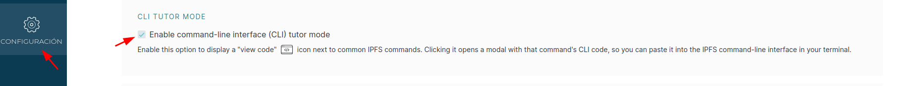

Esto te mostrará, junto a cada acción realizada en la interfaz gráfica, el comando CLI equivalente, facilitando el aprendizaje y la transición al uso avanzado de IPFS desde la terminal.

### Revisar estado del nodo

Accede al resumen del nodo:

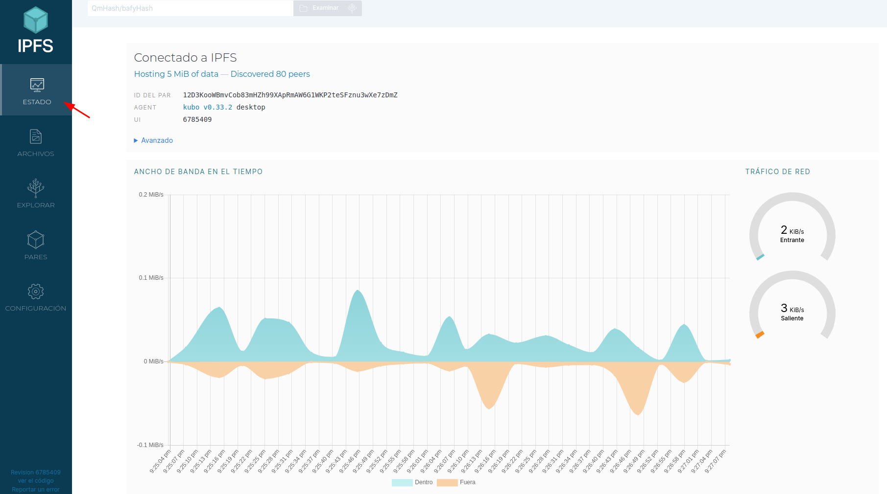

Aquí puedes ver:

* El total de datos hospedados (`MiB`) y el número de nodos conectados.
  > "MiB" significa *mebibyte* (1.048.576 bytes), diferente de "MB" (*megabyte*, 1.000.000 bytes). Durante años, "MB" se usó para ambos valores, pero desde el estándar IEC de 1998 se recomienda distinguirlos. Más información: [Wikipedia: Mebibyte](https://es.wikipedia.org/wiki/Mebibyte).
* El identificador del par (`PeerId`), que es el multihash de la clave pública del nodo codificado normalmente en base58btc. Este identificador es único para cada nodo y permite autenticarlo en la red.
* La versión del cliente (`kubo v...`) y el número de build correspondiente.
* A continuación, se muestra un gráfico en tiempo real de los bytes por segundo (B/s) de entrada y salida del nodo. Es importante tener en cuenta que gran parte de este tráfico corresponde al enrutamiento y mantenimiento de la DHT de Kademlia, no solo a las peticiones de contenido o publicaciones que realizas al añadir archivos. Por lo tanto, observarás actividad de red incluso cuando no estés transfiriendo archivos directamente, ya que el nodo participa activamente en la red P2P.

En "Avanzado", puedes ver detalles adicionales:

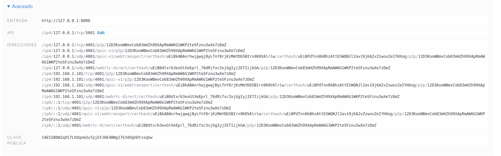

* <http://127.0.0.1:8080> es el gateway HTTP local de tu nodo IPFS. A través de esta dirección puedes acceder y visualizar archivos almacenados en IPFS desde tu navegador, utilizando rutas como `http://127.0.0.1:8080/ipfs/<CID>` o `http://127.0.0.1:8080/ipns/<nombre>`.
* `/ip4/127.0.0.1/tcp/5001` es la dirección de la API HTTP RPC de IPFS. Esta API permite interactuar programáticamente con el nodo, ya sea desde scripts, aplicaciones externas o herramientas como IPFS Desktop y extensiones de navegador. Puedes consultar la [documentación de la API HTTP](https://docs.ipfs.tech/reference/http/api/) para ver todas las operaciones disponibles.
* En el apartado "Direcciones" se listan todas las direcciones multiaddr en las que tu nodo está escuchando conexiones. Estas direcciones pueden incluir diferentes protocolos de red como TCP, UDP, WebRTC, QUIC, y variantes como `/p2p-circuit` (relay). Si tu nodo detecta direcciones IP públicas, también las mostrará aquí; si solo ves direcciones privadas (por ejemplo, `127.0.0.1` o `192.168.x.x`), es probable que estés detrás de un CGNAT, firewall o NAT restrictivo, lo que puede limitar la conectividad directa con otros nodos. En estos casos, IPFS puede utilizar nodos relay para facilitar la conexión con la red global.
* Puedes utilizar el comando `ipfs id` en la terminal para ver todas las direcciones multiaddr de tu nodo, junto con información adicional como el PeerId, la clave pública y los protocolos soportados:

  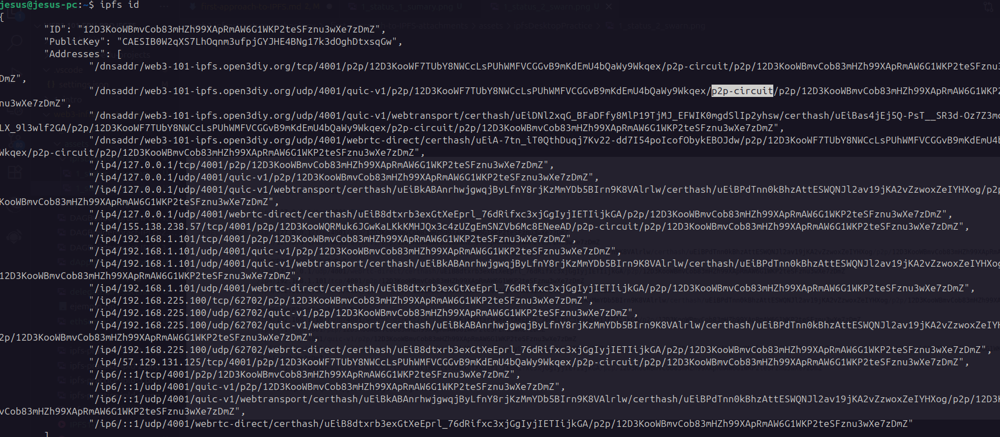

    > El mecanismo de relay permite que un nodo que se encuentra detrás de un CGNAT o firewall, y por tanto no puede recibir conexiones entrantes directas, se conecte a la red IPFS utilizando un nodo relay persistente mediante la dirección `/p2p-circuit`. De este modo, el nodo relay actúa como intermediario, facilitando la comunicación y el intercambio de datos con el resto de la red.

* "Clave pública" muestra la clave pública del nodo codificada en base64. Esta clave es fundamental para autenticar el nodo en la red y para verificar las firmas digitales asociadas a publicaciones en IPNS, garantizando la integridad y la autoría del contenido publicado.

### Agregar contenido al nodo

Puedes añadir archivos o directorios a tu nodo local de IPFS de forma sencilla:

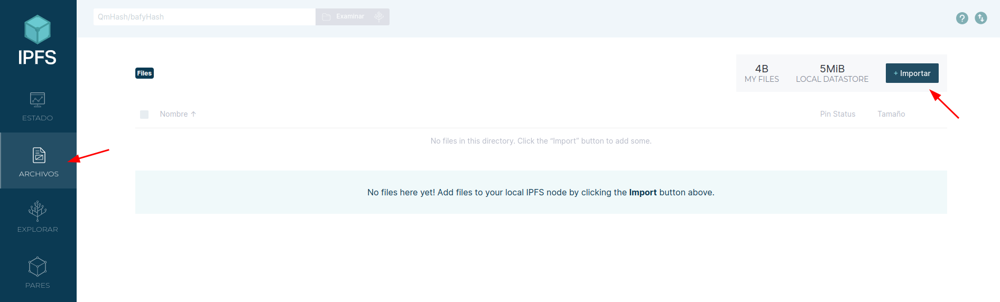

> Puedes importar contenido directamente desde tu disco o referenciarlo utilizando un CID externo. Esto te permite gestionar tanto archivos nuevos como aquellos ya existentes en la red IPFS.

Luego de importar archivos o directorios, puedes realizar diversas operaciones sobre el contenido desde el menú contextual:

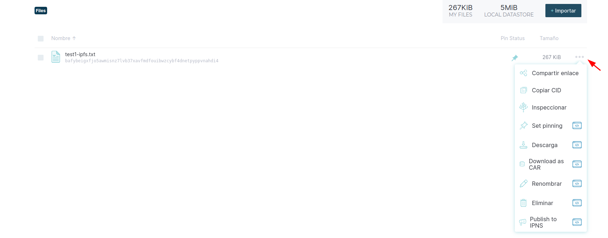

* **Compartir enlace:** Genera una URL para acceder al contenido a través de un gateway público. Por ejemplo:  
  <https://bafybeigxfjo5awmisnz7lvb37xavfmdfouibwzcybf4dnetpyppvnahdi4.ipfs.web3-101-ipfs.open3diy.org?filename=test1-ipfs.txt>
* **Copiar CID:** Permite copiar el identificador de contenido para utilizarlo en otras operaciones o compartirlo.
* **Inspeccionar CID:** Abre la pestaña "Explorar" y muestra el árbol IPLD del contenido, facilitando su análisis estructural.  
  > Puedes practicar esto en [Jugando con IPLD](./_first-approach-to-IPFS-attachments/practice-understand-IPLD.md).
* **Fijar (Pinning):** Marca el contenido para que permanezca almacenado de forma permanente en tu nodo, evitando su eliminación automática.
* **Descargar como CAR:** Permite descargar el contenido en formato CAR (Content Addressed Archive), útil para transferencias seguras y verificables.
  > Posteriormente, puedes visualizar el archivo CAR utilizando la herramienta online en <https://explore.ipld.io/>, donde podrás explorar su estructura IPLD de forma interactiva.
* **Renombrar o eliminar:** Opciones para modificar el nombre del archivo o eliminarlo del nodo.
* **Publicar en IPNS:** Asocia el PeerId del nodo a un CID mutable, permitiendo acceder al contenido mediante un nombre. El proceso incluye:
  * Seleccionar la clave (`self` o PeerId del nodo):

    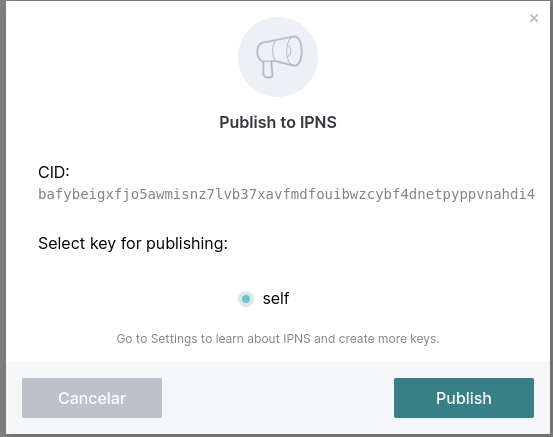

  * Publicar el registro en varios nodos para asegurar su disponibilidad (por defecto, 20 nodos):

    

  * Visualizar el valor IPNS publicado (formato CIDv1 en base36):

    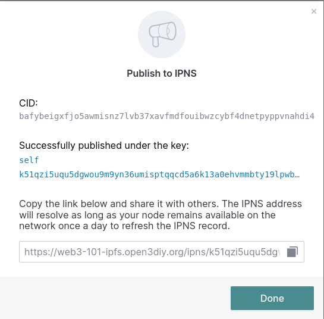

    > Puedes acceder al contenido publicado mediante el gateway público configurado, por ejemplo:  
    <https://web3-101-ipfs.open3diy.org/ipns/k51qzi5uqu5dgwou9m9yn36umisptqqcd5a6k13a0ehvmmbty19lpwb0wq4980>

### Explorar contenido

Puedes explorar cualquier CID de la red IPFS:

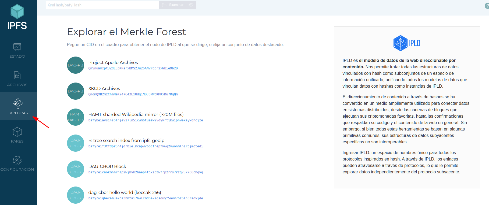

> Esta función es similar a acceder a <https://explore.ipld.io/>. Desde esa web puedes además puedes abrir archivos CAR generados y explorar su estructura IPLD.

La lista de CIDs de ejemplo es estática, es decir, se ha creado manualmente y no se actualiza automáticamente. Solo sirve para mostrar ejemplos. Lo útil es introducir el CID que deseas explorar en el cuadro de búsqueda.

Ejemplo de visualización:

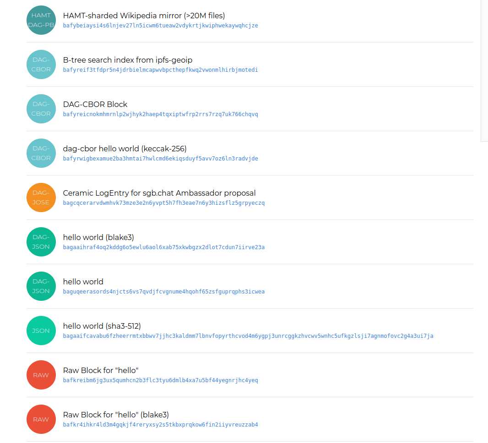

* Los círculos muestran la codificación del CID: DAG-PB y RAW son comunes en archivos/directorios subidos al nodo.
* DAG-CBOR se utiliza cuando se almacenan estructuras de datos IPLD complejas (por ejemplo, objetos anidados o datos personalizados), ya que garantiza CIDs estables y compactos gracias a su serialización determinista y eficiente.
* Los formatos dag-json, dag-cbor y dag-jose son opciones avanzadas de serialización IPLD, pero no se generan por defecto al añadir archivos o directorios comunes en IPFS; suelen emplearse en casos específicos, como aplicaciones que requieren interoperabilidad, firmas digitales o integración con smart contracts.

### Revisar los pares y configuración

Existe la opcion de "Pares" y "Configuración" que no entraremos mucho en detalle.

En "Pares" puedes revisar los nodos que te has conectado, información por si quieres revisarlo.

En la sección de "Configuración", puedes ajustar el idioma de la interfaz, generar nuevas claves para el nodo, configurar servicios externos de pinning y revisar o modificar la configuración avanzada del nodo. Estos pasos no se abordan en detalle en esta introducción a IPFS, pero puedes explorarlos por tu cuenta si deseas.

Si quieres saber más sobre la configuración, puedes acceder a [open3diy.org - IPFS - configurar un nodo local](https://github.com/open3diy/web3-101/blob/main/IPFS/ipfs-testing-public-and-desktop-node/local-ipfs-node-desktop-install.md).

## El ecosistema de IPFS

El ecosistema de IPFS es amplio y diverso, abarcando desde herramientas de infraestructura hasta aplicaciones finales que aprovechan la descentralización, la resistencia a la censura y la eficiencia en la distribución de datos que ofrece IPFS. Puedes explorar una visión general en <https://ecosystem.ipfs.tech/>.

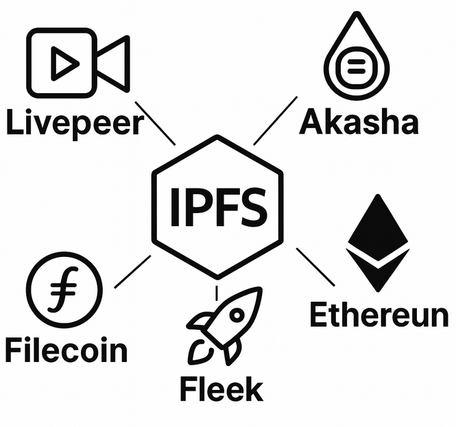

Algunas de las aplicaciones, plataformas y servicios más relevantes que utilizan IPFS o lo integran en su funcionamiento son:

* Livepeer: Plataforma de streaming de video descentralizada que utiliza IPFS para la distribución de contenido multimedia. <https://livepeer.org/>
* Akasha: Red social descentralizada que utiliza tecnologías blockchain e IPFS para la publicación y preservación de contenido resistente a la censura. <https://akasha.world/>
* Fleek: Plataforma para desplegar sitios web y aplicaciones descentralizadas, que integra IPFS para el almacenamiento y distribución de archivos. <https://docs.ipfs.tech/how-to/websites-on-ipfs/introducing-fleek/>
* Ethereum: Muchas dApps y proyectos en Ethereum utilizan IPFS para almacenar archivos, metadatos de NFTs y recursos fuera de la cadena, facilitando la descentralización y la persistencia de datos. <https://ethereum.org/en/developers/docs/storage/#ipfs>

Y claro algunas más como:

* Origin Protocol: Mercado peer-to-peer para la economía colaborativa, que utiliza IPFS para almacenar y compartir datos de productos y usuarios. <https://www.originprotocol.com/>
* Textile: Herramientas y APIs para construir aplicaciones descentralizadas sobre IPFS, incluyendo bases de datos y almacenamiento privado. <https://www.textile.io/>
* Y no podemos seguir más.. entra en la web para conocer más: <https://ecosystem.ipfs.tech/>.

> Recuerda [DYOR](https://bit2me.com/learn/cursos/curso-de-como-hacer-tu-propia-investigacion-en-blockchain-dyor/), que estas plataformas o cualquiera otra use IPFS, no significa que esté validándolas o diga que debes usarlas.

## Seguir practicando en IPFS

No existe mejor documentación que la oficial de IPFS 👏.

Si quieres seguir aprendiendo, explora las guías prácticas y tutoriales en <https://docs.ipfs.tech/how-to/>.

Además, puedes revisar laboratorios y ejercicios en el repositorio de [open3diy.org sobre web3-101](https://github.com/open3diy/web3-101/blob/main/IPFS/README.md), donde encontrarás ejemplos, prácticas y casos de uso reales para experimentar con IPFS desde cero.

Para profundizar aún más, consulta la sección de [conceptos clave](https://docs.ipfs.tech/concepts/) y la [referencia de comandos](https://docs.ipfs.tech/reference/kubo/cli/) para dominar el uso de IPFS desde la terminal.

Recuerda que la mejor forma de aprender IPFS es probando sus herramientas, explorando sus comandos y experimentando con la red tanto en entornos públicos como privados.

## Referencias

* Gracias a que IPFS está tan bien documentado 👏, las referencias son las proporcionadas por el propio sitio Web de IPFS y que has podido ir viendo en el documento.
* Gran parte de las aclaraciones y revisiones se han realizado utilizando asistentes de IA como ChatGPT, Gemini o GitHub Copilot.
